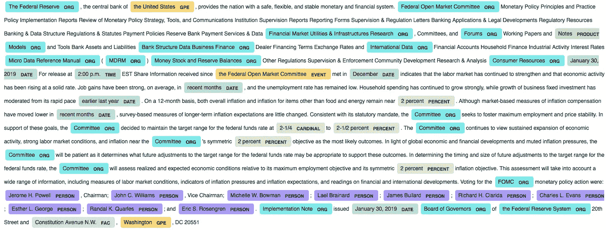

# FOMC 命名实体识别—信息内容发展了吗？

> 原文：<https://towardsdatascience.com/fomc-named-entity-recognition-has-information-content-evolved-2da6da8abd88?source=collection_archive---------36----------------------->

## 本文使用“FedTools”包和 SpaCy 来检测和分析 FOMC 语句中的命名实体。

最后的数字。现在，我们可以使用按钮和下拉菜单来选择感兴趣的项目和时间段。作者创建的图像。

*TL DR* : [Github Repo](https://github.com/David-Woroniuk/Medium-Articles/blob/master/Named_Entity_Recognition.ipynb) 和 [FedTools](https://pypi.org/project/FedTools/) 包。

# 为什么解释 FedSpeak 很重要？

“Fedspeak”最初是由艾伦·布林德(Alan Blinder)定义的，用来描述美联储的主席们在发表含糊、不明确或模棱两可的声明时所使用的“英语方言”。近年来，由于全球金融机构自然语言处理(NLP)能力的提高，美联储政策沟通发生了巨大的变化。对 FOMC 声明的解读可以为对冲基金、自营交易公司和银行等机构的短期交易策略、套利交易、投资组合倾斜和企业融资策略提供信息。

# **那么，什么是自然语言处理呢？**

NLP 是一个人工智能领域，它使机器能够与人类语言进行交互，分析，理解和解释人类语言的含义。自然语言处理由许多子领域组成，例如自动摘要、自动翻译、命名实体识别、关系抽取、语音识别、主题分割和情感分析。

本文主要讨论在 FOMC 语句上实现一种信息提取技术，应用命名实体识别来确定每个主题被提及的次数。

# **命名实体识别**

命名实体识别可以被认为是基于用户偏好的简单或复杂的信息提取方法。用户既可以像在本教程中一样使用预先训练好的模型，也可以选择训练自己的命名实体识别模型。

一旦模型被训练，命名实体识别可以被认为是检测任务和分类任务的组合:

1)第一步涉及将文本分割成多个记号，也称为分块。分块试图应用非嵌套，例如“美联储”是单个令牌，而不是作为单独令牌存在的“联邦”和“储备”。

2)第二步需要选择适当的本体，通过该本体来组织类别。

为了简单起见，本教程使用 SpaCy 的预训练`en_core_web_sm`模型，可以在这里[找到](https://spacy.io/models/en)。

# **实际实施**

现在我们已经了解了底层模型，我们可以通过 7 个简单的步骤来实现它。

第一步是安装我们将使用的包和模块:

其次，我们需要通过“FedTools”库获得 FOMC 的历史陈述，可以在这里找到。在此之后，从数据集中移除附加的非文本操作符，并且解析每个语句，返回包含标记化数据、词条数据、词性标签、命名实体、与命名实体相关联的标签、标签出现的相关次数以及语句中每个项目被检测到的次数的数据帧。

现在，我们可以开始从解析的数据中生成附加信息。我们在每个语句的`number_of_labels`列中搜索特定的标签，确定每个标签实体被提及的次数。潜在命名实体标签的完整列表可以在[这里](https://spacy.io/api/annotation#named-entities)找到。

接下来，我们可以尝试检测每个 FOMC 语句中的相关主席。可用作 FOMC 现任主席的快速识别工具，但如果声明中未出现理事会成员的姓名，则可能会生成“NaN”值(如示例中的前几年)。

我们现在可以生成一个交互式 Plotly 图表，它概述了在每个语句中检测到的总信息内容，并将其分解为特定的标记实体。这对于直观地检验潜在假设特别有用，例如:“美国大选周期前的 FOMC 声明包含的信息很少”或“市场危机期间的声明包含更多定量信息”。

现在，我们可以调用`plot_figure`函数，该函数在内部调用上述函数来生成和解析数据，最终绘制出检测到的命名实体的数量。

最后的数字。现在，我们可以使用按钮和下拉菜单来选择感兴趣的项目和时间段。作者创建的图像。

另外，`displacy.render`可以在单个 FOMC 报表上调用，从而实现对实体识别准确性的可视化分析。

2019 年 1 月 30 日发布的 FOMC 声明的显示可视化。作者创建的图像。

要选择您想要可视化的 FOMC 语句，请将`(dataset[‘FOMC_Statements’][103])`中的数值更改为不同的值。`-1`(负索引)提供最近语句的可视化。