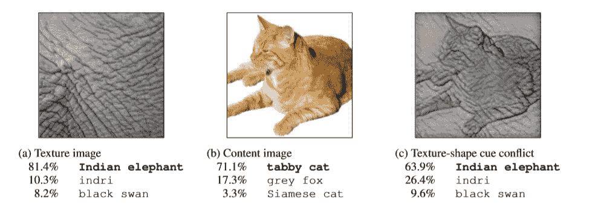
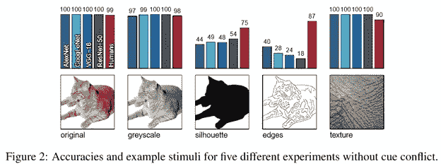
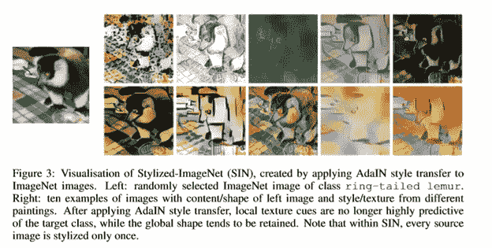
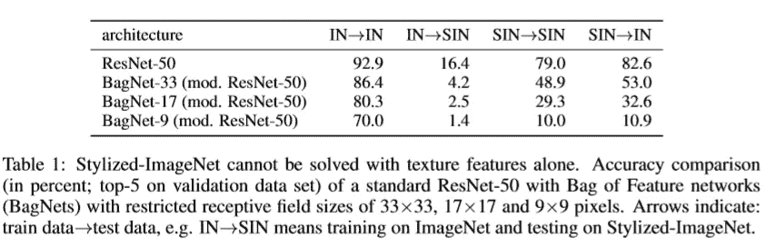
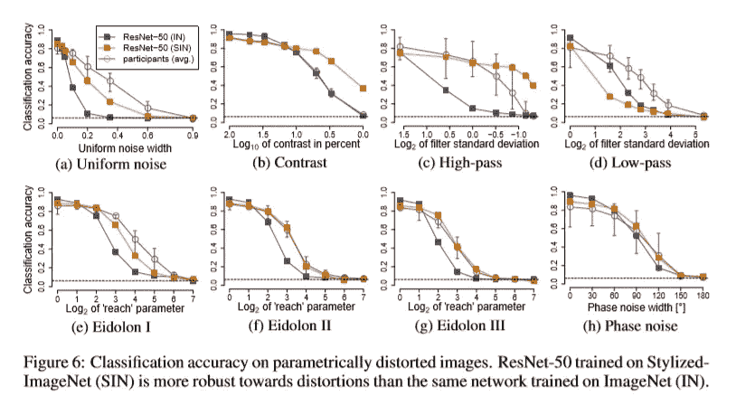
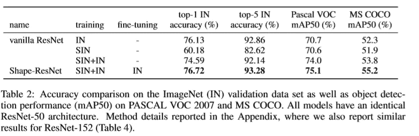

# 思考的食粮——纸星期二

> 原文：<https://towardsdatascience.com/food-for-thought-paper-tuesday-3c0a9b3e432f?source=collection_archive---------38----------------------->

## 使用形状偏差数据提高了准确性和鲁棒性

每周二，我都会强调我在研究或工作中遇到的一篇有趣的论文。希望我的评论能帮助你在 2 分钟内获得论文中最多汁的部分！

# 基本思想

人们普遍认为，CNN 通过提取曲线和边缘等形状特征来学习图像。然而，来自图宾根大学和爱丁堡的一组研究人员在他们的 ICLR 2019 论文中挑战了这一信念 *ImageNet 训练的 CNN 偏向于纹理；增加形状偏差可以提高精确度和鲁棒性*。

来自[的论文](https://openreview.net/pdf?id=Bygh9j09KX)

下面是链接:【https://openreview.net/pdf?id=Bygh9j09KX】T4

通过巧妙设计几个实验，研究人员证明了 CNN 比人们预期的更偏向于图像纹理。由此，他们进一步发现，形状增强数据集可以作为一种有效的数据增强方法，提高模型的准确性和鲁棒性。

研究人员认为，CNN 严重偏向于局部特征，这可能是由于卷积滤波器的感知范围较小。他们的论点得到了 CNN 在无纹理图像上令人惊讶的低性能的支持，如下图所示

摘自[论文](https://openreview.net/pdf?id=Bygh9j09KX)

如图所示，当纹理信息(轮廓和边缘)被移除时，所有主流架构如 AlexNet、GoogleNet 和 VGG16 都经历了显著的性能下降。同时，只要存在纹理(纹理)，即使当形状信息被移除时，CNN 也产生高置信度。

# 结果

为了进一步测试他们的假设，研究人员生成了一个新的数据集，称为风格化图像网(SIN)，其图像的局部纹理特征被无信息的随机特征所取代。

来自[的论文](https://openreview.net/pdf?id=Bygh9j09KX)

如果 CNN 偏向于局部纹理特征，我们可以预期在原始 ImageNet 数据集上训练的 CNN 在 SIN 上表现不佳。事实的确如此，如下表所示

来自[的论文](https://openreview.net/pdf?id=Bygh9j09KX)

好了，现在我们确信 CNN 偏向于本地纹理。但是我们如何利用这些信息呢？研究人员证明，在 SIN 和 IN 上联合训练的模型对图像失真(噪声、裁剪、过滤等)更具鲁棒性，并在图像分类和对象检测方面实现了出色的准确性。

来自[的论文](https://openreview.net/pdf?id=Bygh9j09KX)

来自[的论文](https://openreview.net/pdf?id=Bygh9j09KX)

# 一些想法

很长一段时间，我相信 CNN 有能力进行图像分类，因为它有强大的边缘检测器。这篇论文为我们打开了一扇新的门——有许多关于神经网络的手工解释和理解。要理解哪怕是一种最简单的神经网络形式，还有大量的理论工作要做！