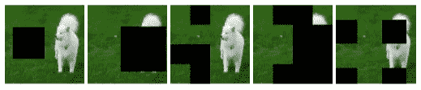
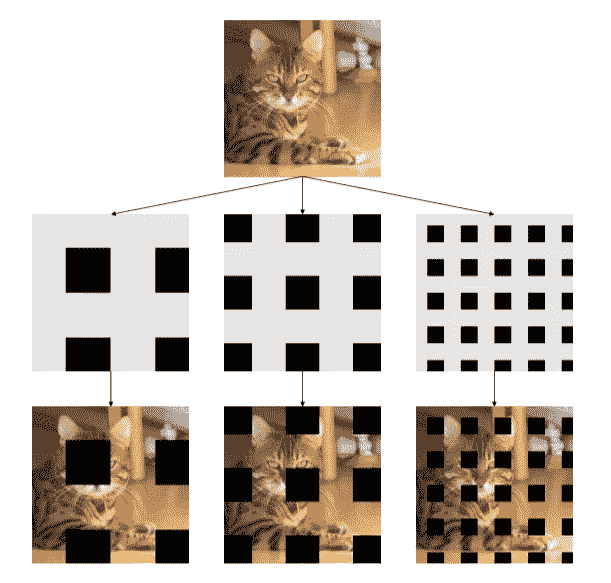
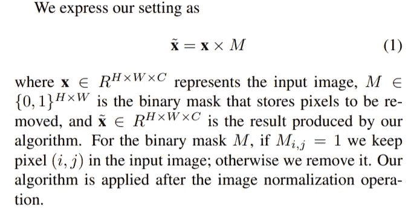
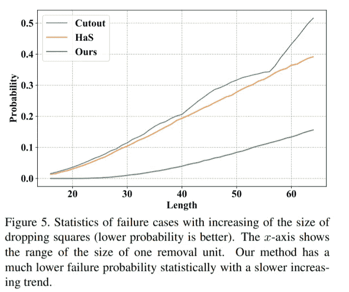
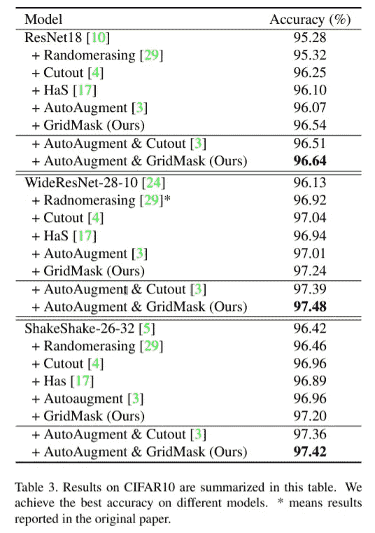
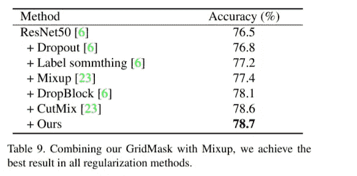

# 思考的食粮——纸星期二

> 原文：<https://towardsdatascience.com/food-for-thought-paper-tuesday-de81f92c3e3?source=collection_archive---------44----------------------->

## 一种增强图像的新方法

每周二，我都会强调我在研究或工作中遇到的一篇有趣的论文。希望我的评论能帮助你在 2 分钟内获得论文中最多汁的部分！

## 基本思想

深度神经网络在许多计算机视觉任务中具有无与伦比的性能，如图像分类、对象分割和图像生成。许多人会认为，正是数百万个参数赋予了模型学习困难任务的能力。然而，天下没有免费的午餐。如果我们想训练更多的参数，我们就需要更多的数据。数据扩充是一种通过简单的转换从收集的数据中生成新数据的方法。更具体地说，当涉及到图像时，人们习惯于随机旋转和翻转图像或者改变亮度和色调。

最近，香港中文大学的一组研究人员开发了一种惊人简单而有效的增强方法，可以与最复杂的自动增强算法相媲美。这是这篇论文的链接:

*GridMask 数据增强*，【https://arxiv.org/pdf/2001.04086.pdf】T2

信息丢弃通过去除图像中的像素，迫使网络更少地关注输入数据的琐碎细节。这里有一个例子:

来自 [GridMask 数据增强](https://arxiv.org/pdf/2001.04086.pdf)

根据作者的观点，现有解决方案如随机擦除、剪切和捉迷藏的两个问题是连续区域的过度删除和保留。例如，在上面的图像中，第二个和第四个地块(左起)遭受了过度删除，第一个遭受了连续区域的保留(我们希望删除狗的某个部分，而不仅仅是草)

作者发现了一种更好地避免这两个问题的直接方法——从图像中移除网格块。

来自 [GridMask 数据增强](https://arxiv.org/pdf/2001.04086.pdf)

算法就是这么简单！创建一个遮罩(上图中的第二行)并将其与原始图像相乘。

来自 [GridMask 数据增强](https://arxiv.org/pdf/2001.04086.pdf)

## 结果

作者证明，与当前方法相比，GridMask 不太可能移除(过度删除)或保留 99+%(过度保留)目标对象。

来自 [GridMask 数据增强](https://arxiv.org/pdf/2001.04086.pdf)

作者还在 ImageNet -1K 和 CIFAR10 等标准数据集上测试了 GridMask，并展示了这种简单算法的潜力。

来自 [GridMask 数据增强](https://arxiv.org/pdf/2001.04086.pdf)

令人惊讶的是，GridMask 不断超越所有其他信息丢弃方法！

来自 [GridMask 数据增强](https://arxiv.org/pdf/2001.04086.pdf)

正如我在文章前面提到的，信息丢弃是一种有效的正则化方式。GridMask 也是一个很好的正则化方法。

## 一些想法

虽然 1%的改善在现实生活中并不显著，但在 Kaggle 这样的数据科学竞赛中却非常有用，在这些竞赛中，人们创建了巨大的集合模型，只是为了小幅增加。这篇文章提醒所有人，我们应该花更多的时间探索简单的技巧，而不是参与“军备竞赛”，在这场竞赛中，人们只是堆积更多的参数。