# [FoodieBuddie]我们如何打造新加坡首个美食推荐者

> 原文：<https://towardsdatascience.com/foodiebuddie-how-we-built-singapores-first-food-recommender-b7f3eed0ac77?source=collection_archive---------36----------------------->

由 [Ethan Hu](https://unsplash.com/@ethanhjy?utm_source=unsplash&utm_medium=referral&utm_content=creditCopyText) 在 [Unsplash](https://unsplash.com/?utm_source=unsplash&utm_medium=referral&utm_content=creditCopyText) 上拍摄的照片

## 社会数据分析，建立一个食品和食品影响者推荐，一个必须为您的食品业务！

你可以在这里找到这个项目的代码[，在这里](https://github.com/terenceneo/Social-Analytics/tree/master/Code)找到我们的网站[。](https://terenceneo.github.io/Social-Analytics/)

# 背景和动机

新加坡是国际美食天堂，拥有价值数十亿美元的食品产业。新加坡的食品行业年收入达 83 亿新元，每年为该国的国内生产总值做出 43 亿新元的贡献，雇用了 48，000 名工人。根据贸易部&工业(MTI) [食品工业转型图](https://www.enterprisesg.gov.sg/industries/type/food-manufacturing/industry-profile)显示，2020 年生产率增长 4.5%，计划新增 2000 个工作岗位。这使得新加坡的食品行业成为对初露头角的企业家颇具吸引力的行业。

> 83 亿新元的年度收入，43 亿新元的年度 GDP 贡献

此外，由于新冠肺炎疫情的结果及其后果，现有的食品企业很难重新考虑他们的产品和商业策略，以便积累足够的销售额，在竞争中保持领先或出局。

一个由[细川玉子](https://www.linkedin.com/in/gracia-yk/)、[吉姆孟](https://www.linkedin.com/in/jimmengkok/)、[克里斯托](https://www.linkedin.com/in/christalpoon/)和[我](https://www.linkedin.com/in/terencenyy/)组成的令人惊叹的团队，因此花了我们夏天的一部分时间开发 [FoodieBuddie](https://terenceneo.github.io/Social-Analytics/) ，目的是帮助新的和现有的食品企业主最大限度地扩大他们在价值数十亿美元的食品行业中的份额。FoodieBuddie 根据 Instagram 趋势向企业推荐潜在的受欢迎的食品和美食，并确定这些企业可以与之合作的潜在食品影响者，以最大限度地扩大他们的影响力和曝光率。

# 数据收集

我们的主要数据来源是 Instagram。我们承认 Instagram 对食品行业的影响，因为它不仅是食品企业营销食品的平台，也是影响者通过发布对推荐菜肴的评论来曝光食品企业的平台。因此，为了识别将成为流行趋势的食物，我们查看了食物影响者发布的内容。在这个项目中，我们将范围缩小到新加坡前 12 名食品影响者的客户:

新加坡 12 大食品影响者，按作者排列

Instagram 帖子是用 Python Selenium WebDriver、BeautifulSoup 和 Pandas 刮出来的。帖子数据包括食品影响者的用户名、标题、点赞数、评论数和评论。这些数据将用于使用数据工程技术的文本分析，这将在下面的章节中进一步讨论。

我们还使用 Phantombuster 搜集了食物影响者的关注者名单。这些数据将用于生成社交网络图。

# 基于维基百科的语料库建设

为了识别 Instagram 帖子中提到的食物，我们需要一个食物名称及其相应菜名的语料库。通过维基百科的分类和多层次的子分类功能，食物列表已经与它们各自的烹饪相关联，因此允许我们快速生成一个相当大的语料库。在这个项目中，我们专注于新加坡美食子类别，并使用维基百科 API 为我们的语料库做了初步的搜集。

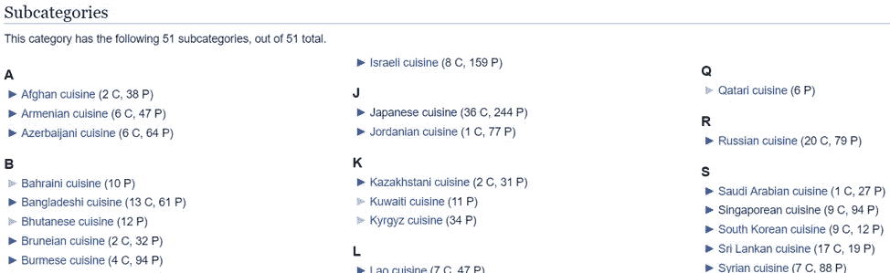

*维基百科食物和饮料子类别，截图来自 Wikipedia.org*

这给了我们一个最初废弃的语料库，包含 112 个与 9 个菜系相关的独特食物名称。大多数食物都归入中国和马来菜系。

## 数据清理

从语料库的视觉检查中，我们发现一些食物名称可以被纠正，而另一些可以用替代名称来指代。因此，我们做了一些数据清理，纠正错误的食品名称，并为上述食品项目添加替代名称，我们将以下食品名称列表添加到我们的语料库中，得到了 129 个搜索词。

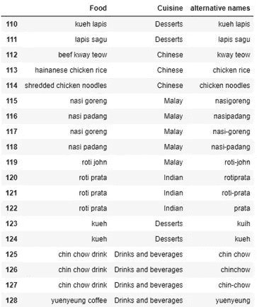

*添加到维基百科语料库，图片由作者提供*

在把食物按各自的菜系分类后，我们意识到在新加坡很容易找到的两大菜系——日本和韩国——都不见了。为了添加这些美食，我们开始了网络搜索。

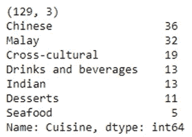

*维基百科语料库摘要，图片由作者提供*

# 基于网络抓取的语料库建设

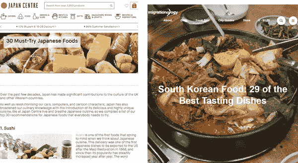

*日韩美食的美食博客，*日式美食:[https://www . Japan centre . com/en/pages/156-30-must-try-Japanese-foods](https://www.japancentre.com/en/pages/156-30-must-try-japanese-foods)，韩式美食:[https://migrationology.com/south-korean-food-dishes/](https://migrationology.com/south-korean-food-dishes/)

我们首先通过字符串解析从日本食品博客中抓取食品名称——这需要从零开始抓取食品名称，而不是使用预先构建的包，通过将网站的 html 代码作为字符串。然后，我们使用 *BeautifulSoup* 从韩国美食博客中抓取。这给了我们 30 个日本和 29 个韩国食物名称。

对语料库的进一步检查揭示了关于韩国食物的两个见解:

1.  一些新加坡人常吃的食物不见了，比如韩国炸鸡、军队炖肉等。
2.  搜集的语料库使用的食物名称不同于我们在新加坡使用的名称(例如，KBBQ，“tteokbokki”而不是“红米蛋糕”)

因此，我们扩大了韩国食品的语料库，增加了新加坡更常见的韩国食品名称，以及替代食品名称，从而使语料库扩展到 42 个搜索词。

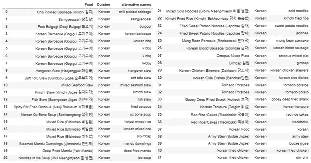

韩国美食文集*，作者图片*

# 基于帕累托分析的语料库建设

由于这个语料库是独立于 Instagram 数据集创建的，所以我们考虑了在使用我们的语料库时食物影响者被低估的可能性。事实上，我们有两个有影响力的人，他们的贴子占总贴子的比例非常低。

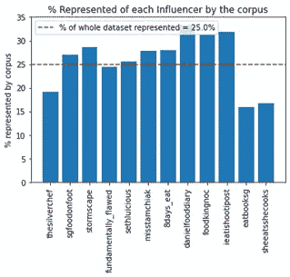

帕累托分析前的影响者表现*，作者图片*

因此，我们进行了帕累托分析，并确定了 9 个新的食品名称，这些名称经常被代表性不足的影响者发布。

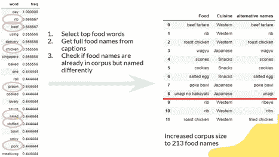

帕累托分析识别频繁发布的食品名称*，作者图片*

将这 9 种新食物添加到我们的语料库中，我们获得了一个突出的结果。我们发现，这 9 种新食品使我们原来的标签数量增加了近 50%，使 *eatbooksg* 的标签数量增加了一倍，使 *sheeatshecooks* 的标签数量增加了约 66.7%。

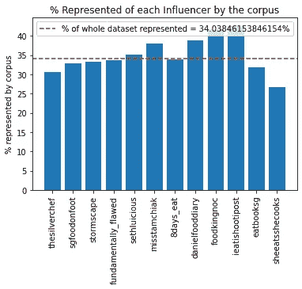

帕累托分析后的影响者代表*，作者图片*

有了我们创建的语料库，我们现在可以标记我们的数据集了！

# **情感分析**

我们意识到，有很多评论的帖子不一定意味着人们喜欢帖子中提到的食物，因为一些评论可能是在批评食物。因此，我们需要提取对一篇文章的看法，并以此作为衡量标准，而不是评论的数量。

我们给每条评论一个从-1 到+1 的综合情绪分数，平均这些分数给每条帖子一个从-1 到+1 的情绪分数。

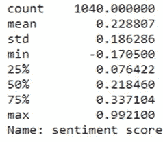

*帖子情感得分汇总统计，图片由作者提供*

# 数据分析

我们使用 Tableau 可视化了我们迄今为止设计的数据。在仪表板中创建和组装了各种图表。为新老企业主创建了两个独立的 Tableau 仪表盘。新的企业所有者可以与仪表板进行交互，以获得关于销售哪些潜在受欢迎的食品以及与之合作的相应合适的影响者的建议。在新企业主打算出售鸭肉米饭、kopi 和辣椒螃蟹的情况下，他/她可以从热图中选择指定的食物项目。此后，他/她可以基于他们的追随者、喜欢的数量、评论和情感分数，找出哪些影响者在张贴陈述的食物项目方面具有更好的状态。因此，这允许新的企业主接触影响者以与其合作，从而获得关于他/她将要出售的食品的更多曝光，这反过来为他/她的新食品企业赢得顾客。

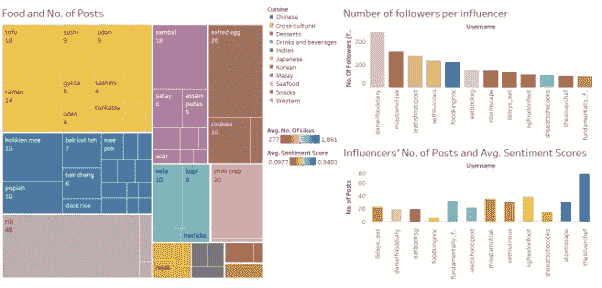

新企业主仪表板*，作者图片*

类似地，现有的企业主可以查看潜在的趋势食品，但他们根据烹饪进行过滤。这是因为我们认识到，现有企业主出售不属于他们领域的潜在受欢迎食品是不切实际的。如果现有企业主既出售马来菜肴又出售印度菜肴，他/她可以通过下拉菜单选择菜肴。在那里，他/她可以找到影响者根据所选美食发布的帖子数量，以及其他指标，包括关注者数量、喜欢、评论和情感评分。因此，现有企业所有者知道与哪个影响者合作来基于影响者的帖子的影响范围来推广他/她的企业以吸引他/她的潜在客户。

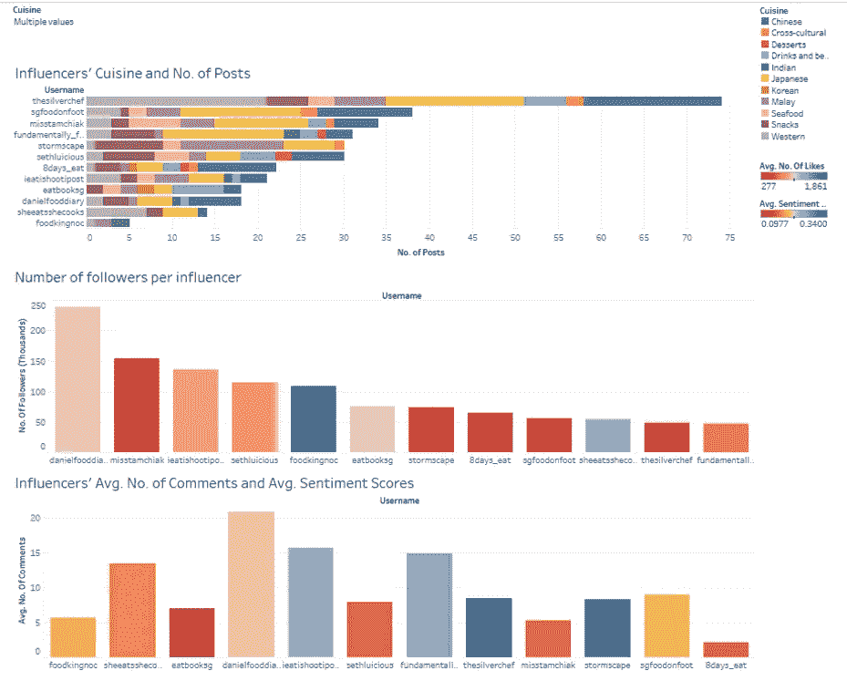

现有企业所有者仪表板*，作者图片*

# 社会网络分析

我们有兴趣了解食品影响者及其追随者的网络。为了做到这一点，我们准备了一个 csv 文件，描述食品影响者和他们的追随者之间的映射。然后，我们将这个文件导入 Gephi，并获得了一个社交网络图。然而，由于节点数量庞大，社交网络图并不清晰可见，因此我们过滤掉了一些节点。下图中的节点代表新加坡前 12 名食品影响者以及至少关注其中 7 名影响者的人。

Gephi 中生成的图形如下:

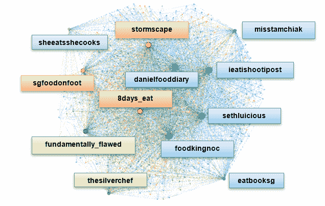

社交网络图*，作者图片*

有趣的是，影响者本身被分组到不同的社区，通过调查，我们发现了以下见解。

对于紫色社区，我们发现 *sheeatsshecooks* 与 butcher @meatcosg 合作，发布了很多关于生肉的帖子。也许她的追随者对生肉感兴趣，但许多人可能没有同样的兴趣。对于绿色社区来说，这两个是所有 12 大食品影响者中最不受欢迎的。对于 orange 社区来说，这些有影响力的人与其他人不同，因为他们倾向于发布饮料和蛋糕等小吃，而不是大餐。最后，蓝色社区聚集在一起，因为他们很受欢迎，有许多追随者。也许追随者喜欢追随受欢迎的美食家。

从图表中，我们可以看到许多追随者追随多个食物影响者，这表明食物社区是紧密结合的，他们是食物的粉丝，而不是食物影响者。这一观察与韩国流行乐迷不同，在韩国流行乐迷中，粉丝们每次都承诺对某个特定群体忠诚。

## 结论

由于网络的紧密中心性，食物趋势很容易在人与人之间传播。这个紧密团结的社区提供了证据，证明食品行业是企业主考虑进入或发展的好行业。

*这个项目是新加坡管理大学 IS434 社会分析和应用课程的一部分。*