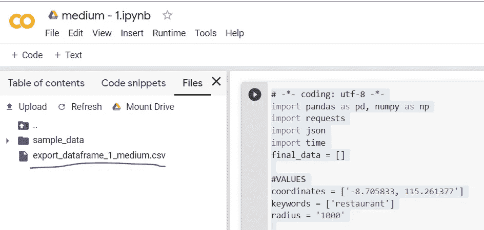
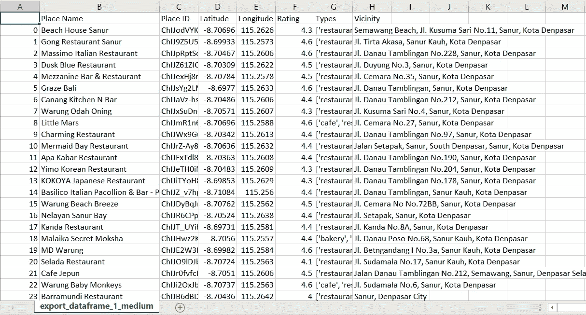
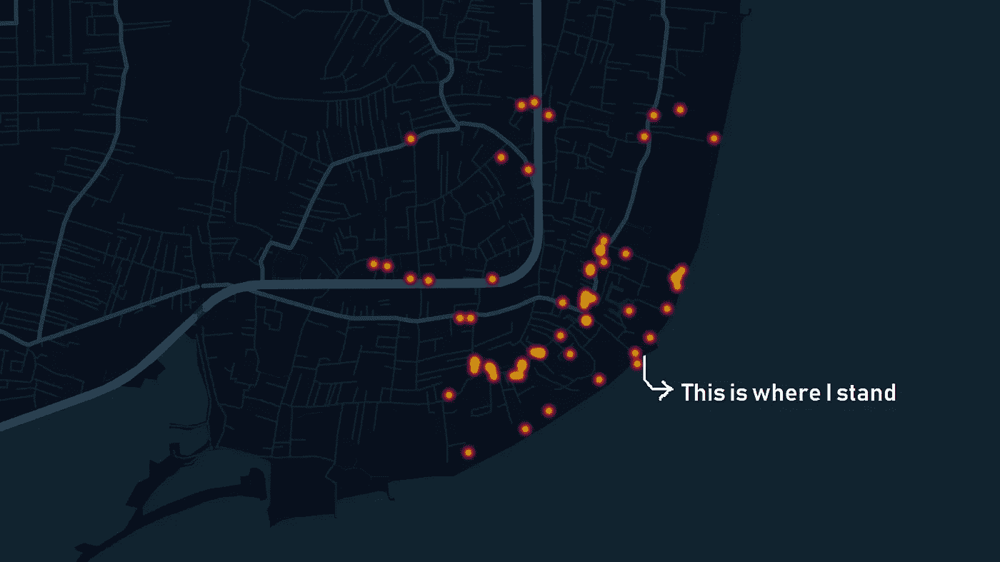

# 我身边的食物:用 Python 和 Google Colab 抓取谷歌地图数据

> 原文：<https://towardsdatascience.com/foods-around-me-google-maps-data-scraping-with-python-google-colab-588986c63db3?source=collection_archive---------3----------------------->

我一直是这样的人，当我想到一个问题时，我会伸手拿起我的智能手机；和食物有关的时候会更快。这是我去年 12 月去巴厘岛的经历。那是旺季——当然，时间选错了。作为一个美食家，当我到达时，食物是我首先想到的。我们都知道巴厘岛有 Ayam Betutu、Sate Lilit 和 Lawar——但我不知道在哪里可以买到它们，或者确切地说，我不知道在哪里可以买到它们。

“要是我有附近所有餐馆的完整列表，包括等级和地址就好了……”我脑海中有个小小的声音说道。

一旦我从假期回来，我冲向我的笔记本电脑。了解如何实现“如果……就好了”真实的。答案当然是数据搜集。数据抓取，或网络抓取，是从网站导入数据到我们的本地机器。输出通常是电子表格的形式。因此，我可以在一个简单的电子表格中获得我周围餐馆的完整列表，包括地址和评级！我觉得听起来很棒。

我在记事本上写了一个简单的 Python 脚本，因为我的(办公室)笔记本电脑上还没有安装 Python 3。众所周知，安装 Python 非常方便，尤其是对于安装了如此多安全设置的办公笔记本电脑。我的朋友 Mahendri 也帮我校对了我的剧本，他建议 Google Colab 来运行这个剧本。它允许我在云上运行 Python 脚本，所以我不需要事先在我的笔记本电脑上安装 Python 3。我只需要在 Google Colab 中写下我的代码，按下‘运行’，就完成了。

既然我的目标是获得完整的地点列表，那么谷歌地图数据就是答案。有了 Google Maps 数据，我们就可以获得地名、地址、坐标、地点类型、等级、电话号码和其他基本数据。当然，对于初学者来说，我们需要获得位置 API。一旦我们有了 API，我们就可以继续收集位置数据。

**第一步:**你想获取什么数据？

对我来说，我希望我周围的**餐厅**(在**萨努尔的海滩边，巴厘岛**)半径 **1 公里**。因此，参数将是“餐馆”、“萨努尔海滩”(在坐标中)和“1 公里”。

翻译成 Python，应该是:

```
coordinates = ['-8.705833, 115.261377']
keywords = ['restaurant']
radius = '1000'
api_key = 'acbhsjbfeur2y8r' #insert your API key here
```

“关键词”让我们可以找到任何注册为餐馆或者名字中包含“餐馆”的地方。所以，我认为这比使用地点的“名称”或“类型”更好，因为我可以获得类型和名称包含“餐馆”的地点的完整列表。比如我可以同时得到寿司 Tei 和 Se'i Sapi 餐厅。如果我们使用“name ”,我们将只能找到名称中包含“restaurant”的地方。如果我们使用“type ”,我们将只得到类型为“restaurant”的地点。然而，使用“关键字”的缺点是需要更长的时间来清理数据。

**第二步:**准备一些需要的库，比如:

```
import pandas as pd, numpy as np
import requests
import json
import time
from google.colab import files
```

你注意到“从 google.colab 导入文件”了吗？是的，使用 Google Colab 需要我们使用 google.colab 库来打开或保存数据。

**第三步:**根据第一步中的参数编写一个代码，生成数据。

```
for coordinate in coordinates:
for keyword in keywords:url = 'https://maps.googleapis.com/maps/api/place/nearbysearch/json?location='+coordinate+'&radius='+str(radius)+'&keyword='+str(keyword)+'&key='+str(api_key)while True:
print(url)
respon = requests.get(url)
jj = json.loads(respon.text)
results = jj['results']
for result in results:
name = result['name']
place_id = result ['place_id']
lat = result['geometry']['location']['lat']
lng = result['geometry']['location']['lng']
rating = result['rating']
types = result['types']
vicinity = result['vicinity']data = [name, place_id, lat, lng, rating, types, vicinity]
final_data.append(data)time.sleep(5)if 'next_page_token' not in jj:
break
else:next_page_token = jj['next_page_token']url = 'https://maps.googleapis.com/maps/api/place/nearbysearch/json?key='+str(api_key)+'&pagetoken='+str(next_page_token)labels = ['Place Name','Place ID', 'Latitude', 'Longitude', 'Types', 'Vicinity']
```

该代码允许我们获得每个坐标和关键字的地名、id、经纬度、等级、类型和邻近地区。由于 Google 在每个页面中只显示 20 个点的数据，我们必须插入' next_page_token '来抓取下一页的数据。假设 Sanur 周围有 40 家餐厅，那么 Google 会用两页显示数据。如果有 58 页，那就是三页。

我们能提取的最大数据点只有 60 位。这是谷歌的规定。举个例子，在离我站的地方 1 公里的半径范围内，萨努尔周围有 140 家餐馆。这意味着 140 家餐馆中只有 60 家会产生。因此，为了防止差异，我们应该控制我们的半径并有效地协调。确保半径不要太宽，否则会导致“只生成 60 个点，而有很多个点”。此外，确保半径不要太小，这会导致我们列出很多坐标。这两种方式都不是很有效，因此我们需要事先了解该地点的环境。

**第四步**:将数据保存到本地机器

```
export_dataframe_1_medium = pd.DataFrame.from_records(final_data, columns=labels)
export_dataframe_1_medium.to_csv('export_dataframe_1_medium.csv')
```

**最后一步**:将上述所有步骤编织成一个完整的代码

```
import pandas as pd, numpy as np
import requests
import json
import time
final_data = []# Parameters
coordinates = ['-8.705833, 115.261377']
keywords = ['restaurant']
radius = '1000'
api_key = 'acbhsjbfeur2y8r' #insert your Places APIfor coordinate in coordinates:
for keyword in keywords:url = 'https://maps.googleapis.com/maps/api/place/nearbysearch/json?location='+coordinate+'&radius='+str(radius)+'&keyword='+str(keyword)+'&key='+str(api_key)while True:
print(url)
respon = requests.get(url)
jj = json.loads(respon.text)
results = jj['results']
for result in results:
name = result['name']
place_id = result ['place_id']
lat = result['geometry']['location']['lat']
lng = result['geometry']['location']['lng']
rating = result['rating']
types = result['types']
vicinity = result['vicinity']data = [name, place_id, lat, lng, rating, types, vicinity]
final_data.append(data)time.sleep(5)if 'next_page_token' not in jj:
break
else:next_page_token = jj['next_page_token']url = 'https://maps.googleapis.com/maps/api/place/nearbysearch/json?key='+str(api_key)+'&pagetoken='+str(next_page_token)labels = ['Place Name','Place ID', 'Latitude', 'Longitude', 'Types', 'Vicinity']export_dataframe_1_medium = pd.DataFrame.from_records(final_data, columns=labels)
export_dataframe_1_medium.to_csv('export_dataframe_1_medium.csv')
```

现在，轻松地从 Google Colab 文件中下载您的数据。单击左侧窗格上的箭头按钮，单击“文件”，然后下载您的数据！:)



您的数据以 CSV 格式保存，可以使用您熟悉的任何工具进行可视化！可以是 R，Python，Tableau 等。在这种情况下，我使用开普勒**将其可视化。**GL；**一款数据不可知、支持 WebGL 的高性能 web 应用，用于地理空间分析可视化。哦，对了，是网站上的描述。**

这是我的数据在电子表格中的样子:



这是它在 Kepler.gl 地图中的样子:



是的，在我站的地方周围有 59 家餐馆，在萨努尔的海滩边放松。是的，只需在地图中添加名称和评级，然后我们就可以探索我们周围的一些食物了！

*这是我第一次在媒体上发表作品。感谢 Swandika Gumilang 教我 Python &并解释了脚本背后的一些逻辑，感谢 Deo Dedianto & Aldo Leofiro 帮我校对代码，也感谢 Mahendri M. D .建议 Google Colab 运行脚本&并发现其中的错误。*

如果你愿意合作，需要一些帮助，或者想复制这个项目，请联系我的 [Linkedin](https://www.linkedin.com/in/regita-hikmatuz-zakia-4b688b124/) 或 [Upwork](https://www.upwork.com/freelancers/~0133a47a271409c495) 。