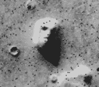
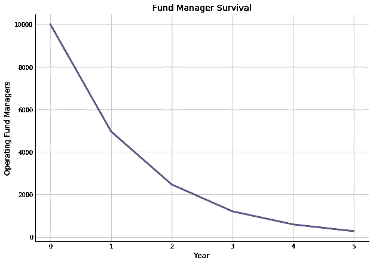
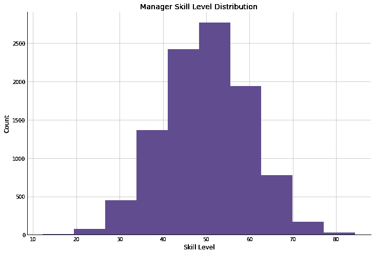
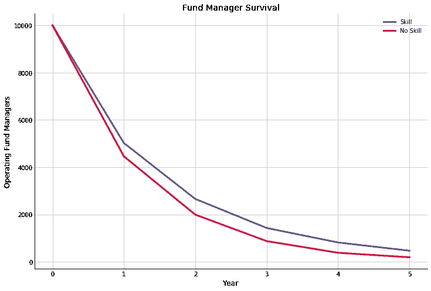
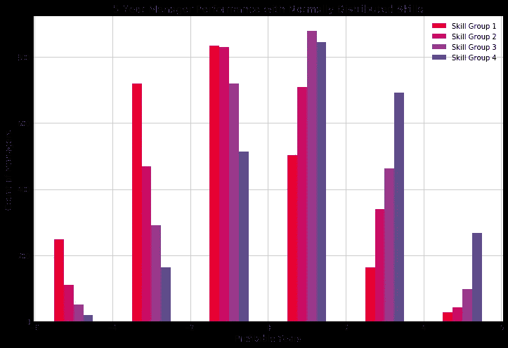
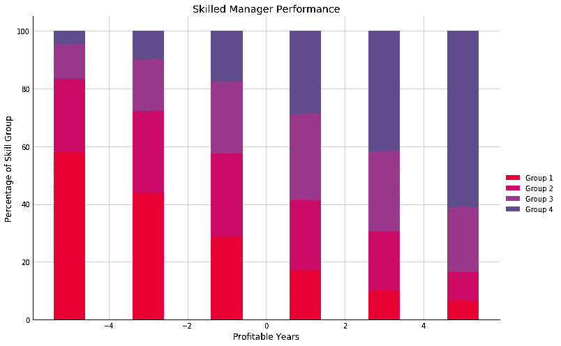

# 被随机性愚弄:将蒙特卡罗模拟应用于基金经理

> 原文：<https://towardsdatascience.com/fooled-by-randomness-applying-monte-carlo-simulations-to-fund-managers-94b926fa7ee9?source=collection_archive---------14----------------------->

## 塔勒布的模型走得太远了

“火星上的脸”是我们倾向于看到不存在的图案的一个例子。来源[维基百科](https://en.wikipedia.org/wiki/Pareidolia#/media/File:Martian_face_viking_cropped.jpg)

> 第一个原则是你不能欺骗自己——而你是最容易被欺骗的人。
> 理查德·费曼

自从 10 年前看到这本书以来，我第一次重读纳西姆·尼古拉斯·塔勒布的《被随机愚弄的 T4》。当时，当他进行统计论证时，我只是相信了他的话。今天，情况并非如此，我认为我们可以通过挑战他的一些假设并自己构建这些模拟来了解更多。

对于外行人来说，塔勒布的第一本书发人深省地讨论了随机性的影响，特别是在金融市场中，以及面对这些影响时人类的局限性、认知偏差和错误。从他的作品中可以收集到许多智慧、机智和洞察力(如果你能超越他的自我)；我发现自己经常反思他多年来提出或推广的一些概念，从[黑天鹅事件](https://amzn.to/2GfFeIk)，反脆弱性，到游戏中有[皮肤的激励](https://amzn.to/30Ioz9P)。

塔勒布经常提到蒙特卡洛模拟的力量，通过数学模拟潜在的未来来处理随机性的影响。看到这些不同的途径如何发挥作用，我们就可以根据**期望**而不是纯粹的概率做出明智的决定。此外，我们可以根据这些随机过程的结果来检查我们正在落入认知陷阱的区域。就金融而言，这是一个特别有害的问题。

# 调查幸存者

众所周知，交易者和职业基金经理面临着一个严格的考验，当亏损开始增加时，他们会被迅速从人群中剔除，不管他们过去的记录如何。在动荡时期，他们很快就被扫地出门，从此杳无音信(塔勒布用约翰和尼禄的故事说明了这一点，前者是一个雄心勃勃的交易者，在破产前积累了数百万美元，被行业和上流社会抛弃，而更保守的尼禄仍在继续)。考虑到这样一个艰难的过程，那些在金融“新闻”网络的观众面前持续展示的有着出色业绩记录的人(新闻是松散地使用的，因为他们倾向于首先娱乐，然后宣传股票)必须是对市场有着非凡洞察力的杰出投资者。

塔勒布强烈反对这种想法。

这种思路属于**生存偏见**——只看到那些在一天结束时仍然存在的人，而忽略了游戏中失败的进入者。塔勒布把这比作一场金融俄罗斯轮盘赌游戏，你一次又一次地冒风险，通常情况下，游戏室会发出咔嚓声，奖励你又一天，并给你一种你自己有能力的错误印象。然而，最终，这将是一个非常糟糕的结局。如果有足够多的参与者，我们可以预计一些人会简单地作为数字游戏生存下来。然而，将这些幸存者视为效仿的榜样是极其愚蠢的。

我们可以通过对书中给出的思想实验建立自己的蒙特卡罗模拟来从数学上探索这一点([见本文代码](https://www.datahubbs.com/fooled-by-randomness-applying-monte-carlo-simulations-to-fund-managers))。

# 5 年基金经理存活率

塔勒布通过让我们想象一群 1 万名基金经理争夺投资来阐述他的观点。每年我们都会评估经理们的表现，淘汰那些赔钱的人。如果我们假设市场给我们提供了一个二元结果，我们要么盈利，要么亏损(在我们的世界里没有盈亏平衡)，而且每种结果的可能性都是相等的，我们会发现我们自己有活力的经理人在迅速减少。

# 模拟基金业绩

这种模拟的技术术语是伯努利过程。这仅仅意味着，我们有一个随机的，二元结果的事件序列。在这种情况下，我们在第一年年底投掷 10，000 个硬币，对于我们得到的每个人头，一位经理获得了利润，并幸存下来，以在第二年再次投资。每条尾巴都表明一位经理正在寻求职业改变。

将这个模型进行到底，我们会得到一条曲线，显示只有一小部分经理的存活率。

5 年后，我们的 10，000 名经理减少到只有 269 名。塔勒布更进一步指出，即使你赔钱的倾向大于赚钱的倾向(45/55)，你还是会有很多“成功的”经理人可供选择(约 190)。

这些经理人将会有出色、完美的记录，并可能为他们自己、他们的公司和/或投资者积累了令人难以置信的大量资金，但你没有理由在未来投资他们。至少，这是塔勒布的论点。

# 性能有多随机？

如果我们假设在市场中获利是一个纯粹的随机过程，那么塔勒布的观点是正确的。然而，考虑到他是以期权交易者的身份赚钱的，并且认为自己聪明能干，我认为他并不真的相信市场会按照他的描述运行。事实上，似乎确实存在各种不同的投资者策略和技能水平。

让我们回到他的例子，给模型添加一点细微差别。不要假设所有参与者的结果是平等的，每个人都有 50:50 的机会盈利或亏损，让我们随机产生具有一定技能水平的经理。在这种情况下，经理的平均技能水平是 50，这意味着生存的几率是 50:50。如果我们将标准差设为 10，那么高于平均值一个标准差的经理的技能水平为 60。他有 60%的机会活下来等等。

我们的技能分布如下:

模拟这种情况，我们可以看到更多的基金经理坚持到 5 年，即使人群的预期回报是相同的。

在这种情况下，幸存下来的基金经理数量更多(439 比 269)。换句话说，我们的 5 年基金经理存活率从 2.7%提高到了 4.4%。

这并不能告诉我们所有的事情，因为如果你是一个关注过去业绩的投资者，你会想知道它是否能告诉你一些东西。

如果我们将我们的经理分成不同的分位数，并跟踪他们的表现，我们可以看到技能如何影响他们的表现。

在上面的图中，我根据技能将经理分成几个部分，并跟踪他们 5 年的表现，其中每年，经理们根据他们的技能水平得到 1 或-1 分，如果他们盈利的话。在这种情况下，我没有排除那些失败的人——我们只需要关注右边的列，以查看那些从未有过下跌年的人。从这里，我们可以看到我们不同的技能组的结局。

我们可以看到，在我们的优秀员工(5 年幸存者)中，61%来自我们技能最高的管理团队。接下来的 22%来自第三组，他们高于平均水平，但不在顶尖的 25%熟练经理之列。余额由两个低于平均水平的组(1 和 2)组成。这些才是真正的幸运儿。平均而言，排名靠前的一组有 63%的时间盈利，而排名靠后的两组分别只有 37%和 47%的时间盈利。

如果你通过延长时间跨度来改变模型，你会看到熟练投资者和非熟练投资者之间的界限越来越清晰。这表明那些拥有较长成功记录的人可能确实比那些拥有较短记录的人更有优势(即使短记录很突出)。在我看来，我们永远也不能排除运气作为一种解释——像巴菲特这样的长期记录可能表明他是有史以来最幸运的投资者——但随着记录的不断延伸，这降低了运气和随机性是成功的主要解释的可能性。

如果我们将我们的投资决策限制在有 5 年利润记录的基金经理(或公司)身上，那么，在这种分布下，我们有 61%的机会选择表现最好的，有 83%的机会选择表现高于平均水平的！这些肯定比我们仅仅通过阅读塔勒布的治疗得到的几率要大。

宇宙时间旅行者在 [Unsplash](https://unsplash.com?utm_source=medium&utm_medium=referral) 上拍摄的照片

# 随机性到底起到了什么作用？

这并不意味着不涉及任何运气，但似乎塔勒布在他的简化插图中证明了太多。为了避免有人把我过于简单的蒙特卡洛模型看得太重，认为仅仅通过查看 5 年的记录，他们就有 83%的机会获利，我的模型也做出了一些关键且非常有问题的假设。

> 所有的模型都是错的，但有些是有用的。
> 乔治·博克斯

首先，请注意，我假设运气和技能之间存在平衡，两者相互抵消。即使我们将其他东西归入技能桶(例如，投资策略、技术基础设施、支持人员等。)我们仍会遗漏市场机制等其它信息。我们可以称之为“运气”，但如果你在 2009 年成年并开始投资，你将享受到历史上最长的牛市。这当然是运气的一个重要方面！然而，从塔勒布使用这个短语的意义上来说，这似乎更多的不是运气或随机性(尽管他在书中的其他地方似乎模棱两可)。这种调整需要使用适当的基线来校正。

另一个关键假设是，这个技能因素是正态分布的。我很有信心，技能——或任何区分投资者的东西——并不像塔勒布的模型所假设的那样因人而异，但我不知道它是否正态分布，是否向左或向右倾斜，或者它在投资者群体中如何变化。我也不知道吉姆·西蒙斯或沃伦·巴菲特如何与你的普通散户投资者相比，按照我设计的这个单一的、包罗万象的“技能”衡量标准。

最后，我假设这个技能因素随着时间的推移保持不变(我很确信这是错误的)，并且随着时间的推移相对于市场保持不变。

# 不要被你自己的模型所迷惑

纠正这些假设并不简单。但是我们应该小心从我们的模型中推断出的东西。当我们推断得太多时，正如我相信塔勒布在他的书中所做的那样，你可能会走上危险的道路。顺便说一句，每当有人援引单一原因来解释复杂现象时，你应该天生持怀疑态度。要是有那么简单就好了。

塔勒布关于随机性在我们生活中的作用的许多更广泛的观点是成立的。我们经常成为其恶习的受害者，因为我们坚持认知偏见和启发，这些在我们生活的大部分时间里都很有用，但在面对概率时却灾难性地失败了。尽管事实如此，但这并不意味着我们不能从我们受到的随机噪音的冲击中获得一些重要的信号。