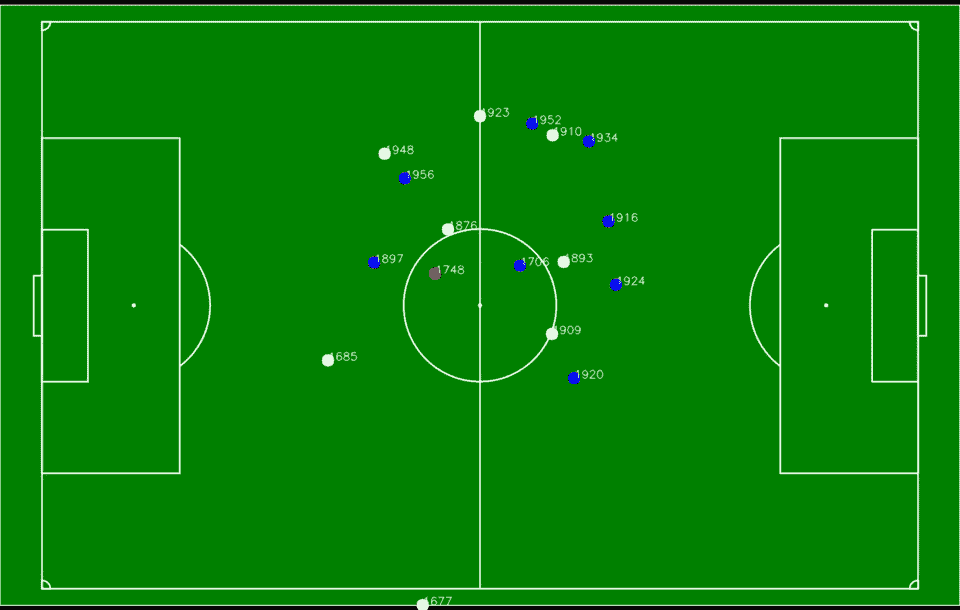
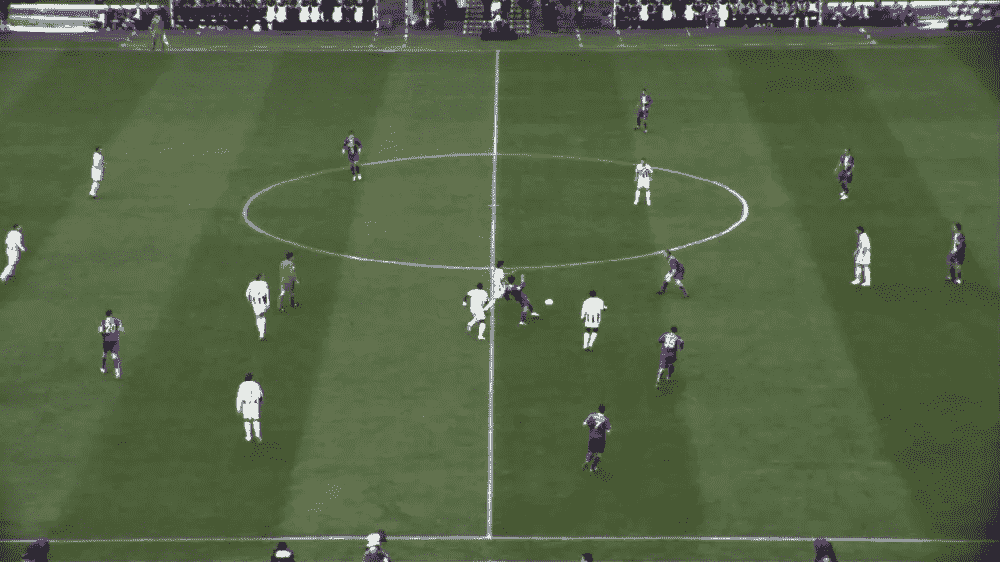
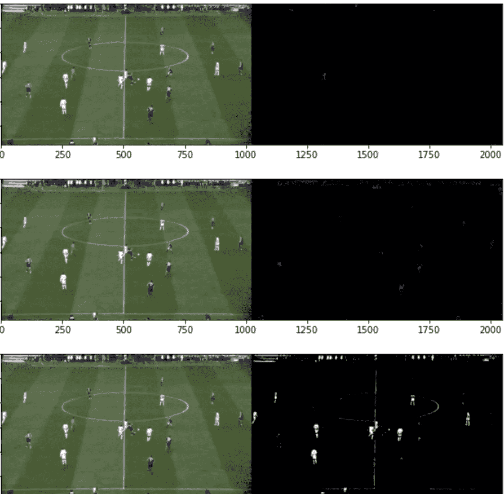
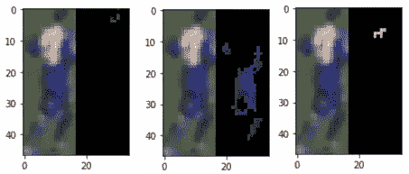
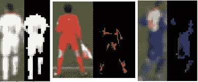
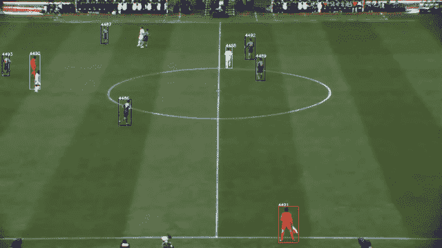

# 足球运动员跟踪——使用 OpenCV 根据运动员球衣的颜色识别他们的球队

> 原文：<https://towardsdatascience.com/football-players-tracking-identifying-players-team-based-on-their-jersey-colors-using-opencv-7eed1b8a1095?source=collection_archive---------21----------------------->

## 使用 Yolov3、SORT 和 OpenCV 检测、跟踪、确定球员的球队并将其转换为鸟瞰图。



球员追踪在鸟瞰图中，蓝点和白点代表两队，红点是裁判。(背景图片来自[https://commons . wikimedia . org/wiki/File:Soccer _ field _-_ empty . SVG](https://commons.wikimedia.org/wiki/File:Soccer_field_-_empty.svg))

# 介绍

在我之前的工作中，我使用预训练的 Yolov3 模型进行检测，并使用 SORT(简单的在线和实时跟踪)从视频中跟踪足球运动员。然后我用 OpenCV 的 getPerspectiveTransform 函数把视频转换成鸟瞰图。

[](/how-to-track-football-players-using-yolo-sort-and-opencv-6c58f71120b8) [## 如何使用 Yolo，SORT 和 Opencv 追踪足球运动员？

### 使用 Yolov3、Opencv 和 SORT 检测和跟踪足球运动员，并将球员的运动转换为鸟瞰图。

towardsdatascience.com](/how-to-track-football-players-using-yolo-sort-and-opencv-6c58f71120b8) 

这项工作的一个问题是模型不能区分团队。如果程序能够识别玩家的团队，而不仅仅是检测“人”，那就太好了。为了进一步改善这一点，我希望包括一个功能，告诉球员球衣颜色的差异。

我现在能想到解决这个问题的两种方法。

1.  使用包含 3 个类的自定义数据集训练对象检测模型——两个队的球员和裁判。这种方法对于实际应用可能不实用，因为必须在每次比赛前训练特定的模型。
2.  使用当前对象检测模型并从检测中提取颜色信息。基于此，我可以识别球员球衣的颜色。

我决定使用 OpenCV 尝试方法 2。

# **足球视频**

静止足球视频从[这里](https://pspagnolo.jimdofree.com/download/)下载。

*“t . D ' orazio，M.Leo，N. Mosca，P.Spagnolo，P.L.Mazzeo 足球视频序列地面实况生成的半自动系统，第六届 IEEE 高级视频和信号监控国际会议，意大利热那亚，2009 年 9 月 2 日至 4 日”*

# OpenCV 的彩色蒙版

球队和裁判之间的主要区别是球衣的颜色——一个球队是白色的，另一个是蓝色的，而裁判是红色的。我想根据球衣颜色来确定球员的球队。



视频中的一帧。

首先，我确定了三种颜色的范围。

```
color_list=['red','blue','white']boundaries = [
    ([17, 15, 75], [50, 56, 200]), #red
    ([43, 31, 4], [250, 88, 50]), #blue
    ([187,169,112],[255,255,255]) #white
    ]
```

然后我应用 OpenCV 的 inRange 函数为三种颜色创建蒙版。

```
mask = cv2.inRange(image, lower, upper)
```

然后使用 bitwise_and 对框架应用遮罩。

```
output = cv2.bitwise_and(image, image, mask = mask)
```

现在提取了三种颜色



应用于图像的红色、蓝色和白色遮罩。

现在我们需要将这些掩模应用到检测中。我根据检测到的边界框裁剪了图像，然后应用了蒙版。

```
crop_img = frame[ymin:ymax, xmin:xmax]
```



应用于检测的掩码。基于非黑色/总像素比率，球衣被识别为蓝色。

我识别颜色的方法是计数非黑色像素，并计算三种颜色的输出图像的比率(非黑色/总像素)。比例最高的是球衣的颜色。在上面的例子中，蓝色的比例最高，所以球衣被识别为蓝色。

现在我把这个功能集成到玩家检测脚本中，这里是一些面具和玩家检测的例子。



检测样本

基于球衣颜色的结果，我可以画出不同颜色的包围盒。



足球运动员追踪。边界框的颜色代表运动衫的颜色。

然后和我之前的帖子类似，通过使用 Opencv 的 [getPerspectiveTransform](https://docs.opencv.org/2.4/modules/imgproc/doc/geometric_transformations.html#getperspectivetransform) ，得到了开头所示的鸟瞰图。

# 结论

仍然存在一些问题:

1.  一些玩家在一些帧中没有被检测到，一些非玩家的人也被检测到。可以通过专门为足球运动员训练对象检测模型而不是使用预先训练的模型来改进。即使球很小，也可以跟踪球，这将是很有趣的，有可能尝试它或其他对象检测架构。
2.  当有玩家遮挡时 ID 改变。尝试像深度排序这样的其他跟踪算法可能会有帮助。

这种跟踪的一些应用:

1.  跟踪玩家并计算他们的速度和距离。
2.  获取两个队的球员路线的热图
3.  更多

感谢阅读，欢迎建议和反馈。

在这里支持我:【https://medium.com/@c.kuan/membership】T2