# 足球运动员自相矛盾的生日

> 原文：<https://towardsdatascience.com/footballers-paradoxical-birthdays-1aa0cbade7e5?source=collection_archive---------43----------------------->

## 用贝叶斯因子证明生日问题


在 [Unsplash](https://unsplash.com/s/photos/birthday?utm_source=unsplash&utm_medium=referral&utm_content=creditCopyText) 上[卡特琳娜·伯杰](https://unsplash.com/@seagull_tree?utm_source=unsplash&utm_medium=referral&utm_content=creditCopyText)的照片

# 序文

好吧，好吧。这个标题有点误导——甚至是 *clickbait* 。至少有 66%是这样的。首先，我今天要解决的现象并不是足球运动员独有的，但鉴于在可预见的未来，白俄罗斯以外的所有足球活动都将被取消，我想我们都可以通过这种方式解决问题。其次，他们的生日一点也不矛盾。生日悖论如此命名纯粹是因为它的反直觉性质；这只不过是冷酷的统计数字。

生日问题(我们以后会更准确地提到它)指出，给定一个只有 70 个人的房间，有 99.9%的可能性至少有两个人同一天生日。事实上，房间里的 23 个人将确保我们有比扔硬币更好的机会(> 50%)在一年中的至少一天为不止一个人唱生日快乐歌。考虑到一年中至少有 365 个可能的生日，这听起来很奇怪。其实我们是不会相信的。我们会证明的。有证据。

瞧，命运安排得好，参赛国最多允许带 23 名运动员参加国际足球比赛。这对我们来说非常方便，因为我们刚刚声称，有(超过)50%的机会，一个满是 23 个人的房间会有至少一对人一起过生日。因此，如果我们看一些国际足球队，其中大约一半应该有球员一起切蛋糕。

*但是，即使这是真的，也可能是偶然发生的——*我听到你说——*也许你只是运气好*。我欣赏你的怀疑精神。这就是为什么我们将使用贝叶斯推理来发现我们的结果有多么重要，并一劳永逸地撕掉隐喻性的史酷比小人面具。

# 为什么

嗯，*为什么不是*。除非你预测办公室蛋糕费用，否则你很难找到与生日问题直接相关的业务。但是我们*将*从数据科学家的瑞士军刀技术中探索两个基本工具:

*   **网络搜集:**我们将从网页上收集数据，以建立我们对足球运动员生日的了解。从客户参与到市场分析，抓取网页是许多真实数据科学用例的基本元素。
*   **数据操作:**我们将使用 Pandas 从我们从网络收集的数据中提取相关信息。
*   **统计评估:**我们将使用贝叶斯因子来检验我们的假设。假设检验是任何自尊的数据科学家的面包和黄油，贝叶斯统计与机器学习和模型选择有很强的相关性。

此外，我发现生日问题是一个有趣的问题，谁不喜欢一个好的证明呢？

# 什么

让我们浏览一下我们的攻击计划和所需的概念。

## 生日

生日问题是怎么解决的？上面我们做了一些大胆的主张，那么我们来提供一个数学上的解释。为了更好地理解至少两个人同一天生日的概率，思考一下在任何群体中没有*或*个人同一天生日的概率是有帮助的:

设想两个人在一个房间里，亚伦和比阿特丽斯。他们*不*同一天生日的概率有多大？Aaron 将在一年中的某一天过生日，Beatrice 可以在一年中的任何一天过生日，因为他们不在同一天过生日。因此概率为 *364/365* 。

*注意:在整个练习中，我将使用 365 天。我假设如果有人出生在闰日，他们的父母会仁慈地伪造他们的出生证明。*

如果有第三个人，塞西尔出现了呢？嗯，Aaron 过生日，Beatrice 过另一个生日，所以她还有 363 天可以选择。因此，她不和艾伦和塞西儿过同一天生日的概率是 363/365。艾伦和比阿特丽斯不在同一天生日的概率是*364/365*×*363/365*。然后迪米特里出现了，留给他的是 363/365 的概率，如此等等…

因此，Aaron、Beatrice、Cecile 和 Dimitri 中没有两个人同一天生日的概率是:

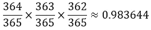

因为在我们的设置中有两种可能的结果，没有两个人过同一天生日**或**至少有两个人过同一天生日，所以这些结果的概率总和必须是 1。因此，Aaron、Beatrice、Cecile 和 Dimitri 中的至少一个生日相同的概率是:

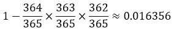

如果我们把这个思考过程扩展到 23 个人(省去了我再想出 19 个字母名字的麻烦)，我们会得到:

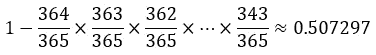

给定一个满是 23 的房间，至少两个人共享一个生日的概率确实超过 50%。但是我还是觉得不太对劲。别担心，我们会用数据证明这一点。

## 足球运动员

我们将使用哪些数据？我在上面提到过，每个国际足球队由 23 名球员组成。因此，我们将分析 18/19 FIFA 世界杯的球队，并收集他们每个球员的生日。

我们将使用这些维基百科页面获得每个国家队的球员名单:

*   [FIFA 2018 男足世界杯阵容](https://en.wikipedia.org/wiki/2018_FIFA_World_Cup_squads)
*   [国际足联 2019 女足世界杯阵容](https://en.wikipedia.org/wiki/2019_FIFA_Women%27s_World_Cup_squads)

将这些组合起来，我们将得到 56 个组，这是一个不错的样本。

## 悖论

我们将如何证明帕拉…呃，T4 问题？我们将分析 56 组 23 人的生日，并检查是否有任何匹配。拥有至少一对匹配生日的团队的百分比将是我们的实验结果，而理论值为 50.73%。

但是我们的结果有多可靠呢？如果你仔细考虑我们的问题，这实际上是*一系列的掷硬币——一个二元结果的实验(球队要么有同一天生日的球员，要么没有)，在这种情况下，我们可以很容易地测试我们结果的重要性。唯一的区别是，考虑到概率略高于 50%，我们的硬币稍微偏向一边。*

测试这一点的 *frequentist* 方法将使用 *p 值*。我们将建立一个无效假设，即生日匹配的概率确实是 50.73%，即我们的硬币是*公平的*。然后，我们将计算生日相同的球队数量(即人头数)，并计算在给定样本的情况下获得该数字的概率。这将给出我们的 *p 值*，如果低于预先确定的值(通常为 1%-5%)，我们将拒绝我们的零假设，并说我们的理论是错误的，即我们的硬币是不公平的。

然而，我们不仅仅是常客。我们将使用托马斯·贝叶斯对 p 值的回答，贝叶斯因子。它比较两个概率模型，帮助我们选择更合适的一个，定义为:

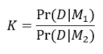

用英语来说，就是得到我们的数据的可能性， *D* ，给定模型 *M1* ，除以得到数据的可能性 *D* 给定模型 *M2* 。一般来说，至少 5 比 1 的比率(即> 5 的值)意味着对 *M1* 的实质性支持。

贝叶斯因子优于 p 值的一个主要优点是它对样本大小的矛盾性。虽然我说过我们有一个不错的样本，有 56 个团队，但这并不完全是大数据。

我们将建立两个基本模型来描述给定实验结果的理论概率。我们的第一个模型， *M1* 将是，概率正好是 50.73%。因此， *M1* 的概率密度在该点为∞，在其他地方为 0。我们的第二个模型将非常天真，我们将假设我们根本不知道概率，它们都是同样可能的:

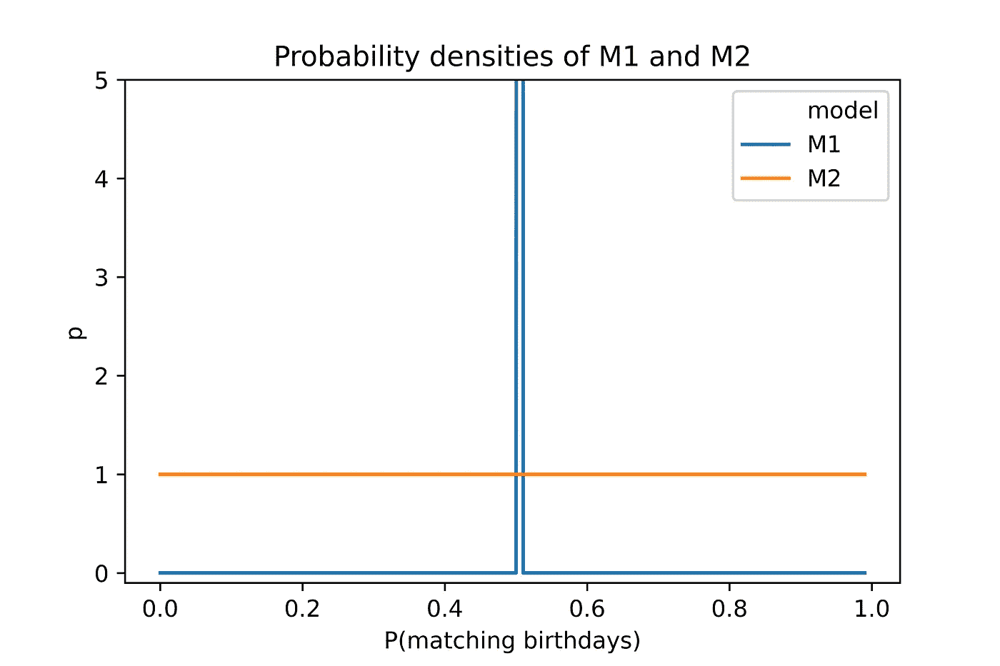

# 怎么做

让我们做些重活。

## 网页抓取

维基百科页面在一个单独的表格中列出了每个国家队中的每个球员。我们希望建立一个数据框，每行都有一名球员，包括他们的出生日期和他们为哪个国家效力。这意味着我们需要从维基百科中获得:

1.  民族
2.  玩家姓名
3.  生日

首先，让我们使用 BeautifulSoup 解析 Wikipedia 页面的 HTML 内容:

```
import requests
from bs4 import BeautifulSoupmens_wiki = requests.get('https://en.wikipedia.org/wiki/2018_FIFA_World_Cup_squads')mens_soup = BeautifulSoup(mens_wiki.content, 'html.parser')
```

我们将从维基百科页面获取这些信息，并找出包含它们的 HMTL 元素标签/类，为搜集做准备:

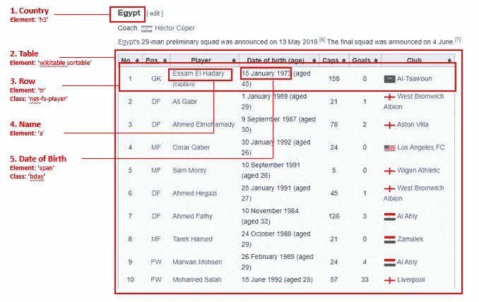

维基百科页面上感兴趣的 HTML 元素

**国家:**表格按顺序列出，每个表格都以国家名称开头，这是一个 h3 HTML 元素，带有“mw-headline”类。比赛中有 32 个国家参赛，所以我们取页面上的前 32 个 h3 元素(后面有我们不想要的 h3 文本)。然后我们将使用 *np.repeat()* 重复每个国家 23 次(每个玩家一次):

```
h3 = mens_soup.find_all('h3')h3 = h3[:32]mens_countries = []for h in h3:
    mens_countries.append(h.find('span', class_='mw-headline').text)mens_countries = np.repeat(mens_countries, 23)
```

**表格:**每个国家都有单独的球员信息表格。他们的类是“sortable wiki table plainrow headers”，页面上没有这种类型的表，所以我们将它们全部收集起来:

```
tables = mens_soup.find_all("table", class_="sortable wikitable plainrowheaders")
```

**Row:** 在每个表中，我们将遍历这些行来获取其中的数据。我们可以使用以下方式识别每个表中的行:

```
rows = table.find_all('tr', class_='nat-fs-player')
```

**姓名和出生日期:**我们将找到每一行中的第二个链接，并获取与之相关的文本；我们还将从每一行中获取出生日期，这是一个带有类“bday”的 span 元素:

```
player = row.find_all('a')[1].textbday = row.find('span', class_='bday').text
```

将所有这些整合到一个函数中，并对团队的数量进行参数化，以确保我们可以为女子团队(有 24 个团队，而不是 32 个团队)重复该过程:

```
def get_football_bdays(main_url, n_teams):
  '''
  function to generate df of footballers and bdays
  ''' # get main Wiki page
  wiki = requests.get(main_url)
  soup = BeautifulSoup(wiki.content) # get list of country names
  h3 = soup.find_all('h3')
  h3 = h3[:n_teams]
  countries = []
  for h in h3:
    countries.append(h.find('span', class_='mw-headline').text) countries = np.repeat(countries, 23) # get players and birthdays
  players = []
  player_links = []
  bdays = [] tables = soup.find_all("table", class_="sortable wikitable plainrowheaders") for table in tables:
    table.find_all('th') rows = table.find_all('tr', class_='nat-fs-player') for row in rows:
      players.append(row.find_all('a')[1].text)
      bdays.append(row.find('span',  class_='bday').text) df = pd.DataFrame(data={'Country': countries,
                          'Player': players,
                          'Date_of_Birth': bdays}) return df
```

我们将应用于男子和女子队页面，并将结果数据框合并为一个:

```
df_men = get_football_bdays('https://en.wikipedia.org/wiki/2018_FIFA_World_Cup_squads', 32)df_women = get_football_bdays('https://en.wikipedia.org/wiki/2019_FIFA_Women%27s_World_Cup_squads', 24)df_men['Gender'] = 'Men'
df_women['Gender'] = 'Women'
df = df_men.append(df_women).reset_index(drop=True)
```

让我们来看看我们的数据:

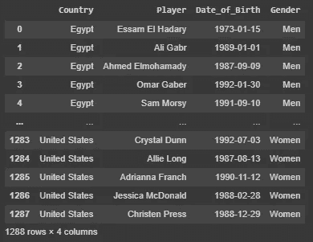

## 数据操作

在这一部分，我们将找出至少有一对生日相同的团队。为此，我们将首先提取每个出生日期的月和日元素:

```
df['Date_of_Birth'] = df['Date_of_Birth'].apply(pd.to_datetime)df['Birthday'] = df['Date_of_Birth'].map(lambda x: str(x.month) + '-' + str(x.day))
```

然后，我们将创建一个列来指示生日是否在团队中重复(如果重复，则用 1 表示，否则用 0 表示):

```
df['Duplicated'] = df.duplicated(['Gender', 'Country', 'Birthday']).astype(int)
```

计算每个团队中的副本数量，并显示结果:

```
df_duplicates = df.groupby(['Gender', 'Country']).agg({'Duplicated':'sum'}).reset_index()
df_duplicates = df_duplicates.sort_values('Duplicated', ascending=False)
df_duplicates['Team'] = df_duplicates.apply(lambda x: x['Country'] + ' ' + x['Gender'], axis=1)g = sns.barplot(data=df_duplicates, x='Team', y='Duplicated', hue='Duplicated', dodge=False, palette=sns.color_palette("GnBu_d"))g.set_xticklabels(g.get_xticklabels(), rotation=90, fontsize=6)
g.set_ylabel('Shared Birthdays')
g.set_title('Number of shared birthdays in each team')
g.legend_.remove()fig = g.get_figure()
fig.tight_layout()
```

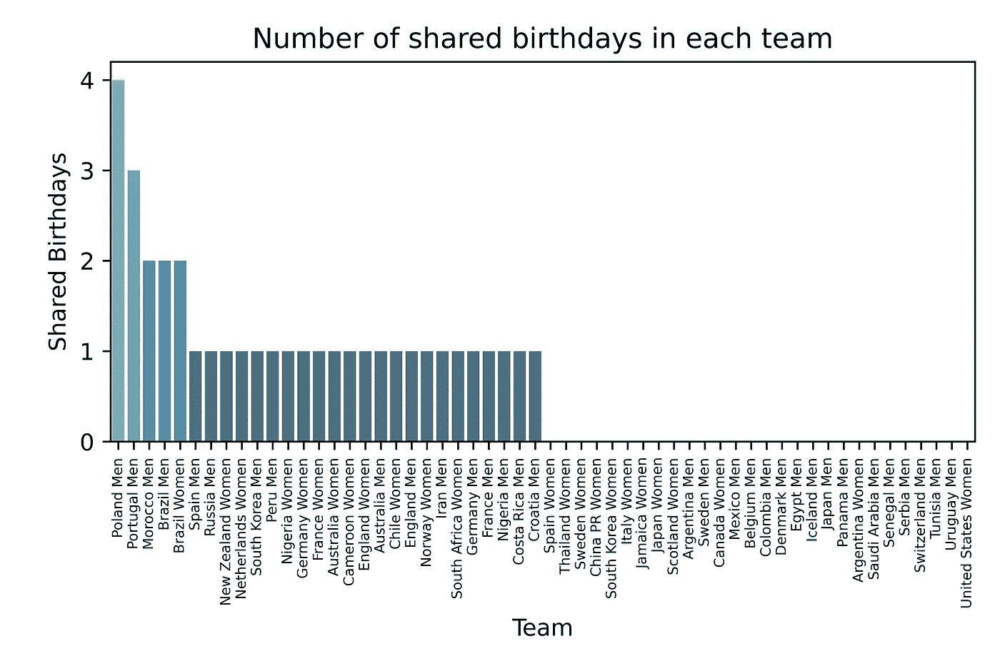

波兰男队 23 名球员中有多达 4 对重复生日；葡萄牙男人有 3 个；摩洛哥男队和两支巴西队各得 2 分。更重要的是，56 支队伍中有 28 支队伍有相同的生日，正好是一半。似乎很幸运！或者是？

## 统计计算

我们已经掷了 56 次硬币，假设 50.73%的时间硬币落在头上，但有一半的时间硬币落在头上。我们的硬币公平吗，即我们 50.73%概率的模型正确吗？

给定 50.73%的理论概率，获得 28 个生日匹配的团队的可能性由二项式概率质量函数给出:

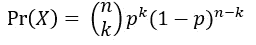

其中 *n* 是试验次数， *k* 是成功次数， *p* 是我们的理论概率。我们会用 Python 找到确切的可能性。

首先，我们计算得到至少一对与 23 个人生日匹配的精确理论概率:

```
mltp = 1for i in range(343, 366):
  mltp*=ip = 1 - mltp*((1/365)**23)
```

得出 *0.5072972343239852* 。我们的 *k* 和 *n* 简单来说就是生日匹配的队伍数量和队伍总数，分别是:

```
k = len(df_duplicates[df_duplicates['Duplicated']>0].index)
# 28n = len(df_duplicates.index)
# 56
```

我们将使用 Scipy 中的 *binom()* 函数来计算可能性:

```
from scipy.stats import binomp_M1 = binom.pmf(k, n, p)
```

以上(结果为 *0.10551566641902223* )是在 56 支队伍中找到 28 支生日相匹配的队伍的可能性，给定我们不久前的模型 *M1* :

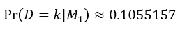

我们的另一种先验信念是，所有的概率都是同等可能的——也就是说，我们不知道概率。这可以用贝塔函数参数 *α = 1，β = 1* 的贝塔二项式先验分布来建模。贝塔二项式概率质量函数为:

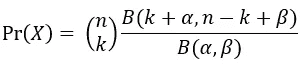

其中 B()是β函数，参数如上所述。幸运的是，SciPy 对此也有一句俏皮话:

```
from scipy.stats import betabinomp_M2 = betabinom.pmf(k, n, 1, 1)
```

上面是给定一个均匀的概率密度先验，得到 28 个生日匹配的球队的可能性。这表现为:

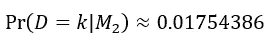

我们记得贝叶斯因子是两种可能性的比率:

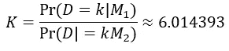

超过 5 的 K 值指向 *M1* 的“实质性”证据，支持我们的假设，即我们的结果用 50.73%的概率描述要比随机描述好得多。

# 外卖

那么我们从这一切中学到了什么呢？

*   我们已经详细探讨了生日问题，并从数学上表明，在 23 人的小组中，两个人更有可能过同一天生日。
*   我们通过分析 2018/19 年世界杯每队 23 名球员的生日来寻找支持这一观点的证据，通过使用**自定义网页抓取功能**抓取两个维基百科页面来收集必要的数据。
*   我们发现 56 支参赛队伍中有一半的队员是同一天生日的；有些甚至超过两对。
*   给定我们收集的数据，我们使用 **Bayes 因子**来测试两个先验假设:使用二项式概率质量函数计算的概率是精确的；或者，使用β-二项式概率质量函数，所有概率都是同等可能的(即*我们不知道*)。
*   我们为前一个模型找到了**的实质性证据**，证明了生日问题(以及引申开来的*数学*)是正确的。

引人入胜的东西，如果我可以这么说。

# 事后思考

我做错什么了吗？我能做得更好吗？我做得好吗？

请随时在 [LinkedIn](https://www.linkedin.com/in/marcell-ferencz-9892a3a6) 上联系我；如果你对我的工作感兴趣，我总是很乐意接受挑战或者只是聊聊天。

如果你想自己玩代码，请点击我的 Google Colab 笔记本的链接:

[](https://colab.research.google.com/drive/1BfeeVJbHqets02tTNwIiEeWpQ7xtX163) [## 谷歌联合实验室

### 编辑描述

colab.research.google.com](https://colab.research.google.com/drive/1BfeeVJbHqets02tTNwIiEeWpQ7xtX163)