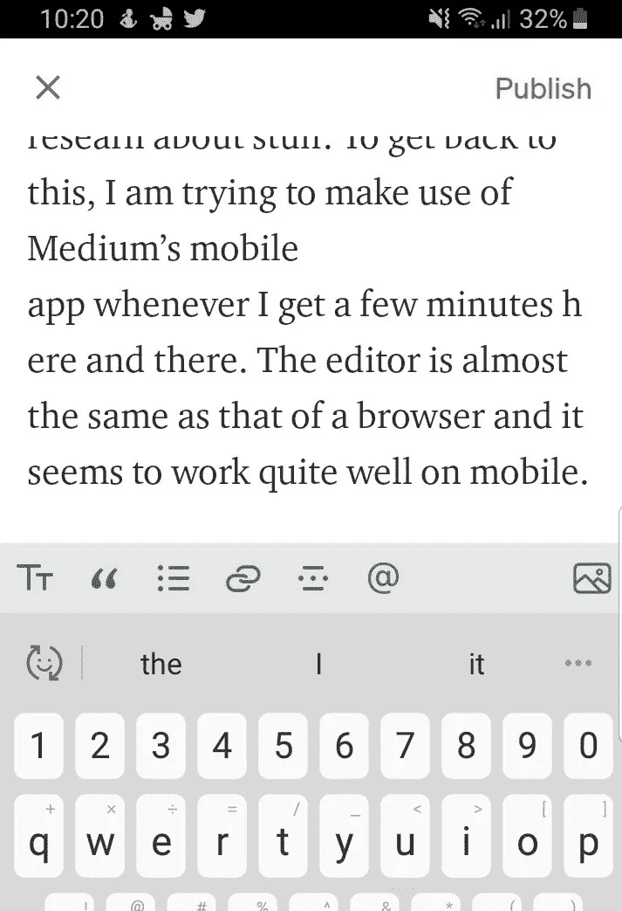
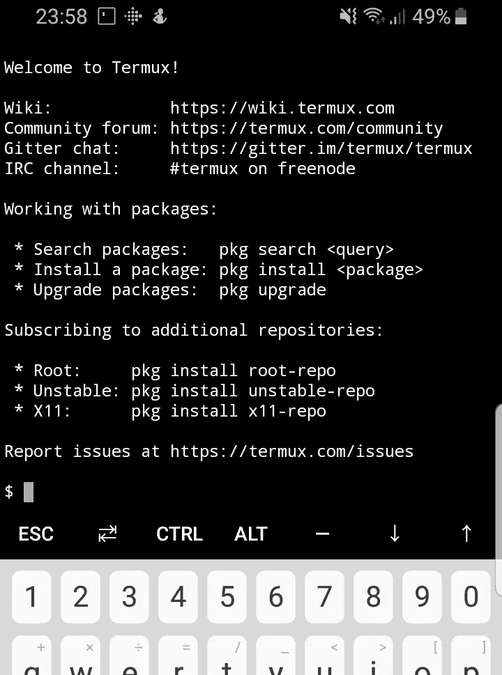
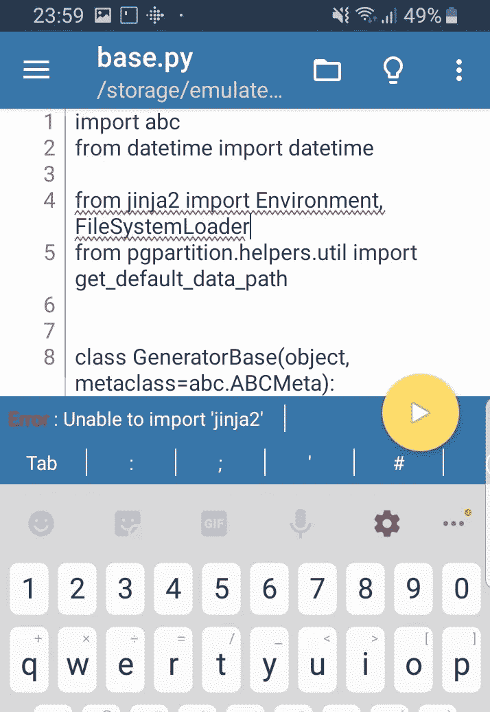
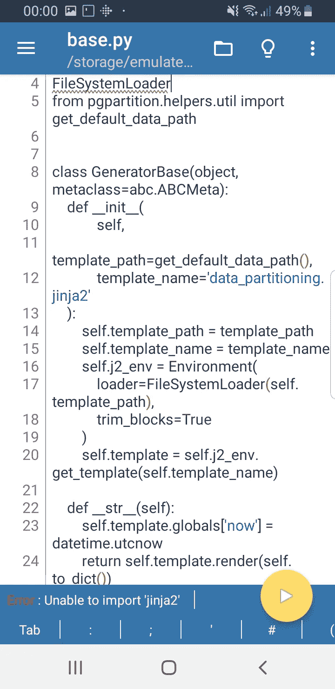
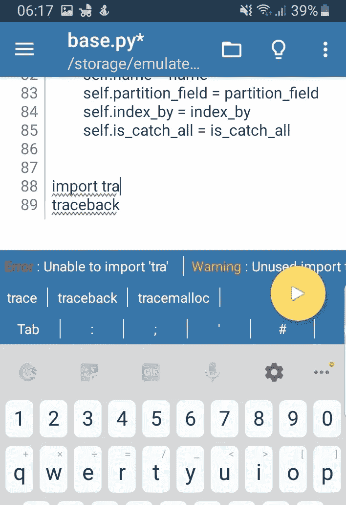
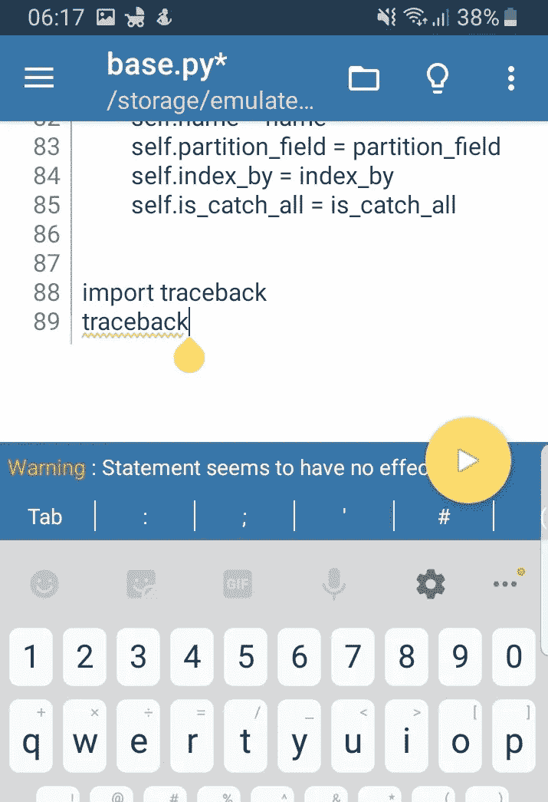
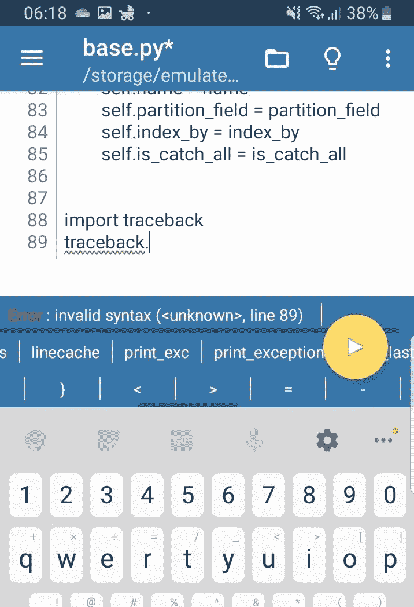
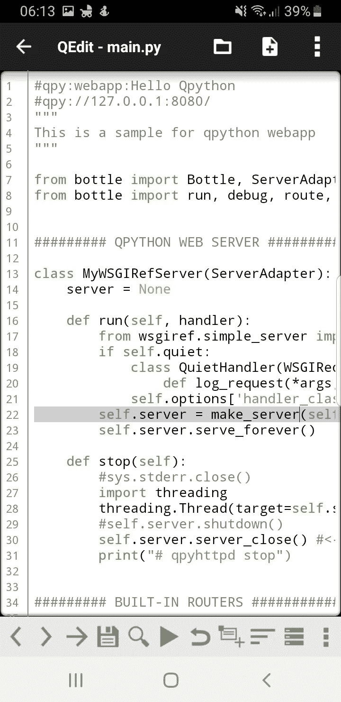
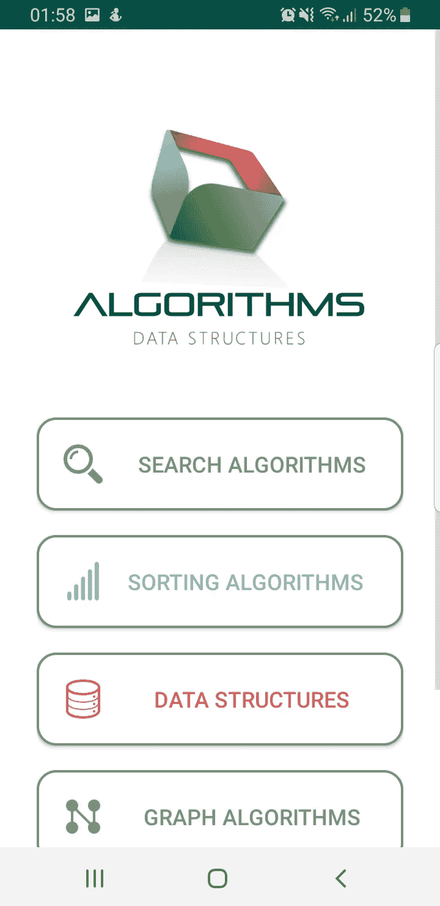
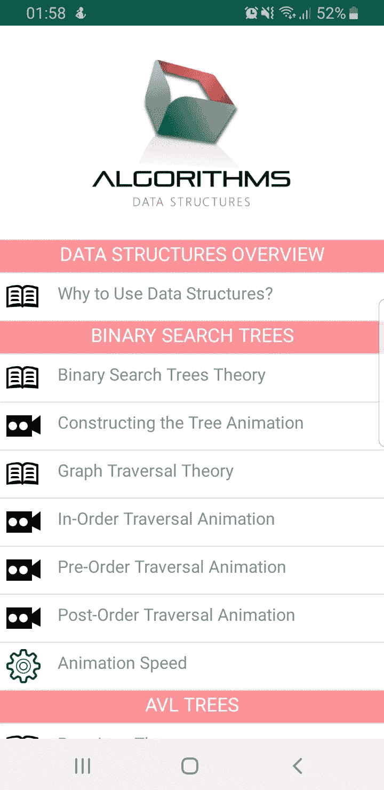

# 对于编码和空闲时间的妈妈们

> 原文：<https://towardsdatascience.com/for-moms-who-code-and-the-idle-hours-72964d75d11d?source=collection_archive---------38----------------------->

## 我希望我拥有的超能力:心灵遥感


在 [Unsplash](https://unsplash.com?utm_source=medium&utm_medium=referral) 上由 [Lacie Slezak](https://unsplash.com/@nbb_photos?utm_source=medium&utm_medium=referral) 拍摄的照片

作为一个两个月大的漂亮宝宝的第一次妈妈，我发现自己大部分时间都被限制在尴尬和累人的位置来喂她，并帮助她放松和睡觉。那时，我最想要的超能力肯定是心灵遥控，因为一旦你处于喂食的位置，例如，如果你没有你需要的所有东西，也没有人帮助你，这取决于婴儿的情绪，你注定会盯着你试图够到的东西，而你抓不到的东西，墙，或者更糟的是，电视。这很可能是接下来的…一两个小时？乐观估计:)

> 我希望我拥有的超能力:心灵遥感

在经历了最初几周的疯狂、懒散和失眠后，我想我应该想出如何最大限度地利用这些安静的时间，每当我被捆住手脚，除了静静地等待什么也做不了的时候。

所以…简而言之，我需要:

*   我的手机，因为把我的小家伙放在腿上的时候拿着笔记本电脑是不可能的(手机也必须放在安全的距离内)
*   一些帮助我编码的东西
*   帮助我跟上文章写作的东西
*   帮助我学习的东西

# 首先:中型应用程序

几个月前，当我怀孕 7 个月的时候，我开始在媒体上写作，以便更好地理解我所知道的事情。我很享受这个过程，但是现在对我来说打开我的笔记本开始写作和研究是不可行的。回到这个话题，每当我有几分钟的时间，我都会尝试使用 Medium 的移动应用程序。这个编辑器几乎和浏览器的编辑器一样，看起来在手机上运行得很好。不过，到目前为止，我还没有找到添加标题或删除图片的方法。



盗梦空间！

# 泰尔穆克

我需要做的另一件事是**在现有代码**上工作，例如修复 bug 或添加特性**或创造新东西**。这意味着我需要一种方法在我的手机上获得我的代码，所以最简单和最合理的方法是通过**版本控制工具**，git，可能还有 github。我发现 Termux 很有帮助！经过几次尝试和一些搜索，才找到了存储库的保存位置，以便其他应用程序可以看到它们。

```
**# first of all install git**
pkg install git**# then create the projects' space and start cloning repos**
cd /storage/emulated/0
mkdir Projects
cd Projects
git clone ....exit
```

到目前为止，我喜欢特穆克斯！



Termux 接口

# Python 编辑器和环境

最近我的大部分工作都是用 Python 完成的，所以我需要一些东西来帮助我处理 Python 文件。当然，我不期望在手机上运行我的项目，否则我会浪费宝贵的时间。我只需要基本的，一个编辑器，将为我提供基本的支持。快速搜索后，我想到了以下两个。

## Pydroid 3

Pydroid 3 安装 Python 3，让你创建和编辑你的 Python 文件。它支持你自动完成和基本的错误和警告提示。

例如，Jinja 2 没有安装在当前的 python 环境中，所以我得到以下错误:



缺少库错误

但是文本换行使得阅读和操作有些困难。我不确定这是否是可配置的，我会就此回复你。例如，以下示例在正常模式下完全对齐，但在移动模式下完全对齐:



文本换行使得代码难以阅读

为了查看自动完成特性的有用性，我尝试了下面的简单测试:添加`traceback`而不导入会给出一个未定义的变量错误。但是没有提出可能的纠正建议。当您开始编写导入时，自动完成建议就开始了，例如`import traceback`，这很有用。但最重要的是，对于导入的模块，本例中的追溯模块，有一些建议。


尝试自动完成功能第 1 部分



尝试自动完成功能第 2 部分



尝试自动完成功能第 3 部分



尝试自动完成功能第 4 部分

我目前正在尝试付费版本，到目前为止还不错，除了在一个复杂项目的文件之间切换的困难。

## qd python 3

Pydroid 3 的替代产品。我还没有时间去充分地探索它，但是，第一眼看上去，那种烦人的文本换行并不存在，代码看起来也应该如此。然而，它似乎缺乏 autoconplete，我不能很容易地导航到项目文件夹，但同样，没有足够的测试到目前为止。我在考虑用它比用 Pydroid 更容易地查看代码，但是我们会看到的。



没有文本换行—使内容更具可读性

# 学习新事物——更新旧知识

我发现我正处于一个很好的机会来更新旧的东西，比如算法和数据结构，并学习新的东西，比如用 PyTorch 进行深度学习等等。也就是说，当我没有疯狂地寻找和研究与婴儿有关的每一件小事，以及对于一个新生的☺来说什么是正常的或不正常的时候

## Algorhyme

我并没有花太多时间去搜索，我只是选择了目前评论最好的应用。它有算法和数据结构的理论，以及一些非常好和有用的动画——我总是通过可视化学得更好。



## 安卓版 Kindle

我想这是一个显而易见的问题，我把去年购买的一些编程电子书加载到了我的安卓版 Kindle 上。失眠当然不会让阅读一些技术性的东西变得容易，但是有时候我思路清晰，能够阅读一些与工作相关的东西对我来说是件好事。它让我的思维活跃，好奇心增强。这也是一个积极的改变，从阅读关于婴儿猝死综合症和所有可能出错的婴儿相关的事情——是的，我就是那个人……

现在，当我头脑模糊的时候，我通过欣赏像亚历克斯·诺里斯的《哦，不》和内森·w·派尔的《T2 奇怪的星球》这样的漫画来保持头脑简单。

# 笔记

*   **准备好能量银行！**你的电池会比你想象的更快耗尽，而且你无法移动，记得吗？
*   不言而喻:**只要有可能就睡觉**而不是让自己全神贯注于其他事情，尤其是在最初的几个月。
*   也不言而喻:**练安全**。确保您的宝宝处于安全的位置，并始终 ***始终*** 关注他们。
*   **这些应用是为安卓用户准备的**，但我相信 iOS 也有类似的应用。如果你知道的话，请告诉我。
*   我花了**几天的时间来写和发表**这篇文章，而且我有时确实需要使用我的笔记本电脑，所以，目前完全在移动设备上做事情似乎是不可行的。但是能发表出来的感觉真好，即使是这样的速度！让我们看看我是否能做得更好。

我希望这些想法对你有所帮助。让我知道你的经历，或者你有其他的想法或建议！

保重！