# 真的吗？基于机器学习的汽车保险欺诈索赔检测。

> 原文：<https://towardsdatascience.com/for-real-auto-insurance-fraud-claim-detection-with-machine-learning-efcf957b38f3?source=collection_archive---------10----------------------->

作者:Ice Asher Chew | linkedin.com/in/iceasherchew | github.com/iceasherchew

读者们，这篇文章是关于我做的一个关于汽车保险欺诈索赔检测的项目，使用了许多不同的分类器和集成器。这篇文章可能会引起一些公司的兴趣，这些公司正在研究将机器学习作为一种方法来对少数民族班级或正在做类似项目的学生进行分类。请查看我的 GitHub 以获取代码和更详细的报告，我在其中详细介绍了数据清理、EDA 和其他组件。

链接到代码:

[https://github . com/iceasherchew/Asher-github/tree/master/Handling % 20 不平衡% 20classes _ auto % 20insruance %欺诈](https://github.com/iceasherchew/Asher-github/tree/master/Handling%20imbalance%20classes_auto%20insruance%20fraud)

# **问题陈述**

这个项目的目标是建立一个可以检测汽车保险欺诈的模型。机器学习中欺诈检测背后的挑战是，与合法的保险索赔相比，欺诈远不常见。这类问题被称为不平衡分类。欺诈是不道德的，是公司的损失。通过建立一个可以对汽车保险欺诈进行分类的模型，我能够为保险公司减少损失。亏损越少，收益越多。

**与业务的相关性:**

不平衡的阶级问题在很多行业都很普遍。很多时候，我们感兴趣的是一个少数阶级，而不是另一个大得多的阶级。例如，对其他类型的欺诈进行分类、对有缺陷的商品进行分类、对处于危险中的青少年进行分类、识别高潜力雇员、识别恐怖分子等相关人员等等。

**成功的标准:**

该模型应该能够在它没有看到的数据集上准确地分类索赔是否是欺诈。这通过 F1 得分来衡量，并与 F1 的基线天真预测值 0.397 进行比较。ROC 曲线下面积(ROC AUC)也将作为次要标准在模型选择中加以考虑，因为区分欺诈和合法索赔非常重要。这是因为对欺诈的调查既耗时又昂贵，甚至可能对客户体验产生负面影响。作为强制性标准，ROC AUC 必须高于 0.50。最重要的是，我的目标是 ROC AUC 至少为 0.70。

**保险诈骗背景:**

保险欺诈是保险公司或代理人为获取经济利益而故意实施的欺骗行为。申请人、投保人、第三方索赔人或为索赔人提供服务的专业人员可能在交易的不同环节实施欺诈。保险代理人和公司员工也可能实施保险欺诈。常见的欺诈包括“填充”，或夸大索赔；在保险申请中歪曲事实；提交从未发生的伤害或损害的索赔；制造事故。

联邦调查局估计，保险欺诈的总成本(不包括健康保险)每年超过 400 亿美元。
汽车保险欺诈的范围很广，从在保险申请中歪曲事实、夸大保险索赔，到策划事故、提交从未发生的伤害或损坏的索赔表，再到虚报被盗车辆。

根据保险研究委员会(IRC)的一项研究，欺诈占 2012 年汽车保险人身伤害总索赔额的 15%至 17%。该研究估计，2012 年，汽车保险人身伤害赔付中有 56 亿至 77 亿美元被欺诈，而 2002 年的数字为 43 亿至 58 亿美元。

目前的研究旨在对索赔引起的汽车保险欺诈进行分类。该数据集中没有披露欺诈的类型，可能是虚假报告、夸大索赔、策划事故或提交从未发生的损害或伤害的索赔表。

来源:[https://www.iii.org/article/background-on-insurance-fraud](https://www.iii.org/article/background-on-insurance-fraud)

# 行动纲要

这个项目的目标是建立一个可以检测汽车保险欺诈的模型。机器学习中欺诈检测背后的挑战是，与合法的保险索赔相比，欺诈远不常见。这类问题被称为不平衡分类。

用处理不平衡数据集的不同方法测试了几个模型。顶级模特也穿着不同的套装进行试衣和测试。

最终拟合的模型是一个加权 XGBoost，其 F1 值为 0.72，ROC AUC 值为 0.84。该模型的表现远好于基线 F1 评分 0.397 和 ROC AUC 目标 0.7。该模型的 F1 评分和 ROC AUC 评分是其他模型中最高的。总之，该模型能够以较高的准确度正确区分欺诈索赔和合法索赔。

在建模之前，数据是干净的，并进行探索性数据分析。之后，数据被预处理用于建模。建模后，评估模型，并使用 F1 评分和 ROC AUC 评分选择最佳拟合模型。进一步详细讨论了最终拟合模型的性能，并展示了其主要特征。该项目最后重申了研究的重要性和已经完成的工作，并提出了一些限制。

# 关于数据集

**数据来源:**【https://www.kaggle.com/roshansharma/insurance-claim 

这个项目的灵感是对不平衡类数据集进行分类，特别是欺诈。欺诈数据集非常难以获得，并且由于其敏感性，通常是未标记的。

当前数据集用 n=1000 个样本标记。与许多其他数据集不同，这个数据集不太受欢迎，只有作者和另一个人在 Kaggle 上有一个笔记本，这使得这个数据集在本质上相当新颖。该数据集包括从 2015 年 1 月 1 日到 2015 年 3 月 1 日来自俄亥俄州、伊利诺伊州和印第安纳州的 1000 起汽车事故和汽车保险索赔。在任何清理或特征工程之前，数据集总共有 39 个变量。没有说明这个数据是来自多家保险公司还是只有一家公司。但是，在整个报告中，将使用“保险公司”来指代这些数据的来源。

这个数据集的明显缺点是样本量小。但是，仍然有很多公司没有大数据集。对于任何希望转型到利用数据科学的公司来说，利用可用资源的能力至关重要。在 2017 年 MIT tech review，EmTech 演示中，吴恩达教授在白板上写下了一个循环图，并解释说，许多公司从一些小数据开始，开发一个拥有用户的产品，这反过来导致更多产品的产生。类似地，公司可能从一个小的数据集开始，随着时间的推移，建立一个更大的数据集。与等待拥有庞大数据集的那一天的公司相比，从小型数据集开始并处理它的公司更有可能在数据科学之旅中更早成功并获得回报。

# 探索性数据分析

*查看我的 GitHub 获取更多详细的 EDA*

**因变量**
从因变量 Fraud_reported 开始进行探索性数据分析。有 247 起欺诈事件，753 起非欺诈事件。24.7%的数据是欺诈性的，而 75.3%是非欺诈性的索赔。

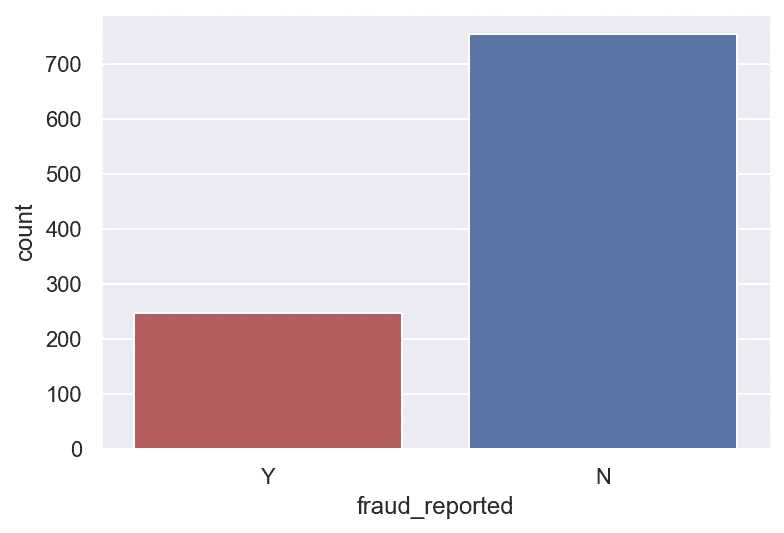

**变量间的相关性**
接下来，检查连续变量(序数、区间/比率变量)间的相关性。为 Pearson 相关系数至少为 0.3 的变量绘制热图，包括 DV。

客户的月份和年龄的相关系数为 0.92。可能是因为司机在拥有一辆车时购买了汽车保险，而这一时间尺度只会随着年龄的增长而增加。

事故严重性和不同类型的索赔有明显的相关性($ r $ = 0.36–0.50)

除此之外，数据中似乎没有太多的相关性。
似乎不存在多重共线性问题，除了可能所有索赔都是相关的，并且总索赔已经说明了它们。
但是，其他索赔提供了一些粒度，否则总索赔将无法获取这些粒度。因此，这些变量被保留下来。

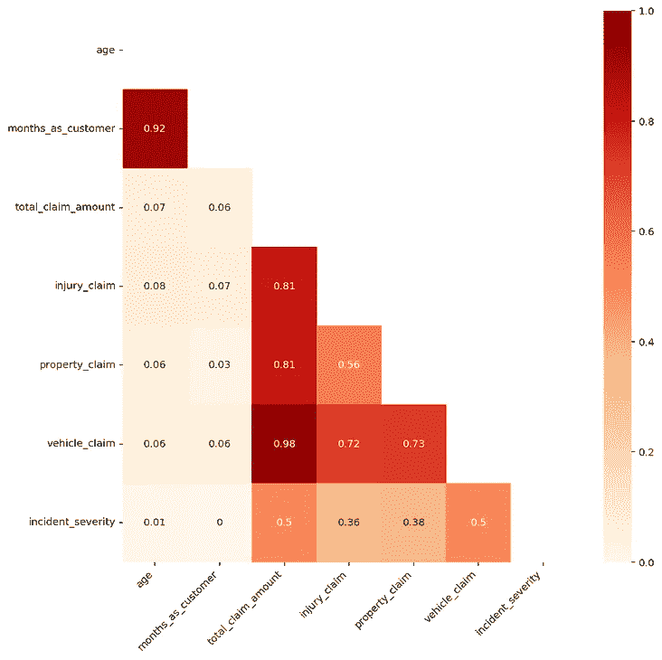

**将变量相对于 DV**
可视化，绘制 DV 分割的每个变量的计数。下面是几个值得注意的情节。

我一点也不怀疑欺诈在不同的爱好中有所不同。看起来棋手和异装癖者有更高的欺诈倾向。我停下来想，这项运动是否会让人倾向于欺诈，或者有这种倾向的人会被它吸引

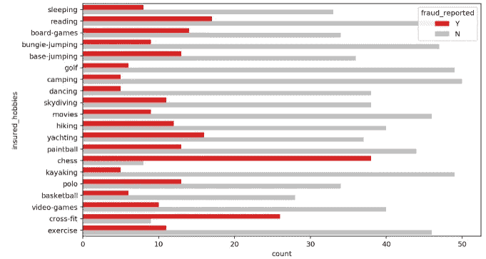

重大事件的严重性似乎是欺诈案例最高，超过了非欺诈案例。

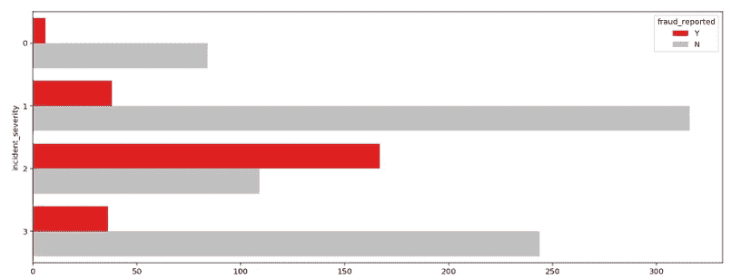

从索赔总额的平均值来看，欺诈索赔似乎比非欺诈索赔多。

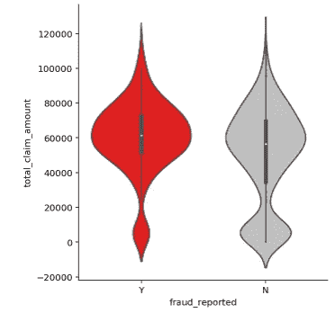

# 索赔损失

在这里，我将损失定义为从保险公司流出的钱。另一方面，收入来源是保险费。虽然我们知道保费和索赔不是保险公司资金进出的唯一来源，但这两个变量是我们从该数据集中获得的唯一信息。通常，其他资金流动的来源可能是保险公司的投资。

我创建了一个变量来衡量索赔额减去客户支付的保费，以显示索赔损失。正数表示亏损，负数表示盈利。每次索赔金额超过客户支付的总保费时；这是保险公司的损失。

2015 年，保险公司通过欺诈索赔损失了 8，198，060.09 美元。诈骗的平均损失为 43752.03 美元 *(M = 43752.03，SD = 21812.68)* ，多了 10383.35 美元 *(p < .001)* 。比通过合法债权的平均损失 *(M = 33368.68，SD = 29690.41)* 。

请注意，这不是保险公司赚的钱，因为数据集只显示事故索赔。

在美国，过去发生过失事故的全国平均数大约是 12%的车主。

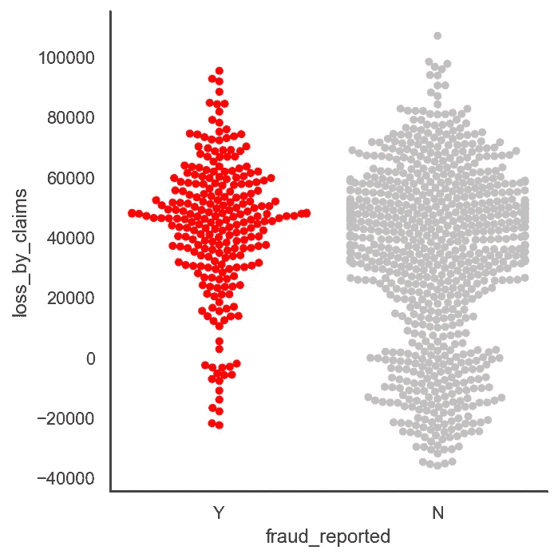

# 预处理

DV，fraud_reported 编码为 1 代表欺诈，0 代表非欺诈。

创建了六个交互术语。财产索赔金额和事故严重程度、车辆索赔金额和事故严重程度、伤害索赔金额和事故严重程度、总索赔金额和事故严重程度、保单年度保费和总索赔金额、总限额和总索赔金额之间的相互作用。

名义变量被一次性编码，数据集被分成 75%的训练集和 25%的测试集，根据欺诈报告进行分层。

# 基线分数

由于我们的数据集是不平衡的，准确性不是衡量成功的好标准。高精度可以通过仅选择多数类的差模型来实现，因此，不检测和测量对感兴趣的类进行分类的精度。事实上，仅预测多数类将给出 75%的准确性，100%的特异性，但灵敏度为 0%。

如果我们天真地预测所有索赔都是欺诈，因此没有欺诈逃过我们的监视，我们的得分如下所示:

-灵敏度:1.0
-特异性:0.0
-精确度:0.248
- F1 得分:0.397
- ROC AUC 得分:0.50

因为目标是识别尽可能多的欺诈，所以 F1 分数 0.397 被用作基线。然而，对欺诈的调查可能既费时又费钱，甚至可能影响客户体验。因此，ROC AUC 分数也将用于衡量我们如何区分欺诈和合法索赔。基线 ROC AUC 得分为 0.50。我的 ROC AUC 至少为 0.70。

# 建模

在这个项目中使用了五种不同的分类器:
-逻辑回归
-K-最近邻
-随机森林
- XGBoost
- AdaBoost

使用随机搜索对所有模型进行超参数调整和选择。由于运行的参数和模型的数量，与 gridsearch 相比，RandomizedSearch 是一个更快更有效的选择。

在 10 倍随机化搜索 CV 之后，模型及其选择的超参数被拟合在训练集上。

计算随机化搜索 CV 的最佳估计值的平均准确度分数、训练集的准确度分数和测试集的准确度分数。然后，计算灵敏度、特异性、精确度、F1 评分和 ROC AUC 评分。

*查看 RandomizedSearch 与 GridSearch 的实验链接(剧透:RandomizedSearch 在 10、50、100、500 次试验中获胜，时间和成本函数值不同，但情况并非总是如此):*

[*https://towardsdatascience . com/random-search-vs-grid-search-for-hyperparameter-optimization-345 e 1422899d*](/random-search-vs-grid-search-for-hyperparameter-optimization-345e1422899d)

本节讨论不同的模型块是如何运行的。对模型的评估将是评估部分。

## 1.具有类别加权和超参数调整的模型

如上所述的五个分类器用超参数调谐来运行。具有类别加权选项的模型将类别加权作为该模型块中的超参数之一。也就是说，随机搜索将测试加权和非加权模型，以查看哪一个表现更好。

使用类权重的最佳实践是使用训练数据集中存在的类分布的逆分布。例如，测试数据集的类分布是少数类与多数类的比例为 1:100。这个比率的倒数可以用 1 表示多数阶级，用 100 表示少数阶级；例如:{0:1.0，1:100.0}。在我们的例子中，类权重是{0:0.246667，1:0.75333}。在 XGBoost 中，类权重的定义是不同的。XGBoost 使用比例正权重，即负样本总数除以正样本总数。对于不平衡的二元分类数据集，负类是指多数类(类 0)，正类是指少数类(类 1)。在此分析中，按比例调整的正权重为 3.054。

## 2.使用 SMOTE 进行过采样建模

五个分类器在 SMOTE 数据集上运行，具有超参数调整。SMOTE 的工作方式是选择特征空间中接近的示例，在特征空间中的示例之间画一条线，并在沿着该线的一点处画一个新的样本。具体来说，首先从少数类中随机选择一个例子。则找到该示例的 k 个最近邻居(通常 k=5)。选择随机选择的邻居，并且在特征空间中的两个示例之间的随机选择的点处创建合成示例。仅对训练集进行过采样。在 SMOTE 之后，欺诈和非欺诈在训练集中有 565 个样本。由于 SMOTE 是为处理不平衡的类而设计的，所以没有对类进行加权。

## 3.使用 ADASYN 进行过采样建模

ADASYN 和 SMOTE 做的一样，只是有一点小的改进。创建这些样本后，它会在点上添加一个随机的小值，从而使其更加真实。换句话说，不是所有样本都与母体线性相关，而是样本中有更多的方差和噪声，而且有点分散。ADASYN 过采样只对训练集进行。在 ADASYN 之后，欺诈和非欺诈都在训练集中有 565 个样本。五个分类器在 ADASYN 数据集上运行，并进行超参数调整。

**4。使用自举进行过采样建模**

与 SMOTE 或 ADASYN 不同，bootstrap 从现有的发行版中提取数据，不会创建合成数据。因此，数据只是对现有数据的简单重复，而且被许多人认为不那么有偏见。Bootstrap 过采样是通过从现有欺诈数据集中随机抽取替换数据进行的，直到欺诈和非欺诈的样本量相同，均为 565。Bootstrap 只在训练集上进行。五个分类器在自举数据集上运行，具有超参数调整。

# 集合模型

机器学习中的集成模型组合来自多个模型的决策，以提高预测的整体性能和稳定性。

在集合之前，运行预测的相关性。XGB、Random forest 和 AdaBoost 具有高相关性，可能因为它们都是 CARTs(分类和回归树)。除此之外，模型似乎捕捉到了特征空间的不同方面，正如它们预测的小至平均相关性(皮尔逊试探法)所示。

通过学习结合它们各自的优势，一个集合可能能够胜过任何单一的模型。然而，我们为集合选择的模型不应该高度相关。否则，我们的模型将无法解释独特的变化，因此，不太可能改善。集成模型将使用最佳逻辑回归、KNN 以及 XGB、随机森林和 AdaBoost(集成 3 模型)中的最佳者，基于来自具有类别加权的模型、通过 SMOTE 过采样的模型、ADASYN 和 Bootstrapping 的 F1 分数。

选择的树模型有:
-带 SMOTE 的逻辑回归(F1: 0.41)
-带 bootstrapping 的 KNN(F1:0.42)
-加权 XGBoost (F1: 0.72)

## 1.无过采样的最大投票

最大投票法一般用于分类问题。在这种技术中，使用多个模型来预测每个数据点。每个模型的预测被认为是一次“投票”。我们从大多数模型中得到的预测被用作最终预测。这三个选定的模型在投票分类器中组合在一起。

进行 10 重交叉验证，打印其平均分数，然后计算训练和测试准确度分数。然后，计算灵敏度、特异性、精确度、F1 评分和 ROC AUC 评分。

## 2.过采样下的最大投票

因为在这个项目中，自举总体上比其他过采样技术产生了最好的 F1 分数，所以它在这里被用于最大投票集合。在训练集被引导之后，该过程与没有过采样的最大投票相同

## 3.无过采样混合

在混合方法的第一步中，训练集被分为两部分，即新的训练集和称为验证集的维持集，两者的比例分别为 75:25。混合方法将 3 个选定的模型拟合到新的训练集，并同时对验证集和测试集进行预测。验证集的 3 个不同预测堆叠成一个长列。对测试集的预测也是如此。然后，将元模型(在这种情况下为逻辑回归)拟合到堆叠的验证预测上，并在堆叠的测试预测上评分。

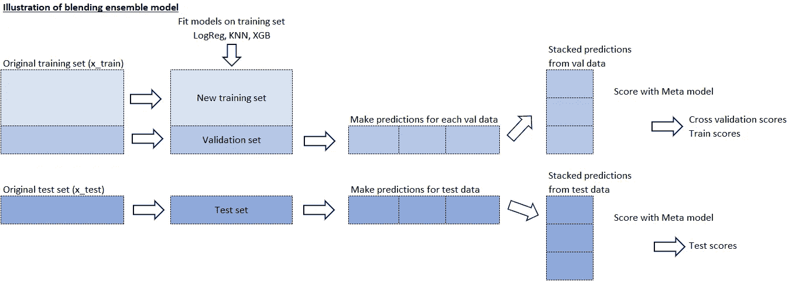

进行 10 重交叉验证，打印其平均分数，然后计算训练和测试准确度分数。然后，计算灵敏度、特异性、精确度、F1 评分和 ROC AUC 评分。

*关于混合的更多信息:*

*Blending 是网飞竞赛获胜者引入的一个词。它与叠加综合密切相关，但更简单，信息泄露的风险也更小。*

*一些研究人员和数据科学家交替使用“堆叠集合”和“混合”。通过混合，您可以创建定型集的一个小型维持集，而不是为定型集创建折叠外预测。然后，预测被用作特征，并且元模型(通常是线性模型)被用于进行最终和实际的评分和预测。该模型中使用的元模型是逻辑回归。*

## 4.混合过采样

因为在这个项目中，自举一般来说比其他过采样技术产生最好的 F1 分数，所以它在这里被用于混合系综。在训练集被引导之后，该过程与没有过采样的混合集成相同

# 估价

交叉验证准确度分数、训练集准确度分数、测试集准确度分数、灵敏度、特异性、精确度、F1 分数和 ROC AUC 如下表所示进行计算和打印。

观察结果:

*   通过比较非过采样数据集、SMOTE 数据集、ADASYN 数据集和 bootstrapped 数据集上拟合的模型，我选择了最佳的逻辑回归、KNN 和 CART 模型。
*   最佳逻辑回归模型是在 SMOTE 数据集上训练的模型。它的 F1 值为 0.41，AUC 为 0.64
*   最好的 KNN 模型是在 bootstrap 数据集上训练的模型。它的 F1 值为 0.42，AUC 为 0.60。
*   CARTs 在这个数据集上表现非常好。然而，由于购物车的预测都是高度相关的，所以选择了其中最好的。最好的 CART 模型是没有过采样的数据集上的加权 XGBoost。它产生 0.72 的 F1 分数和 0.84 的 AUC。
*   总的来说，与其他过采样方法相比，自举方法似乎具有最好的 F1 分数。
*   在自举数据集上训练的 max voting 模型在所有集成模型中表现最好，F1 得分为 0.55，AUC 为 0.77。
*   在没有过采样的数据集上，集成模型并不比加权 XGBoost 表现得更好。这可能是因为 XGBoost 和另外两个选择的模型的分数差异很大，并且它的分数已经很高了。其他 2 个模型的 F1 和 AUC 分数低得多，因此可能会影响整体性能。相反，当所有模型表现一般时，集成模型可能表现得更好。

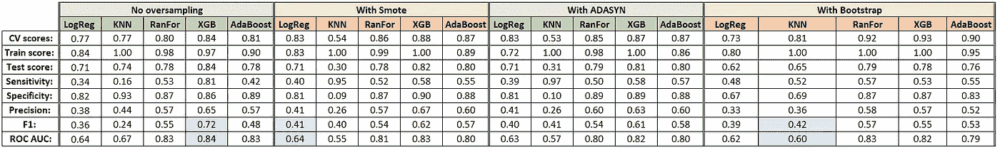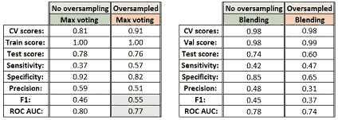

# 最终模型:加权 XGBoost

最终拟合的模型是没有过采样的数据集上的加权 XGBoost。模型的最佳估计量如下:

-Scale _ pos _ weight:3.054054054054054，
- Reg_lambda (L2 正则化权重):0.1，
- Reg_alpha (L1 正则化权重):0.05，
-N _ estimates:550，
- Max_depth: 6，
- Gamma: 3，
- Eta: 0.05

*有关这些参数的更多信息，请访问:https://xgboost.readthedocs.io/en/latest/parameter.html*

*更多关于 XGBoost 的信息请见陈天琦(XGB 主要作者)讲座:*[*&feature = emb _ logo*](https://www.youtube.com/watch?v=Vly8xGnNiWs&feature=emb_logo)

## 最终拟合模型的性能

该模型的训练精度得分为 0.967，测试精度为 0.844。高准确度分数暗示了低偏倚(这只是一个暗示，因为在不平衡类问题中准确度不是偏倚的良好量度)。
训练和测试之间 0.123 的准确度分数差异相对较小。因此，这个模型可以说具有低方差，并且可以在看不见的数据上推广。

下面的混淆矩阵中显示了测试集的每个类别的案例数。y 轴显示实际类别，而 x 轴显示预测类别。
测试集总样本量的百分比打印在每个象限上。

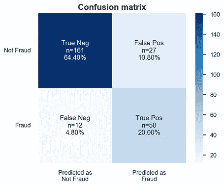

**分类报告摘要如下。**

敏感性(欺诈案例的回忆)源自:

*   真阳性/(真阳性+假阴性)
*   敏感度总结了我们的真实阳性率，即在所有阳性病例中我们有多少是正确的。
*   最终模型的灵敏度为 81%。

特异性(非欺诈案例的回忆)源自:

*   真阴性/(真阴性+假阳性)
*   特异性概括了我们真正的阴性率，也就是在所有阴性病例中我们得到了多少正确答案。
*   最终模型的特异性为 86%

欺诈案例的精确度来自:

*   真阳性/(真阳性+假阳性)
*   欺诈案例的准确性总结了检测到的欺诈案例的准确性。也就是说，在我预测的所有欺诈中，有多少是正确的。
*   欺诈检测的准确率为 65%。

非欺诈案例的精确度来自:

*   真阴性/(真阴性+假阴性)
*   非欺诈案例的准确性总结了检测到的非欺诈案例的准确性。也就是说，在我预测的所有非欺诈中，有多少是正确的。
*   非欺诈检测的准确率为 93%。

F1 分数是召回率和精确度的调和平均值，其来源于

*   (2 倍查全率 x 查准率)\(查全率+查准率)
*   由于我们对欺诈案例感兴趣，因此只报告欺诈案例的 F1 分数。
*   该模型的 F1 分数为 72%。

总之，这个模型远远超过了 F1 的基准分数。

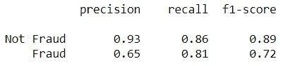

下面的 ROC 曲线总结了我们的模型在真阳性率(灵敏度)和假阳性率(1-特异性)之间的平衡程度。理想情况下，我们希望预测欺诈的真实阳性率为 100%，预测非欺诈的真实阴性率为 100%(或 0%的假阳性，即 100% — 100%的真实阴性率)。这意味着我们对两个类都有完美的预测。然而，在不平衡类问题中，这在现实世界中极难实现。除此之外，在真阳性率和真阴性率以及相反的假阳性率之间有一个交易。
该图总结了我们在真阳性和假阳性率的每个阈值下区分两个类别的能力。曲线下面积用作此指标的汇总百分比。总之，该模型远远超过了基线 ROC AUC 得分。

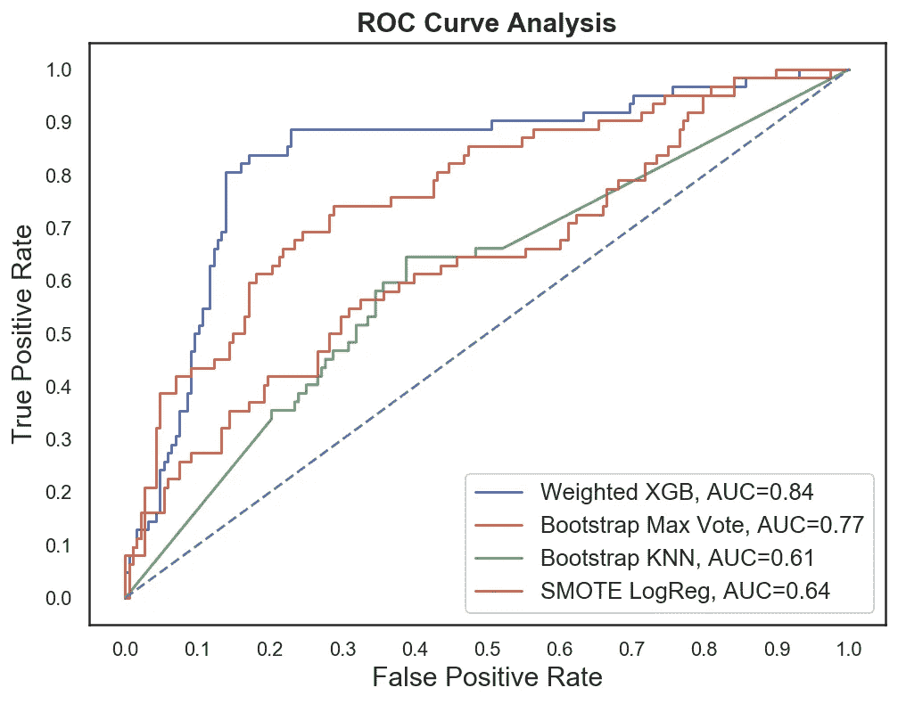

尽管我们的模型在预测非欺诈案例时表现更好，但该模型在预测欺诈案例时表现也非常好。我们有比逃避检测的欺诈更高的错误警报。在我们的情况下，识别更多的欺诈比让欺诈案件逃脱检测要好。因此，该模型成功地实现了检测欺诈索赔的目的。与牺牲太多资源进行调查并阻碍客户体验的基线模型不同，我们也能够在该模型中平衡这一点。我们可以检测到更多的欺诈行为，并且能够通过正确预测非欺诈案件来平衡这一点。

## 顶级功能

重要性提供了一个分数，该分数指示每个特征在模型内的增强决策树的构造中的有用性或价值。在决策树中，一个属性被用来做关键决策的次数越多，它的相对重要性就越高。这种重要性是为数据集中的每个属性显式计算的，允许对属性进行排序和相互比较。

**体重(点击图片可放大):**

使用某个特征在所有树上分割数据的次数。XGBoost 中专门实现的最后一项措施是计算受基于特性的分割影响的样本数。

下图根据权重总结了按功能重要性排名的前 20 名。有象棋、越野赛等爱好的司机似乎更容易作弊。事故严重程度和财产索赔也是最高的。保费和总索赔额、车辆索赔额和事故严重性等交互术语也是权重最高的特征。

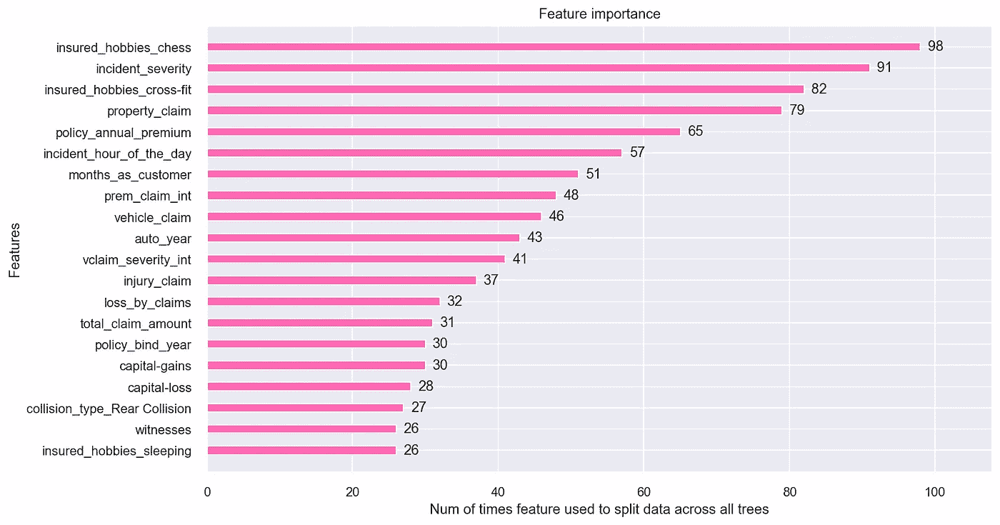

**增益(点击图像放大):**

它有时被称为“基尼重要度”或“平均减少杂质”,并被定义为在集合的所有树上平均的节点杂质的总减少量(由到达该节点的概率加权(由到达该节点的样本的比例近似))。

下图根据权重总结了按功能重要性排名的前 20 名。事故严重性再次成为最重要的因素之一。当考虑杂质的平均减少时，诸如国际象棋和交叉健身等爱好也在最重要的特征之列。总索赔和事故严重性等交互术语也是主要特性。

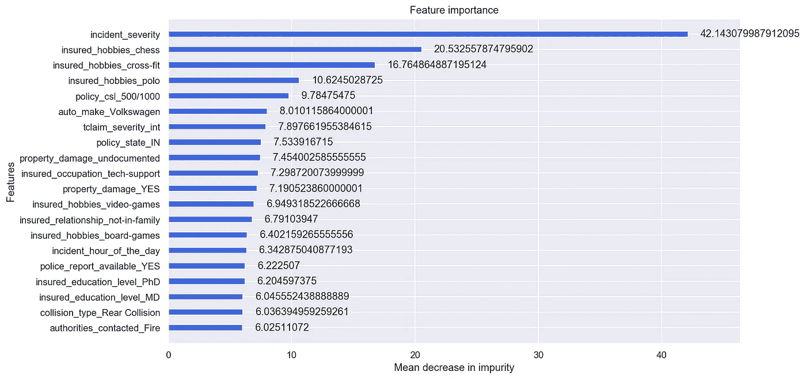

# 结论和局限性

根据保险研究委员会(IRC)的一项研究，欺诈占 2012 年汽车保险人身伤害总索赔额的 15%至 17%。该研究估计，2012 年，汽车保险人身伤害赔付中有 56 亿至 77 亿美元被欺诈，而 2002 年的数字为 43 亿至 58 亿美元。

这个项目建立了一个可以检测汽车保险欺诈的模型。这样，该模型可以减少保险公司的损失。机器学习中欺诈检测背后的挑战是，与合法的保险索赔相比，欺诈远不常见。

在这个项目中使用了五种不同的分类器:逻辑回归、K-最近邻、随机森林、XGBoost、AdaBoost。用这五个分类器测试了处理不平衡类的四种不同方式:具有类加权和超参数调整的模型、具有 SMOTE 的过采样、具有 ADASYN 的过采样和具有 bootstrapping 的过采样。在此基础上，建立了两个最大投票群体。一个在训练集上，一个在引导训练集上。还执行了两个混合系综。一个在训练集上，一个也在引导训练集上。

最佳和最终拟合模型是加权 XGBoost，其 F1 值为 0.72，ROC AUC 为 0.84。该模型的表现远好于基线 F1 评分 0.397 和 ROC AUC 目标 0.7。该模型的 F1 评分和 ROC AUC 评分是其他模型中最高的。总之，该模型能够以较高的准确度正确区分欺诈索赔和合法索赔。

这项研究并非没有局限性。首先，本研究受到样本量小的限制。数据集越大，统计模型越稳定。它也更容易概括，因为它占实际人口的比例更大。此外，数据仅涵盖 2015 年 1 月 1 日至 2015 年 3 月 1 日 3 个州的事故索赔。这意味着我们不知道没有发生事故的汽车保险投保人与发生事故的投保人的比例。我们还局限于两个月之间的事件，这可能不是一年中的准确情况。这一点很重要，因为一年中的某些时间可能与较高的事故率相关，如圣帕特里克节或其他假期。未来的研究可能会调查获取一个更大的多年数据集。然而，由于欺诈的敏感性和此类数据中的机密信息，这可能仍然是一个挑战。