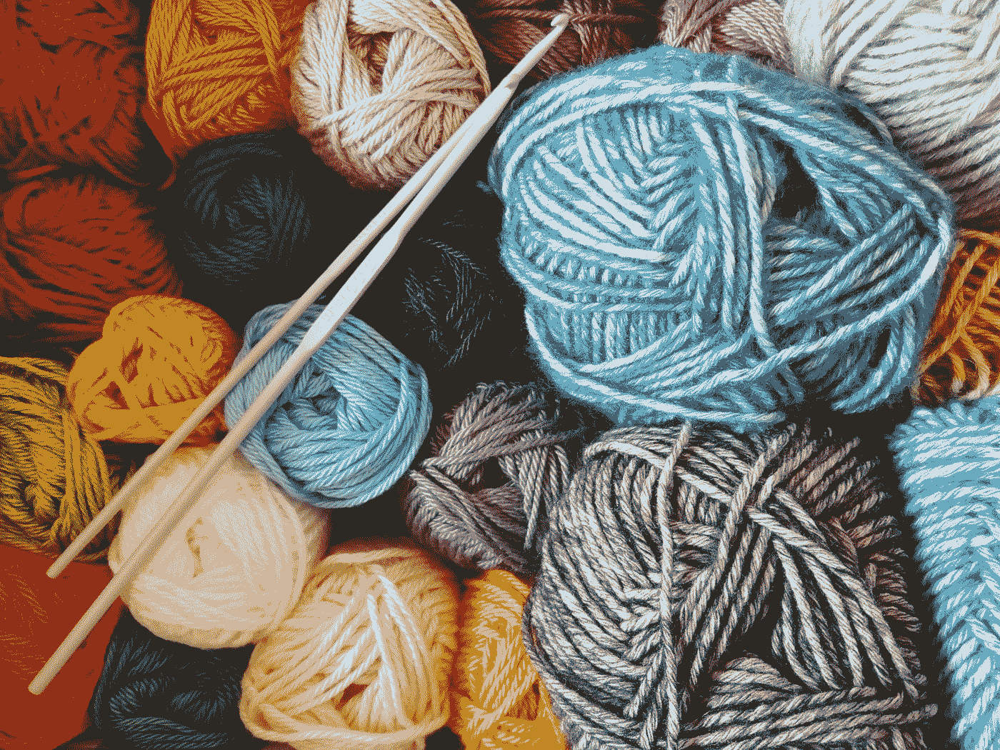
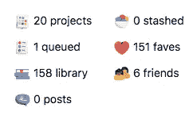
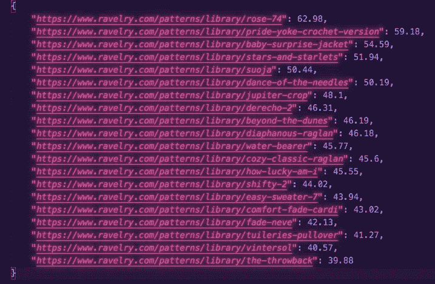

# 对于你的下一个项目，我推荐…

> 原文：<https://towardsdatascience.com/for-your-next-project-i-recommend-ab89cad53dec?source=collection_archive---------77----------------------->

## 我如何制作一个针织图案推荐系统

玛格丽塔·阿丰索在 [Unsplash](https://unsplash.com?utm_source=medium&utm_medium=referral) 上的照片

不久前，我发布了一系列关于如何开始和完成一个项目的文章(你可以在这里找到，这里找到，这里找到)。我在那些文章中讨论的项目可以在这里访问[。在这个网站上，你可以从 Ravelry(一个常用的针织网站)输入一个图案 url，它会产生一个搜索 url，生成类似的图案。然而，这只是我更大项目的一个分支:创建一个生成个性化模式推荐的程序。在过去的一周里，我完成了这个项目的后端，现在我将解释我用来创建这个模式推荐系统的步骤。](https://pure-peak-95236.herokuapp.com/)

在我的一篇关于开始一个项目的文章中，我谈到了在开始之前研究你的想法。对于这个项目，这意味着研究推荐系统的类型，并决定我想走哪条路。

有两种类型的推荐系统，协作的和基于内容的。从本质上来说，合作推荐者会看你的朋友喜欢什么，然后利用这些信息向你推荐商品。因此，如果你的朋友一直在订购美术用品，这种推荐器也会向你推荐美术用品。另一方面，基于内容的推荐器只会查看你自己的内容来向你推荐商品。所以它会看到你在看素描本和水彩画，然后会根据这些信息推荐其他美术用品。你可以在维基百科页面[这里](https://en.wikipedia.org/wiki/Recommender_system#Collaborative_filtering)阅读更多关于推荐系统的内容。

回到我的个人项目，我认为创建一个基于内容的推荐器可能更容易(至少现在是这样)。从那里，我研究了基于内容的推荐器。这项研究让我看到了这篇文章，这也是我推荐的依据。

任何基于内容的推荐系统都需要两个主要组件，用户信息和项目池。用户信息可以是记录你喜欢或不喜欢的一切的用户资料，也可以是你当时正在看的任何东西。项目池基本上是可以推荐给用户的一组项目。上面链接的是我的第一个项目，类似的模式查找器，本质上是一个推荐器，它只考虑你正在看的东西，项目池是 Ravelry 上的一切，推荐是在生成的 URL 中显示的搜索结果。然而，我刚刚完成的项目生成了一个用户配置文件，这有助于生成模式建议。

本质上，这个推荐器有 3 个步骤:

1.  创建用户配置文件
2.  创建模式池
3.  确定哪些模式最符合用户的兴趣

下面，我将简单总结一下我是如何根据我上面链接的文章中的说明来创建我自己的推荐系统的。

# 创建用户配置文件

在这种情况下，我所说的用户简档是一个条目属性的字典和一个显示用户喜欢某个给定属性程度的分数。再深入一点，在这个例子中，项目属性意味着给定模式的属性。我在推荐中使用的属性是图案类别(配饰与服装、帽子与围巾)、图案属性(自下而上或自上而下的结构、绞花与嵌花)和纱线重量(膨松与蕾丝等)。现在有趣的部分是，我如何确定一个用户有多喜欢一个给定的属性:

如果你在 Ravelry 上查看一个用户配置文件(不要与我的程序生成的用户配置文件混淆)，你会在右上角看到这个:

显然，这将因用户而异，但这就是我的个人资料的样子

我特别关注的是用户收藏夹中的模式和用户项目中的模式。在开始创建我的用户配置文件时，我创建了一个表，其中每一行是 faves 或 projects 中的一个模式，每一列是一个模式属性。

在我的项目所基于的分析 Vidhya 帖子中，他们生成了一个他们没有命名的列，但我调用了用户数据。本质上，每一行(在邮报的例子中是一篇文章，在我的例子中是一个模式)都被分配了一个数字。在博文中，这个数字是根据用户参与度分配的。在我的项目中，这个数字是根据一个人的喜好或项目来分配的。这就是我的项目与博客文章的不同之处。

正如你所看到的，我的收藏中的模式比我的项目中的多得多，我想我可以有把握地说，对于大量的 Ravelry 用户来说这是真的。在你的收藏夹中有一个模式就像说，“是的，我们应该找个时间一起喝咖啡”，在你的项目中有一个模式实际上就是一起喝咖啡。显然，和你一起喝咖啡的人比你说理论上你想和他一起喝咖啡的人更重要。因此，在我的用户数据栏中，如果模式在他们的收藏夹中，则每个模式被分配一个 1，如果在他们的项目中且未评级，则分配三(您可以从 1 到 5 的范围内对您的项目的满意度进行评级，但这是可选的)，如果项目已评级，则分配评级本身。

所以现在我们有了一个用户数据列来说明用户有多喜欢一个给定的模式。我们如何把它转化成一个可以用在看不见的模式上的用户档案呢？

让我们回到我们的表，其中每一行是一个模式，每一列是一个模式属性。现在我们有了这个新的列，用户数据。为了创建我们的用户配置文件，我们取表中每一列的[点积](https://www.mathsisfun.com/algebra/matrix-multiplying.html)和用户数据列。这给我们留下了一个新行，即用户配置文件，其中每个数字都是用户数据列和模式属性列的点积。

现在我们有了我们的用户简介，它本质上说，给定用户喜欢和创造的东西，这是他们喜欢给定属性的程度

# 创建模式池

## (我保证这远没有最后一步复杂)

现在我们有了自己的资料，我们需要生成候选人以供选择。如果用户没有任何特别的想法，这个池将会是在[最近流行的搜索](https://www.ravelry.com/patterns/search#sort=recently-popular&view=captioned_thumbs)中出现的任何东西。但是，如果他们确实有什么想法，比如他们已经喜欢的模式，他们可以提供模式 url，模式池将是通过类似的模式搜索生成的模式。

是的，这意味着我基本上只是隔离了这个项目的一个元素来创建另一个项目。

因此，一旦我们有了这些候选人，我们就创建一个新表，就像我们为生成用户配置文件而创建的表一样。每行是一个模式，每列是一个模式属性。

# 确定哪些模式最符合用户的兴趣

我们有自己的人才库和个人资料，这意味着我们拥有进行匹配所需的所有信息。

还记得我们如何用每一列和用户数据列的点积来生成用户配置文件吗？我们基本上要做同样的事情，但是这次用行代替列。显然，在我们这样做之前，我们通过在用户配置文件中添加虚拟值(如果表中有一个属性不在配置文件中),以及在池中添加一个虚拟列(如果它只在用户配置文件中),来确保一切都符合要求。这些点积创建了一个新的列，它是给定模式与用户兴趣匹配程度的分数。例如，在我要求类似于[这个](https://www.ravelry.com/patterns/library/anneli-2)的模式后，下面是我的程序推荐给我的模式的截图:

数字是匹配的百分比，链接是模式本身的链接

这个程序的用户界面即将推出，所以请继续关注你什么时候可以使用它！

以下是该项目的回购:

 [## 克里斯滕森/拉韦利

### 在 GitHub 上创建一个帐户，为 k-christensen/Ravelry 的发展做出贡献。

github.com](https://github.com/k-christensen/Ravelry)