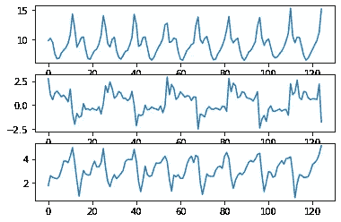
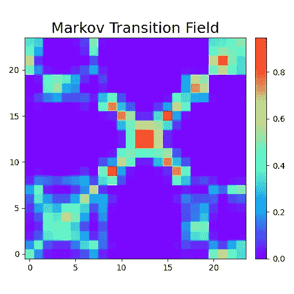
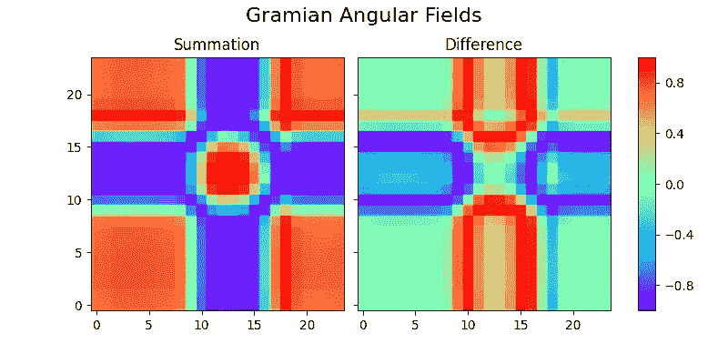
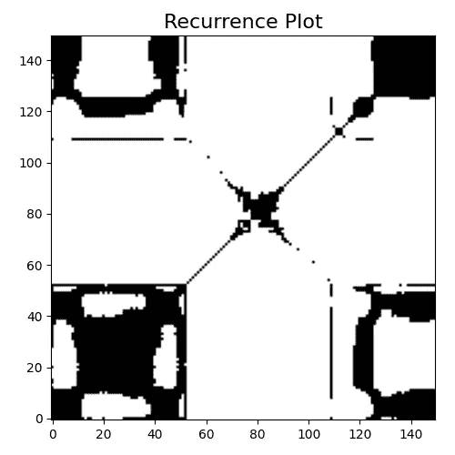
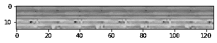
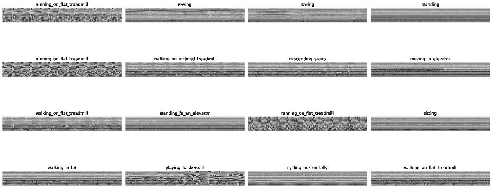
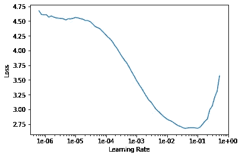
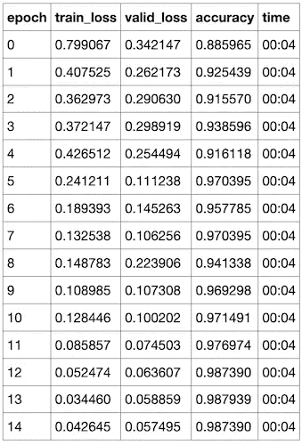
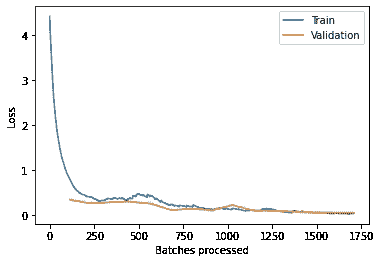
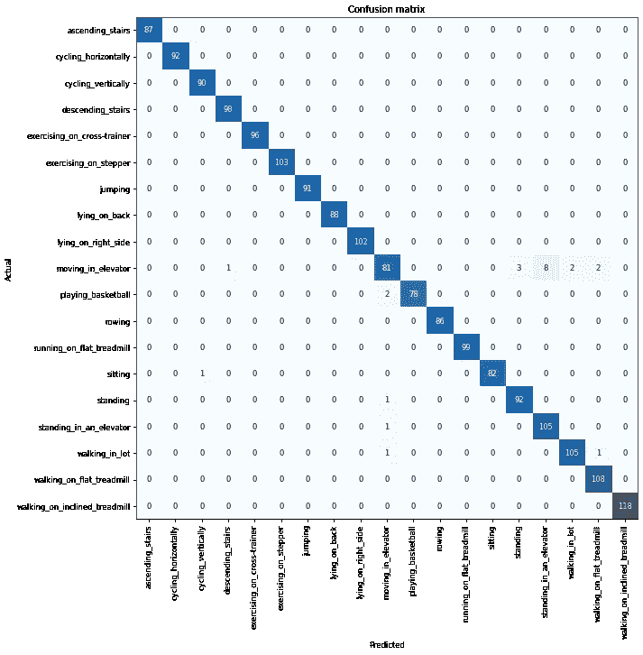

# 进军深度学习:迁移学习和 fast.ai

> 原文：<https://towardsdatascience.com/foray-into-deep-learning-transfer-learning-and-fast-ai-ca0c44c03874?source=collection_archive---------51----------------------->

## 基于 ResNet34 的人体活动识别

最近，我想深入学习，虽然我从课堂作业和课程中获得了不错的理论经验，但实践经验很少。因此，我决定完全致力于更严格地实践深度学习，并实际建立做事的模型。

fast.ai 课程在这方面非常棒。杰瑞米·霍华德对实用深度学习的关注令人耳目一新，让我想起了我在大学找工作时给朋友们的建议。学生应该投入大量的时间，完成一个项目，也许还可以写点东西，从头到尾真正充实软件工程的体验。所以我在这里，通过使用 fastai 库(该公司名为 fast.ai，library，fastai)实现建议，做一个项目，并撰写有关它的文章。

# 基于传感器数据的人体活动识别

人类运动是一个有趣的领域——它令我着迷，我一直在阅读有关它的书籍，并且我一直在寻找理解它的新方法。对我来说幸运的是，UCI 有一个伟大的机器学习知识库，特别是一个分类成不同人类运动的传感器记录的[数据集](https://archive.ics.uci.edu/ml/datasets/Daily+and+Sports+Activities)。

我不会过多地探讨数据，但总结一下，在不同运动的 x、y 和 z 轴上，躯干、左臂、右臂、左腿和右腿有多个不同的传感器记录。每个动作有一个 60 秒的记录，分成 5 秒的片段。记录了 19 个动作。

## **论文成绩**

杰里米经常拿一个他为解决某个问题而建立的模型来演示它现在如何比产生问题的那张纸做得更好。对于我的项目，[有一篇附带论文](http://kilyos.ee.bilkent.edu.tr/~billur/publ_list/cj14.pdf)，它获取数据并比较两个不同库提供的模型在分类任务中的性能。那些将表格数据作为输入的模型的最佳结果是 **95.5** %(不同的验证方法不太准确，但更真实)。本文讨论了一些尝试过的微调增强功能(或缺乏这些功能，如 PRTools 库中人工神经网络的学习速率和动量)。

我想看看使用 fastai 库是否能得到更好的结果。在看了这些数据之后，利用一点直觉，我选择只看加速度数据，希望这将为我提供足够的区分来识别不同的运动。

## **攻击计划**

我从加速度数据中创建了图像，并将它们输入到一个带有预训练 ResNet34 模型的卷积神经网络(CNN)中。我稍后会解释这些决定。

# 数据准备

受 Jeremy 对迁移学习的信心的启发，我想尝试一种不同的途径来使用数据，而不仅仅是将数据输入到神经网络中。迁移学习是在不同的任务中使用已经预先训练好的模型的过程，希望这个模型有足够的一般化信息来解决特定的任务。

Jeremy 最初的许多课程围绕着使用预训练的 ResNet34(首次出现在本文中)或 ResNet50 模型进行迁移学习。这些架构专用于图像识别。我将在以后的文章中探索 ResNet 的架构；值得自己关注。不过，只知道 ResNet34/50 在一般的图像识别应用上还是蛮不错的。

当然，我仍然需要图像来使用图像识别模型，而我目前所拥有的只是所谓的多变量时间序列的表格数据(多变量，因为有多个变量被跟踪)。下面是一个数据示例(x 轴是以秒为单位的时间，y 轴是米/秒):



在平板跑步机上行走的人在 x、y 和 z 轴上的躯干加速度数据。

经过一些研究后，我发现了一些将单变量时间序列转化为图像的成熟技术。



捕捉单变量时间序列数据的不同类型的图[1]

为捕捉多元时间序列数据而展示的唯一图像是**联合递归图**，它是对多个递归图([矩阵元素乘法，极其简单的](https://en.wikipedia.org/wiki/Hadamard_product_(matrices)))取哈达玛乘积的结果。现在，有个问题。我试图使用 pyts 库中的联合递归图，但我不知道如何让它与我的数据一起工作。它需要输入(n_samples，n_features，n_timestamps ),我对我的数据进行了处理以创建这些数据，但我只获得了一组记录的一个相当弱的图，这感觉不太对。我希望我为这篇文章保存了其中的一张图片，但是现在，我已经尝试过了，但是失败了。

相反，我采用了一种非常简单的方法。我将加速度数据归一化，使其最小值为 0，最大值为 1。然后，对于每个身体部位，对于每个记录，我将其转换为灰度像素，按时间从左到右堆叠这些像素，并从上到下堆叠每个身体部位。最终结果是这样的图像:



在平板跑步机上行走的人的加速度数据的灰度图像

没有上面那些图好看，但是加速度的差异还是很明显的。由于对我创建的示例图像感到满意，我循环浏览了数据，并将所有这些图像保存到一个新文件夹中，以供 CNN 使用。

# 快速人工智能和训练 CNN

现在，最大的问题是，尽管图像中的差异对于人眼来说是显而易见的，但是对于没有对没有特定对象的小的、灰色的、矩形的图像进行训练的预训练的 ResNet34 模型的眼睛来说是明显的吗？我有一点怀疑，但事实证明模型确实从这些图像中识别出了类，而且识别得相当好。

## **获取数据**

有了 fastai 库中的 datablock API，为 CNN 准备数据变得轻而易举。获取数据、将数据分成训练集和验证集、应用转换以及为 CNN 创建所谓的 databunch 所需的全部工作如下所示(图像类的标签是文件名的一部分):

```
data = ImageList.from_folder('./images') \
                .split_by_rand_pct() \
                .label_from_re(r'images/(.*)_p') \
                .databunch()
```

之后，快速浏览一些数据也是轻而易举的事情



我要说明的是，我没有用 imagenet _ stats(fastai 提供)对数据进行归一化。杰里米在他的视频中说，要始终使用与预训练模型相同的技术来标准化数据，但当我的输入图像已经如此不同时，我很难合理解释这一点。然而，我至少应该尝试一下正常化，看看会发生什么。我以后可能会回来做这个实验。

## **使用预训练模型**

应用预训练模型简单得可笑，因为 fastai 库附带了一些可用的模型。

```
learn = cnn_learner(data, models.resnet34, metrics=accuracy)
```

现在，这是一个使用 ResNet34 架构和预训练权重的模型，使用我的数据作为输入，并使用准确性作为学习过程中的跟踪指标。在训练它之前，我试图找到一组最佳的学习率来使用。fastai 库有一个快速的方法来检查学习率和检查损失，以查看损失何时开始爆发(实际上是发散)，使用`lr_find`。



学习率探测器

在进行训练之前，让我回答“如果我们已经在使用预训练模型，为什么我们还需要训练网络？”预训练模型擅长于广义模式识别，但我们需要它来解决我们的具体问题。当使用预训练模型进行训练时，架构中的大多数层的权重将被**冻结**，并且不会被更新。只有最后一层的权重会受到我们训练的影响，这或多或少是我们想要的。架构的初始层通常识别广泛的、通用的事物，而更深的层倾向于在它们识别的事物中变得更加具体。因此，我们希望训练模型的最后几层，而只是偶尔接触最初几层。

我使用了[单周期策略](https://arxiv.org/abs/1803.09820)来训练网络(fast.ai 课程向我介绍了这个概念)。

```
learn.fit_one_cycle(15, slice(1e-4,1e-2))
```

结果是:



一个图像，因为媒体不做表格

观察训练进度的损失图:

```
learn.recorder.plot_losses()
```



## 结果分析

经过 13 个时期后，我仅通过加速度数据就实现了 98.7%的**准确率。不考虑库和验证技术，这篇论文所做的最好成绩是 95.5%的准确率**。为了真正确认结果，如果我也尝试本文中的不同验证技术，那将是最好的，但那超出了我的努力范围。****

**请注意，损失在最后 3 个时期没有太大变化，并且训练损失仍然小于验证损失。这表明我创建的模型没有过度拟合。一般直觉告诉我们，对于我们正在训练的图像，我们应该总是看到模型在训练数据上表现良好，而在验证数据上表现稍差。**

****

**类别的混淆矩阵**

**现在，根据模型试图分类的活动，我认为它将与跑步机活动和电梯活动进行最大的斗争。上面的混淆矩阵证实了这一点，在很多活动中有一些额外的错误分类，比如步行。**

# **包裹**

**迁移学习非常强大，老实说，我对这个模型的表现感到惊讶。然而，我认为有一些东西有助于识别这些特征。例如，因为六十秒的记录被分成五秒的片段，所以图案在图像中的移动可以被认为是“时间不变的”该模型学会了忽略数据中变化的具体位置，而更多地关注数据中变化的外观，无论是一次性的还是周期性的。在某种程度上，这也是一种帮助模型避免过度拟合的“数据扩充”形式。**

**值得注意的是，在这篇文章和我的回购中，我没有解冻模型来训练所有层。我尝试用不同的历元计数、不同的学习速率等来训练冻结的模型，然后是解冻的模型，但是结果似乎表明解冻模型没有什么好处。我怀疑这是因为我的输入数据和 ResNet34 的训练数据之间存在巨大差异，而在我的数据上训练初始层并没有真正帮助理解我的问题。**

**fastai 库简单、干净、直观。通常，在数据科学项目中，人们普遍认为 80%的工作是数据准备，20%是实际分析。对于深度学习，这种分裂往往会随着正确建立模型的难度而各半；通常花费数小时来训练不起作用的模型，并且在一些层后面缺乏直觉使得理解下一步做什么变得困难。对我来说幸运的是，fastai 库将这个项目重新分成了 80/20。**

**我刚刚谈到的一切都可以在我的 [github repo](https://github.com/abcde13/HumanActivityRecognition) 中找到，有代码，有一个很好的 README 和 python 笔记本。**

**我期待着写更多这样的帖子，无论是关于我正在研究的论文/主题，还是我正在从事的项目。**

**感谢阅读！欢迎评论或提问！**

**[1][https://pyts . readthedocs . io/en/stable/auto _ examples/image/plot _ GAF . html](https://pyts.readthedocs.io/en/stable/auto_examples/image/plot_gaf.html)**