# 预测误差度量:间歇需求

> 原文：<https://towardsdatascience.com/forecast-error-measures-intermittent-demand-22617a733c9e?source=collection_archive---------35----------------------->

在之前的几篇博文中，我们已经看到了实践中使用的所有流行的预测方法。但是他们都非常关注平稳的时间序列。但是在现实生活中有一种完全不同的时间序列——间歇性的和不稳定的需求。

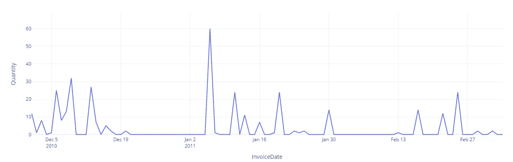

作者图片

我们随便把间歇序列称为有很多周期没有需求的序列，即偶发性需求。Syntetos 和 Boylan(2005)提出了一种更正式的时间序列分类方法。他们使用时间序列的两个参数进行分类——平均需求间隔和变异系数的平方。

平均需求间隔是两个非零需求之间的平均时间间隔。也就是说，如果一个时间序列的 ADI 为 1.9，这意味着平均每 1.9 个时间段我们就会看到一个非零需求。

ADI 是间歇性的量度；它越高，该系列的矿石间断性越强。

变异系数是标准化的标准偏差。我们计算标准偏差，然后用序列的平均值对其进行缩放，以防止缩放依赖性。

这显示了时间序列的可变性。如果 COV 很高，这意味着序列的可变性也很高。

基于这两个需求特征，Syntetos 和 Boylan 从理论上推导出了界定行为类型显著变化的临界值。他们定义间歇性截止为 1.32，COV 截止为 0.49。使用这些分界点，他们定义了高点和低点，然后将两者放在一起形成一个网格，将时间序列分为平稳、不稳定、间歇和起伏。

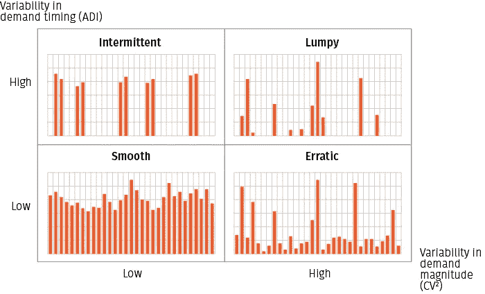

[来源](https://blog.griddynamics.com/safety-stock-optimization-for-ship-from-store/)

我们已经讨论过的预测方法主要是用来处理平稳和不稳定的时间序列的。但在现实世界中，有更多的间歇和起伏不定的时间序列。典型的例子有零配件销售、零售的长尾等。

# 传统误差度量的不适用性

间歇和波动系列的唯一定义特征是零需求的次数。这严重破坏了我们到目前为止看到的许多措施。所有的百分比误差(例如 T2 MAPE T3)变得不稳定，因为被零除，这现在几乎是必然的。类似地，相对误差(例如**、MRAE** )也变得不稳定，特别是当我们使用天真的预测作为参考时。发生这种情况是因为会有多个需求为零的周期，这将产生零参考误差，因此是未定义的。

sMAPE 是针对这种零除法设计的，但是当零需求的数量增加时，sMAPE 也会出现问题。从我们之前的探索中我们知道，当预测值远远高于实际值或者相反时，sMAPE 就会出现问题。在间歇性需求的情况下，这种情况非常多。如果需求为零，而我们预测到了一些东西，或者相反，我们就会遇到这种情况。例如，对于零需求，一种方法预测 1，另一种方法预测 10，无论如何结果都是 200%。

# 新的和推荐的误差测量

**累积预测误差** **(CFE，CFE Min，CFE Max)**

我们之前已经看到了累积预测误差(也称为预测偏差)。它只是整个范围内的带符号误差，因此正负误差相互抵消。这对供应链中的库存过多或不足有直接影响。Peter Wallstrom[1]也提倡使用 CFE Max 和 CFE Min。零 CFE 也可能因为偶然而发生，在一个大的范围内，我们错过了其间的许多细节。因此，他建议将 CFE 与 CFE Max 和 CFE Min 结合起来看，这是 CFE 在地平线上的最大值和最小值。

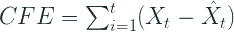

**更好的百分比(PBMAE、PBRMSE 等。)**

我们已经看到了 10%的进步.对于间歇性需求来说，这也是一个相当不错的衡量标准。这没有数值不稳定的问题，而且到处都有定义。但是它不测量错误的大小，而不是错误的数量。

**短缺数量(NOS 和 NOSp)**

一般来说，为了跟踪一个预测是否有偏差，我们使用跟踪信号(即 CFE/MAD)。但是设置为触发警告(+/- 4)的限制是基于需求正态分布的假设而得出的。在间歇性需求的情况下，它不是正态分布的，正因为如此，这个触发器会产生很多误报。

另一个替代方法是短缺数量度量，通常表示为短缺数量的百分比。它只计算预测低于需求导致短缺的情况的数量。一个非常高的数字或一个非常低的数字表明在两个方向上都有偏差。

**库存周期(PIS)**

NOS 没有识别系统错误，因为它没有考虑库存结转的时间维度。PIS 向前迈进一步，测量预测项目在库存中度过的总周期数或缺货周期数。

为了理解 PIS 是如何工作的，让我们举个例子。

> 假设有一个三天展望期内每天一个单位的预测。在第一个周期开始时，一件物品被交付给虚拟库存(与现实相比，这是一种简化)。如果第一天没有需求，结果是加一个 PIS。当需求发生时，从预测中减去需求。周期 1 中的需求为 1 会导致周期 1 中的 PIS 为零，CFE 为-1。如果需求在三个期间都等于零，则期间 3 的 PIS 等于正六。第一天的商品库存了三天，第二天的商品库存了两天，最后一个商品库存了一天
> 
> *摘自* [*针对间歇性需求的预测技术和预测误差评估*](https://www.diva-portal.org/smash/get/diva2:990519/FULLTEXT01.pdf)

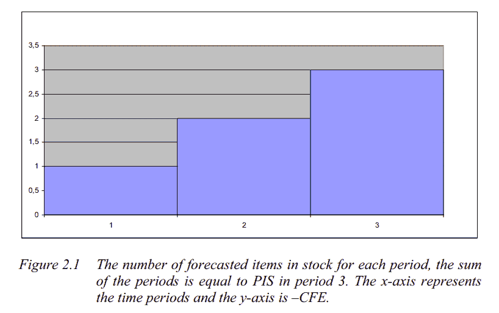

[评估预测技术和预测误差，重点关注间歇性需求](https://www.diva-portal.org/smash/get/diva2:990519/FULLTEXT01.pdf)

正数表示超出预测，负数表示低于需求预测。它可以很容易地计算为 CFE 的累积和，即图表中条形图下的面积

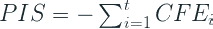

**面向库存管理的预测误差成本(SPEC)**

SPEC 是一个较新的指标(Martin et al. 2020[4])，它试图采取与库存周期相同的路线，但稍微复杂一些

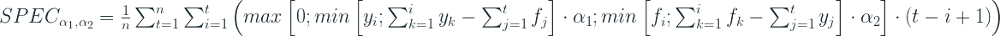

虽然一开始看起来很吓人，但是我们可以直观的理解。计算的关键是由两个内部最小项处理的——机会成本和库存成本。从库存管理的角度来看，这是我们需要在供应链中平衡的两个成本。

左边一项衡量因预测不足而产生的机会成本。如果有足够的存货，这是我们可以完成的销售。例如，如果需求为 10，而我们只预测了 5，那么我们的机会损失为 5。现在，假设我们在过去三个时间段预测了 5，但没有需求，然后需求为 10。所以我们有 15 个库存，我们完成了 10 个。所以在这里，不存在机会成本。而且我们也可以说，一个时间段的机会成本不会大于那个时间段的需求。所以结合这些条件，我们得到等式的第一项，它衡量机会成本。

使用与之前相同的逻辑，但反过来，我们可以推导出类似的库存成本方程(我们高估了)。这个问题由等式中的正确项来解决。

时间步长的规格。实际上，查看所有以前的时间步长，计算每个时间步长的机会成本和库存成本，并将它们相加得出一个数字。在任何时间步，都会有机会成本或库存成本，这反过来又会考虑到该时间步之前的累计预测和实际值。

时间序列预测范围的规格是所有时间步长的平均值。

现在有两个术语α1 和α2，让我们对机会成本和库存成本应用不同的权重，根据组织的战略，我们可以选择正确的权重。建议将权重之和保持为 1，α1 = 0.75 和α2 = 0.25 是零售环境中的常见选择。

这样做的一个缺点是时间复杂性。我们需要嵌套循环来计算这个指标，这使得计算速度很慢。

实现可在此获得—[https://github.com/DominikMartin/spec_metric](https://github.com/DominikMartin/spec_metric)

**平均反正切绝对百分比误差(MAAPE)**

这是 MAPE 公式的一个巧妙之处，避免了它的一个主要问题——零的不确定性。在解决这一问题的同时，这一变化也使其对称。

这个想法很简单。我们知道，

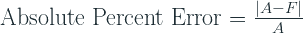

因此，如果我们考虑一个三角形，其邻边和对边分别等于 A 和|A-F|,斜边的斜率决定了绝对百分比误差为零。

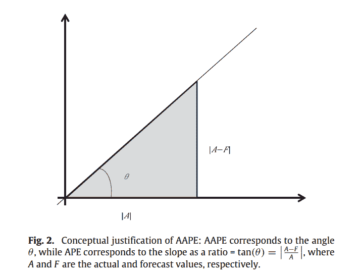

[间歇性需求预测绝对百分比误差的新指标](https://www.sciencedirect.com/science/article/pii/S0169207016000121)

斜率可以用比率来度量，范围从 0 到无穷大，也可以用角度来度量，范围从 0 到 90。斜率作为一个比率是传统的绝对百分比误差，这是非常流行的。因此，本文将斜率作为一个角度，作为一个稳定的替代方案。那些记得你们的三角学的人会记得:

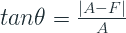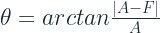

本文将其命名为反正切绝对百分比误差，并将平均反正切绝对误差定义为:

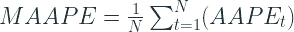

在哪里

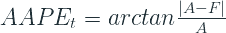

反正切定义为从负无穷大到无穷大的所有实数值。

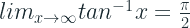

所以推而广之，APE 的范围是从[0，∞]，AAPE 的范围是从[0，π/2]。这使得它可以在任何地方被定义，并且如此健壮。

我们之前看到的对称性测试给出了下面的结果(来自论文)

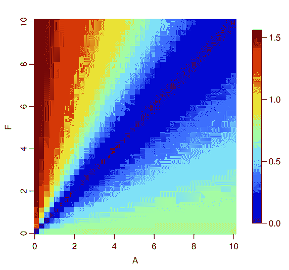

[间歇性需求预测的绝对百分比误差的新指标](https://www.sciencedirect.com/science/article/pii/S0169207016000121)

我们可以看到我们在猿身上看到的不对称在这里并不明显。我们之前看到的互补图，如果我们把 AAPE 比作猿，我们会看到它的形状好得多。

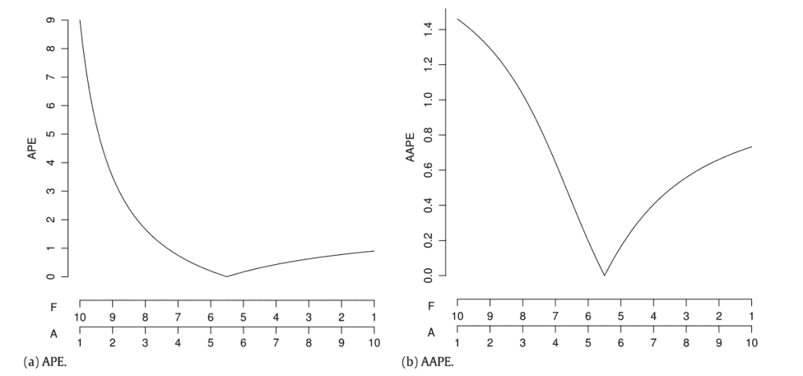

[间歇性需求预测绝对百分比误差的新指标](https://www.sciencedirect.com/science/article/pii/S0169207016000121)

我们可以看到，AAPE 仍然倾向于预测不足，但没有猿那么多，因此可能更有用。

**相对平均绝对误差&相对均方误差**

有一些相对的测量方法，将预测的误差与参考预测的误差进行比较，在大多数情况下，参考预测是一个简单的预测，或者更正式地说是一个随机游走预测。

**比例误差(MASE)**

我们之前也见过 MASE，知道它是怎么定义的。我们用参考预测的平均平均误差来衡量误差。Davidenko 和 Fildes，2013[3]已经表明，MASE 只不过是相对 MAE 的加权平均值，权重是误差项的数量。这意味着同时包含 MASE 和 RelMAE 可能是多余的。但不管怎样，让我们检查一下。

# 实验

让我们挑选一个真实的数据集，运行 ARIMA、ETS 和 Crostons，以零预测为基线，并计算所有这些措施(使用 GluonTS)。

# 资料组

我从 UCI 机器学习知识库中选择了[零售数据集](https://archive.ics.uci.edu/ml/datasets/online+retail)。这是一个跨国数据集，包含一家总部位于英国的注册无店铺在线零售商在 2010 年 1 月 12 日至 2011 年 9 月 12 日之间发生的所有交易。该公司主要销售独特的适合各种场合的礼品。这家公司的许多客户都是批发商。

**栏目:**

*   *发票号*:发票号。名义上，分配给每笔交易的 6 位整数。如果此代码以字母“c”开头，则表示取消。
*   *库存代码*:产品(项目)代码。名义上，一个 5 位数的整数，唯一分配给每个不同的产品。
*   *描述*:产品(物品)名称。名义上。
*   *数量*:每笔交易每种产品(物品)的数量。数字。
*   *发票日期*:发票日期和时间。数字，每笔交易生成的日期和时间。
*   *单价*:单价。数字，单位为英镑的产品价格。
*   *CustomerID* :客户编号。名义上，一个唯一分配给每个客户的 5 位整数。
*   *国家*:国家名称。名义上，每个客户居住的国家的名称。

**预处理:**

*   分组依据为*库存代码*、*国家*、*发票日期* - >、*数量*和*单价*的平均值
*   用零填充以使时间序列连续
*   将数量的下限值裁剪为 0(去除负值)
*   仅采用长度超过 52 天的时间序列。
*   列车测试拆分日期:*2011–11–01*

**统计:**

*   时间序列数:3828。过滤后:3671
*   数量:平均值= 3.76，最大值= 12540，最小值= 0，中值= 0

**时间序列分割**

使用我们之前讨论过的相同的分割方法——间歇的、不规则的、平滑的和不稳定的——我将数据集分成了四份。

作者图片

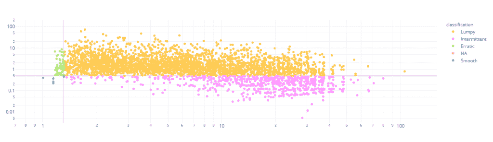

作者图片

我们可以看到，数据集中几乎 98%的时间序列是间歇的或不规则的，这对于我们的用例来说是完美的。

# 结果

## 每个指标的预测方法排名

我们将零预测作为一种试金石，它将告诉我们在间歇需求中使用它时应该警惕哪些预测指标。

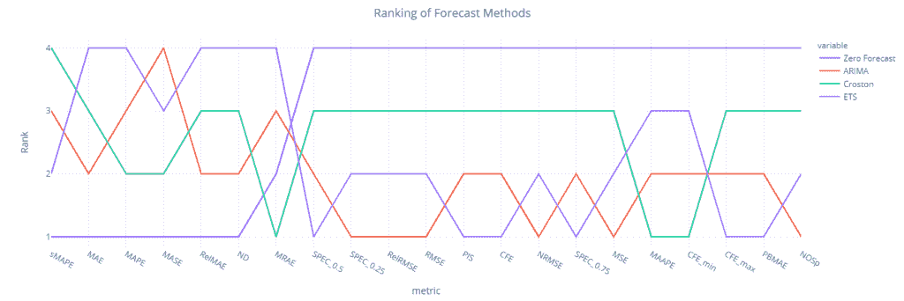

作者图片

我们可以看到，sMAPE、RelMAE、MAE、MAPE、MASE 和 nd(即体积加权 MAPE)都倾向于零预测，并将其列为最佳预测方法。但是，当我们查看与库存相关的指标(如 CFE、PIS 等)时。衡量预测中的系统偏差)，零预测是表现最差的。

被认为在间歇性需求中表现更好的 MASE 也表现平平，并将零预测评为最佳。选择基于这些方法的预测方法的危险是，我们最终的预测值太低，这将对下游的规划任务造成严重破坏。

令人惊讶的是，ETS 和 ARIMA 表现很好(超过克罗斯顿)，当我们看 PIS、MSE、CFE、NOSp 等指标时，排名第一和第二。

只有当我们看看马佩、MRAE 和 CFE_min 时，克罗斯顿的表现才不错。

## 等级相关性(聚合)

我们根据所有这些不同的指标对不同的预测方法进行了排名。如果一组指标衡量的是同一件事，那么这些排名也会显示出良好的相关性。因此，让我们计算这些等级的 Spearman 等级相关性，并查看哪些指标彼此一致。

作者图片

我们可以看到两组大的指标，它们彼此之间正相关，而组之间负相关。MAE、MRAE、MASE、MAPE、RelMAPE、ND 和 sMAPE 属于一类，MSE、RMSE、CFE、PIS、SPEC_0.75、SPEC_0.5、SPEC_0.25、NOSp、PBMAE、RelRMSE 和 NRMSE 属于另一类。MAAPE 和 CFE_min 也属于第二组，但相关性不大。

这两个组是否衡量预测的不同特征？

## 排名相关性(项目级别)

现在，让我们来看看项目级别的度量标准之间的相同一致性，而不是聚合级别的。例如，对于我们预测的每个项目，我们根据这些不同的指标对预测方法进行排名，并对这些排名进行 Spearman 排名关联。

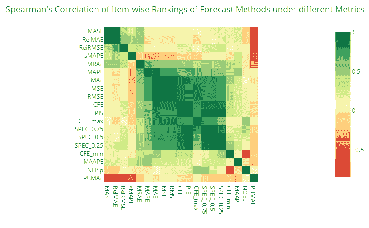

作者图片

与聚合级别视图类似，这里我们也可以找到两组指标，但是与聚合级别相反，我们无法找到两组之间的强负相关性。SPEC_0.5(其中我们给予机会成本和库存成本同等的权重)和 PIS 显示了高度的相关性，主要是因为它在概念上是相同的。

## 加载图

另一种可视化和理解不同度量的相似性的方法是使用项目级度量并运行二维 PCA。并且绘制指向我们使用 PCA 提取的两个分量的原始特征的方向。它显示了原始变量如何有助于创建主成分。因此，如果我们假设两个 PCA 成分是我们在谈论预测的“准确性”时测量的主要“属性”，那么负载图将向您显示这些不同的特征(指标)如何对预测做出贡献，包括大小和方向。

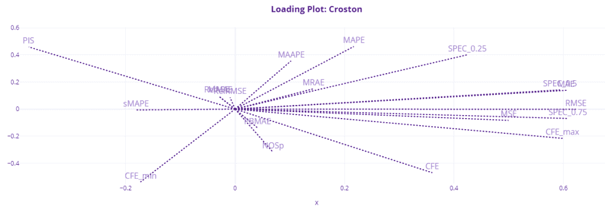

作者图片

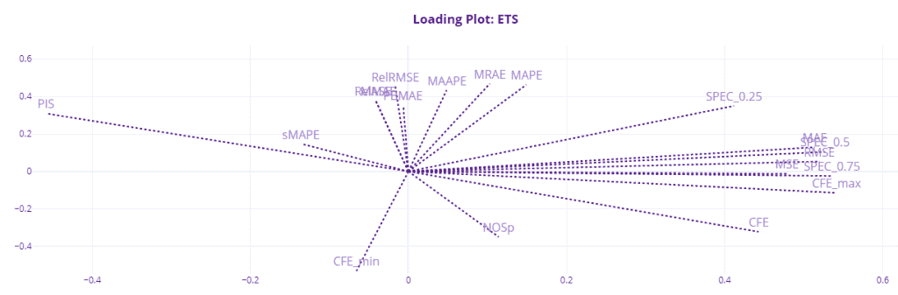

作者图片

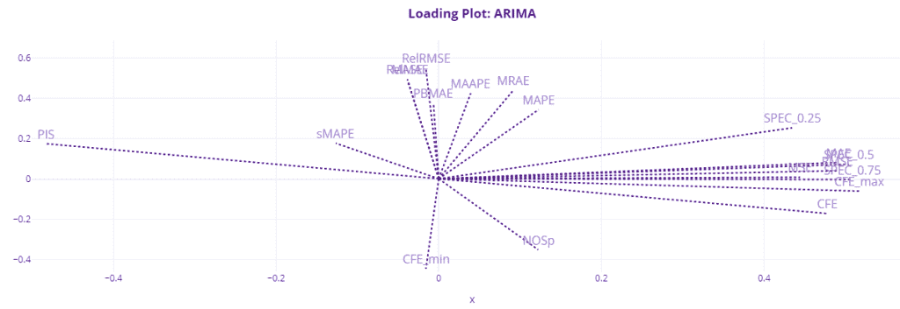

作者图片

在这里，我们可以看到这种关系更加明确。大多数指标都围绕这两个组件聚集在一起。MAE、MSE、RMSE、CFE、CFE_max 和 SPEC 指标在加载图中占据相似的空间，看起来它是“预测偏差”的组成部分，因为 CFE 和 SPEC 指标在该部分中占主导地位。PIS 在另一边，由于 PIS 的标志，几乎与欧洲常规武装力量成 180 度角。

另一个因素可能是“准确性”因素。这主要是雷尔姆塞，梅斯，马埃佩，MRAE 等。MAPE 似乎介于两者之间，马佩也是如此。

我们还可以看到，sMAPE 可能测量完全不同的东西，如 NOSp 和 CFE_min。

由于符号的原因，PIS 与 CFE、SPEC_0.5 和 SPEC_0.75 成 180 度角，但它们测量的是相同的东西。SPEC_0.25(其中我们给机会成本 0.25 的权重)显示了与另一组更大的相似性，这可能是因为它倾向于预测不足，因为库存成本的惩罚很重。

# 结论和建议

在这篇简短的博客文章中，我们没有做很多实验(没有彼得·瓦尔斯特伦的论文[1]做得多)，但是我们所做的已经向我们展示了很多。我们知道不要依赖像 sMAPE，RelMAE，MAE，MAPE，MASE 这样的指标，因为他们给出了一个零预测的最佳排名。我们还知道，没有一个单一的指标可以告诉你整个故事。如果我们看看像 MAPE 这样的国家，我们不会在预测中衡量结构性偏差。如果我们只看《欧洲常规武装力量条约》,它可能会显示一幅美好的画面，而事实并非如此。

让我快速总结一下彼得·瓦尔斯特伦论文中的发现(以及我自己的一些结论。

*   即使 MSE 和 CFE 出现在载荷图中的相同位置，它们在不同的预测方法中并没有显示出一致的关系。同样，我们也可以在装载图中看到。CFE 远离克罗斯顿和 ETS 的第二个组成部分。
*   MAE 和 MSE 有很强的相关性，它们测量相同的可变性。由于 MAE 已经显示出接近于零预测，所以最好使用基于 MSE 的误差度量。
*   CFE 本身并不能非常可靠地衡量预测偏差。它应该与 PIS 或 SPEC 等指标搭配使用，以获得完整的图像。当考虑时间点时，CFE 可以掩盖偏差趋势。如果 CFE 值的绝对值较低，则符号不会显示任何偏差信息。一个正的 CFE(低估)可能只是一个随机数字，当检查其他度量时，该方法高估了需求。低 CFE 是在需求发生后满足需求的结果，这是 CFE 无法追踪的。
*   Peter 还建议不要使用 CFE_max 和 CFE_min，而使用 PIS 和 NOSp 这样的指标。

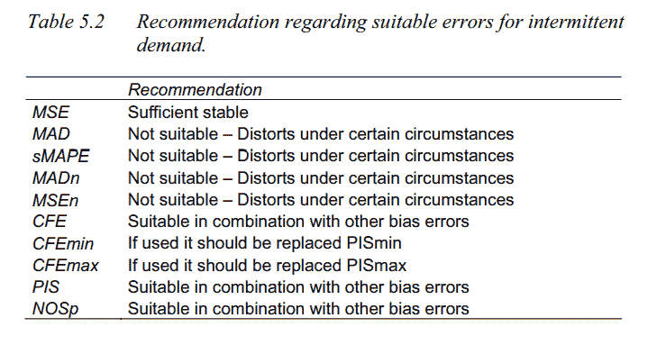

[评估预测技术和预测误差，重点关注间歇性需求](https://www.diva-portal.org/smash/get/diva2:990519/FULLTEXT01.pdf)

*   除此之外，SPEC 分数和 MAAPE(论文中没有回顾)也是合适的度量。

GitHub 资源库—【https://github.com/manujosephv/forecast_metrics 

**查看该系列的其余文章**

1.  [预测误差度量:通过实验了解它们](https://deep-and-shallow.com/2020/09/26/forecast-error-measures-understanding-them-through-experiments/)
2.  [预测误差度量:比例误差、相对误差和其他误差](https://deep-and-shallow.com/2020/10/01/forecast-error-measures-scaled-relative-and-other-errors/)
3.  [预测误差度量:间歇需求](https://deep-and-shallow.com/2020/10/07/forecast-error-measures-intermittent-demand/)

# 参考

1.  Peter Wallströ，2009 年，[评估预测技术和预测误差，重点关注间歇性需求](https://www.diva-portal.org/smash/get/diva2:990519/FULLTEXT01.pdf)
2.  金等人，2016。[间歇性需求预测的绝对百分比误差的新指标](https://www.sciencedirect.com/science/article/pii/S0169207016000121)
3.  达维登科&菲尔德斯。2013，[衡量预测准确性:对 Sku 级需求预测进行判断性调整的案例](https://www.sciencedirect.com/science/article/abs/pii/S0169207012001161?via%3Dihub)
4.  Martin 等人，2013 年，[块状和间歇性需求预测的新指标:面向库存的预测误差成本](https://arxiv.org/pdf/2004.10537.pdf)
5.  Hyndman，R.J .，& Athanasopoulos，G. (2018) *预测:原理与实践*，第二版，OTexts:澳洲墨尔本。OTexts.com/fpp2.访问于 2020 年 7 月 10 日

*原载于 2020 年 10 月 7 日 http://deep-and-shallow.com***。**