# 预测误差度量:比例误差、相对误差和其他误差

> 原文：<https://towardsdatascience.com/forecast-error-measures-scaled-relative-and-other-errors-c0645f794352?source=collection_archive---------46----------------------->

## 继我上一篇关于标准绝对误差、平方误差和百分比误差的博客之后，让我们来看看时间序列预测的替代方法——比例误差、相对误差和其他误差测量方法。

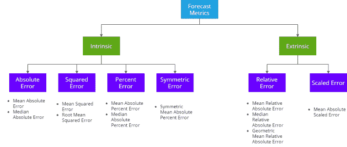

比例误差和相对误差都是外在误差度量。他们依靠另一个参考预测来评估自己，并且在实践中，参考预测通常是一个简单的预测或一个季节性的简单预测。除了这些误差之外，我们还将考察诸如百分比改善、累积预测误差、跟踪信号等指标。

# 相对误差

当我们说相对误差时，有两种主要的计算方法，Shcherbakov 等人称之为相对误差和相对度量。

相对误差是当我们使用来自参考模型的预测作为基础来比较误差时，相对度量是当我们使用来自参考基础模型的一些预测度量来计算误差时。

相对误差计算如下:

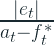

类似地，相对测量值计算如下:

其中 MAE 是预测的平均绝对误差，MAE*是参考预测的 MAE。这个度量可以是任何东西，而不仅仅是 MAE。

相对误差是基于一个参考预测，虽然我们最常用的是天真的预测，但并不总是如此。例如，如果我们有一个正在努力改进的现有预测，我们可以使用相对度量，或者我们可以使用我们在开发周期中定义的基线预测，等等。

我们可以立即看到的一个缺点是，当参考预测等于地面实况时，它将是不确定的。这可能是非常稳定的时间序列的情况，也可能是间歇的时间序列的情况，在这种情况下，我们可以重复相同的基础事实，这使得天真的预测等于基础事实。

# 比例误差

标度误差是 Hyndman 和 Koehler 在 2006 年提出的。他们建议根据来自原始预测方法的样本内平均误差来衡量误差。因此，我们使用整个系列的平均绝对误差作为缩放因子，而不是使用前一时间步的地面实况作为缩放因子。

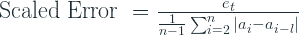

其中，e 是时间步长 t 的误差，n 是时间序列的长度，a 是时间步长 t 的基本事实，l 是失调。对于简单的预测，l 是 1。另一个普遍使用的替代方法是 l =季节周期。例如，对于 12 个月的季节性，l=12。

这里选择样本内 MAE 是因为它总是可用的，并且与样本外的 MAE 相比更可靠。

# 实验

在我们之前的博客中，我们检查了规模依赖性、对称性、损失曲线、过度和不足预测以及异常值的影响。但这一次，我们面对的是相对误差。因此，绘制损失曲线不再容易，因为有三个输入，地面实况、预测和参考预测，并且测量值可能随其中每一个而变化。过度预测和预测不足，以及我们仍然可以检查的异常值的影响。

# 损耗曲线

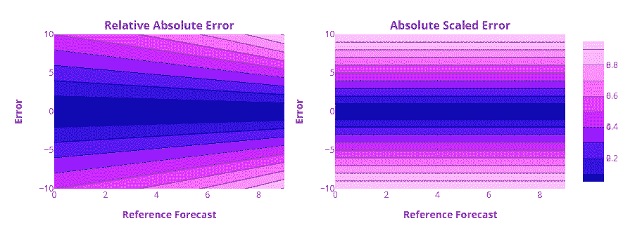

损失曲线绘制成等高线图，以适应三个维度——误差、参考预测和测量值。

我们可以看到，误差关于误差轴对称。如果我们保持参考预测不变，而改变误差，则测量值在误差两侧是对称的。这并不奇怪，因为所有这些误差都基于绝对误差，我们看到这是对称的。

但这里有趣的是对参考预测的依赖。根据参考预测，相同的误差导致不同的相对绝对误差值。

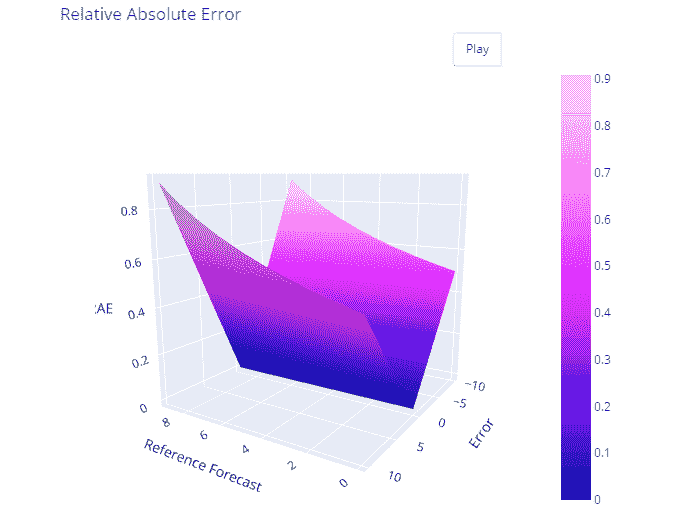

我们也可以在曲线的 3D 图中看到同样的不对称性。但是比例误差在这里是不同的，因为它不直接依赖于参考预测，而是依赖于参考预测的平均绝对误差。因此它具有很好的绝对误差对称性，对参考预报的依赖性很小。

# 预测过高和过低

对于超额和欠额预测实验，我们重复了与上次 *** 相同的设置，但针对这四个误差测量值——平均相对绝对误差(MRAE)、平均绝对标度误差(脉塞)、相对平均绝对误差(RMAE)和相对均方根误差(RRMSE)

** —有一个小的变化，因为我们还添加了一个小于 1 的随机噪声，以确保连续的实际值不相同。在这种情况下，相关的措施是不明确的。*

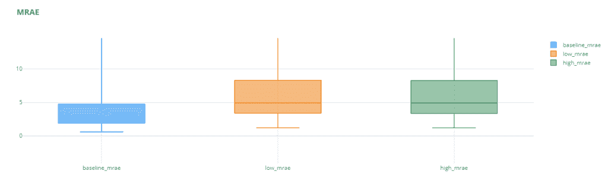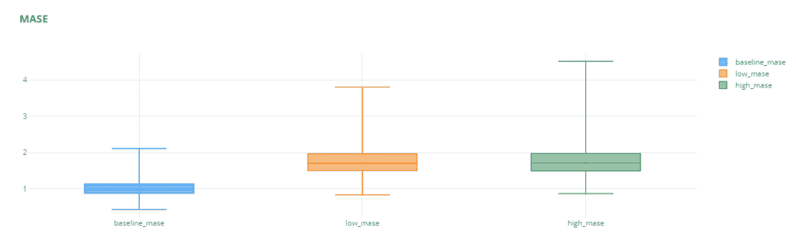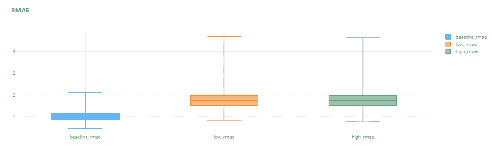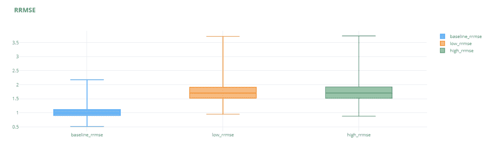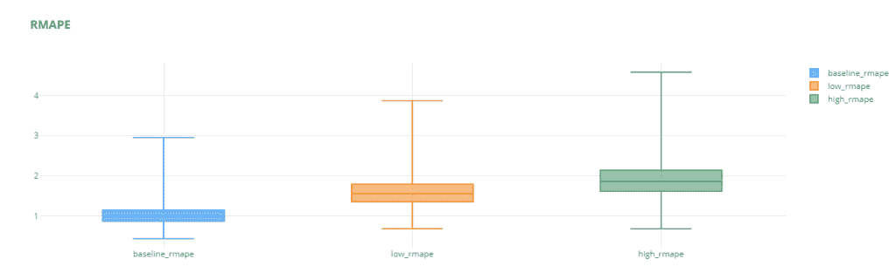

我们可以看到，这些比例误差和相对误差没有超出或低于预测的问题。低预测和高预测的误差线都同样糟糕。即使在基本误差有利于其中之一的情况下(例如 MAPE)，相对误差度量(RMAPE)也会减少这种“偏爱”，并使误差度量更加稳健。

我们注意到的另一件事是，平均相对误差有一个巨大的传播(我实际上已经放大，使图清晰)。例如，中值 *baseline_rmae* 是 2.79，最大值 *baseline_mrae* 是 42k。这种巨大的差异表明，平均绝对相对误差的可靠性很低。根据不同的样本，误差变化很大。这可能部分是因为我们使用参考预测的方式。如果实际情况太接近参考预测(在这种情况下是天真的预测)，误差会高得多。这个缺点通过使用中值相对绝对误差(MdRAE)得到部分解决

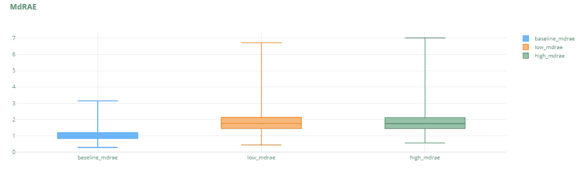

# 异常影响

为了检查异常值的影响，我们在 MRAE、梅斯、RMAE 和 RRMSE 重复了之前博客文章中的相同实验。

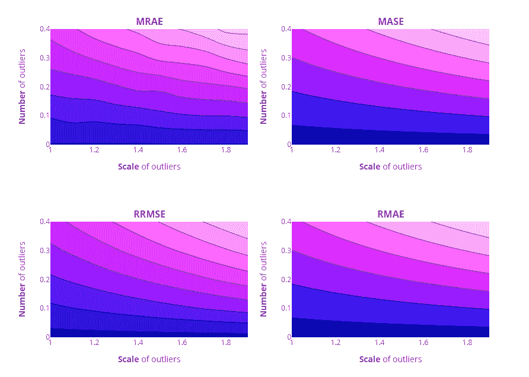

# 其他错误

除了这些标准的误差度量，还有一些更适合于处理预测的一些方面，这些方面是我们到目前为止所看到的度量中没有适当涵盖的。

# 更好百分比

在我们目前看到的所有措施中，只有 MAPE 是我所说的对非技术人员来说可以解释的。但是正如我们所看到的，MAPE 没有最好的房产。所有其他指标都不能直观地说明预测的好坏。更好的百分比是获得这种可解释性的另一种尝试。

Percent Better(PB)也依赖于参考预测，并通过计算预测误差测量值优于参考预测误差的实例数量来测量我们的预测。

例如。

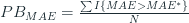

其中，当 MAE>MAE*时 I = 0，当 MAE<mae></mae>

类似地，我们可以将此扩展到任何其他误差度量。这让我们直观地了解与参考预测相比，我们做得有多好。这对于异常值也有很强的抵抗力，因为它只对实例进行计数，而不是测量或量化错误。

这也是一个关键的缺点。我们只是在衡量我们变得更好的次数。但这并不能衡量我们做得有多好或有多差。如果我们的误差比参考误差少 50%或少 1%,那么这对更好分数的影响是相同的。

# 归一化 RMSE

归一化 RMSE 被提出来中和 RMSE 的尺度依赖性。总的想法是用一个标量来划分 RMSE，比如所有时间序列中的最大值，或者最大值或最小值之间的差，或者所有基本事实的平均值等等。

由于除以最大值或最大值和最小值之差容易受到异常值的影响，nRMSE 的常用方法是用平均值进行归一化。

nRMSE =RMSE/平均值(y)

# 累积预测误差又称预测偏差

到目前为止，我们看到的所有错误都集中在惩罚错误上，不管是积极的还是消极的。我们使用绝对项或平方项来确保误差不会相互抵消，从而描绘出比实际情况更乐观的画面。

但通过这样做，我们也对预测中的结构性问题视而不见。如果我们总是预测过高或过低，这是我们应该意识到的，并采取纠正措施。但是目前为止我们所看到的措施都没有从这个角度出发。

这就是预测偏差的来源。

虽然它看起来像百分比误差公式，但这里的关键是没有绝对项。因此，如果没有绝对项，我们将累计实际值和预测值，并以百分比的形式衡量它们之间的差异。这就给出了一个直观的解释。如果我们看到 5%的偏差，我们可以推断，总的来说，我们低估了 5%。根据我们是使用实际值——预测值还是预测值——实际值，解释是不同的，但实质上是相同的。

如果我们计算跨时间序列，那么我们也累积实际值，并预测我们测量的数据的任何部分，并计算预测偏差。

# 摘要

让我们将现在看到的误差度量添加到上次制作的汇总表中。

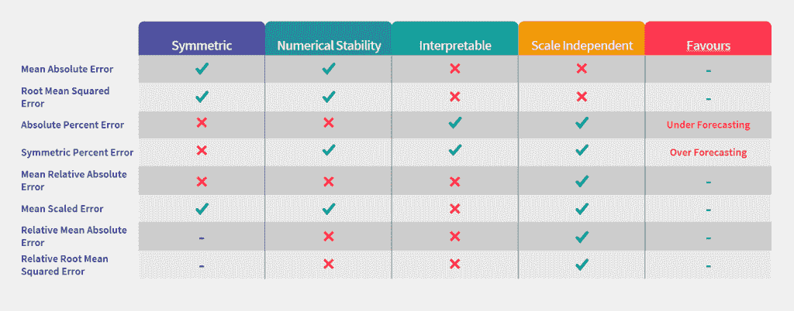

我们再次看到，没有人能统治所有人。根据不同的情况可能会有不同的选择，我们需要为特定的目的进行挑选。

# 选择预测指标的经验法则和指南

我们已经看到，只选择一个预测指标并在任何地方使用都不容易。它们都有自己的优点和缺点，我们的选择应该认识到所有这些。

也就是说，在这个过程中你可以应用一些经验法则来帮助你:

1.  如果每个时间序列都是相同的尺度，使用梅伊，RMSE 等。
2.  如果时间序列有很大的变化(即在我们测量的范围内，时间序列水平有很大的变化)，那么可以使用百分比或相对绝对误差。
3.  当跨时间序列进行汇总时，对于像百分比改善或 APE 这样的指标，我们可以使用算术平均值(如 MAPE)。对于相对误差，经验证明几何平均具有更好的性质。但同时，他们也容易受到离群值的影响。我们可以控制异常值的几种方法是:
4.  修剪离群值或从聚合计算中丢弃它们
5.  使用聚合中值(MdAPE)是控制异常值的另一种极端方法。
6.  Winsorizing(用截止值替换异常值)是处理如此巨大的个别错误的另一种方法。

# 预测方法一般化的误差度量:经验比较[2]

Armstrong 等人(1992 年)对这些预测指标进行了广泛的研究，使用 M 竞争对总共 90 个年度和 101 个季度序列的 5 个子样本及其预测进行采样。然后，他们继续计算这个样本的误差度量，并进行研究来检验它们。

他们考察了不同衡量标准的关键维度:

## 可靠性

可靠性指的是测量的重复应用是否会产生相似的结果。为了衡量这一点，他们首先计算了所有 5 个子样本(总体水平)的不同预测方法的误差度量，并按照表现的顺序对它们进行排序。他们在年度和季度系列中分别实施了“提前 1 步”和“提前 6 步”。

因此，他们计算了每个子样本的 Spearman 等级相关系数(成对的),并对它们进行平均。例如，我们从子样本 1 中提取等级，并将其与子样本 2 进行比较，然后将子样本 1 与子样本 3 进行比较，依此类推。，直到我们覆盖了所有的线对，然后对它们进行平均。

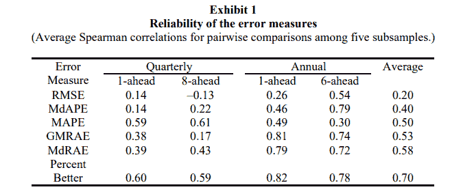

来源:[阿姆斯特朗等人](https://repository.upenn.edu/marketing_papers/69/)

基于 RMSE 的排名是最不可靠的，相关系数非常低。他们指出，只有当混合中有大量时间序列可能抵消这种影响时，使用 RMSE 才能克服这种可靠性问题。

他们还发现，像 Percent Better 和 MdRAE 这样的相对指标比他们的同行具有更高的可靠性。他们还试图计算达到与 Percent Better 相同的统计显著性所需的样本数量 GMRAE 为 18 个系列，MdRAE 为 19 个，MAPE 为 49 个，MdAPE 为 55 个，RMSE 为 170 个。

## 结构效度

信度是测量一致性，而结构效度则是问一个测量方法实际上是否测量了它想要测量的东西。这向我们展示了各种方法评估预测方法“准确性”的程度。为了比较这一点，他们像以前一样检查了预测方法的排名，但这次他们比较了成对误差度量之间的排名。例如，基于 RMSE 的排名和基于 MAPE 的排名有多少一致性？

这些相关性受到结构效度和信度的影响。为了说明可靠性的变化，作者通过使用更多数量的样本导出了同一张表，并发现正如预期的那样，平均相关性从 0.34 增加到 0.68，表明这些测量实际上是测量它们应该测量的。

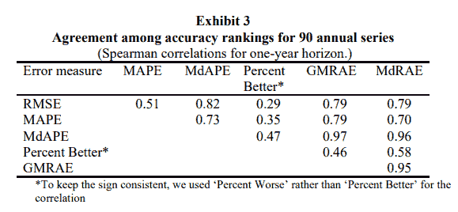

来源:[阿姆斯壮等人](https://repository.upenn.edu/marketing_papers/69/)

作为有效性的最终测试，他们通过对 90 个年度系列和 1010 个季度系列的全部样本的每个误差度量的平均排名构建了一个共识排名，然后检查了每个个体误差度量排名与共识排名的相关性。

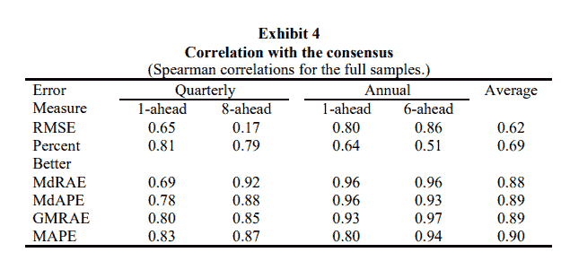

来源:[阿姆斯壮等人](https://repository.upenn.edu/marketing_papers/69/)

RMSE 与共识的相关性最低。这很可能是因为可靠性低。这也可能是因为 RMSE 强调更高的错误。

更好的百分比也显示了低相关性(即使它具有高可靠性)。这可能是因为“更好的百分比”是唯一不能衡量误差大小的指标。

## 灵敏度

希望有对变化影响敏感的误差测量，特别是对于参数校准或调谐。当模型的参数发生变化时，度量应该指示对“准确性”的影响。

中位误差测量并不敏感，也没有更好的百分比。中位数聚合通过关注中间值来隐藏变化，只会缓慢变化。改善百分比并不敏感，因为一旦系列表现好于参考，它就不再对指标做出任何改变。它也不能衡量我们是否将一个极其糟糕的预测提高到几乎和一个天真的预测一样准确的程度。

## 与决策的关系

这篇论文非常清楚地表明，他们所评估的措施中没有一个对决策来说是理想的。他们认为 RMSE 是一个足够好的衡量标准，并反对基于百分比的误差，认为实际的业务影响是以美元而不是百分比误差来表示的。但我不同意这一点，因为当我们客观地评估一项预测以传达它做得有多好或有多坏时，RMSE 就是不符合标准。如果我走到最高管理层面前，说财务预测的 RMSE 是 22343，那将会是持平的。但是相反，如果我说准确率是 90%，每个人都很高兴。

我和这篇论文都同意一件事，相对误差测量与决策无关。

## 选择误差度量的准则

为了帮助选择错误，论文还对他们确定的维度的不同度量进行了评级。

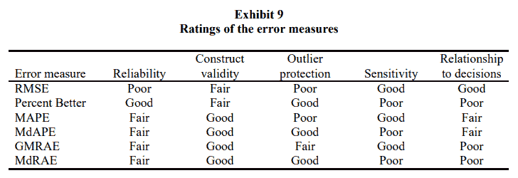

来源:[阿姆斯特朗等人](https://repository.upenn.edu/marketing_papers/69/)

**进行参数调谐**

对于参数调整的校准，本文建议使用灵敏度高的测量方法之一——RMSE、MAPE 和 **GMRAE** 。由于 RMSE 的低可靠性和 MAPE 的有利低预报问题，他们建议使用 GMRAE(几何平均相对绝对误差)。 **MASE** 是在本文发布后提出的，因此它不在这些分析中。但是，如果你仔细想想，微波激射器也很敏感，不受我们在 RMSE 或 MAPE 看到的问题的影响，可以作为校准的一个很好的候选。

**用于预测方法选择**

为了在预测方法之间进行选择，主要标准是可靠性、结构有效性、防止异常值以及与决策的关系。在这种情况下，敏感性并不那么重要。

这篇论文马上否定了 RMSE，因为它可靠性低，而且缺乏对异常值的保护。当系列数量较少时，他们建议使用 MdRAE，MdRAE 与 GMRAE 一样可靠，但提供了额外的保护，防止异常值。如果系列数量适中，可靠性就不再是一个问题，在这种情况下，MdAPE 将是一个合适的选择，因为它与决策的关系更密切。

# 结论

在这两篇博文中，我们已经看到了许多预测方法，并且了解了它们各自的优缺点。最后得出了一些在选择预测方法时可以遵循的经验法则。虽然不是结论性的，但我希望它能在你做这些决定时给你一个方向。

但是所有这些讨论都是在我们预测的时间序列是稳定平滑的假设下进行的。但在现实世界的商业案例中，也有很多系列是断断续续或零星的。在非零需求出现之前，我们会看到长时间的零需求。在这种情况下，几乎所有的误差测量(可能是例外)都失败了。在下一篇博文中，让我们来看看几种适合间歇性需求的不同方法。

实验用 Github 链接:[https://github.com/manujosephv/forecast_metrics](https://github.com/manujosephv/forecast_metrics)

## **更新(2020 年 4 月 10 日)**

在进一步的阅读中，我也偶然发现了一些对梅斯的批评，我想我也应该在这里提一下。

1.  有人批评我们使用参考预报的平均平均误差作为标度误差项。Davidenko 和 Fildes(2013 年)[3]声称，这引入了高估参考预测准确性的偏见。换句话说，坏预测的惩罚变得比好预测的奖励更大。
2.  另一个批评来自于这样一个事实，即均值不是一个非常稳定的估计值，可能会受到几个大值的影响。

Davidenko 和 Fildes[3]展示的另一个有趣的事实是，MASE 相当于相对 MAE 的加权算术平均值，其中可用误差值的数量是权重。

**查看该系列的其余文章**

1.  [预测误差度量:通过实验了解它们](https://deep-and-shallow.com/2020/09/26/forecast-error-measures-understanding-them-through-experiments/)
2.  [预测误差度量:比例误差、相对误差和其他误差](https://deep-and-shallow.com/2020/10/01/forecast-error-measures-scaled-relative-and-other-errors/)
3.  预测误差度量:间歇需求

# 参考

1.  Shcherbakov 等人，2013 年，[预测误差测量调查](http://idosi.org/wasj/wasj(ITMIES)13/28.pdf)
2.  Armstrong 等人 1992 年，[关于预测方法一般化的误差度量:经验比较](https://repository.upenn.edu/cgi/viewcontent.cgi?article=1075&context=marketing_papers)
3.  达维登科&菲尔德斯。2013，[测量预测准确性:对 Sku 级需求预测进行判断性调整的案例](https://www.sciencedirect.com/science/article/abs/pii/S0169207012001161?via%3Dihub)

*原载于 2020 年 10 月 1 日 http://deep-and-shallow.com**[*。*](https://deep-and-shallow.com/2020/10/01/forecast-error-measures-scaled-relative-and-other-errors/)*