# 预测误差测量:通过实验了解它们

> 原文：<https://towardsdatascience.com/forecast-error-measures-understanding-them-through-experiments-da7ddcb0b035?source=collection_archive---------24----------------------->

## [入门](https://towardsdatascience.com/tagged/getting-started)

> 测量是导致控制和最终改进的第一步。
> 
> H.詹姆斯·哈林顿

在许多商业应用中，提前计划的能力是最重要的，在大多数这样的情况下，我们使用预测来帮助我们提前计划。例如，如果我经营一家零售店*，我今天应该订购多少盒那种洗发水？*看预报。*我能在年底实现我的财务目标吗？让我们预测一下，并在必要时做出调整。如果我经营一家自行车租赁公司，明天下午 4 点我需要在地铁站放多少辆自行车？*

如果对于所有这些情况，我们都根据预测采取行动，我们也应该知道这些预测有多好。在经典统计或机器学习中，我们有一些通用的损失函数，如平方误差或绝对误差。但是由于时间序列预测的发展，有更多的方法来评估你的表现。

在这篇博文中，让我们通过实验来探索不同的预测误差度量，并了解它们各自的缺点和优点。

# 时间序列预测中的度量

有几个关键点使得时间序列预测中的指标从机器学习中的常规指标中脱颖而出。

1.时间相关性

顾名思义，时间序列预测具有内置的时间方面，并且有累积预测误差或预测偏差等指标也采用这种时间方面。

2.聚合指标

在大多数业务用例中，我们不会预测单个时间序列，而是一组相关或不相关的时间序列。高层管理人员不希望单独查看这些时间序列中的每一个，而是希望看到一个总体的度量，直接告诉他们我们的预测工作做得有多好。即使对于从业者来说，这种综合的方法也能帮助他们对建模过程中的进展有一个总体的感觉。

3.超出或低于预测

预测的另一个关键方面是过度预测和预测不足的概念。我们不希望预测模型有结构性偏差，总是超过或低于预测。为了解决这些问题，我们需要既不高估也不低估的指标。

4.可解释性

最后一个方面是可解释性。因为非分析业务功能也使用这些指标，所以它需要是可解释的。

由于这些不同的使用情形，这一领域使用了许多指标，在这里，我们尝试将其统一在某种结构下，并对它们进行严格的检查。

# 预测指标的分类

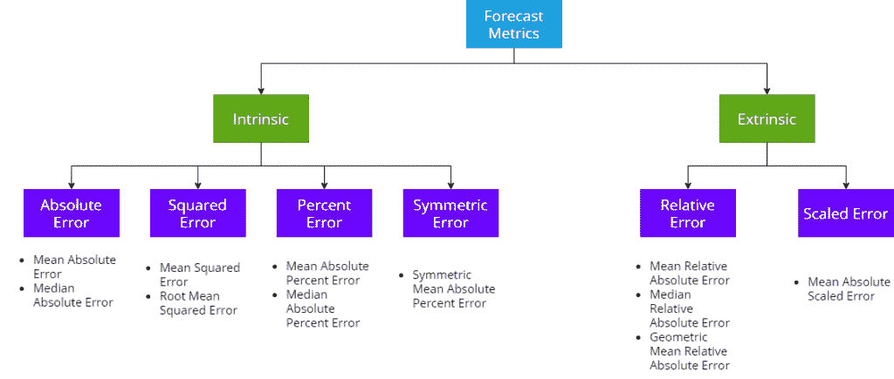

我们可以对不同的预测指标进行分类。广义地说。分成两个桶— **内在的和外在的**。内在度量是仅采用生成的预测和基础事实来计算指标的度量。外部指标是指除了生成的预测和基本事实之外，还使用外部参考预测来计算指标的指标。

现在让我们坚持内在的度量(外在的度量需要完全不同的度量)。我们有四种主要的方法来计算误差——绝对误差、平方误差、百分比误差和对称误差。所有这些指标都是这些基本误差的不同集合。因此，不失一般性，我们可以讨论这些宽泛的部分，它们也适用于这些标题下的所有指标。

## 绝对误差

这组误差测量以误差的绝对值为基础。

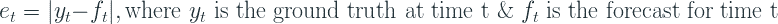

## 平方误差

我们不是取绝对值，而是将误差平方，使其为正，这是这些指标的基础。

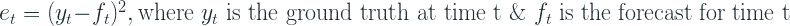

## 百分误差

在这组误差测量中，我们用地面实况来衡量绝对误差，将其转换成百分比项。

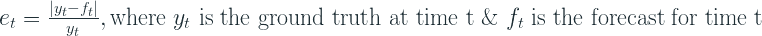

## 对称误差

对称误差被提出来作为百分比误差的替代，在百分比误差中，我们将预测值和实际值的平均值作为衡量绝对误差的基础。

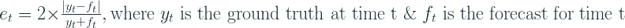

# 实验

不要只是说这些是这样那样的度量标准的缺点和优点，让我们设计几个实验，自己看看那些优点和缺点是什么。

# 比例依赖性

在这个实验中，我们试图找出时间序列的规模对聚合度量的影响。在这个实验中，我们

1.  生成 10000 个不同尺度的合成时间序列，但误差相同。
2.  将这些系列分割成 10 个柱状图箱
3.  样本量= 5000；迭代每个容器
4.  从当前箱中取样 50%,从其他箱中平均分配 res。
5.  计算这组时间序列的聚合度量
6.  靠着垃圾箱下边缘记录
7.  根据条块边缘绘制总测量值。

# 对称性

误差测量应与输入对称，即预测和地面实况。如果我们交换预测值和实际值，理想情况下，误差指标应该返回相同的值。

为了测试这一点，让我们为实际值和预测值制作一个从 0 到 10 的网格，并计算该网格上的误差指标。

# 互补对

在这个实验中，我们采用互补的基础事实和预测对，它们加起来是一个常量，并测量每个点的性能。具体来说，我们使用与对称性实验相同的设置，并计算沿交叉对角线的点，其中地面真实值+预测值总和总是为 10。

# 损耗曲线

我们的指标依赖于两个实体——预测和实际情况。我们可以用一个对称的误差范围(例如-10 到 10)来修正一个，改变另一个，然后我们期望该度量在该范围的两边表现相同。在我们的实验中，我们选择固定基础事实，因为在现实中，这是固定的数量，我们根据基础事实来衡量预测。

# 过欠预测实验

在这个实验中，我们生成了 4 个随机时间序列——基本事实、基线预测、低预测和高预测。这些只是在一个范围内产生的随机数。地面实况和基线预测是在 2 和 4 之间产生的随机数。预测下限是在 0 到 3 之间生成的随机数，预测上限是在 3 到 6 之间生成的随机数。在这种情况下，基准预测应该作为我们的基准，低预测是我们持续低估的预测，高预测是我们持续高估的预测。现在让我们计算这三个预测的 MAPE，并重复这个实验 1000 次。

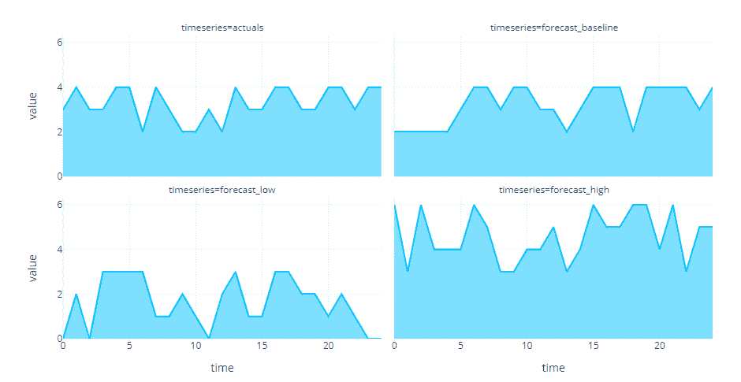

# 异常影响

为了检查对异常值的影响，我们设置了下面的实验。

我们想要检查异常值对两个轴的相对影响——异常值的数量，异常值的规模。因此，我们定义了一个网格—离群值的数量[0%-40%]和离群值的范围[0 到 2]。然后，我们随机选取一个合成时间序列，并根据我们之前定义的网格参数迭代地引入异常值，并记录误差度量。

# 结果和讨论

# 绝对误差

## 对称性

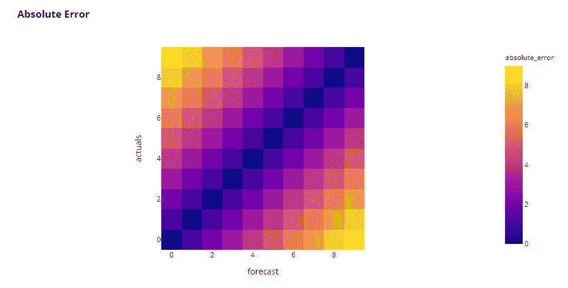

这是一个很好的对称热图。我们看到对角线上的误差为零，较高的误差以一种很好的对称模式远离对角线。

## 损耗曲线

再次对称。如果我们走曲线的两边，MAE 变化相等。

## 互补对

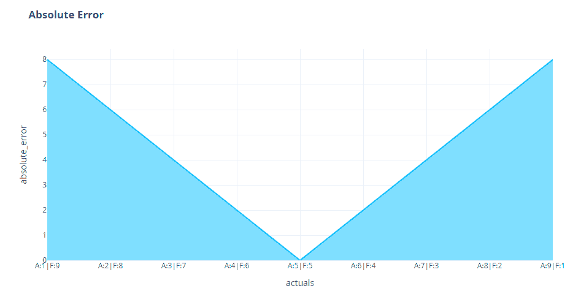

又是好消息。如果我们改变预测，保持实际值不变，反之亦然，指标的变化也是对称的。

## 预测过高和过低

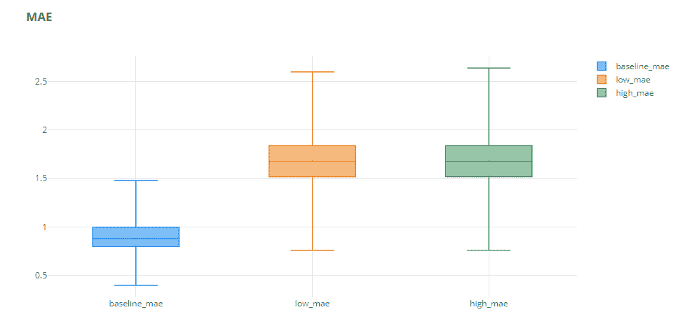

正如预期的那样，预测过高或过低对 MAE 没有太大影响。两者都受到同等的处罚。

## 比例依赖性

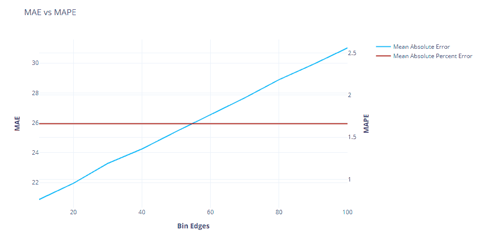

这是梅的致命弱点。在这里，当我们增加时间序列的基础水平时，我们可以看到 MAE 线性增加。这意味着当我们跨时间序列比较性能时，这不是您想要使用的衡量标准。例如，当比较两个时间序列时，一个级别为 5，另一个级别为 100，使用 MAE 总是将较高的误差分配给级别为 100 的时间序列。另一个例子是当你想比较你的时间序列的不同子部分，看看哪里的误差更大(例如，不同的产品类别，等等。)，那么使用 MAE 总是会告诉你，平均销售额较高的子部门也会有较高的 MAE，但这并不意味着该子部门做得不好。

# 平方误差

## 对称性

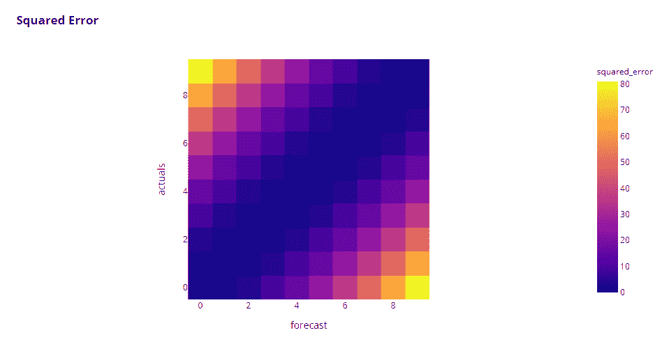

平方误差也显示了我们正在寻找的对称性。但我们在这里可以看到的另一点是，误差倾向于更高的误差。对角线上的颜色分布不像我们在《绝对误差》中看到的那样均匀。**这是因为平方误差(因为平方项)将较高的影响分配给较低误差的较高误差。**这也是平方误差通常更容易因异常值而失真的原因。

*边注:*由于平方误差和绝对误差也被用作许多机器学习算法中的损失函数，这也对这种算法的训练有影响。如果我们选择平方误差损失，我们对较小的误差不太敏感，对较大的误差更敏感。如果我们选择绝对误差，我们会平等地惩罚较高和较低的误差，因此单个异常值不会对总损失产生太大影响。

## 损耗曲线

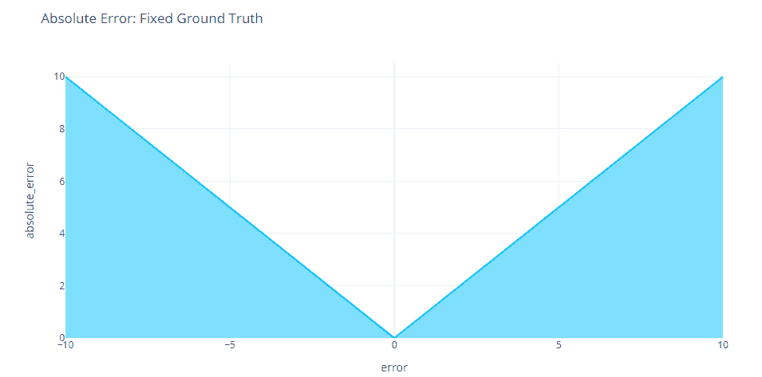

我们在这里也可以看到同样的模式。它围绕原点对称，但由于二次型，较高的误差比较低的误差不成比例地多。

## 互补对

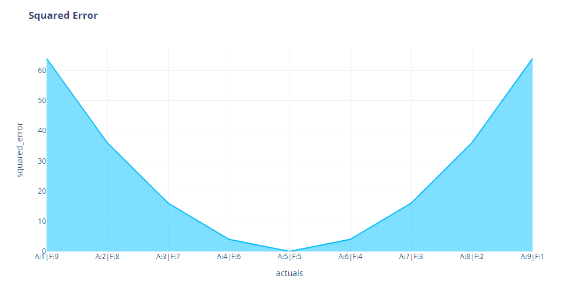

## 预测过高和过低

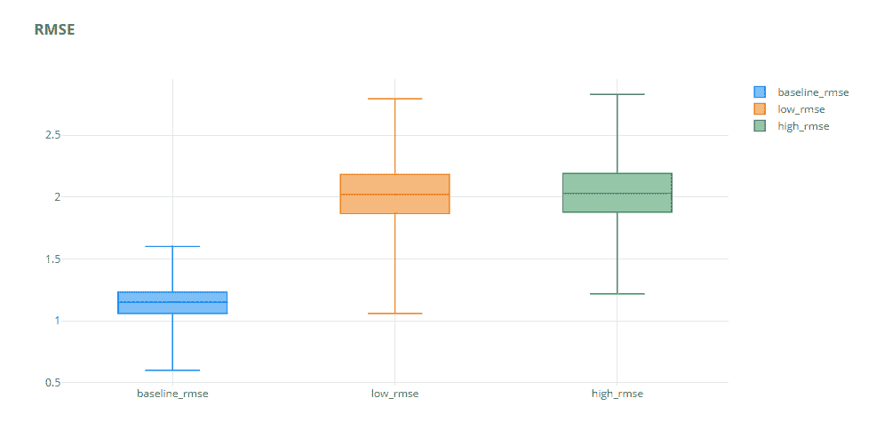

与 MAE 类似，由于对称性，过度预测和预测不足会产生几乎相同的影响。

## 比例依赖性

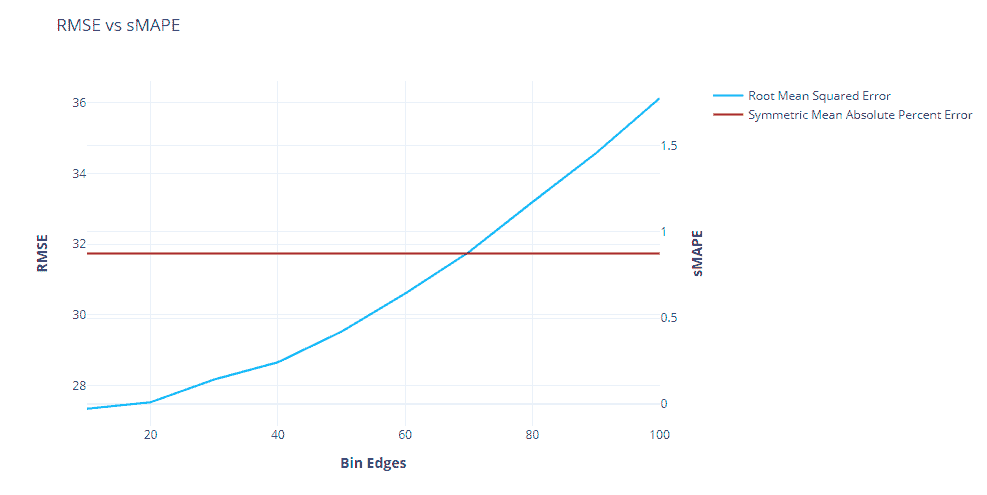

与 MAE 类似，RMSE 也有规模依赖问题，这意味着我们讨论的 MAE 的所有缺点在这里也适用，但更糟。我们可以看到，当我们增加比例时，RMSE 的比例是平方的。

# 百分误差

百分比误差是**业内使用的**最普遍的误差度量。它大受欢迎的几个原因是:

1.  规模独立—正如我们在前面的规模依赖关系图中看到的，随着时间序列规模的增加，MAPE 线是平坦的。
2.  可解释性——由于误差被表示为一个百分比项，这是非常流行和可解释的，误差度量也立即变得可解释。如果我们说 RMSE 是 32，这并不意味着孤立的。但另一方面，如果我们说 MAPE 是 20%，我们马上就知道预测的好坏。

## 对称性

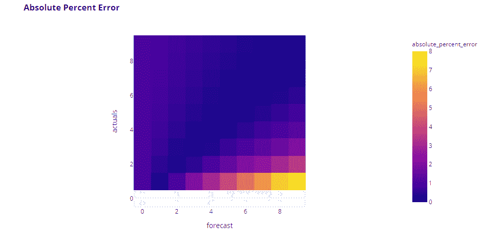

这看起来不太对，是吗？百分比误差是其中最常见的，它看起来一点也不对称。事实上，我们可以看到，当实际值接近零时，误差达到峰值，当实际值为零时，误差趋于无穷大(底部的无色带是因为除以零而导致误差无穷大的地方)。

我们可以看到百分比误差的两个缺点:

1.  当基础真值为零时，它是未定义的(因为被零除)
2.  当地面真实值较低时(右上角)，它会指定较高的误差

让我们看看损耗曲线和互补对图，以了解更多信息。

## 损耗曲线

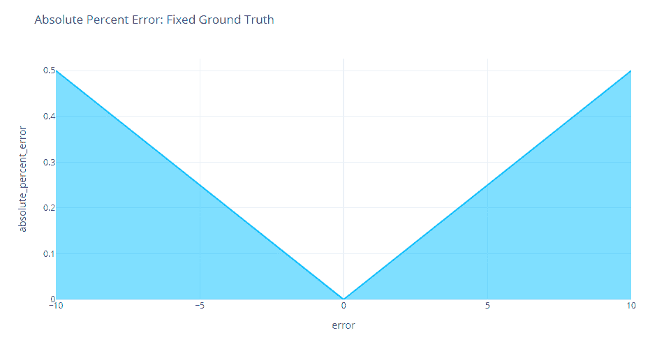

突然间，我们看到的不对称不复存在了。如果我们保持基本真理不变，百分误差在原点周围是对称的。

## 互补对

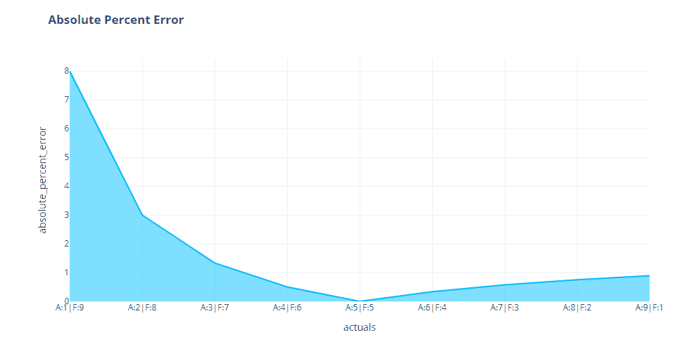

但是当我们看互补对时，我们看到了之前在热图中看到的不对称。当实际值较低时，同样的误差比预测值较低时的误差百分比高得多。

所有这一切都是因为我们用来衡量它的基数。即使我们有相同大小的误差，如果地面真值低，误差百分比就会高，反之亦然。例如，让我们回顾两个案例:

1.  F = 8，A=2 ->绝对百分比误差=(8–2)/2 = 3
2.  F=2，A=8 ->绝对百分比误差=(8–2)/8 = 0.75

有无数的论文和博客声称百分比误差的不对称性是一个交易破坏者。流行的说法是，绝对百分比误差对过度预测的惩罚大于对不足预测的惩罚，或者换句话说，它鼓励了不足预测。

反对这一点的一个论点是，这种不对称只是因为我们改变了地面真相。期望值为 2 的时间序列的误差为 6 比期望值为 6 的时间序列的误差为 2 要严重得多。所以根据直觉，百分误差是做它应该做的，不是吗？

## 预测过高和过低

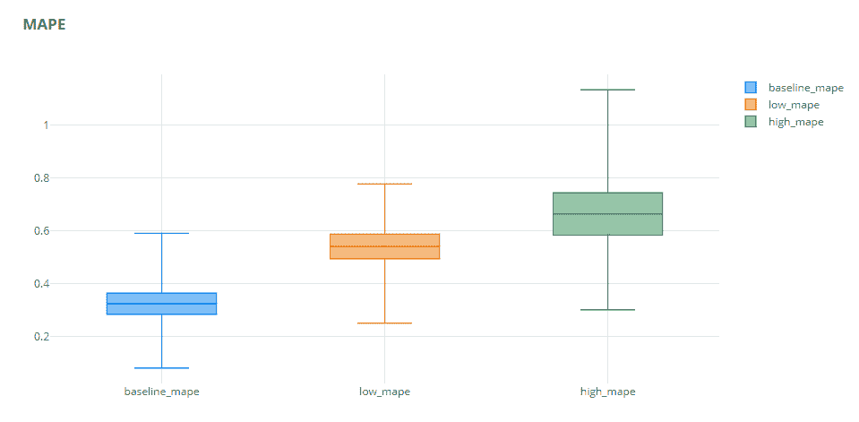

不完全是。在某种程度上，对百分误差的批评是有道理的。这里我们看到，我们低估的预测比我们高估的预测具有更低的 MAPE。低 MAPE 的传播也大大低于其他。但是，就商业而言，这是否意味着总是预测较低的预测是更好的预测呢？绝对不行。在供应链中，这会导致缺货，如果你想在市场中保持竞争力，这不是你想要的。

# 对称误差

对称误差被认为是比百分比误差更好的选择。百分比误差有两个主要缺点——当地面真值为零时不确定和不对称。和预测的平均值作为计算百分比误差的基础来解决这两个问题。

## 对称性

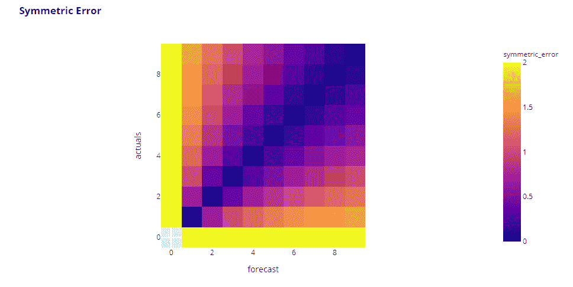

马上，我们可以看到这是围绕对角线对称的，几乎类似于对称情况下的绝对误差。底部的栏是空的，现在有了颜色(这意味着它们不是未定义的)。但是仔细观察会发现更多的东西。它不是围绕第二条对角线对称的。我们看到，当实际值和预测值都较低时，误差会更大。

## 损耗曲线

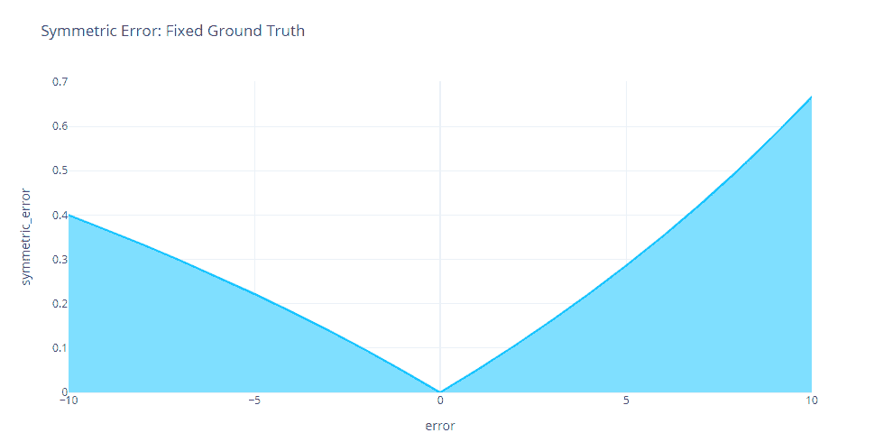

这在损耗曲线中更为明显。随着原点两侧误差的增加，我们可以看到不对称性。与名字相反，对称误差对预测不足的惩罚大于对预测过度的惩罚。

## 互补对

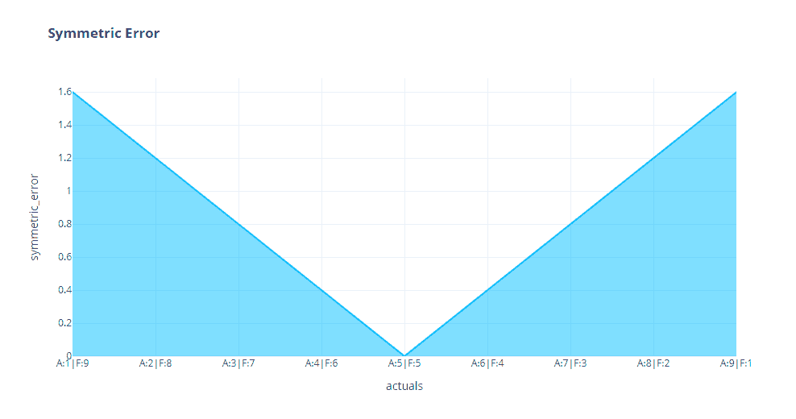

但是当我们看互补对时，我们可以看到它是完全对称的。这可能是因为基数，我们保持不变。

## 预测过高和过低

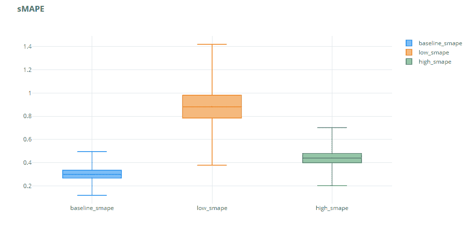

我们在这里也可以看到同样的情况。与预测不足系列相比，预测过度系列的误差始终较低。因此，在努力使对百分比误差预测不足的偏差正常化的过程中，对称误差反其道而行之，偏向于预测过度。

# 异常影响

除了上述实验之外，我们还运行了一个实验来检查异常值(完全偏离的单个预测)对聚合指标的影响。

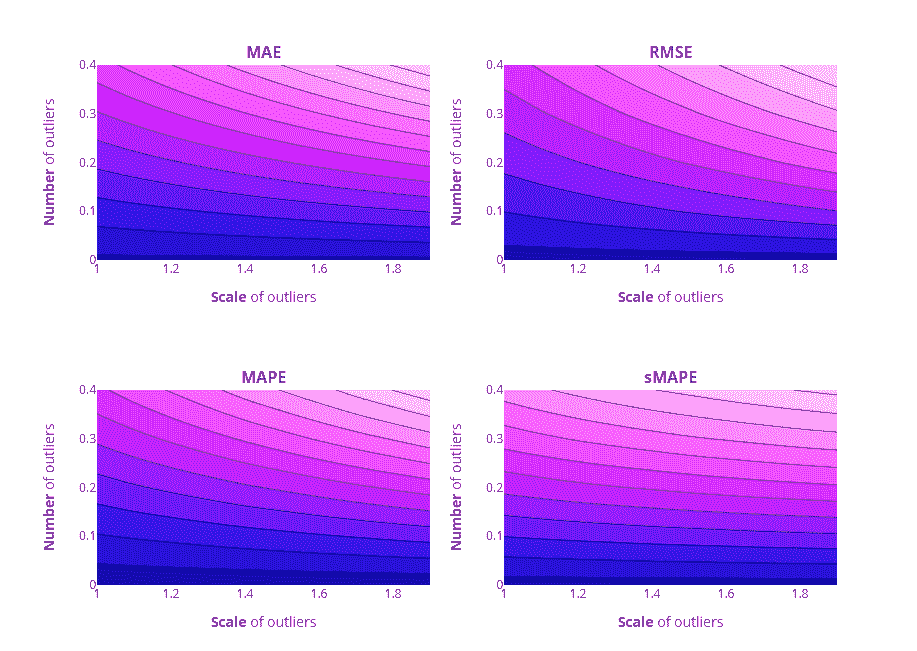

当遇到异常值时，所有四种误差度量具有相似的行为。离群值的数量比离群值的规模有更大的影响。

在这四个国家中，RMSE 受离群值的影响最大。我们可以看到等高线间隔很远，这表明当我们引入异常值时，变化率很高。另一方面，sMAPE 受离群值的影响最小。从平坦而密集的等高线可以明显看出。梅和 MAPE 的表现几乎相似，可能 MAPE 稍微好一点。

# 摘要

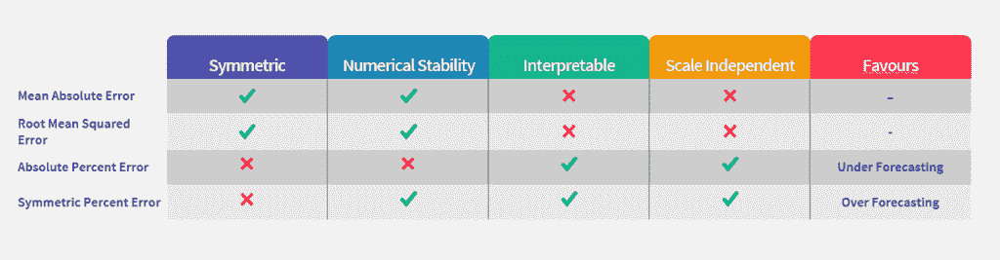

最后，没有一个度量标准可以满足误差测量的所有需求。根据不同的用例，我们需要挑选。在四个内在衡量指标中(及其所有聚合指标，如 MAPE、梅伊等)。)，如果不关心可解释性和尺度依赖性，就应该选择绝对误差度量。当我们寻找与规模无关的度量标准时，百分误差是我们最好的选择(尽管它有很多缺点)。在这种情况下，像标度误差这样的外部误差度量提供了一个更好的选择(也许在另一篇博文中，我也会谈到这些)。)

**代码重现实验**

 [## manujosephv/预测 _ 指标

### 在 GitHub 上创建一个帐户，为 manujosephv/forecast_metrics 的发展做出贡献。

github.com](https://github.com/manujosephv/forecast_metrics/tree/master) 

**查看该系列的其余文章**

1.  [预测误差度量:通过实验了解它们](https://deep-and-shallow.com/2020/09/26/forecast-error-measures-understanding-them-through-experiments/)
2.  [预测误差度量:比例误差、相对误差和其他误差](https://deep-and-shallow.com/2020/10/01/forecast-error-measures-scaled-relative-and-other-errors/)
3.  预测误差度量:间歇需求

**延伸阅读**

*   Shcherbakov 等人，2013 年，[预测误差测量调查](http://idosi.org/wasj/wasj(ITMIES)13/28.pdf)
*   Goodwin & Lawton，1999，[关于对称 MAPE 的不对称性](https://doi.org/10.1016/S0169-2070(99)00007-2)

***编辑(29–09–2020):修正了等高线图*** 中的一个标注错误问题

*原载于 2020 年 9 月 26 日*[*【http://deep-and-shallow.com】*](https://deep-and-shallow.com/2020/09/26/forecast-error-measures-understanding-them-through-experiments/)*。*