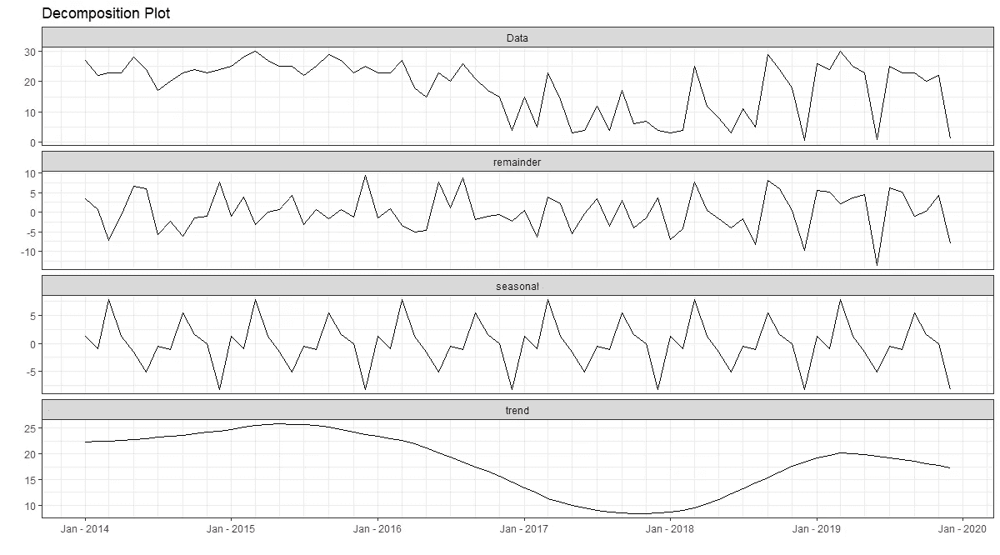

# 将外部信息作为预测因素的预测

> 原文：<https://towardsdatascience.com/forecast-with-including-external-information-as-predictor-594eaae7a2b9?source=collection_archive---------41----------------------->


照片由[维达尔·诺德里-马西森](https://unsplash.com/@vidarnm?utm_source=unsplash&utm_medium=referral&utm_content=creditCopyText)在 [Unsplash](https://unsplash.com/?utm_source=unsplash&utm_medium=referral&utm_content=creditCopyText) 拍摄

## R 中预测方法如何利用外部信息的简单案例研究

预测在某些情况下是必需的:预测一个行业的供给和需求，预测产品需求和生产中需要的劳动力，预测像降雨这样的天气，或者更多的情况可以使用预测来解决。最常用的预测方法是仅使用其历史数据，如趋势和季节性，而忽略了剩余因素(从外部来源获得的信息)。然而，如果我们处理一些与一些外部信息高度相关的数据，这并没有错，但是不够明智。例如，旅游业假期的影响、金融和银行业的通货膨胀率、竞争对手的行动以及许多其他条件都需要考虑外部信息。

虽然数据科学工具已经显著发展，但它有助于预测者简化他们的工作。我们将以使用 R 创建预测为例，包括外部信息，作为其预测器的一部分。

我们的数据集包含印度尼西亚万隆的月降雨量、雨天数、平均温度等信息；

1.  降雨量:以平方毫米为单位，指给定时间内给定区域的降雨量
2.  下雨天数:下雨的天数
3.  平均温度


图一。万隆数据集的头

万隆数据集包含 2014 年至 2019 年范围内的时间序列信息。由于这应该在进行任何分析工作之前完成，我们需要有一个我们想要解决的明确目标，在这种情况下，我们将我们的目标设定为预测 2020 年期间的降雨天数。使用降雨量或温度中的一个或两个，我们将尝试创建一个简单的预测方法来达到我们的目标。

**探索我们的数据**



图二。分解图

时间序列的分解是探索数据内部任何信息的最有力的技术之一。利用这一点，我们可以计算趋势和季节性强度，并找出其趋势和季节性的剩余模式。如果我们排除外部信息，我们将只利用季节性和趋势模式进行分析，并将剩余部分视为误差。当我们使用外部信息作为我们的预测器时，区别在于我们可以使用我们的外部信息来解释剩余分量的变化，或者简单地说，由我们的外部信息组成的剩余分量。
那么，如何确定我们应该使用哪些信息作为我们的外部预测器呢？最有用但最直接的方法是检查它与我们的目标变量的相关性:


图三。相关表

降雨量与降雨量有适度的相关性。我们将利用这个变量作为我们的外部预测。但是，让我们先来看看这些变量之间的曲线:


图 4。降雨量和降雨量时间序列图

在这个简单的图表上，我们可以看到雨滴(底部)和降雨量(顶部)虽然不完全相同，但由于它们在周期内的相关性，仍然有相似的运动。

**时间序列预测**

R 中的自动 Arima 函数使得预测比它看起来更容易。但是要在我们的模型中包含外部信息，我们必须用我们的预测器(外部信息)指定 **xreg** 参数。最后， **auto.arima()** 将进行剩余的计算，并为我们找到最佳模型。

```
#Creating Model
fit <- auto.arima(Bandung[,2], xreg=Bandung[,1], stepwise = FALSE,
                  approximation = FALSE, biasadj= TRUE)**#Summary of Our Model****Series: Bandung[, 2] 
Regression with ARIMA(5,1,0) errors 

Coefficients:
          ar1      ar2      ar3      ar4      ar5    xreg
      -0.8445  -0.7907  -0.8163  -0.7130  -0.7036  0.0269
s.e.   0.0911   0.1081   0.1003   0.1038   0.0847  0.0049

sigma^2 estimated as 25.51:  log likelihood=-214.8
AIC=443.59   AICc=445.37   BIC=459.43**#Check Residuals
checkresiduals(fit)**Ljung-Box test

data:  Residuals from Regression with ARIMA(5,1,0) errors
Q* = 7.0153, df = 8, p-value = 0.535

Model df: 6\.   Total lags used: 14**
```


图五。拟合模型的残差检验

**auto.arima()** 选择具有 5 阶自回归和一阶差分的非季节性 arima 模型，其中包含误差作为我们的 **xreg** (外部预测器)。如果我们看到我们的模型的细节，xreg 组件与 AR 的 5 阶相比，对计算没有那么大的影响。但我们将继续下去，因为这是唯一一个使用简单数据集的简单教程。对于另一个数据集，外部预测可能对模型计算更有影响。

已经完成的残差检验显示残差彼此之间不相关，这意味着我们的模型可以很好地使用。

为了使用具有外部信息的模型进行预测，我们需要获得外部信息的未来值。这一步对不同的数据集有不同的处理。如果我们可以根据专业知识直接预测它的未来价值，我们就可以直接使用它。但是，如果我们不能立即预测其未来价值，我们可以建立一个单独的模型，并在与我们的主要预测目标相同的时间范围内预测其未来价值。对于我们的例子，我们将使用 auto.arima()构建另一个模型并预测其未来值:


图六。未来 12 个月的预测值

利用已知的外部预测值，我们最终可以对 2020 年的降雨进行预测，并可视化其结果。


图七。未来 12 个月的降雨预报


图八。2020 年万隆降雨预报

我们的预测显示，2020 年将有两个月(6 月和 12 月)的月降雨日数最少，最高降雨日数出现在 3 月和 9 月。

这就是我们如何进行预测，将外部信息作为模型中的一个回归变量。更详细地说，我们还可以将仅使用趋势和季节性的预测与使用外部信息的预测进行比较，并找出哪个模型更好。然而，无论你选择哪种方法，都没有错，因为不同的数据需要不同的处理。

对于免责声明，本文仅讨论如何在我们的时间序列模型中包括外部回归变量，因此在预测雨天的真实情况下，我建议咨询气候专家，并找到另一个与雨天如何发生相关的变量。

你可以在这个[链接](https://www.kaggle.com/derykurniawan/bandungrainfall)上找到数据集。