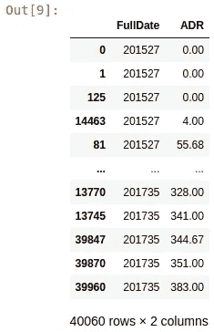
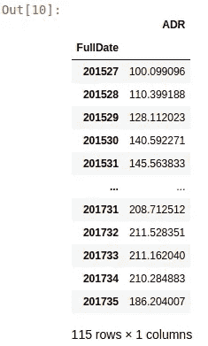
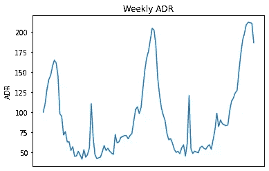
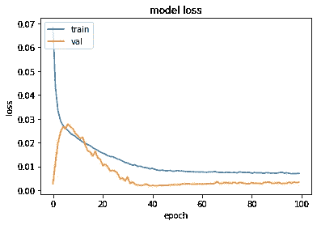
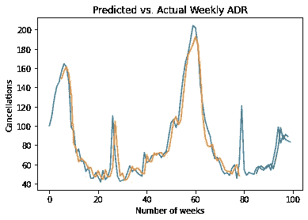

# 使用 LSTM 预测酒店的平均每日房价趋势

> 原文：<https://towardsdatascience.com/forecasting-average-daily-rate-trends-for-hotels-using-lstm-93a31e01190a?source=collection_archive---------28----------------------->

## 以下是如何使用 LSTM 模型来预测酒店的 ADR(平均每日房价),这是业内的一个重要指标。

平均每日房价(ADR)被认为是酒店最重要的[指标之一。](https://roompricegenie.com/average-rate-adr/)


资料来源:pixabay.com

其计算方法如下:

```
ADR = Revenue ÷ sold rooms
```

实质上，ADR 是衡量一个酒店房间在特定时期的平均价格。

# 背景

正在研究的[数据集](https://www.sciencedirect.com/science/article/pii/S2352340918315191)由一家葡萄牙酒店的取消预订组成，其中包括每个单独预订的 ADR 作为包含变量之一。

使用时间序列分析，我们假设酒店希望 1)计算给定一周内所有预订的平均 ADR 值，2)使用该数据预测未来每周 ADR 趋势——每周 ADR 是指任何一周内所有预订的平均 ADR——以下称为“每周 ADR”。

人们会注意到，数据集中有许多 ADR 值为正的取消事件，在这种情况下，假设即使客户取消了预订，他们最终仍会被收取预订费用(例如，在取消截止日期后取消，等等)。

一个长短期记忆网络(LSTM)被用来做这件事。LSTMs 是顺序神经网络，它假设特定序列中的观察值之间存在相关性。因此，它们越来越多地被用于时间序列预测的目的。

作为参考，每个客户的 ADR 也包括在内——考虑到一些客户既是公司也是个人，这导致在许多情况下每次预订不止一个房间。

# 数据操作

使用 pandas，完整的日期(年份和周数)与每个预订的相应 ADR 值相结合。



然后将这些数据点组合在一起，以获得所有预订的每周平均每日房价，如下所示:

```
df4 = df3.groupby('FullDate').agg("mean")
df4
df4.sort_values(['FullDate'], ascending=True)
```

以下是新数据帧的外观:



顺便提一下，完整的笔记本和数据集可以在下面提供的 GitHub 资源库的链接中找到，其中更详细地说明了数据操作过程。

生成时间序列图:

```
import matplotlib.pyplot as plt
plt.plot(tseries)
plt.tick_params(
    axis='x',          # changes apply to the x-axis
    which='both',      # both major and minor ticks are affected
    bottom=False,      # ticks along the bottom edge are off
    top=False,         # ticks along the top edge are off
    labelbottom=False) # labels along the bottom edge are off
plt.ylabel('ADR')
plt.title("Weekly ADR")
plt.show()
```



# LSTM 模型配置

让我们开始分析 H1 数据集。创建的时间序列的前 100 个观察值称为。然后，创建数据集矩阵，并对数据进行缩放。

```
df = df[:100]# Form dataset matrix
def create_dataset(df, previous=1):
    dataX, dataY = [], []
    for i in range(len(df)-previous-1):
        a = df[i:(i+previous), 0]
        dataX.append(a)
        dataY.append(df[i + previous, 0])
    return np.array(dataX), np.array(dataY)
```

然后，使用 MinMaxScaler 对数据进行归一化，以便神经网络正确解释数据:

```
# normalize dataset with MinMaxScaler
scaler = MinMaxScaler(feature_range=(0, 1))
df = scaler.fit_transform(df)
df
```

以下是输出示例:

```
array([[0.35915778],
       [0.42256282],
       [0.53159902],
...
       [0.27125524],
       [0.26293747],
       [0.25547682]])
```

数据被分成训练集和测试集，其中*先前的*参数被设置为 5:

```
import tensorflow as tf
from tensorflow.keras import layers
from tensorflow.keras.layers import Dense
from tensorflow.keras.layers import LSTM# Training and Validation data partition
train_size = int(len(df) * 0.8)
val_size = len(df) - train_size
train, val = df[0:train_size,:], df[train_size:len(df),:]# Number of previous
previous = 5
X_train, Y_train = create_dataset(train, previous)
X_val, Y_val = create_dataset(val, previous)
```

当*先前*参数设置为该值时，这实质上意味着时间 *t* (训练数据的 Y_train)的值是使用值 *t-1* 、 *t-2* 、 *t-3* 、 *t-4* 和 *t-5* (均在 X_train 下)预测的。

这里是一个 *Y_train* 数组的例子:

```
array([0.70858066, 0.75574219, 0.7348692 , 0.63555916, 0.34629856,
       0.32723163, 0.18514608, 0.21056117, 0.13243974, 0.1321469 ,
       0.06636683, 0.09516089, 0.02223529, 0.02497857, 0.06036494,
...
       0.12222412, 0.07324677, 0.05206859, 0.05937164, 0.04205497,
       0.0867528 , 0.10976084, 0.0236608 , 0.11987636])
```

这里是一个 *X_train* 数组的例子:

```
array([[0.35915778, 0.42256282, 0.53159902, 0.6084246 , 0.63902841],
       [0.42256282, 0.53159902, 0.6084246 , 0.63902841, 0.70858066],
       [0.53159902, 0.6084246 , 0.63902841, 0.70858066, 0.75574219],
...
       [0.07324677, 0.05206859, 0.05937164, 0.04205497, 0.0867528 ],
       [0.05206859, 0.05937164, 0.04205497, 0.0867528 , 0.10976084],
       [0.05937164, 0.04205497, 0.0867528 , 0.10976084, 0.0236608 ]])
```

运行 100 个时期:

```
# reshape input to be [samples, time steps, features]
X_train = np.reshape(X_train, (X_train.shape[0], 1, X_train.shape[1]))
X_val = np.reshape(X_val, (X_val.shape[0], 1, X_val.shape[1]))# Generate LSTM network
model = tf.keras.Sequential()
model.add(LSTM(4, input_shape=(1, previous)))
model.add(Dense(1))
model.compile(loss='mean_squared_error', optimizer='adam')
history=model.fit(X_train, Y_train, validation_split=0.2, epochs=100, batch_size=1, verbose=2)
```

以下是一些示例结果:

```
Train on 59 samples, validate on 15 samples
Epoch 1/100
59/59 - 1s - loss: 0.0689 - val_loss: 0.0027
Epoch 2/100
59/59 - 0s - loss: 0.0431 - val_loss: 0.0118
...
Epoch 99/100
59/59 - 0s - loss: 0.0070 - val_loss: 0.0031
Epoch 100/100
59/59 - 0s - loss: 0.0071 - val_loss: 0.0034
dict_keys(['loss', 'val_loss'])
```

这是培训和验证损失的直观表示:



# 训练和验证预测

现在，让我们进行一些预测。

```
# Generate predictions
trainpred = model.predict(X_train)
valpred = model.predict(X_val)
```

以下是训练和测试预测的示例:

**训练预测**

```
>>> trainpred
array([[0.6923234 ],
       [0.73979336],
       [0.75128263],
...
       [0.09547461],
       [0.11602292],
       [0.050261  ]], dtype=float32)
```

**测试预测**

```
>>> valpredarray([[0.06604623],
       [0.0982968 ],
       [0.10709635],
...
       [0.3344252 ],
       [0.2922875 ]], dtype=float32)
```

使用`scaler.inverse_transform`将预测值转换回正常值，并计算训练和验证分数。

```
import math
from sklearn.metrics import mean_squared_error# calculate RMSE
trainScore = math.sqrt(mean_squared_error(Y_train[0], trainpred[:,0]))
print('Train Score: %.2f RMSE' % (trainScore))
valScore = math.sqrt(mean_squared_error(Y_val[0], valpred[:,0]))
print('Validation Score: %.2f RMSE' % (valScore))
```

**培训和验证分数**

```
Train Score: 12.71 RMSE
Validation Score: 8.83 RMSE
```

以下是预测的图表:



测试和预测阵列被相应地重新整形，并且平均方向精度的函数被定义为:

```
import numpy as npdef mda(actual: np.ndarray, predicted: np.ndarray):
    """ Mean Directional Accuracy """
    return np.mean((np.sign(actual[1:] - actual[:-1]) == np.sign(predicted[1:] - predicted[:-1])).astype(int))
```

# 模型结果

现在计算平均方向精度:

```
>>> mda(Y_val, predictions)
0.8571428571428571
```

获得了 86% 的 MDA，这意味着该模型在 86%的时间内正确预测了实际每周 ADR 趋势的方向。

如上所示，还获得了 **8.83** RMSE 的验证分数。RMSE 是衡量每周 ADR 与实际值之间的偏差，并采用相同的数字格式。验证数据的平均每周 ADR 为 **69.99** 。

验证数据的平均预测误差为 **-1.419** :

```
>>> forecast_error = (predictions-Y_val)
>>> forecast_error
>>> mean_forecast_error = np.mean(forecast_error)
>>> mean_forecast_error
-1.419167548625413
```

# 测试看不见的(测试)数据

既然模型已经定型，下一步就是在看不见的(或测试数据)上测试模型的预测。

如前所述，LSTM 使用值 *t-1* 、 *t-2* 、 *t-3* 、 *t-4* 和 *t-5* 预测时间 *t* 的值。

在这种情况下，预测系列中最后 15 周的 ADR 值。

```
actual = tseries.iloc[100:115]
actual = np.array(actual)
actual
```

先前建立的模型现在用于使用时间序列中的前五个值来预测每个值:

```
# Test (unseen) predictions
# (t) and (t-5)
>>> XNewarray([[ 82.1267268 ,  90.48381679,  85.81940503,  84.46819121,
         83.25621451],
       [ 90.48381679,  85.81940503,  84.46819121,  83.25621451,
         84.12304147],
...
       [189.16831978, 198.22268542, 208.71251185, 211.52835052,
        211.16204036],
       [198.22268542, 208.71251185, 211.52835052, 211.16204036,
        210.28488251]])
```

变量被适当缩放，并调用`model.predict`:

```
Xnew = scaler.transform(Xnew)
Xnew
Xnewformat = np.reshape(Xnew, (Xnew.shape[0], 1, Xnew.shape[1]))
ynew=model.predict(Xnewformat)
```

以下是生成的预测数组:

```
array([0.02153895, 0.0157201 , 0.12966183, 0.22085814, 0.26296526,
       0.33762595, 0.35830092, 0.54184073, 0.73585206, 0.8718423 ,
       0.92918825, 0.9334069 , 0.8861607 , 0.81483454, 0.76510745],
      dtype=float32)
```

数组被转换回原始值格式:

```
>>> ynew = ynew * np.abs(maxt-mint) + np.min(tseries)
>>> ynewpd=pd.Series(ynew)
>>> ynewpd0      45.410988
1      44.423096
2      63.767456
3      79.250229
4      86.398926
5      99.074379
6     102.584457
7     133.744766
8     166.682877
9     189.770493
10    199.506348
11    200.222565
12    192.201385
13    180.092041
14    171.649673
dtype: float32
```

这里是计算出的 **MDA** 、 **RMSE** 、 **MFE(平均预测误差)**。

**丙二醛= 0.86**

```
>>> mda(actualpd, ynewpd)0.8666666666666667
```

**RMSE = 33.77**

```
>>> mse = mean_squared_error(actualpd, ynewpd)
>>> rmse = sqrt(mse)
>>> print('RMSE: %f' % rmse)RMSE: 33.775573
```

**MFE = -30.17**

```
>>> forecast_error = (ynewpd-actualpd)
>>> mean_forecast_error = np.mean(forecast_error)
>>> mean_forecast_error-30.173496939933216
```

随着测试集的平均每周 ADR 达到 **160.49** ，RMSE 和 MFE 表现看起来相当强劲(误差越低越好)。

# H2 结果

在 H2 数据集(葡萄牙一家独立酒店的 ADR 数据)上执行了相同的过程。以下是将预测与测试集进行比较的结果:

**丙二醛= 0.86**

```
>>> mda(actualpd, ynewpd)0.8666666666666667
```

**RMSE = 38.15**

```
>>> mse = mean_squared_error(actualpd, ynewpd)
>>> rmse = sqrt(mse)
>>> print('RMSE: %f' % rmse)RMSE: 38.155347
```

**MFE = -34.43**

```
>>> forecast_error = (ynewpd-actualpd)
>>> mean_forecast_error = np.mean(forecast_error)
>>> mean_forecast_error-34.437111023457376
```

对于 H2 数据集，测试集的平均每周 ADR 为 **131.42** ，相比之下，RMSE 和 MFE 误差较低。

# 结论

在本例中，您已经看到了如何使用 LSTM 模型预测 ADR。具体而言，上述示例说明了:

*   如何构建 LSTM 模型
*   测量 LSTM 模式预测的误差和精确度的方法

本例的数据集和笔记本可从 MGCodesandStats GitHub 库获得，以及对该主题的进一步研究。

你也可以在 michael-grogan.com[找到更多我的数据科学内容。](https://www.michael-grogan.com/)

*免责声明:本文是在“原样”的基础上编写的，没有任何担保。本文旨在提供数据科学概念的概述，不应以任何方式解释为专业建议。*