# 预测印度的新冠肺炎病例

> 原文：<https://towardsdatascience.com/forecasting-covid-19-cases-in-india-c1c410cfc730?source=collection_archive---------8----------------------->

## 到 2020 年 4 月 7 日，印度将发现多少病例？

自 2019 年 12 月在中国武汉首次报道后，新冠肺炎在世界各地掀起了风暴。自那时以来，全球此类案件的数量呈指数级增长。截至 2020 年 3 月 28 日，报告的病例总数达到 668，352 例，其中 31，027 例已经死亡。下图显示了病毒在不同国家的爆发情况

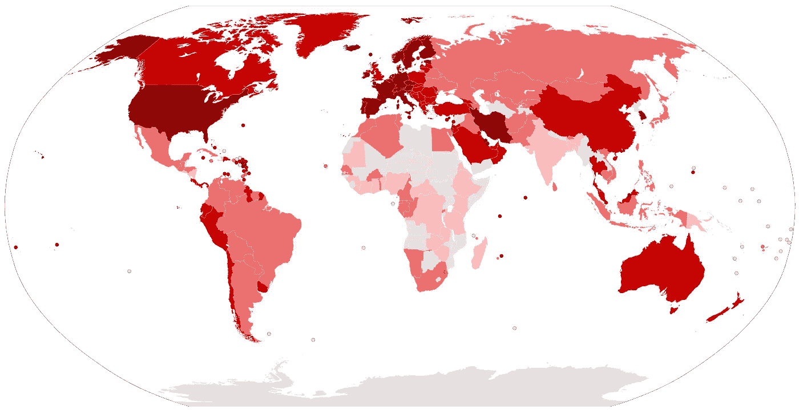

演职员表:拉斐尔·杜楠特，链接:[https://en . Wikipedia . org/wiki/2019% E2 % 80% 9320 _ 冠状病毒 _ 疫情#/media/File:新冠肺炎 _ 疫情 _ 世界 _ 地图 _ 人均. svg](https://en.wikipedia.org/wiki/2019%E2%80%9320_coronavirus_pandemic#/media/File:COVID-19_Outbreak_World_Map_per_Capita.svg)

可以很好地观察到，大多数国家都报告了新型冠状病毒病例。截至目前，已影响 192 个国家和 1 艘国际运输工具(停靠日本横滨港的*钻石公主号*邮轮)。

就印度而言，这些病例于 1 月底出现在喀拉拉邦，当时有三名学生从中国武汉返回。然而，事情在 3 月份升级，此前全国各地都报告了几起病例，其中大多数人都有去其他国家的旅行史。下图显示了 1 月 30 日至 3 月 28 日期间发现的病例数量。

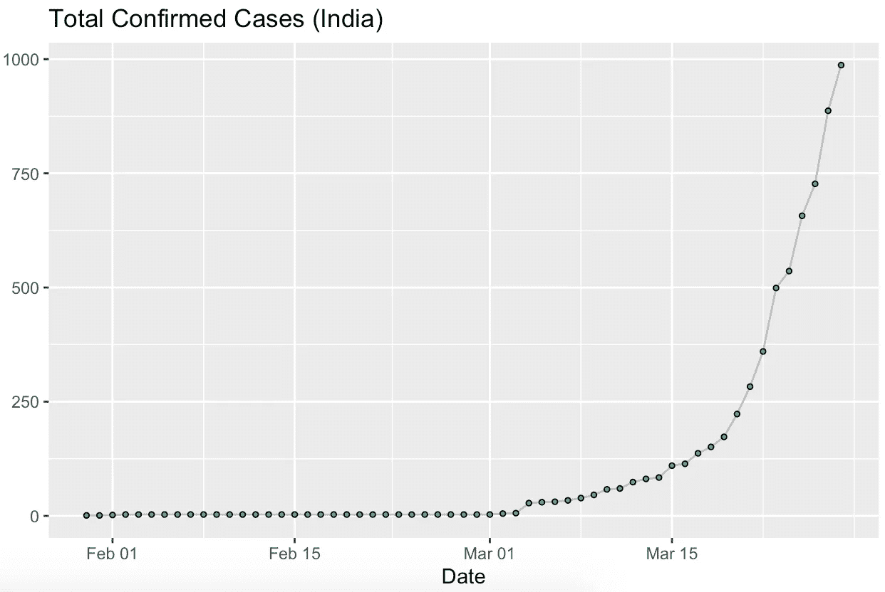

截至 3 月 28 日确诊病例总数(印度)

在 1 月下旬首次出现后，该数字一直保持稳定，直到 3 月初，此后，它呈指数级增长。截至 3 月 28 日，总病例数已达 987 例，24 例死亡。鉴于目前的增长速度，如果不采取具体的预防措施，这些病例预计在未来 10 天内会到达哪里？

我们可以进行*时间序列*分析来创建一个有助于预测的模型。数据集可以在 Kaggle 上获得。我们使用 R 编程进行分析。

我们加载必要的包并附加数据集

```
#COVID India — Analyzing/Forecasting Total Cases#Packages
library(dplyr)
library(ggplot2)
library(hrbrthemes)
library(tseries)
library(forecast)attach(Data)> head(Data)
# A tibble: 6 x 4
  Date                `Total Confirmed Cases` Cured Deaths
  <dttm>                                <dbl> <dbl>  <dbl>
1 2020-01-30 00:00:00                       1     0      0
2 2020-01-31 00:00:00                       1     0      0
3 2020-02-01 00:00:00                       2     0      0
4 2020-02-02 00:00:00                       3     0      0
5 2020-02-03 00:00:00                       3     0      0
6 2020-02-04 00:00:00                       3     0      0
```

让我们来看看前 6 个观察结果。这些列包括:

**日期:**记录观察结果的日期。

**确诊病例总数:**截至给定日期的确诊病例数。

**治愈:**患者在指定日期康复

**死亡:**患者在给定日期死亡

由于我们只分析全部确诊病例，因此我们创建了一个仅包含这些病例的新数据框。

```
#Creating a new data frame with Confirmed Cases
df <- Data[2]
```

下一步是将数据框转换为时间序列对象。

```
#Converting it to Time Series Object
tsdata <- ts(df$`Total Confirmed Cases`)
ts.plot(tsdata)
```

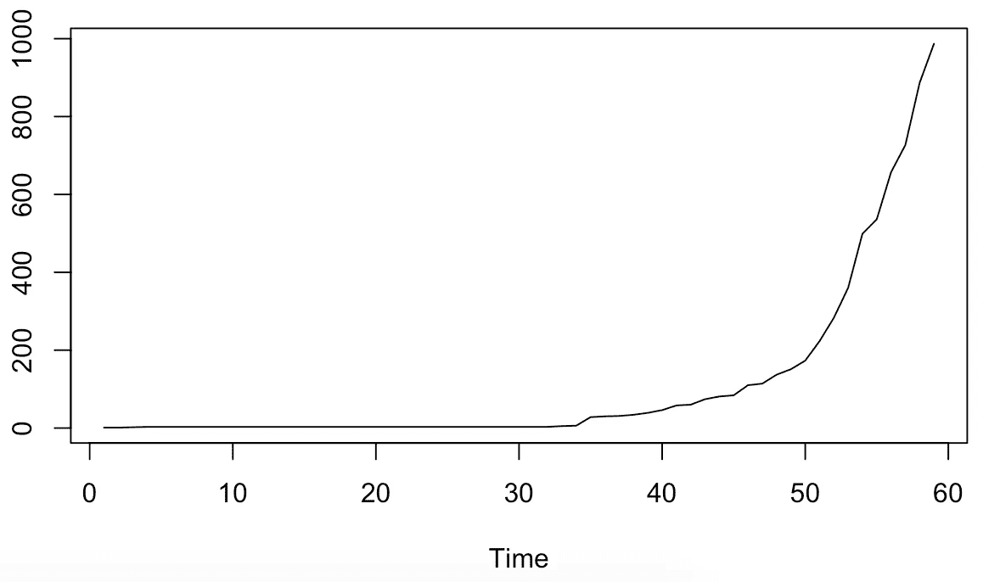

时间序列图

我们得到了每天记录的每个观察值的时间序列图。下一步是检查时间序列是否是平稳的。简而言之，平稳时间序列的统计特性(如均值、方差、自相关)是恒定的。时间序列观测值保持平稳是很重要的，因为这样就很容易得到准确的预测。我们使用*扩展的 Dickey Fuller 测试*来测试时间序列观测值的平稳性。检验的零假设(Ho)是数据不稳定，而另一个假设是数据稳定。*显著性水平(LOS)* 取 0.05。

```
> adf.test(tsdata)Augmented Dickey-Fuller Testdata: tsdata
Dickey-Fuller = 2.2994, Lag order = 3, p-value = 0.99
alternative hypothesis: stationaryWarning message:
In adf.test(tsdata) : p-value greater than printed p-value
```

*p 值*结果是 0.99。因此，我们不能拒绝我们的 Ho，并得出数据不是稳定的结论。我们现在必须研究数据的平稳性。根据时间序列的行为，有各种方法可以使我们的时间序列平稳。最流行的是*差分法。* **差分**通过消除**时间序列**的水平变化，从而消除(或减少)趋势和季节性，帮助稳定**时间序列**的平均值。从数学上讲，它是这样给出的:

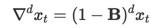

在上面的表达式中， **B** 是后移运算符， ***d*** 表示差分顺序。R 中使用的代码如下

```
> tsdata1 <- diff(tsdata, differences = 2)
> adf.test(tsdata1)Augmented Dickey-Fuller Testdata:  tsdata1
Dickey-Fuller = -4.3764, Lag order = 3, p-value = 0.01
alternative hypothesis: stationaryWarning message:
In adf.test(tsdata1) : p-value smaller than printed p-value
```

经过两轮差分后，我们再次执行*增强迪基富勒测试* (ADF 测试)。 *p 值*小于 0.01。因此，我们可以拒绝我们的零假设，并得出结论，数据是平稳的。由于差分的顺序是 2， *d* 是 2。

下一步是绘制 ACF 和 PACF 图。

完整的*自相关函数* (ACF)给出了任何序列与其滞后值的自相关。换句话说，ACF 是时间序列与其滞后值之间相关系数的图表。

*部分自相关函数* (PACF)给出了两个变量之间的相关量，这不是用它们的相互相关性来解释的，而是用残差来解释的。因此，我们观察残差是否能帮助我们产生更多的信息。关于这个主题的更全面的指南可以在[这里](/significance-of-acf-and-pacf-plots-in-time-series-analysis-2fa11a5d10a8)找到。

```
#Plotting the ACF plot and PACF
acf(data1)
pacf(data1)
```

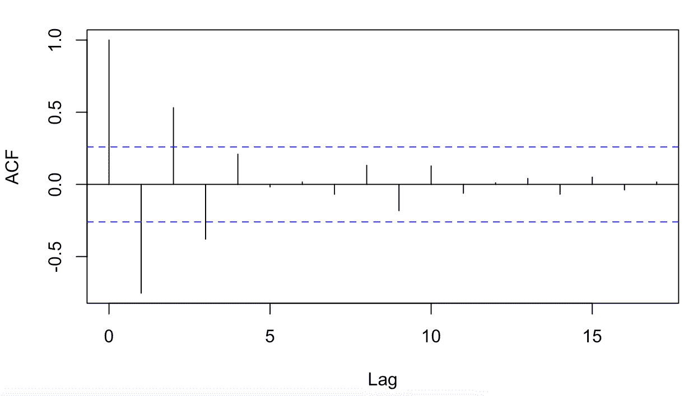

ACF 图

上面的 ACF 图显示了滞后 3(q)时的显著相关性，而下面的 PACF 图显示了直到滞后 1(p)时的显著相关性。

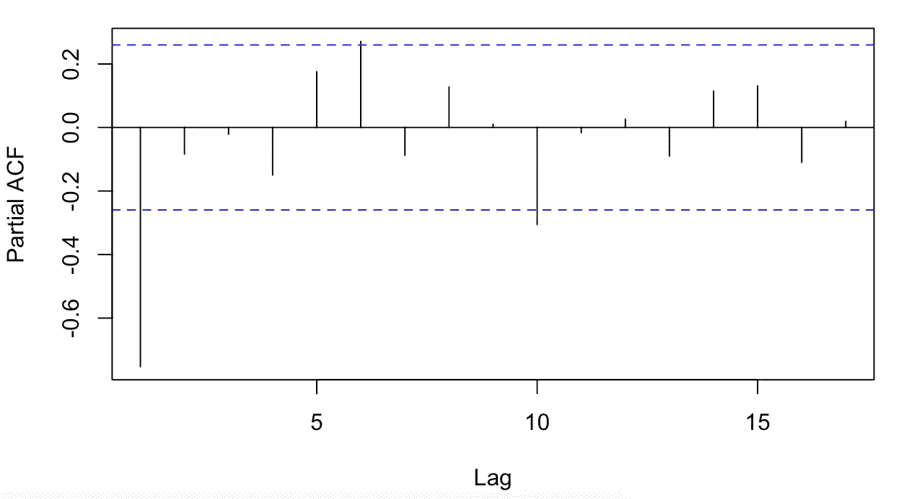

PACF 图

# **使用 ARIMA (1，2，3)**

基于 ACF 和 PACF，我们选择了 ARIMA (1，2，3)模型。我们将 ***d*** 作为 2，因为需要两个差分来使我们的时间序列平稳。我们现在将根据上面选择的参数来拟合模型

```
#Fitting ARIMA (1,2,3) model
fit1 <- arima(df$`Total Confirmed Cases`, c(1,2,3))
fit1#Forecasting
forecast1 <- forecast(fit1, h = 10)
forecast1
plot(forecast1)
```

我们得到以下结果

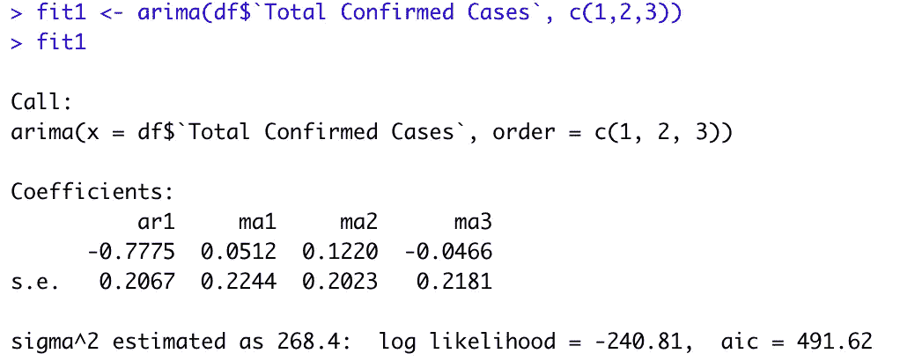

ARIMA (1，2，3)

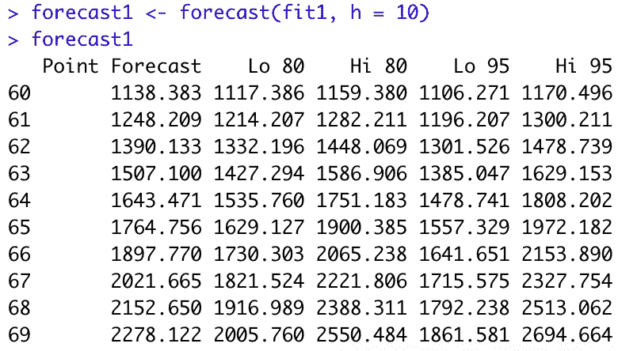

未来 10 天的点预测(h = 10)

我们预测了未来 10 天的确诊病例，即直到 2020 年 4 月 7 日。该点预测在第 69 天达到 2278 例，也就是到 2020 年 4 月 7 日，*总确诊病例很可能达到 2278 例。* *还有，需要注意的是，病例几乎每 10 天翻一倍。*图中显示了预测的病例。蓝线代表预测，其周围的银色阴影代表置信区间。

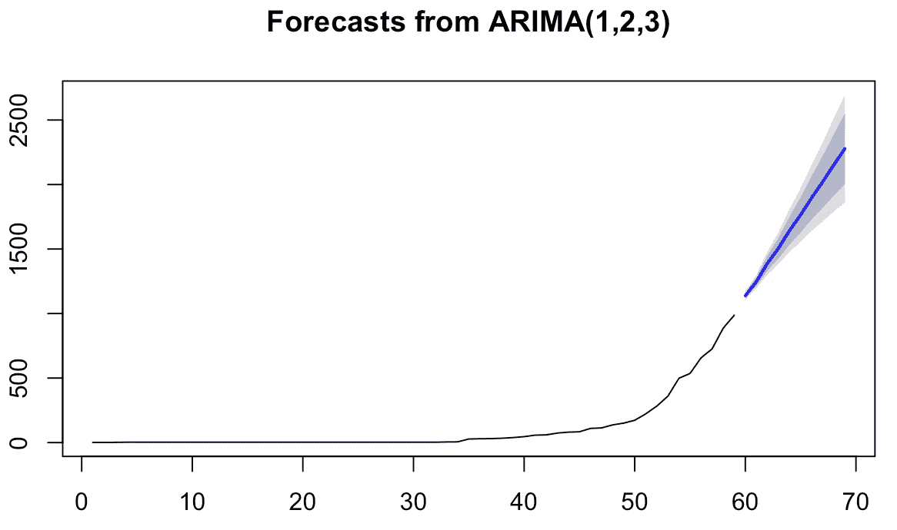

未来 10 天的预测

# 使用 auto.arima()

r 还具有 at *auto.arima()* 功能，可自动选择 arima 模型的最佳 *(p，d，q)* 值。让我们利用这一点。

```
#Fitting auto.arima ()
fit2 <- auto.arima(df$`Total Confirmed Cases`, seasonal = FALSE)
fit2#Forecasting
forecast2 <- forecast(fit2, h = 9)
forecast2
plot(forecast2)
```

我们得到以下结果

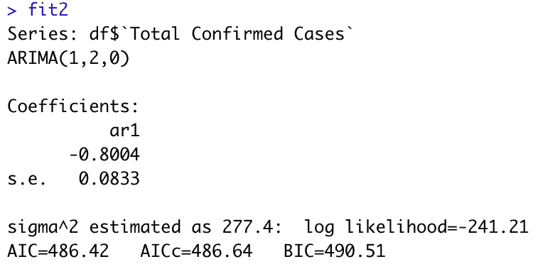

auto.arima(1，2，0)

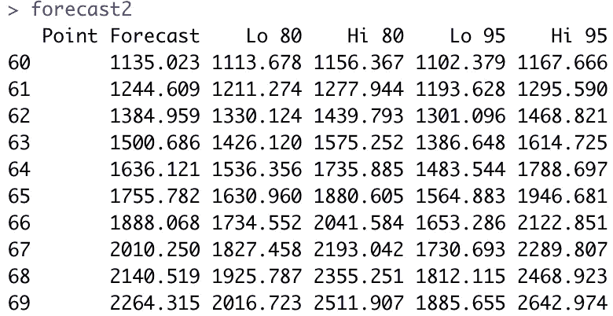

未来 10 天的点预测(h = 10)

使用 *auto.arima(1，2，0)* 的模型与我们之前的模型非常相似，但是 *q* 值为 0。我们得到 486.42 的赤池信息标准(AIC)，其小于先前模型的 AIC(491.62)。从点估算中，我们可以看到 ***总病例数在*** 第 10 天 ***达到 2264 例，也就是说，到 2020 年 4 月 7 日，略低于之前模型预测的 2278 例。*病例每 10 天多一倍或少一倍。*标绘这些预测，我们得到:***

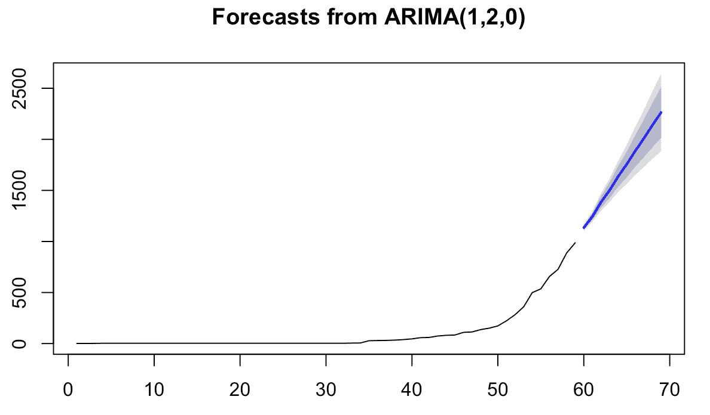

未来 10 天的预测

为了估计模型的充分性，我们进行残差分析。对于一个合适的模型，残差应该是独立的和同分布的，并且应该是不相关的。为了测试相关性，我们使用 ACF 图并寻找显著的相关性。

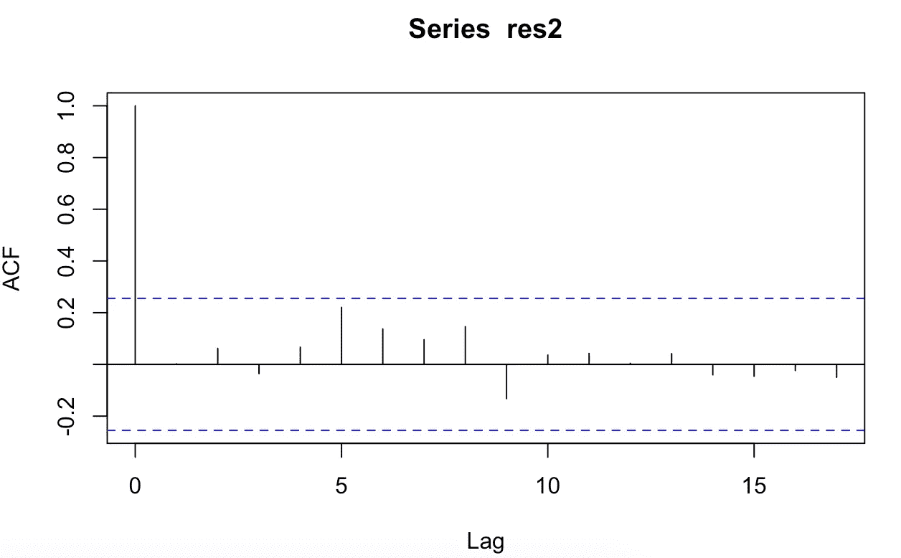

残差的 ACF 图。

除了 0，在任何滞后都没有观察到显著的相关性。我们可以推断残差是不相关的。为了检验残差是否正态分布，我们使用夏皮罗-维尔克正态性检验。结果表明，残差服从正态分布。

# 结论

最后，我们对印度的病例总数进行时间序列建模。这个数字每天都在增加，然而，在接下来的几天里，增长的速度将会放缓。如果公众认真对待这些措施，3 月 24 日在印度实施的封锁将防止病毒的社区传播。现在，这是困扰世界每个角落每个人的一个主要问题。作为一个社区，我们有潜力阻止它，我们可以通过防止病毒传播来阻止它。

*感谢您的阅读。我真诚地希望它对你有所帮助，并且一如既往地欢迎建设性的反馈。*

给我发邮件:icy.algorithms@gmail.com

你可以在 [LinkedIn](https://www.linkedin.com/company/enka-analytics/?viewAsMember=true) 上找到我。

***编者按:*** [*走向数据科学*](http://towardsdatascience.com/) *是一份以数据科学和机器学习研究为主的中型刊物。我们不是健康专家或流行病学家，本文的观点不应被解释为专业建议。想了解更多关于疫情冠状病毒的信息，可以点击* [*这里*](https://www.who.int/emergencies/diseases/novel-coronavirus-2019/situation-reports) *。*