# 利用 Prophet 和 SARIMA 模型预测新冠肺炎推文量

> 原文：<https://towardsdatascience.com/forecasting-covid-19-tweeting-volume-using-prophet-and-sarima-model-25206ea5b23b?source=collection_archive---------48----------------------->


照片由[伊霍尔·马里茨基](https://unsplash.com/@ihor_malytskyi?utm_source=unsplash&utm_medium=referral&utm_content=creditCopyText)在 [Unsplash](https://unsplash.com/?utm_source=unsplash&utm_medium=referral&utm_content=creditCopyText) 拍摄

## 如何在 ARIMA 建模中确定 twitter 数据的最佳季节性

本文是关于时间序列预测的季节性自回归区间移动平均法。这包括两个部分:首先是使用脸书先知图书馆，这是一个预测时间序列数据的工具，在第二部分，我们将从头开始建立一个最佳 ARIMA 模型，并将其扩展到季节性 ARIMA(萨里玛)。

数据集和笔记本已经上传到[T5 这个](https://github.com/Qmoein/Arima-vs-Prophet) 资源库中。

# **数学:**

ARIMA 模型的特征在于 3 项:p，d，q:
p = AR 项的阶(自回归)
q = MA 项的阶(移动平均)
d =使时间序列平稳所需的差异数

如果一个时间序列，有季节性模式，我们必须使用季节性 ARIMA 或萨里玛，因为增加了季节性。在 AR 模型中，Yt 取决于模型的滞后。因此，它是“Yt 滞后”的函数。

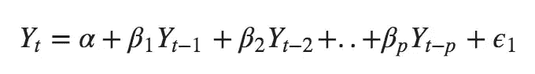

在 **MA 模型**中，Yt 取决于滞后预测误差:

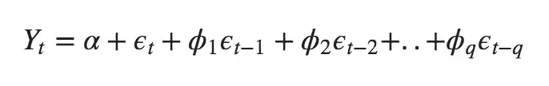

误差 Et 和 E(t-1)是来自以下等式的误差:

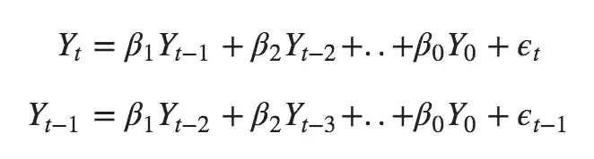

因此，如果您将 **AR** 和 **MA** 模型结合起来，则等式变为:

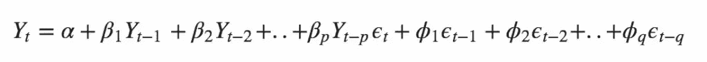

**ARIMA 模型中的文字:**

**预测 Yt =常数+Y 的线性组合滞后(最多 p 个滞后)+滞后预测误差的线性组合(最多 q 个滞后)**

你可以在这里找到更多关于 ARIMA 背后的数学知识。

# 资料组

我们使用了 Vakavic 记录的 Twitter 数据集，vaka vic 是中东的一个 NLP 服务。该数据集包含从 2020 年 2 月 15 日到 2020 年 4 月 18 日(64 天)发布的 1，259，478 条带有冠状病毒实体的法语推文。让我们快速浏览一下数据:

```
import pandas as pd
df = pd.read_json('fr-crona-tweets.json')
df.head()
```

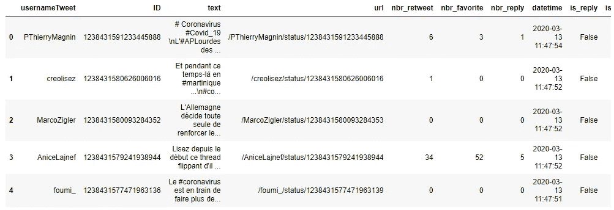

正如您在 datetime 列中看到的，数据是在每秒钟内收集的，因此我们必须按分钟、小时甚至更长时间对它们进行分组。

**准备数据**

首先，我们只是复制我们需要的列，然后我们将其四舍五入为 1 分钟的季节性，并计算每分钟的 tweets 值。

```
df = df[['datetime']].copy()timeseason = '1min'
dftime = df['datetime'].dt.round(timeseason)
newdf = dftime.value_counts()
df = pd.DataFrame(newdf)
df.head()
```

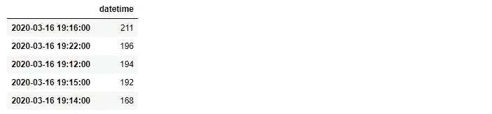

prophet 模型期望数据集具有特定的结构，其中包含时间的列应该命名为“ds”，频率列应该命名为“y”。我们将首先重命名 dataframe 列。然后我们把它写成“1 分钟。CSV”。现在我们可以通过改变“时间季节”变量来创造任何季节性。

```
df.index.name = 'ds'
df = df.rename(columns = {'datetime':'y'})
nameoffile = str(timeseason+'.csv')
df.to_csv(nameoffile)
df.head()
```

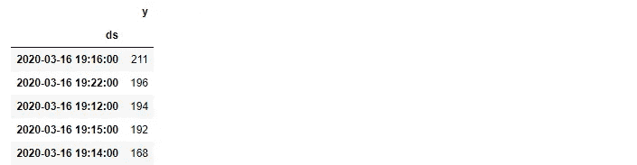

**导入库**

```
import numpy as np
import pandas as pd
from fbprophet import Prophet
import seaborn as sns
import matplotlib.pyplot as plt
from sklearn.metrics import mean_squared_error, mean_absolute_error
plt.style.use('fivethirtyeight')
```

# **FB 先知:**

[Prophet](https://facebook.github.io/prophet/) 是一种基于加法模型预测时间序列数据的程序，其中非线性趋势与每年、每周和每天的季节性以及假日影响相适应。它最适用于具有强烈季节效应的时间序列和几个季节的历史数据。

```
data = pd.read_csv('1min.csv',index_col=[0], parse_dates=[0])data.plot(style='.', figsize=(15,5), color=["#1DA1F2"], title='TimeLine')plt.show()
```

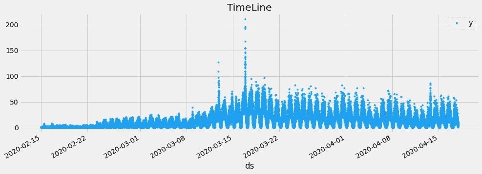

```
#Splinting Datasplit_date = '06-apr-2020'data_train = data.loc[data.index <= split_date].copy()data_test = data.loc[data.index > split_date].copy()#Plot train and test so you can see where we have split the datadata_test.rename(columns={'y': 'TEST SET'}).join(data_train.rename(columns={'y': 'TRAINING SET'}),how='outer').plot(figsize=(15,5), title='French tweets about Coronavirus', style='.')plt.show()
```

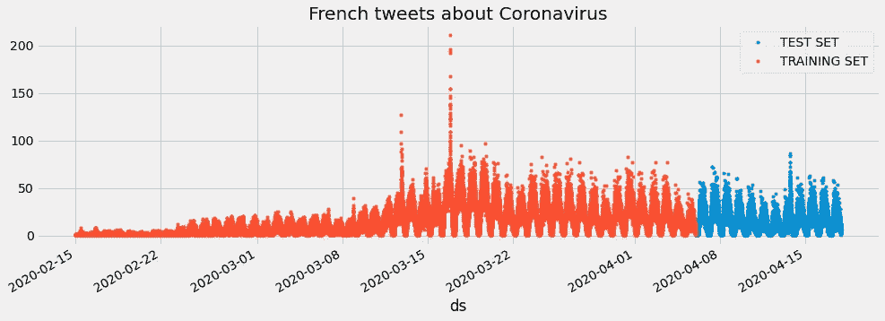

通过实例化一个新的 prophet 对象来适应这个模型。预测过程的任何设置都被传递到构造函数中。

```
model.fit(data_train.reset_index())# Predict on the training set with modeldata_test_fcst = model.predict(df=data_test.reset_index())
data_test_fcst.head()
```

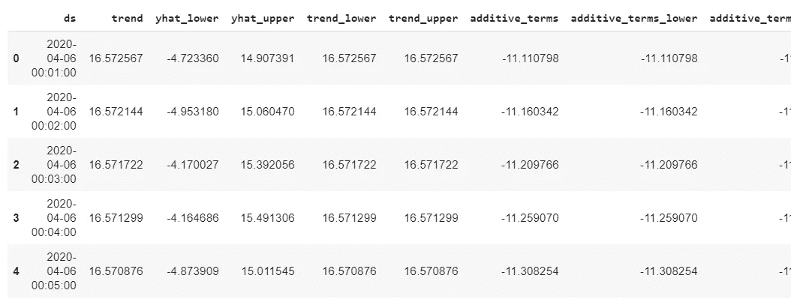

```
# Plot the forecastf, ax = plt.subplots(1)
f.set_figheight(5)
f.set_figwidth(15)
fig = model.plot(data_test_fcst,ax=ax)plt.show()
```

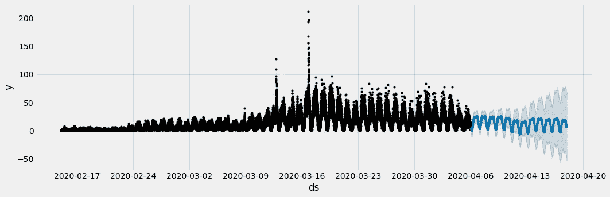

```
# Plot the components of the modelfig = model.plot_components(data_test_fcst)
```

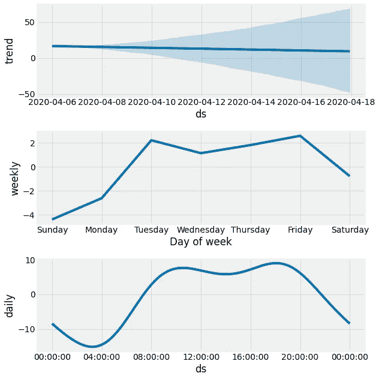

**定义误差指标**

```
def mean_absolute_percentage_error(y_true, y_pred):
    y_true, y_pred = np.array(y_true), np.array(y_pred)
    return np.mean(np.abs((y_true - y_pred) / y_true)) * 100MSE = mean_squared_error(y_true=data_test['y'],
y_pred=data_test_fcst['yhat'])MAE = mean_absolute_error(y_true=data_test['y'],
y_pred=data_test_fcst['yhat'])MAPE = mean_absolute_percentage_error(y_true=data_test['y'],
y_pred=data_test_fcst['yhat'])print ('MSE :',MSE)
print ('MAE :',MAE)
print ('MAEP', MAPE, '%')
```

平均误差:169.3955
平均误差:9.9056
MAEP: 167.5118%

```
ax = data_test_fcst.set_index('ds')['yhat'].plot(figsize=(15, 5), lw=0, style='.')
data_test['y'].plot(ax=ax, style='x', lw=3, alpha=0.1)plt.legend(['Forecast','Actual'])
plt.title('Forecast vs Actuals')plt.show()
```

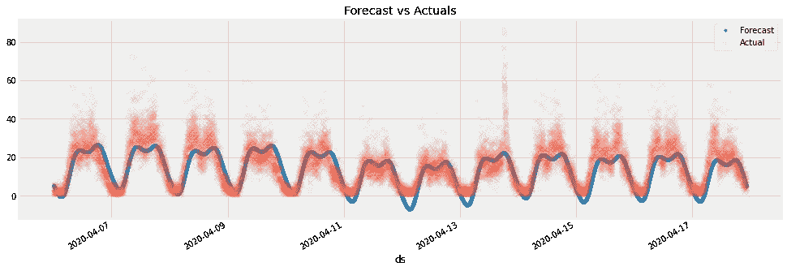

正如你所看到的，167%的 MAPE 是完全不能接受的，我们必须尝试其他季节。请记住，要将数据更改为新的季节，您必须更改“time eason”变量(即:timeseason = ' 1min ')。其他 5 个的结果如下所示。

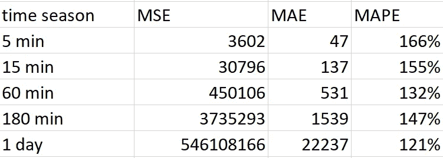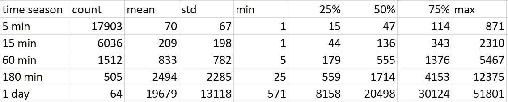

我们得到了 1440 分钟时间(1 天)的更好的结果，是 121%，我们知道这仍然是不可接受的。因此，让我们为此清理数据。

# **季节性 1 天的清洁数据**

清除突出显示的坏数据(在图中用红点表示)

```
ax = data_train.plot(style='.', figsize=(15,5), color=['#6387c2'],
title='French tweets dataset with bad data highlighted',
xlim=('03-9-2020','04-6-2020')
)data_train.query('y > 40000').plot(style='.', figsize=(15,5), color=['#eb6b26'], ax=ax)ax.legend().set_visible(False)
plt.show()
```

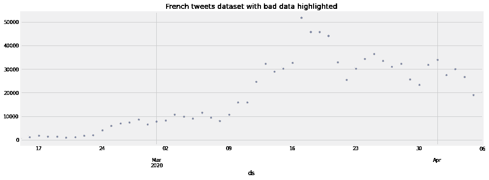

我们想要创建新的训练数据，所以我们暂时更改数据索引名称:

```
data_train = data_train.rename(columns = {'y':'freq'})data_train.index.name = 'Datetime'data_train.head()
```

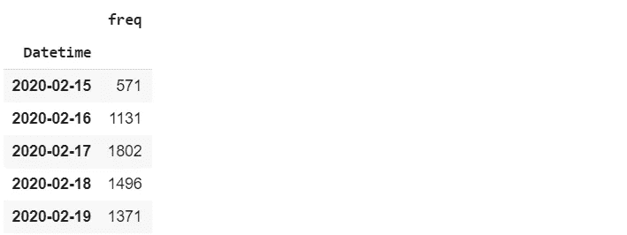

```
# Clean Data on freqimport numpy as npdata_train['data_clean'] = data_train['freq']data_train.loc[data_train['freq'] > 30000, 'data_clean'] = np.nan# Train model on clean datamodel = Prophet()model.fit(data_train.reset_index() \.rename(columns={'Datetime':'ds','data_clean':'y'}))# Predict on training set with clean modeldata_test_fcst_clean = model.predict(df=data_test.reset_index() \.rename(columns={'Datetime':'ds'}))
```

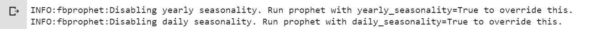

**定义已清理数据的错误指标**

```
mse_clean = mean_squared_error(y_true=data_test['y'],
y_pred=data_test_fcst_clean['yhat']
)mae_clean = mean_absolute_error(y_true=data_test['y'],
y_pred=data_test_fcst_clean['yhat']
)mape_clean = mean_absolute_percentage_error(y_true=data_test['y'],
y_pred=data_test_fcst_clean['yhat'])print(f'Cleaned data model has MSE {mse_clean:0.4f} - MAE {mae_clean:0.4f} - MAPE {mape_clean:0.4f}')
```

MSE:156554655.1105
MAE:10975.0188
MAEP:63.7044%

我们通过清理“1 天”时间序列实现了 63%。结果比未清洗的好 58%,但仍不可接受。清理数据对所有季节的影响并不相同。正如您在下图中看到的，清洁后的某些季节性结果甚至比清洁前的结果更差。

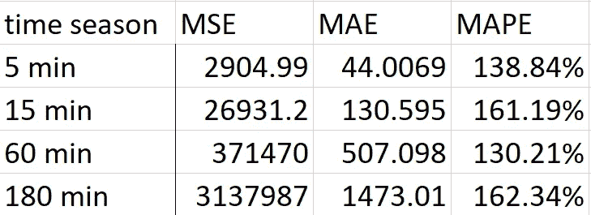

# 萨里玛造型:

**导入库:**

```
import warnings
import itertools
import numpy as np
from sklearn.metrics import mean_squared_error, mean_absolute_error
import matplotlib.pyplot as plt
warnings.filterwarnings("ignore")
plt.style.use('fivethirtyeight')
import pandas as pd
import statsmodels.api as smimport matplotlib
matplotlib.rcParams['axes.labelsize'] = 14
matplotlib.rcParams['xtick.labelsize'] = 12
matplotlib.rcParams['ytick.labelsize'] = 12
matplotlib.rcParams['text.color'] = 'G'
```

正如我们在上一节中得到的结果，1 天的季节性是最佳的。因此，我们将数据框定义为“1440 分钟”。CSV”。

```
df = pd.read_excel("1440min.xlsx")y.plot(figsize=(20,5))
plt.show()
```

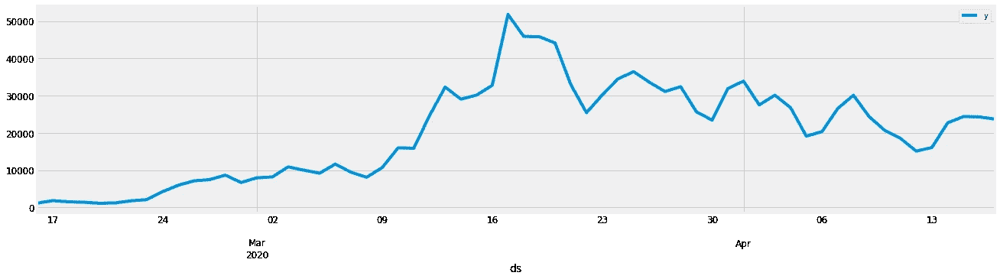

**使用 AIC(赤池信息标准):**

AIC 比较了一组统计模型的质量，AIC 值较低的模型给出了更好的结果。正如我们所说，SARIMA 有三个参数，分别代表季节性、趋势和数据中的噪声。

因此，我们将检查可能的季节性订单，并获得最低的 AIC 值。

```
p = d = q = range(0, 2)pdq = list(itertools.product(p, d, q))seasonal_pdq = [(x[0], x[1], x[2], 12) for x in list(itertools.product(p, d, q))]for param in pdq:for param_seasonal in seasonal_pdq:model = sm.tsa.statespace.SARIMAX(y,order=param,seasonal_order=param_seasonal,enforce_stationarity=False,enforce_invertibility=False)results = model.fit()
```

…
ARIMA(1，1，1)x(0，1，1，12)12—AIC:717.3527391232792
ARIMA(1，1，1)x(1，0，0，12)12—AIC:961.0509395792214
ARIMA(1，1，1)x(1，0，1，12)12—AIC:939.8989814

根据结果，718.9785 是 ARIMA 模型的最优 AIC 值，那么我们将我们的季节顺序设置为(1，1，1)x(1，1，1，12):

```
model = sm.tsa.statespace.SARIMAX(y,order=(0, 1, 1),seasonal_order=(1, 1, 1, 12),enforce_stationarity=False,enforce_invertibility=False)results = mod.fit()print(results.summary().tables[1])
```

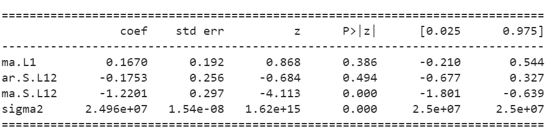

现在通过回归诊断图，您可以看到回归模型拟合数据的花费:

```
results.plot_diagnostics(figsize=(18, 8))plt.show()
```

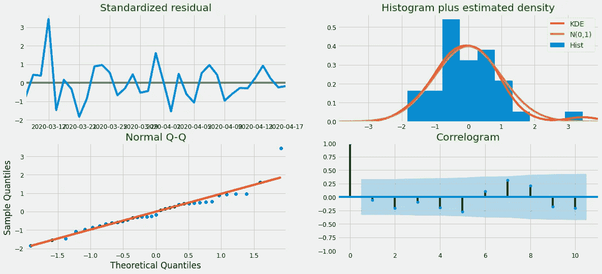

在测试集上将实际数据(y)与预测进行比较:

```
pred = results.get_prediction(start=pd.to_datetime('2020-3-31'), dynamic=True)pred_ci = pred.conf_int()ax = y['2020':].plot(label='observed')pred.predicted_mean.plot(ax=ax, label='Forecast', alpha=.7, figsize=(14, 4))ax.fill_between(pred_ci.index,pred_ci.iloc[:, 0],pred_ci.iloc[:, 1], color='K', alpha=.2)ax.set_xlabel('Date')ax.set_ylabel('Tweets volume per 1 day')plt.legend()plt.show()
```

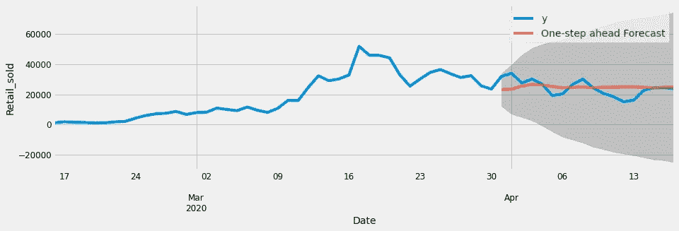

**定义误差指标**

```
def mean_absolute_percentage_error(y_true, y_pred):y_true, y_pred = np.array(y_true), np.array(y_pred)return np.mean(np.abs((y_true - y_pred) / y_true)) * 100 MSE = mean_squared_error(y_true=y['2020-3-31':],y_pred=pred.predicted_mean)MAE = mean_absolute_error(y_true=y['2020-3-31':],y_pred=pred.predicted_mean)MAPE = mean_absolute_percentage_error(y_true=y['2020-3-31':],y_pred=pred.predicted_mean)print ('MSE :',MSE)print ('MAE :',MAE)print ('MAEP', MAPE, '%')y_pred = pred.predicted_mean ;y_true = y['2020-3-31':]
```

MSE:28827140.1939
MAE:4145.2211
MAEP:19.6832%

恭喜，我们得到了 19.68 %的平均绝对误差百分比，这是可以接受的，这是约 44%低于先知的最好结果，由清洗数据。

**它对我们的基本面分析有帮助吗？**

答案是否定的，如果你看看时间线，你会发现在 3 月 16 日，频率已经跃升。原因是法国政府已经宣布全面隔离，但我们简单的 SARIMA 模型无法预测这种类型的时间序列数据变化。可以帮助我们的是使用 NLP N-gram 模型(未来的工作)。

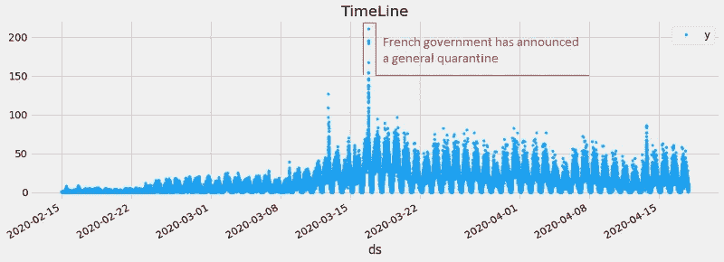

**预测未来两周:**

```
pred_uc = results.get_forecast(steps=14)pred_ci = pred_uc.conf_int()ax = y.plot(label='observed', figsize=(14, 4))pred_uc.predicted_mean.plot(ax=ax, label='Forecast')ax.fill_between(pred_ci.index,pred_ci.iloc[:, 0],pred_ci.iloc[:, 1], color='k', alpha=.25)ax.set_xlabel('Date')ax.set_ylabel('Sales')plt.legend()plt.show()
```

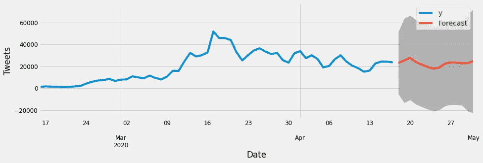

# **结论:**

我们想回答“twitter 数据上时间序列预测的最佳季节性是什么？”首先，在使用 FB-prophet 时，假设更多的数据给我们更好的结果，我们选择 1 分钟的季节性，然后发现最佳的时间序列是 1 天。我们通过删除坏的亮点来清理数据，并在 1 天序列中获得更好的结果，并且理解这不会对其他季节产生相同的影响。然后，我们尝试通过使用 AIC 选择最佳订单来创建一个 SARIMA 模型，并获得 19%的 MAPE，这是一个可接受的结果。

**未来作品:**

尝试其他清洁方法

使用 XG-boost 最小化 MAPE

使用 N-gram 模型预测文本内容基本时间序列

# **参考文献:**

[1] C.McClellan，M.Ali，R.Mutter，L.Kroutil，J.Landwehr，[使用社交媒体监控心理健康讨论——来自 Twitter 的证据](https://academic.oup.com/jamia/article/24/3/496/2907899) (2017)，美国医学信息学协会杂志

[2] S.Prabhakaran *，*[machinelearningplus.com ARIMA 模型 Python 中时间序列预测完全指南](https://www.machinelearningplus.com/time-series/arima-model-time-series-forecasting-python/)

[3] R.Larrosa，[如何使用萨里玛模型使用 Python 预测销售额【towardsdatascience.com (2019)](/how-to-forecast-sales-with-python-using-sarima-model-ba600992fa7d)

[4] R.Mulla，[利用脸书的预言家进行逐时时间序列预测](https://www.kaggle.com/robikscube/time-series-forecasting-with-prophet) (2020)，kaggle.com