# 用神经网络预测能源需求

> 原文：<https://towardsdatascience.com/forecasting-energy-consumption-using-neural-networks-xgboost-2032b6e6f7e2?source=collection_archive---------5----------------------->

## 变革的数据

## 我们如何通过使用 XGBoost 的广泛文献综述、特征工程和特征选择，赢得了一个简单神经网络的数据

*作者:* [*蔡美儿*](https://www.linkedin.com/in/chiahsoon/)*[*【李】*](https://www.linkedin.com/in/zhaochen-li-9409961a7/)*[*林敏【Htoo】*](https://www.linkedin.com/in/minhtoo/)*[*奎月咏家*](https://www.linkedin.com/in/jia-yong-quah-834088164/) *，所有*[*NTU*](https://www.ntu.edu.sg/Pages/home.aspx)*新加坡留学生。****

**本文总结了我们用来赢得由新加坡南洋理工大学& ai4impact 联合举办的[深度学习数据大会](https://ai4impact.org/challenges.html#schneider_electric)的方法。如有任何疑问，请通过 [LinkedIn](https://www.linkedin.com/in/minhtoo/) 联系我们。**

**这是我们文章的大纲:**

*   **介绍**
*   **目标和成功的衡量标准**
*   **探索性数据分析**
*   **数据清理**
*   **研究方法**
*   **将一维时间转换为二维时间**
*   **开窗术**
*   **XGBoost SHAP 要素重要性值**
*   **结果和讨论:特点**
*   **结果和讨论:模型**
*   **我们模型的优点和缺点**
*   **关于可解释机器学习的一个注记**
*   **结论**

# **介绍**

**将电能消耗与正确的供应水平相匹配是至关重要的，因为过量供应的电力无法储存，除非转换为其他形式，这会导致额外的成本和资源。与此同时，低估能源消耗可能是致命的，过度需求会使供应线超载，甚至导致停电。显然，密切监控建筑物的能源消耗会带来实实在在的好处——无论是办公室、商业还是家庭。**

**随着机器学习的出现，准确预测未来的能源消耗变得越来越可能。准确的预测提供了双重好处:首先，管理人员获得了对影响其建筑能源需求的因素的关键见解，提供了解决这些问题和提高能源效率的机会。其次，预测提供了一个基准，以挑出异常高/低的能耗，并提醒管理人员建筑物内的故障。**

**然而，困难在于实时能量使用的非线性和波动性，其极易受外部因素变化的影响。例如，众所周知，环境温度会通过供暖和空调显著影响建筑物的能源需求[1]。此外，由于设备故障、电源故障或难以解释的简单随机波动，可能会出现能源消耗的意外激增和下降。**

# **目标和成功的衡量标准**

**我们的任务是根据从 2014 年 7 月到 2016 年 5 月每隔 15 分钟提供的 2 年历史能源需求数据，提前 1 天预测建筑物的能源消耗。此外，我们还获得了距离建筑物不同(未披露)距离的 4 个位置的温度数据，顺序为 wx1(最近)、wx2、wx3 和 wx4(最远)。我们使用了一个简单的人工神经网络(ANN，又名多层感知器),因为它能够捕捉不同数字数据之间复杂的非线性关系，与长短期记忆网络(LSTMs)等更复杂的架构相比，它的构建和训练速度相对较快。**

**我们使用两个指标来评估我们的模型:均方误差(MSE)和滞后。均方误差衡量误差平方的平均值:**

****

**因此，我们使用 MSE 损失来优化我们的人工神经网络。MSE 的优势在于，由于它的平方性质，它惩罚了较大的误差，降低了我们的模型做出极端预测的可能性，这种预测将是昂贵的，甚至是危险的。最低限度，我们的模型必须实现比持久性更低的 MSE，持久性是一个微不足道的基准预测，其中“提前 1 天预测的未来值=观察到的现值”。由于能量消耗的高度周期性，持久性是一个很好的起点[2]。**

**至于滞后，我们的目标是我们的预测和实际能耗值之间的峰值滞后为 0，平均而言，我们的模型在预测中不会延迟，并且可以及时捕捉能耗的变化。**

**我们解决这个问题的工作流程包括:**

1.  **广泛的文献综述、数据可视化和分析**
2.  **Python 中的预处理、数据清理和要素工程**
3.  **将数据导出到 AutoCaffe 以训练和评估神经网络。**

**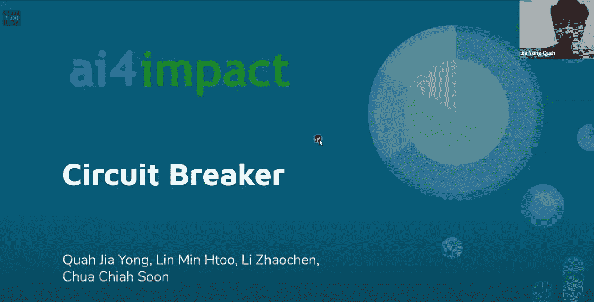**

**我们方法的视频摘要可在:[https://www.youtube.com/watch?v=dTUU9urBUoE](https://www.youtube.com/watch?v=dTUU9urBUoE)获得**

# **探索性数据分析**

**由于给定的数据集是用最小上下文匿名的，我们首先仔细检查它以获得有效特征工程的全面直觉。可以说，这是任何机器学习项目中最重要的一步，作为“垃圾进，垃圾出”的坚定信徒，我们在这上面花了将近整整一周的时间。我们发现能量和温度数据都包含大量的缺失值，因此需要一种有效的方法来填充这些值。进一步说，wx4 的数据非常稀疏(只包含 2016 年的数据)，所以我们不太可能利用它。**

**首先，我们绘制了 2015 年的能源数据，这是数据最完整的一年，不同于 2014 年和 2016 年。月平均值被叠加，以提供跨月趋势的更清晰概览。**

****

**图 1:2015 年能源消耗(红色)和温度(蓝色)的时间序列。使用 Wx3 是因为它与能耗数据的相关性最高。**

**如图所示，建筑物周围的温度范围从零下到 30 摄氏度；鉴于 12 月至 2 月为寒冷月份，6 月至 8 月为温暖月份，该建筑应来自纬度> 30°的北半球。有趣的是，能源消耗存在两个局部最大值，出现在温度的两个尾端:一次在最冷的月份，另一次在最热的月份(7 月)，这表明空调和供暖是能源需求的重要驱动因素。在这一年中，我们发现了 3 种不同的能源温度体系:**

****冬季，12 月至 2 月:**能量波动频繁且较大，平均消耗相对较大。气温一般在 10℃以下。**

****夏季:6 月至 8 月**:与冬季相比，频繁但较小的能量变化，随着温度稳步增加。温度一般在 20℃以上。**

****过渡期:3 月至 5 月&9 月至 11 月:**相对恒定稳定的能源消耗。温度范围从 10 到 20 摄氏度。**

**该分析启发了两个虚拟变量(值 1 代表真或 0 代表假):1)is _ season _ winter & 2)is _ season _ transition，以促进神经网络的更好学习。请注意，每当 is_winter 和 is_summer 列都为 0 (False)时，is_summer 列的值将为 1(True)；因此，我们删除了 is_summer 列，以避免虚拟变量陷阱[3]，其中一个变量可以从一个或多个其他变量直接推断出来，从而导致多重共线性问题。**

**接下来，我们绘制了整个时间段的能源消耗时间序列。**

****

**图 2:能源消耗的年度趋势。从 2014 年 7 月到 2014 年 10 月异常低的能耗值引人注目**

**我们意识到 2014 年 7 月至 10 月的能耗异常低。可能有各种各样的原因:建筑物可能是新建的，正在缓慢加速运行(因此不是满负荷)或正在进行维护。虽然通常不鼓励丢弃数据，但我们决定在这里这样做，因为异常数据显然会对我们依赖历史数据进行预测的模型造成更大的伤害。因此，我们的能源数据从 2014 年 10 月 29 日开始。通过 70/30 的训练/测试分割，我们的测试数据从 2015 年 12 月 7 日开始，训练集涵盖了全年的数据，这足以将我们的模型暴露给全年的所有季节。**

**然后我们将一周中不同日子的能量消耗可视化。我们计算了全年一周中每一天的平均、最高和最低消费，首先不包括公共假日。**

****

**图 3:2015 年每周每天的平均、最大和最小能耗值。请注意周末的能耗是如何降低的。**

**我们观察到，周末的能耗明显较低，这意味着该建筑可能是一座办公楼——工作日繁忙，周末空置，而不是购物中心或图书馆。为了利用这种模式，我们创建了一个虚拟变量，名为 is_weekend，用于判断预测的日期是否是周末。**

**接下来，我们绘制了每个月的能源消耗分布图，分为工作日、周末和公共假日。**

**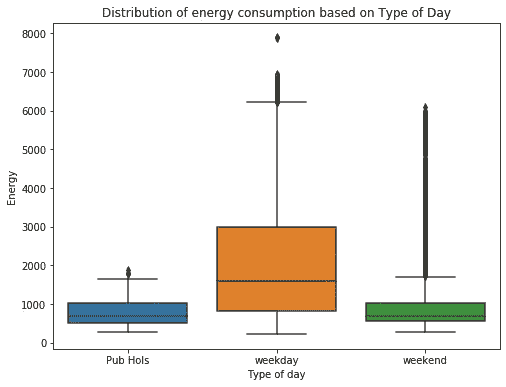**

**图 4:不同月份基于一天类型的能源消耗分布。这为我们提供了特征工程和填充缺失数据的定制方法的思路。**

**首先，工作日的能源消耗明显高于周末和一般公共假日。第二，虽然周末有大量异常高的能源需求，但周末和公共假日的能源消耗的总体分布非常相似。这意味着我们应该将前一个周末/公共假日(以较接近者为准)的能源消耗插入一个工作日公共假日。**

**接下来，我们仔细研究了日常消费模式。**

**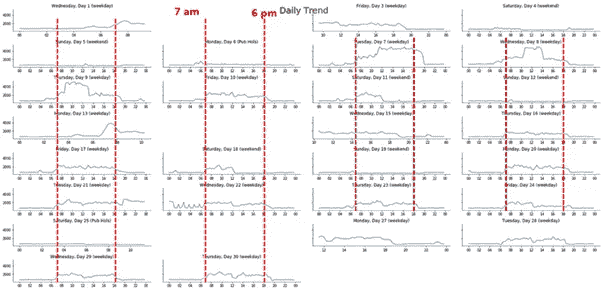**

**图 5:7 月份的日常能源消耗。**

**一般来说，在工作日，能源消耗在早上 7 点急剧上升，在下午 6 点之后急剧下降，这很可能是该建筑的标准工作时间。请注意，由于缺少值，一些图看起来形状奇怪，这进一步说明了填补这些空白的必要性。放大到特定的一天，我们发现，平均来说，在下午 12 点左右，能源消耗有明显的下降，我们将这归因于办公室午餐时间。**

****

**图 6:对每日趋势的进一步分析表明，通常在中午 12 点出现局部能量消耗最小值，我们将其归因于午餐时间。**

**因此，我们决定引入虚拟变量:is _ 午餐时间(当非公共假日工作日的时间= 12 时)和 is _ 工作时间(非公共假日工作日的上午 7 点到下午 6 点)。**

**接下来，我们绘制了能源消耗的自相关图，以识别由统计分析支持的循环模式，而不是“瞎猜”。**

**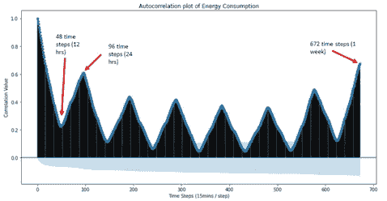**

**图 7:672 个时间步长(1 周)的能耗自相关图。请注意，峰值出现的时间间隔为 96 (24 小时)。**

****

**图 8 2880 个时间步长(1 个月)的能耗自相关图。请注意，672 时间步长比 96 时间步长具有更强的自相关系数。**

**由于数据是以 15 分钟为间隔给出的，因此相隔 24 小时对应于 96 个时间步长，12 小时对应于 48 个时间步长，依此类推。每天某个特定时间的能量消耗与前一天的同一时间最密切相关。这种关系随着天数的增加而减弱，但在 672 个时间步长或相隔 1 周时再次达到峰值，这实际上比相隔 1 天具有更强的相关性。另一方面，自相关在相隔 12 小时时最弱。这向我们暗示了强预测特征可以包括 T:-576(从当前时间起 6 天前，但是从被预测的时间起 1 周前)，T:0(从被预测的时间起 1 天前)和 T:-96(从被预测的时间起 2 天前)。**

**接下来，我们深入研究了能源需求和温度之间的关系，并受 Valor 等人 2001 年[1]的启发，尝试拟合多项式趋势。**

****

**图 9:从散点图可以看出，能耗和温度之间的关系是非线性的。**

**虽然最佳拟合线显然不是理想的，但散点图仍然揭示了有用的见解。在温度的末端(太热或太冷)，能源消耗往往会上升，很可能是由于空调或供暖分别增加。此外，这种关系不太可能是纯线性的，显示出在大约 19°c 的温度下“最舒适”的二次曲线。为了进一步探索这一点，我们使用 Python Seaborn 库制作了一个关联热图，将数据分为冬季、夏季和过渡月份。**

**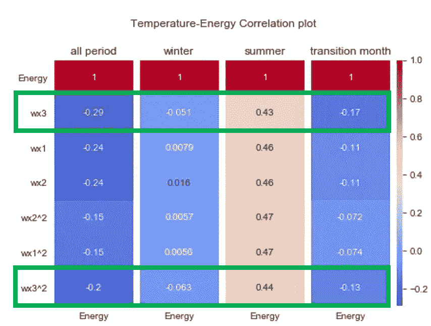**

**图 10:温度和温度平方与能耗的相关热图**

**首先，我们观察到 wx3 在所有时期(0.29 比 0.24)、冬季(0.051 比 0.0079 & 0.016)和过渡月份(0.17 比 0.11)具有明显更高的绝对相关值。夏季略低于 wx1 和 wx2(0.43 vs 0.46)。这也通过对 XGBoost 中特征重要性值的初步研究得到了证实，该研究始终将 wx3 排在 T+96，高于 wx1 或 wx2。因此，我们着重于为 wx3 以外的温度创建窗口特征。**

**接下来，在夏季(对于所有 3 种温度)和冬季(对于 wx3)，二次关系似乎略微优于具有更高绝对相关值的线性关系。因此，除了原始能量值之外，T+96(预测时间)时 wx3 的平方值可能是一个值得考虑的有用特性。**

**最后，在冬季，原始温度和平方温度与能量的相关性都很差。一个原因可能是，在冬天，建筑物的供暖系统可能会无限期地保持在一个固定的水平，而不管温度的大幅波动。**

# **数据清理**

**我们用 Python 而不是 AutoCaffe 进行数据预处理，因为我们的团队比 Smojo 更精通 Python 库，并且我们想要更多的控制来创建特定的功能，如虚拟变量。预处理管道的大致轮廓包括将温度数据与 15 分钟间隔对齐、插值和归一化。**

**从 2014 年 10 月 29 日 00:00:00 到 2016 年 5 月 26 日 20:15:00，大约 17%的能源数据集丢失。我们首先尝试线性插值，但我们意识到这会导致数据泄漏，因为计算平均值涉及未来的数据(在丢失时间戳之后)。我们还注意到，缺失值通常出现在长达两天的整个时间段内，在这种情况下，由于温度和工作时间等因素，线性插值无法捕捉能源需求的内在季节性。然后我们尝试简单的向前填充，用正好 24 小时前的数据替换丢失的数据。然而，这并没有很好地反映每周的趋势，因为工作日和周末/公共假日之间存在差异。**

**因此，我们实现了一种定制的填充方法，考虑了一天的类型(公共假日/周末/工作日)。如果缺失值日不是公共假日，缺失值将被恰好一周前的值替换(假设这也没有缺失！幸运的是在这个数据集中没有发生)。否则，如果缺少的值日是公共假日，它将被最接近的前一个周末值替换。**

**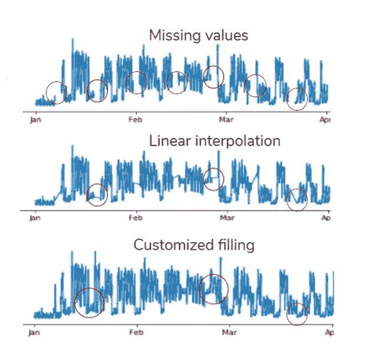******

**图 11:上图:比较线性插值和我们自己定制的数据填充方法。下图:填充能量数据的放大示例。**

**这种方法更准确地反映了季节性，与更复杂的方法相比，相对容易实施。我们确实考虑了两个改进:**

1.  **不是精确地复制，而是通过将那天的所有能量值乘以一个小的随机因子，比如 0.8 到 1.2 之间的因子，将一个随机的“抖动”添加到被提出的值中。只要为随机因子选择了合适的范围，这种方法就减少了我们的模型过度拟合历史数据的机会。这种随机抖动只会应用于训练数据集，而不会应用于测试集。然而，由于我们没有面临大规模的过度拟合问题，我们没有实施这一想法。**
2.  **拟合神经网络或时间序列预测算法，该算法也考虑温度数据来估算缺失值，因为它可能会给出更真实的结果。然而，考虑到比赛的时间限制，我们认为这使任务过于复杂。**

**至于温度，我们从天气预报中得到了未来 24 小时的数据。我们选择线性插值，因为数据间隙持续不到一小时，所以它仍然可以很好地捕捉趋势(图 12)。其次，由于我们得到了未来的数据，数据泄露不是问题。没有对 wx4 进行插值，因为它太稀疏。**

**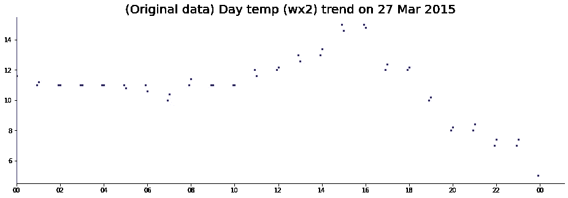****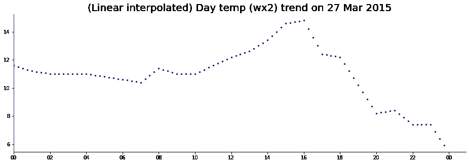**

**图 12:上图:线性插值前的温度数据。下图:线性插值后。对于温度，由于数据间隙稀疏，我们可以使用线性插值来产生合理的结果**

**我们使用“最小最大比例”将所有能量和温度数据归一化到范围[0，1]。所有特征输入的这种标准化对于神经网络来说是至关重要的，以确保特征重要性的任何差异仅仅是由于特征本身而不是其数值大小。我们还注意从训练数据中提取最小/最大值，以防止测试集中的数据泄露。**

****

# **将一维时间转换为二维时间**

**在我们的文献综述中，我们发现了一种创造性的时间数据操作方法:Moon 等人 2019 [2]将日历时间转换为 2d 连续格式。虽然像月和日这样的日历数据具有周期性属性，但是用顺序数据表示它们会失去一些周期性。例如，0000 小时紧跟在 2359 小时之后，但从数字上看，它们相距甚远。因此，Moon 等人[2]利用了以下等式(EoM =月末，即该月的天数):**

**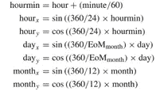****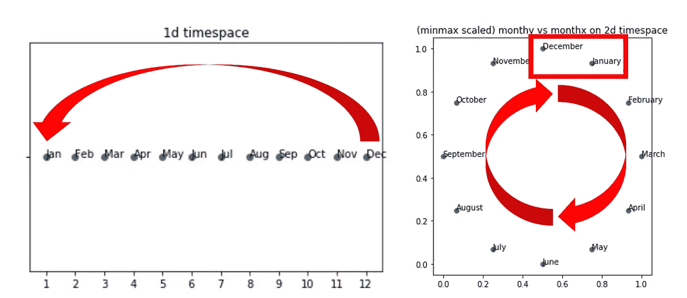**

**图 13:上图:将 1d 时间转换为 2d 时间的方程式。左图:时间的一维顺序表示。请注意，尽管 12 月(第 12 个月)在 1 月(第 1 个月)之后，但数值差距 11 并不反映这种周期性。右图:时间的二维变换。注意它是如何恢复月份的周期性的，十二月正好是一月的邻居。**

****

**当我们使用 2d 时间时，我们的测试损耗性能至少提高了 2.5%到 4%。**

**我们想要探索的另一个有趣的特征是 Valor 等人 2001 年提出的“公共假日/周末惯性”。他们发现，由于非工作日经济活动减少造成的惯性，在周末(即周一)或公共假期后的工作日，办公楼的能源消耗系统地较低。利用这一点的特征可以是“自上次公共假期以来的天数”和“自上周末以来的天数”。然而，仔细分析我们的数据表明，这种“惯性”效应并不存在，我们没有进一步研究。**

# **研究方法**

**我们生成最佳可能模型的方法包括在 AutoCaffe 中训练模型，并根据测试分数和达到的延迟逐一添加特性。然而，虽然 AutoCaffe 允许快速训练，但有一个限制是我们不能“自动”排列特征，必须手动进行。为了最大限度地减少重复排列特征所花费的时间，我们依靠数据分析、领域知识、广泛的特征工程和 XGboost SHAP 特征重要性值来减少要检查的特征组合。**

**一个很大的假设是，功能是相互独立的，只有最小的功能交互。考虑到这种假设不太可能总是成立，我们还根据我们的直觉和从阅读科学文献中获得的领域知识，运行了某些功能组合。我们还小心翼翼地进行了充分的重复，以减少由于随机重量初始化导致的最终测试损失的差异。**

# **开窗术**

**为了进行初步调查，我们准备了一个 *Pandas* dataframe，其中包含能量、温度(wx1 到 wx3)、日期时间特征(如月、日)和窗口特征(如最小值、最大值、平均值、范围、一阶差、一阶差的平均值、二阶差等)的原始值。**

**良好的窗口对于帮助我们的人工神经网络更好地对数据进行聚类至关重要。我们选择窗户是基于我们对能源消耗循环模式的理解:**

1.  **1 小时的小窗口(例如 T:0:-4 平均值)捕捉最近的能量波动**
2.  **稍大的 5 小时窗口，用于捕捉全天的较大变化**
3.  **更大的 12 小时窗口，用于捕捉昼夜循环模式**
4.  **1 天到 1 周的最大窗口，用于捕捉季节转换**

**我们没有使用大于 1 周的窗口，因为根据自相关图，我们认为过去太远的值可能只是噪声，更不用说给我们的输入增加额外的维度。**

**利用能量和 wx3 温度的窗口特征、虚拟变量和 2d 时间特征，我们在 AutoCaffe 上进行初步实验，以消除无用的特征，我们发现这些特征是“范围”、“偏斜”和“峰度”。我们希望“偏斜”和“峰度”可以向我们的模型发出信号，表明最近出现了极端值(例如，在正常温度背景下，短时间内突然出现高于正常温度的热浪)，这可能会增加模型预测意外事件的稳健性。不幸的是，尽管反复实验，这些特性并没有改善我们的测试损失和滞后。关于 wx4，我们尽了最大努力来利用它，例如通过计算所有 4 个传感器的“上个月的平均温度”,但不幸的是，这些功能并没有改善我们的结果。**

**经过大约 150 次实验，我们生成了一个大约 130 个特征的精炼列表。**

# **要素选择:使用 XGBoost SHAP 要素重要性值**

**在这个阶段，为了给我们的特征选择过程提供严格的理由，我们使用了 Python XGBoost 库，这是一个快速且用户友好的梯度增强决策树算法实现。我们选择决策树是因为它们比神经网络更擅长处理高维数据集(> 100 列特征)，而神经网络由于维数灾难和不重要的输入更容易绘制出糟糕的决策边界。**

**我们将约 130 个特征输入到 XGBoost 回归模型中，以预测 T:0 和 T+96 能量值之间的差异(模拟 AutoCaffe 中的“差异”神经网络)。有趣的是，这个具有以下相当标准的超参数的模型实现了 0.010853 的测试 MSE(在因子 0.5 之后)，这已经击败了 0.019377 的持久性 44%，尽管我们没有可视化其滞后相关性或散点图。**

****

**使用 Python SHAP 库[4，5]，我们可以很容易地可视化各种特性对 XGBoost 模型输出的贡献。选择 SHAP 是因为其跨模型的一致性和准确性，这是许多重要机制所缺乏的[6]，包括 XGBoost/scikit-learn 的内置版本。我们根据 SHAP 值(越高=越重要)对大约 130 个顶级功能进行了排名，并在 AutoCaffe 上进行的另一轮实验中重点关注了这些顶级功能的置换。这些顶级特征很可能有助于更好地对数据进行聚类，这些数据应该可以转移到神经网络。当然，我们知道梯度增强树和神经网络的算法存在固有的差异；SHAP 要素重要性值并不是全部，我们偶尔也会包括其他要素。**

**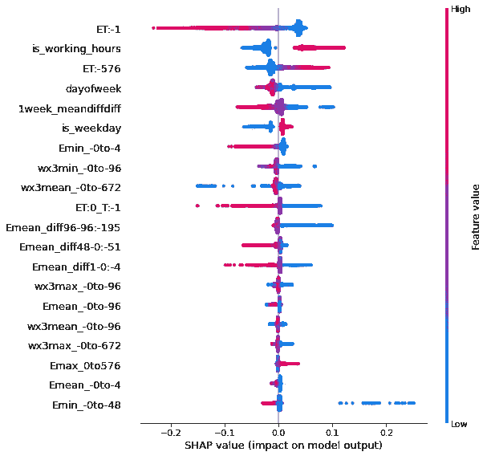**

**图 14:对于输入到标准 XGBoost 回归器中的大约 130 个特性，按 SHAP 值排序的顶级特性(顶级特性=最重要)。请注意，对于 wx3，T:0 实际上是指预测的时间(从 T:0 开始 24 小时后的能量),因为我们可以访问温度预测数据。请继续阅读我们的语法的简要解释。**

**为了阐明我们的语法，Emean _ diff 96–96:-195 是以下各项的平均值(为了减少噪声):1) E:-96 减去 E:-192 2) E:-97 减去 E:-193 … 4) E:-99 减去 E:-195。同样，Emean _ diff 48–0:-51 是以下各项的平均值:1) E:0 减去 E:-48 2) E:-1 减去 E:-49 … 4) E:-3 减去 E:-51。**

**对于 1week_meandiffdiff:我们首先计算七个一阶微分 Emean _ diff 96–0:-99，Emean _ diff 96–96:-195，…Emean _ diff 96–576:-675。然后，我们计算这些值之间的连续差(以获得六个二阶微分),并取其平均值以获得单个值 1week_meandiffdiff。我们可以平等地使用六个二阶微分，而不取平均值，但是我们希望最小化特征的数量，并且不希望引入太多“不重要的输入”。**

# **结果和讨论:特点**

**我们最好的神经网络实现了 0.00907207 的测试损失(50 次重复)和 0 的测试滞后，以 53%的优势击败了我们的持久性 0.01937720。我们还计算了一个更现实的持久性基准，其中对下一个星期一/星期六的预测来自上一个星期一/星期六，而不是 24 小时前，因为周末和工作日的能源需求有很大不同。尽管如此，我们的测试损失以 44%的优势击败了这种“聪明”的持久性 0.0163。**

**我们用于差分网络的 36 个特征是(其中许多来自图 14)**

1.  ****时间特征****

*   **二维时间:小时，小时，日，日，月，月**
*   **一周中的某一天(0 =星期一，6 =星期日，按最小最大值缩放至[0，1])**

**3.**虚拟变量:(受我们数据分析的启发)****

*   **是 _ 公共场所，是 _ 工作日，是 _ 工作时间，是 _ 季节转换，是 _ 季节 _ 冬季，是 _ 午餐时间**
*   **请注意，我们删除了 is_weekend & is_season_summer，以避免多重共线性问题，即在同一行中，数据中一列的值可以从其他列的值中推断出来**

**4.**能源特性:****

*   **T:-1 处的能量，T:0 和 T:-1 之间的一阶差，T:0 的最小值和平均值:-4，与 T:0 的一阶差的平均值:-4 **(1 小时窗口)****
*   **T:0 和 T:-20 之间的一阶差 **(5 小时窗口)****
*   **T:0 的最小值:-48，T:0 和 T 之间的一阶差:-48 **(12 小时窗口)****
*   **T 的平均值:0:-96 **(1 天窗口)****
*   **T:-96 和 T:-192 之间的一阶差 **(1 天窗口)****
*   **T 时的能量:-576，T 的最大值:0:-576 **(从 T+96 开始的一周时间)****

**5.**温度特性:****

*   **T+96 时的 Wx3，T+96 的 Max & Min:+92，T:+96 & T+95 之间的一阶差 **(1 小时窗口)****
*   **T+96:0 的最小值、最大值和平均值 **(1 天窗口)****
*   **T+96 的平均值和最大值:-576 **(1 周窗口)****

**6.**非线性特征****

*   **T+96 时 wx3 的平方**
*   **T:0 时的能量与 T+96 时的 wx3 的乘积**

**在看到使用 T+96 处 wx3 的平方的改进之后，我们试验了各种其他非线性特征，T+96 处 wx3 的立方、ln(Kelvins 中 T+96 处 wx3)、T+96 处 wx3 的平方根等。T:0 时的能量与 T+96 时的 wx3 之积的概念是对二次多项式(a+b) = a + b + 2ab 的自然延伸**

# **结果和讨论:模型**

**我们的最佳模式:**

*   **一个简单的差分网络，预测 T+96 和 T:0 之间的能耗差异，将模型预测添加到 T:0 的能耗中**
*   **第一层中有 32 个感知器的 4 层，逐层收缩比为 2/3(即 32、21、14、9 个感知器)**
*   **丢弃概率为 0，tanh 激活，10，000 次迭代，提前停止& Adam 优化器**

**对于大多数实验，层数保持在 3 或 4，筛选第一层感知器计数为 32、64、128，偶尔为 256，ReLU 激活用于快速训练。我们很快发现，感知器计数为 32 到 64 给出了最好的结果，并且 tanh 激活实现了较好的测试损失，尽管代价是较慢的训练。为什么 tanh 似乎比 ReLU 给出更好的结果背后的直觉可能是其额外的非线性，这对于映射能量/温度数据中的复杂关系可能是至关重要的。tanh 还避免了 ReLU 面临的一些问题，如“死亡 ReLU ”,即负激活的神经元不太可能再次变为正激活。**

**2 层对于最佳学习是不够的，而 5 或 6 层很快就会过度适应。SGD 优化器的控制实验给出了令人沮丧的结果。使用方形感知器、自动编码器/缩放和力/动量损失的试验并没有改善我们的结果。尽管如此，我们认为仍有机会在更多列的窗口能量/wx3 值上利用自动编码器来降低维数，同时从历史数据中提取最有用的信息。**

**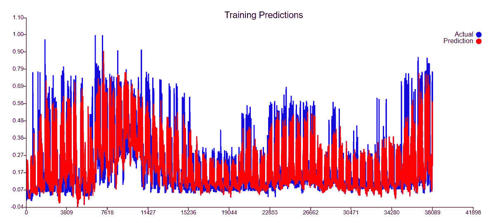****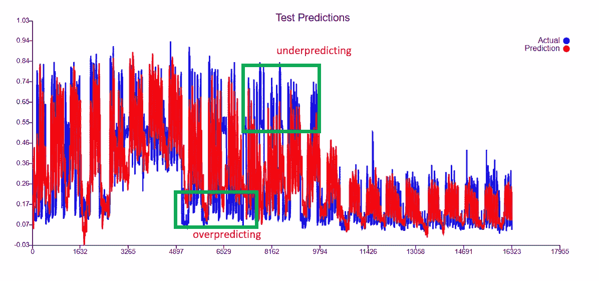****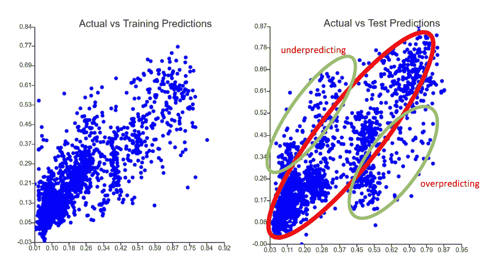****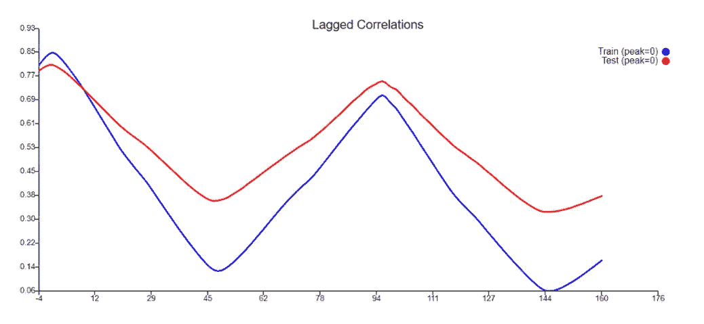**

**图 15:训练和测试预测、散点图和滞后相关值的图表**

# **我们模型的优点和缺点**

****优势:****

*   **T=0 时的主要滞后峰值和 T=+96 时的次要滞后峰值之间的舒适间隙。零延迟意味着我们的预测没有时间延迟，这为建筑管理人员提供了一个可靠、准时的“基准”来比较他们建筑的实际能耗，其中任何不和谐的差异都可能表明，例如，建筑的供暖/制冷系统中未被注意到的故障。**
*   **在初冬和春季的几个月里相当不错的预测。我们的模型能够很好地预测每周的趋势，预测工作日/白天的上升和周末/晚上的下降。**
*   **总的来说，在整个测试期间，最少不和谐的异常预测。**

****弱点:****

*   **在冬末至初春的过渡期，我们的模型很难预测极端的能耗值，如测试预测图上的绿色方框所示，测试散点图中的两个绿色椭圆也反映了这一点。也就是说，测试数据集中大约有 16000 个点，大多数点似乎接近预测和实际之间合理的 1:1 关系。异常似乎只占总点数的相对较小的百分比。**
*   **不幸的是，尽管我们尽了最大努力，我们还是无法进一步降低测试损失并解决这个问题。这一时期的特点是温度和能量消耗的大幅波动，这可能是造成我们模型困难的原因。**

**下面是预测与实际的放大图，再次强调了我们的模型在预测初冬和春季月份的季节模式方面的优势(绿框)，以及在预测 2016 年 2 月至 3 月期间的一些极值方面的不足(红框)。我们注意到，特别是在 12 月-1 月和 4 月-5 月，绿色方框显示了实际和预测图之间的良好拟合。**

****

**图 16a:绿框:良好的预测，橙框:我们的模型准确地预测了公共假日**

****

**图 16b:绿框:良好的预测，橙框:我们的模型准确地预测了公共假日**

****

**图 16c:红框:我们的模型没有正确预测峰值和谷值**

**仔细研究这些图表后，我们认为，也许我们的模型并不总是错的。对于我们的模型未能准确预测的峰值/谷值，它们完全有可能是异常值/意外的能量消耗行为。如果我们仔细重新检查图 16c 中的红框，这确实有一定的意义:第一个红框显示了一个周末持续的高能耗，这是不寻常的。此外，紧接着第二个盒子之后的第二个峰值落在星期六，又是一个周末。也许某些周末加班操作/工作是在冬末的几个月进行的，这不包括在我们的培训数据中。**

**也就是说，我们认识到，对于第二个红框，即从周三到周五的工作日，我们的模型确实未能匹配实际的峰值&预测不足。这需要进一步分析；也许在 wx3 温度和实际能量之间的相关性存在偏差。根据我们的研究，除温度之外的天气因素，如风速和湿度，会影响人类的“感觉”温度，从而影响加热/冷却的使用。因此，拥有更多数据可能有助于我们判断实际趋势是“可预测的”还是实际上是异常值。**

# **关于可解释机器学习的一个注记**

**SHAP 特征值是关于数据集中存在的多种关系的极其丰富的信息源。相比之下，深入研究神经网络的“黑箱”以理解权重和偏差如何讲述不同特征的故事会更加困难。毕竟，如果我们也能够深入了解某些特征如何塑造模型的输出，而不是盲目地寻找最低的测试损失，那么对能源预测社区来说，这将更加有益，因为最终的模型可能无法转移到不同的环境中。因此，我们特意在“差异”XGBoost 回归方程上再次显示 SHAP 特征重要性图表，该回归方程正好适合我们的最佳 36 个特征。**

**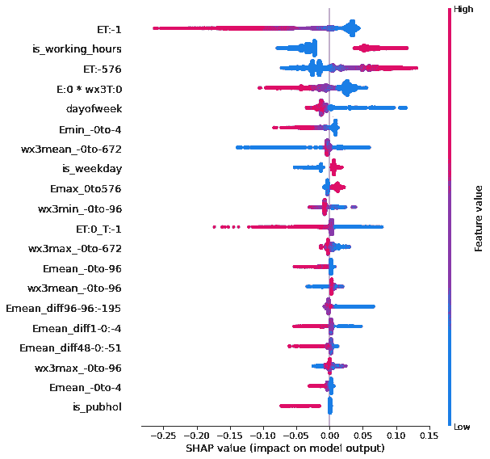**

**图 15:根据输入标准 XGBoost 回归器的最佳 36 个特性的 SHAP 值排列的顶级特性。请注意，特别是对于 wx3，T:0 是预测时间(从 T:0 开始 24 小时后的能量)的温度，因为我们可以访问温度预测数据。**

**对于工作时间来说，存在明显的分离是不足为奇的，在预测的时间内，高值(即=1)会增加能耗，而低值(即=0)会减少能耗。尽管如此，一系列预测的出现暗示了工作时间正在与其他特征相互作用。类似地，对于 dayofweek(周一= 0 到周日= 6 minmax 缩放到[0，1])，高值(周六和周日)往往会降低模型的输出，而低值则会增加输出。**

**更有趣的是，该图表明，1 天 15 分钟前(ET:-1)的高能量消耗值更有可能导致现在的能量消耗降低，反之亦然(尽管反之的幅度要低得多)。此外，对于 ET:-1 的高值，我们从-0.25 到~ 0.25 的模型输出方差中看到特征相互作用的暗示。此外，过去一周从 T+96(Emax _ 0 到 576)的高最大能耗往往会略微增加模型的输出，而低值的影响很小。至于温度，图表暗示移动周平均温度的低值(wx3 mean _-0 到-672)可以增加和减少模型的输出，而高值似乎没有影响。这些现象的原因尚不清楚，可以进行后续研究来进一步研究。话虽如此，我们必须注意，虽然 SHAP 值可以表明特征&模型输出之间的高度相关性，但它们并不意味着因果关系。**

# **结论**

**总之，我们已经建立了一个相对准确的神经网络模型来预测建筑物 1 天的能耗，该模型基于大约一年的历史能源数据以及直到前一天的温度预测进行训练。**

**人工神经网络的优势包括它比传统的机器学习方法有明显的性能提升。然而，这种性能提升的代价是需要大量的数据(维数灾难),因此计算成本在时间和金钱方面都会变得很高。人工神经网络如何学习的内部工作仍然是一个“黑盒”，我们必须使用额外的包，如 SHAP 值，以间接探索相对特征重要性值。**

**必须注意的是，这个项目的结果是一个“验证”损失，因为我们已经使用了测试损失值来改变我们的特征组合和改进我们的模型。鉴于我们拥有的数据有限，我们没有验证集的特权，只能依赖测试损失作为代理。考虑到我们已经进行了数百次实验，这可能导致了验证集的细微过度拟合。因此，理想的做法是在同一栋建筑的未知能源数据集上再次评估我们的模型，以便对其预测能力进行更公正的估计。**

**虽然我们希望我们的发现适用于其他情况，但建筑的类型及其气候应该始终被考虑在内。同样的趋势可能不适用于住宅建筑或购物中心，或位于像新加坡这样缺乏明显季节的赤道气候中的办公楼。我们还应该注意气候变化，这可能导致历史上罕见的温度(和温度变化模式)，并可能给严重依赖历史数据的模型带来问题。**

**总的来说，我们从这种端到端的体验中学到了很多东西，从在构建预处理、特征工程和窗口管道中锻炼我们的面向对象 Python 编程技能，通过广泛的可视化和文献综述强化我们的数据和统计直觉，到理解不同机器学习方法背后的警告，并根据算法的结果做出谨慎的决定。我们在比赛中集思广益，想出了很多主意(包括为冬季、过渡季节和夏季设计不同的模型)，但我们只有这么多时间(和数据)来尝试所有的想法。**

**最后，我们要感谢 ai4impact 和曹组织了这次有趣而宝贵的机会！**

**在 [LinkedIn](https://www.linkedin.com/in/minhtoo/) 上与我们联系！**

# **参考资料:**

**1.Valor，e .，Meneu，v .，& Caselles，v .西班牙每日气温和电力负荷(2001 年)。*应用气象学报*， *40* (8)，1413–1421。https://doi . org/10.1175/1520-0450 2.0.CO；2 。**

**2.Moon，j .，Park，s .，Rho，s .，& Hwang，e .建筑能耗预测人工神经网络架构的比较分析(2019 年)。*国际分布式传感器网络杂志*， *15* (9)，1550147719877616。[https://doi.org/10.1177/1550147719877616](https://doi.org/10.1177/1550147719877616)**

**3.Saurav，a .虚拟变量陷阱(2019 年)。[https://medium . com/datadriveninvestor/dummy-variable-trap-c6d4a 387 F10 a](https://medium.com/datadriveninvestor/dummy-variable-trap-c6d4a387f10a)**

**4.Lundberg，S. M .、Erion，g .、Chen，h .、DeGrave，a .、Prutkin，J. M .、Nair，b . …& Lee，S. I .，《用可解释的人工智能从局部解释到全球理解树木》(2020 年)。*自然机器智能*， *2* (1)，2522–5839。[https://doi.org/10.1038/s42256-019-0138-9](https://doi.org/10.1038/s42256-019-0138-9)**

**5.Lundberg，S. M .，Nair，b .，Vavilala，M. S .，Horibe，m .，Eisses，M. J .，Adams，t .，… & Lee，S. I .关于预防手术期间低氧血症的可解释的机器学习预测(2018)。*自然生物医学工程*， *2* (10)，749–760。【https://doi.org/10.1038/s41551-018-0304-0 **

**6.a . am jad . XG boost(2019)中“特性重要性”的多面性。[https://towards data science . com/to wards data science . com/to wards data science/](/be-careful-when-interpreting-your-features-importance-in-xgboost-6e16132588e7)**