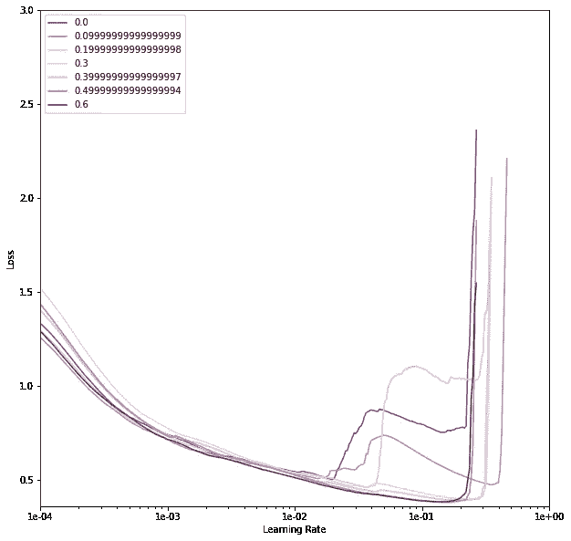
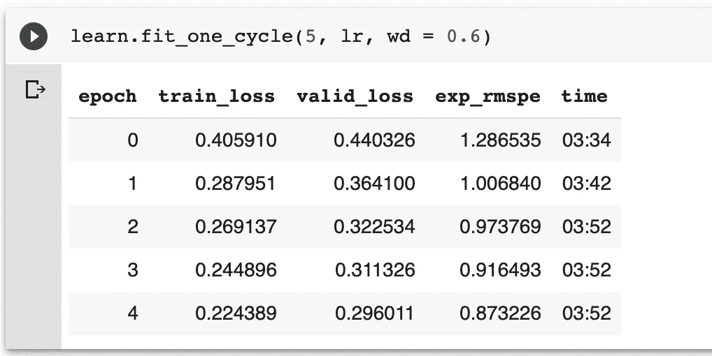
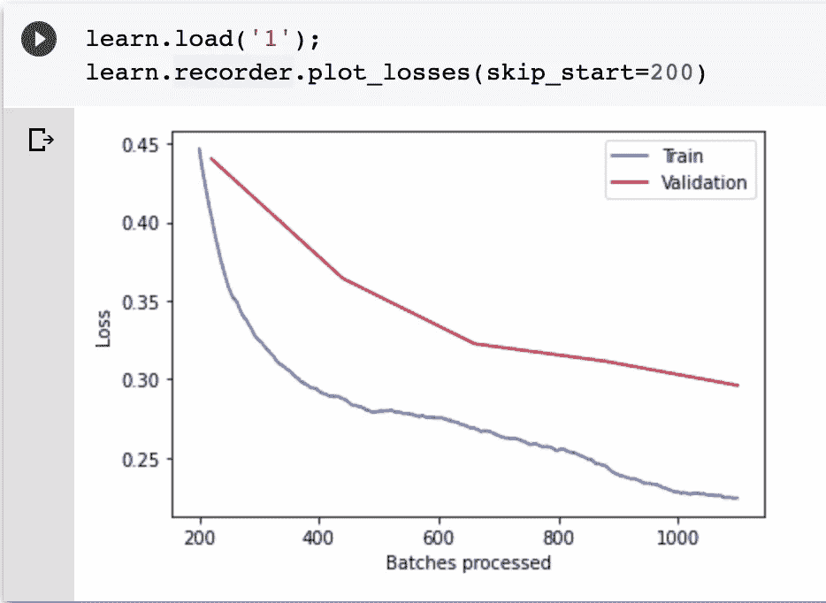
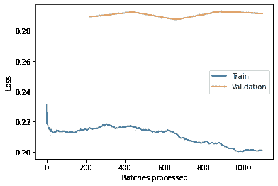
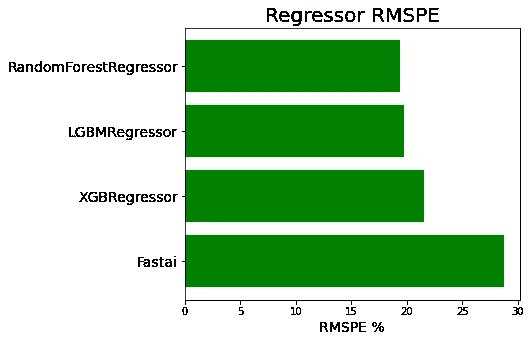

# 预测食物需求

> 原文：<https://towardsdatascience.com/forecasting-food-demand-applying-neural-networks-to-the-meal-kit-industry-6f1e3b2207aa?source=collection_archive---------46----------------------->

## 神经网络在餐包行业中的应用


[百合网](https://unsplash.com/@lvnatikk)在 [Unsplash](https://unsplash.com/) 上拍摄的照片

**所以这将是过度拟合。**

时间序列问题通常与过度拟合作斗争。这整个练习变得更具挑战性，看我如何能防止时间序列预测中的过度拟合。

我添加了[重量衰减](https://www.fast.ai/2018/07/02/adam-weight-decay/)和[脱落](https://www.cs.toronto.edu/~hinton/absps/JMLRdropout.pdf)。这将有助于防止过度拟合。网络有分类变量的嵌入层(我改变了大小)，接着是丢弃和[批量标准化](https://arxiv.org/abs/1502.03167)(对于连续变量)。

根据这篇文章[的说法](https://medium.com/@lankinen/fast-ai-lesson-6-notes-part-1-v3-646edf916c04)理想情况下，你想要更低的脱落量和更大的体重衰减量。

# 资料组

数据由一家[餐包公司](https://datahack.analyticsvidhya.com/contest/genpact-machine-learning-hackathon-1/#ProblemStatement)给出。由于食物容易腐烂，计划和需求预测极其重要。

弄错了这一点可能会给一家餐盒公司带来灾难。补充通常每周进行一次。我们需要预测未来 10 周的需求。

# **预处理**

多亏了 Fastai，标准化、填充缺失值和编码分类变量现在是一个相对简单的过程。

接下来，我们将为每个分类变量创建嵌入。问题是，每个分类嵌入应该有多大？Fastai 有一个很好的经验法则，其中分类嵌入由以下公式给出:

```
cardinality = len(df[cat_vars[0]].value_counts().index)
emb_size = min(50, cardinality//2)
```

这意味着嵌入的大小将是分类变量中唯一值的数量除以 2 并向下舍入。也可能是 50。哪个最小。

我们最终的嵌入大小字典如下所示

```
 emb_szs = {cat_vars[i]:min(len(df[cat_vars[i]].value_counts().index)//2, min_size) for i in range(1, len(cat_vars))}

{‘Day’: 15,
 ‘Dayofweek’: 0,
 ‘Dayofyear’: 50,
 ‘Is_month_end’: 1,
 ‘Is_month_start’: 1,
 ‘Is_quarter_end’: 1,
 ‘Is_quarter_start’: 1,
 ‘Is_year_end’: 1,
 ‘Is_year_start’: 1,
 ‘Month’: 6,
 ‘Week’: 26,
 ‘Year’: 1,
 ‘category’: 7,
 ‘center_id’: 38,
 ‘center_type’: 1,
 ‘city_code’: 25,
 ‘cuisine’: 2,
 ‘email_plus_homepage’: 1,
 ‘emailer_for_promotion’: 1,
 ‘homepage_featured’: 1,
 ‘meal_id’: 25,
 ‘op_area’: 15,
 ‘region_code’: 4}
```

我们需要调整我们的模型架构。这总是最难的部分。几篇文章强调了获得正确的模型架构的重要性。在许多方面，这可以被视为[“新”特征工程](https://smerity.com/articles/2016/architectures_are_the_new_feature_engineering.html)。

[由](https://arxiv.org/abs/1803.09820) [Leslie Smith](https://scholar.google.com/citations?user=pwh7Pw4AAAAJ&hl=en) 撰写的这篇论文提出了一种有趣的方法，以一种更加规范的方式来选择超参数。我将从[这个 kaggle 内核](https://www.kaggle.com/qitvision/a-complete-ml-pipeline-fast-ai)建模实现。

我们需要找到最优的学习速率、权重衰减和嵌入丢失。根据 Leslie Smith 的说法，为了选择最佳的超参数，我们需要针对一些不同的权重衰减和下降值运行学习率查找器。然后，我们选择具有最低损失、最高学习速率(在快速增加之前)和最高重量衰减的最大组合。

那要考虑很多。此外，还有几个我们没有考虑的超参数。为此，我将借用具有相对较大的层的模型架构。这款车型曾在罗斯曼·卡格尔比赛中获得第三名。

最后，我需要考虑批量大小。根据 Leslie 的说法，这应该设置得尽可能高，以适应所有可用的内存。我非常乐意做那件事。这大大减少了我的训练时间。

我使用 Fastai 中的学习率查找器来可视化我们改变模型架构时的损失。从那里，我创建了一个基本的网格搜索。我不想实现疯狂的深度网格搜索——那将是计算开销很大的。我认为最好的方法是手动操作。

一旦我们描绘出模型架构的所有不同组合，事情就会变得更加清晰。



*作者图片*

如果我们选择重量衰减为零的模型架构，损耗峰值会更早出现。从选项中,“0.6”的权重衰减允许我们以最低的损失训练合理的高学习率。

虽然与最低损失水平相对应的学习率在 1e-1 区域，但我不会使用该学习率。相反，我将为学习率选择 1e-2 值。这是爆炸的安全值。这已经[显示](https://sgugger.github.io/how-do-you-find-a-good-learning-rate.html)有助于训练。

这是我们的最终模型:

```
learn = get_learner(emb_szs=emb_szs, layers = [1000,500], ps = [0.2,0.4], emb_drop = 0.04)

TabularModel(
 (embeds): ModuleList(
 (0): Embedding(146, 26)
 (1): Embedding(78, 38)
 (2): Embedding(52, 25)
 (3): Embedding(3, 1)
 (4): Embedding(3, 1)
 (5): Embedding(15, 7)
 (6): Embedding(5, 2)
 (7): Embedding(52, 25)
 (8): Embedding(9, 4)
 (9): Embedding(4, 1)
 (10): Embedding(31, 15)
 (11): Embedding(4, 1)
 (12): Embedding(13, 6)
 (13): Embedding(53, 26)
 (14): Embedding(32, 15)
 (15): Embedding(2, 0)
 (16): Embedding(146, 50)
 (17): Embedding(3, 1)
 (18): Embedding(3, 1)
 (19): Embedding(3, 1)
 (20): Embedding(3, 1)
 (21): Embedding(3, 1)
 (22): Embedding(3, 1)
 (23): Embedding(4, 1)
 )
 (emb_drop): Dropout(p=0.04, inplace=False)
 (bn_cont): BatchNorm1d(6, eps=1e-05, momentum=0.1, affine=True, track_running_stats=True)
 (layers): Sequential(
 (0): Linear(in_features=256, out_features=1000, bias=True)
 (1): ReLU(inplace=True)
 (2): BatchNorm1d(1000, eps=1e-05, momentum=0.1, affine=True, track_running_stats=True)
 (3): Dropout(p=0.2, inplace=False)
 (4): Linear(in_features=1000, out_features=500, bias=True)
 (5): ReLU(inplace=True)
 (6): BatchNorm1d(500, eps=1e-05, momentum=0.1, affine=True, track_running_stats=True)
 (7): Dropout(p=0.4, inplace=False)
 (8): Linear(in_features=500, out_features=1, bias=True)
 )
)
```

我将在这里使用学习率退火。这是[显示工作良好](https://sgugger.github.io/the-1cycle-policy.html)。



*作者图片*



*作者图片*

我将继续拟合更多的周期，直到验证开始增加。我将在拟合几个纪元后保存模型。这样我就可以在以后的推理中使用最好的模型。


*作者图片*



*作者图片*

我能得到的最好结果是大约 0.29 的确认损失(四舍五入)。

与马丁·阿拉克伦的[文章](https://www.martinalarcon.org/2018-12-31-b-water-pumps/)类似。我想将神经网络的性能与更传统的方法进行比较。

# 其他方法

XGBoost、随机森林回归器和 LightGBM。相对于神经网络，它们的表现如何？

我将使用或多或少与神经网络相同的数据。Fastai 已经内置了优秀的预处理方法。

然而，Fastai 的分类编码有点奇怪。Fastai 从分类值到它们的编码值创建一个字典。在推断时间，分类值[被编码值交换](https://forums.fast.ai/t/fastai-v2-code-walk-thru-8/55068)。

这很聪明，也很有用。但这使得在 Fastai 生态系统之外的模型中使用 Fastai 预处理数据有点困难。

为了解决这个问题，我创建了一个简单的脚本，将 Fastai 表格数据束转换成可以提供给另一个模型的数据。

```
# inspired by [https://www.martinalarcon.org/2018-12-31-b-water-pumps/](https://www.martinalarcon.org/2018-12-31-b-water-pumps/)
class convert_tabular_learner_to_df():def __init__(self, cat_names, tabular_data_bunch):
 self.cat_names = cat_names
 self.tabular_data_bunch = tabular_data_bunchdef driver(self):# convert tabular data to dataframe
 X_train, y_train = self.list_to_df(self.tabular_data_bunch.train_ds)
 X_valid, y_valid = self.list_to_df(self.tabular_data_bunch.valid_ds)# label encode data
 encoder = BinaryEncoder(cols = self.cat_names)
 X_train = encoder.fit_transform(X_train)
 X_valid = encoder.transform(X_valid)return X_train, X_valid, y_train, y_validdef list_to_df(self, tabular_learner):# create X df
 x_vals = np.concatenate([tabular_learner.x.codes, tabular_learner.x.conts], axis=1)
 cols = tabular_learner.x.cat_names + tabular_learner.x.cont_names
 x_df = pd.DataFrame(data=x_vals, columns=cols)# reorder cols
 x_df = x_df[[c for c in tabular_learner.inner_df.columns if c in cols]]# create y labels
 cols = [i.obj for i in tabular_learner.y]
 y_vals = np.array(cols, dtype=”float64")return x_df, y_vals
```

现在，我们将对数据进行一系列回归分析。每个都使用默认值。我想知道神经网络相对于回归的标准方法表现如何。好点了吗？更糟？

现在看结果。



*作者图片*

在这种情况下，似乎其他模型优于神经网络。尽管如此，具有类别嵌入的深度学习模型在 [Kaggle](https://www.kaggle.com/c/rossmann-store-sales/discussion/17974) 上非常受欢迎。我可能需要改变我使用的下降量和体重衰减量。但目前，就 RMSPE 而言，RandomForestRegressor 是最好的模型。

# 丰富

1.模型架构。我想改变更多的超参数，同时避免昂贵的网格搜索。这可能是进一步改进模型的唯一最有用的事情。

Fastai 明确警告您不要减少参数，以免过度拟合。相反，使用辍学和体重衰减宽松。

我已经尝试过了。但最终还是稍微超配了一下。改变超参数可能有助于进一步减少过度拟合。

具体来说，我可能会受益于不同的辍学。我想改变嵌入层的漏失，更重要的是漏失的概率。

[本文](https://scholarworks.uark.edu/cgi/viewcontent.cgi?referer=https://www.google.com/&httpsredir=1&article=1028&context=csceuht)讲述了大型*深度*神经网络中的辍学效应。也许加深网络和更自由地应用 dropout 可以提高性能？

网格搜索可以随机实现。这叫做随机搜索。我可以潜在地使用 [skorch](https://skorch.readthedocs.io/en/stable/user/quickstart.html#grid-search) 来做这件事。

2.我也想试试脸书的先知。这是一个用于时间序列预测的开源工具。我想看看它相对于这个神经网络的表现。

3.混合。在 [kaggle](https://www.kaggle.com/fl2ooo/nn-wo-pseudo-1-fold-seed) 上的第一名解决方案使用了混合了 lightGBM 模型的神经网络。这可能是未来研究的希望。

我的 [Github](https://github.com/spiyer99/spiyer99.github.io/blob/master/nbs/medium_food_demand_prediction_mealkit.ipynb) 上有完整的代码

原帖来自 [spiyer99.github.io](https://spiyer99.github.io/Mealkit-Food-Demand-Forecasting/)