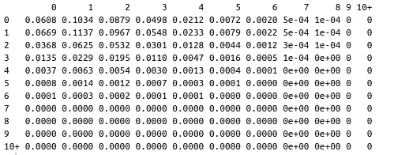
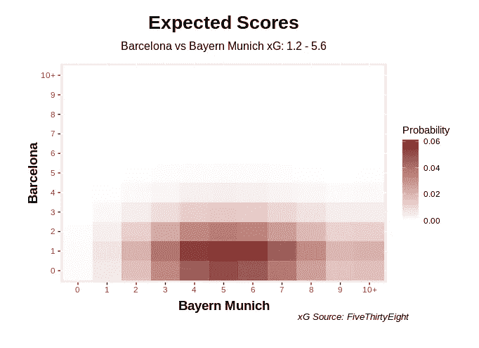
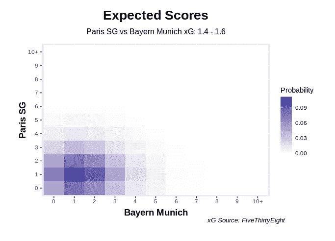

# 用 GgPlot2 预测足球比分

> 原文：<https://towardsdatascience.com/forecasting-football-scores-with-ggplot2-949de7c1cb52?source=collection_archive---------14----------------------->

## 使用泊松帮助可视化足球正确的分数在 R


李名炀([@果事无双](https://unsplash.com/@guoshiwushuang))在 [Unsplash](https://unsplash.com/photos/6J7eIvNwttQ) 上的照片

# 胡闹

在我之前的一篇帖子中，我提到一场足球比赛的比分可以用[泊松分布](https://en.wikipedia.org/wiki/Poisson_distribution)来近似计算，但我没有过多地谈论这个话题。好吧，你今天很幸运…我们将看看这个主题，在这篇文章的最后，我们将有 Ggplot2 可视化说明一场足球比赛的可能比分，这真的很棒。

首先，讲一点泊松分布的根。这种概率分布的发现归功于十九世纪的法国数学家西蒙·丹尼斯·泊松。像他同时代的许多人一样，他主要研究它的理论。直到俄罗斯统计学家 Ladislaus Bortkiewicz 于 1898 年出版了他的书《大数定律》，泊松分布才在实践中得到广泛应用。

众所周知，Bortkiewicz 获得了普鲁士军队 20 年来的一组数据，记录了被马踢死的士兵人数。冷酷无情。

总之，他证明了这些死亡可以用泊松分布来近似，剩下的，正如他们所说的，都是历史了。

现在…一个人如何从普鲁士骑兵到足球比分？

# 愚弄你和我

让我们先来看看满足泊松过程的基本假设:

1.  **事件在给定时间间隔内发生的概率不随时间变化**
2.  **事件随机发生**
3.  **事件独立发生**

现在把进球想象成足球比赛中的一个事件。如果我们有一个指标可以表达一支球队在 90 分钟内的得分率/强度，我们可以说第一个假设得到了满足。这很难定义，但谢天谢地，体育迷们(我应该补充一句，他们比我聪明一百倍)已经为此提出了[预期目标](https://fbref.com/en/expected-goals-model-explained/) (xG)。今天谢谢你！

下一个问题-足球比赛中进球是随机出现的吗？也就是说，在一场比赛中是否有一个特定的时间点更容易进球？[这个家伙](https://medium.com/@Soccermatics/luck-skill-and-randomness-aaa8d80836ea)说不，许多其他[的文章和研究](https://www.nytimes.com/2014/07/08/science/soccer-a-beautiful-game-of-chance.html#:~:text=It%20involves%20hundreds%20of%20skillful,victory%20is%20a%20single%20goal.)也表明进球*确实*在足球比赛中随机发生。在实践中，目标可能不像人们想象的那样随机，但是…我们有足够的证据证明它们是随机的，所以让我们打勾，现在继续。

现在是最后一个假设——目标是相互独立的。如果一支球队落后，球员们肯定会更加努力地回到比赛中去，以扳平比分。或者，如果一个队已经领先 5 个球，球员可能会因为自满而放松油门，让一个人进入。无论哪种方式，你都必须说目标*不是彼此独立发生的，使用基本泊松过程来模拟足球比分在这里开始失效。*

*有一些技术可以调整比赛中的目标依赖性，但我们都有白天的工作——所以让我们把它留到另一天……现在同意三分之二并不坏(而且，我正在努力在 it 中生成有用的内容，所以我们在这里)。为了进一步阅读，我建议看看这篇[精彩的博客文章](https://dashee87.github.io/data%20science/football/r/predicting-football-results-with-statistical-modelling/)，它基本上为足球做了一个 Bortkiewicz，表明你可以用泊松分布近似一个赛季的进球数。*

# *蹄*

*在我之前关于 xG 的[帖子](/did-liverpool-deserve-to-win-the-premier-league-eda7a4e1b9ca#h1)中，我创建了一个简单的泊松模型来帮助预测 r 中一场足球比赛的结果(主场胜利、平局、客场胜利)。我们将在这里使用类似的东西，但更侧重于获得正确得分的概率作为输出。*

*r 已经从它的基础热图库中走了很长一段路，这些热图库还不太成熟。Ggplot2 是一个神奇的软件包，它允许构建各种图形和图表。为了使用它们，我们必须首先在 RStudio 中安装一些依赖项:*

```
*install.packages('tidyr')
install.packages('dplyr')
install.packages('scales')
install.packages('ggplot2')library('tidyr')
library('dplyr')
library('scales')
library('ggplot2')*
```

*酷，现在让我们回到我们最初的假设之一——在一场足球比赛中，球队在 90 分钟内有恒定的得分率。我们将使用取自 [FiveThirtyEight 的模型](https://projects.fivethirtyeight.com/soccer-predictions/champions-league/)的基于镜头的 xG，用于巴塞罗那和拜仁慕尼黑之间的冠军联赛四分之一决赛(哦，天哪……)。让我们构造并获取一个`ScoreGrid`:*

*我们创建了一个 11 列 11 行的数据框，每个条目代表一个正确的分数。因此[ **行 *i* ，列 *j*** 中的条目将是得分 ***i，j*** ，其中 ***i*** 为主场得分， ***j*** 为客场得分。因此，entry [ *1，2* ]将会是客场队以 2-1 获胜。给定`homeXg`和`awayXg`，`dpois`有助于为每个分数 *i* 生成随机泊松概率。最后，我们将个人得分限制在 9 分，一旦我们达到 10 分，我们将把概率加在一起，并将它们分组为一个条目。这只会让事情变得更简单。*

*让我们快速旋转一下。在 RStudio 控制台中，键入*

```
*ScoreGrid(1.7,1.1)*
```

*你应该知道这个:*

**

*足球正确得分网格。作者图片*

*网格不错，但不太好看。*

# *罗伯特·莱万戈尔斯基*

*让我们现在建立正确的分数视觉。我们将在 Ggplot2 中使用`geom_tile()`,它会在最后生成一个漂亮的热图。代码如下:*

*Ggplot2 要求输入数据为`tidy`数据帧，因此从基数 R `data.frame`的转换发生在第 10 行的`pivot_longer`处。接下来，我们需要将所有的`vars`转换为`factors`，并按照正确的顺序对等级进行排序(记住 *10+* 是一个因子，使用`as.numeric`只会使它变成一个`NA`)。我们希望它是列表中的最后一级)。这在第 14 行用`~forcats::fct_relevel`完成。除此之外的所有内容都只包含 Ggplot2 图的常见构件。*

*好了，我们开始吧。启动 R 控制台，输入团队名称和 xG 输入，无论您来自哪里:*

```
*ScoreHeatMap("Barcelona", "Bayern_Munich", 1.2, 5.6, "FiveThirtyEight")*
```

**

*巴塞罗那 vs 拜仁慕尼黑正确的比分可视化。作者图片*

*在这场比赛中，男人对男孩，只要看看可视化/热图，你就可以看到根据 xG，拜仁慕尼黑最有可能的比分是 5-1。事实上，拜仁实际上以 8 比 2 获胜。罗伯特·莱万戈尔斯基的确。*

*再举一个例子来说明一场势均力敌的比赛，昨晚巴黎圣日耳曼和拜仁慕尼黑之间的冠军联赛决赛:*

```
*ScoreHeatMap("Paris_SG", "Bayern_Munich", 1.4,1.6,"FiveThirtyEight")*
```

**

*巴黎圣日耳曼 vs 拜仁慕尼黑正确比分可视化。图片作者。*

*一场激烈得多的比赛，1-1 是最有可能的比分，拜仁慕尼黑实际上以 1-0 获胜。*

# *稳定的模型*

*和往常一样，有几个警告，其中一个我们已经讨论过了——即目标不是相互独立的，所以这个模型值得重新审视。此外，如果这些 xG 机会中的任何一个有不同的结果(即射门击中门柱或偏出而不是进入)，我们可能[今天就不会在这里谈论这个问题](https://en.wikipedia.org/wiki/Butterfly_effect) …让我们不要忘记 xG 本身是一个有缺陷的指标，它没有捕捉到一场足球比赛中的许多细微差别。*

*尽管如此，这些视觉效果很好地展示了一场比赛的结果——如果有什么不同的话，这是一次很好的使用一些令人印象深刻的 R 库进行图形和可视化的练习。*

*和往常一样，如果我想不通的话，你可以在我的 Github 仓库里找到所有这些。为今天干杯…*

# *其他文章*

*[](/did-liverpool-deserve-to-win-the-premier-league-eda7a4e1b9ca) [## 利物浦值得赢得英超冠军吗？

### 使用 Python、R 和预期目标的英超联赛 2019/20 回顾

towardsdatascience.com](/did-liverpool-deserve-to-win-the-premier-league-eda7a4e1b9ca) 

# **足球正确比分可视化 R 码**

[](https://github.com/ourandy/blog-repo) [## ourandy/博客-回购

### 博客文章的存储库。在 GitHub 上创建一个帐户，为我们的 andy/blog-repo 开发做出贡献。

github.com](https://github.com/ourandy/blog-repo)*