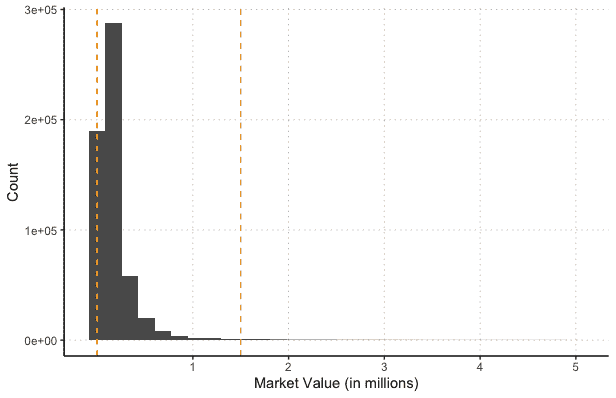
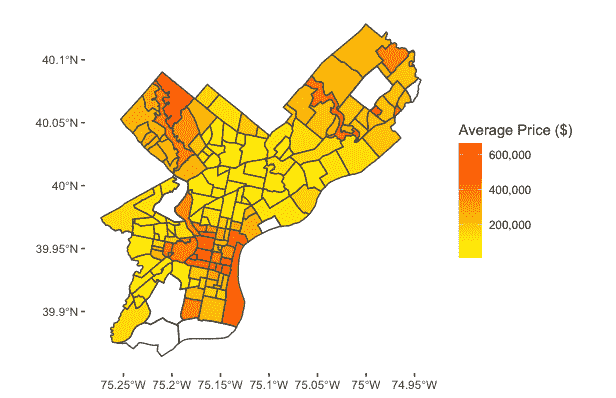
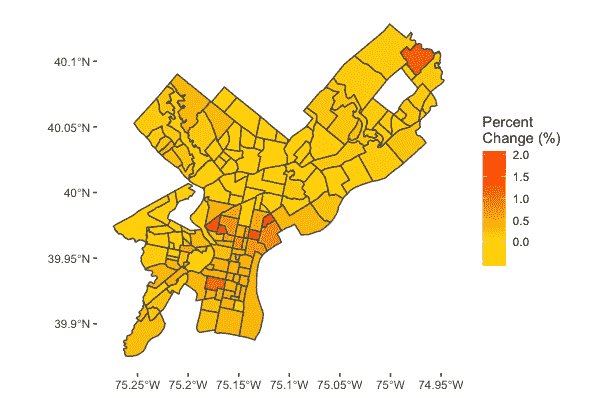
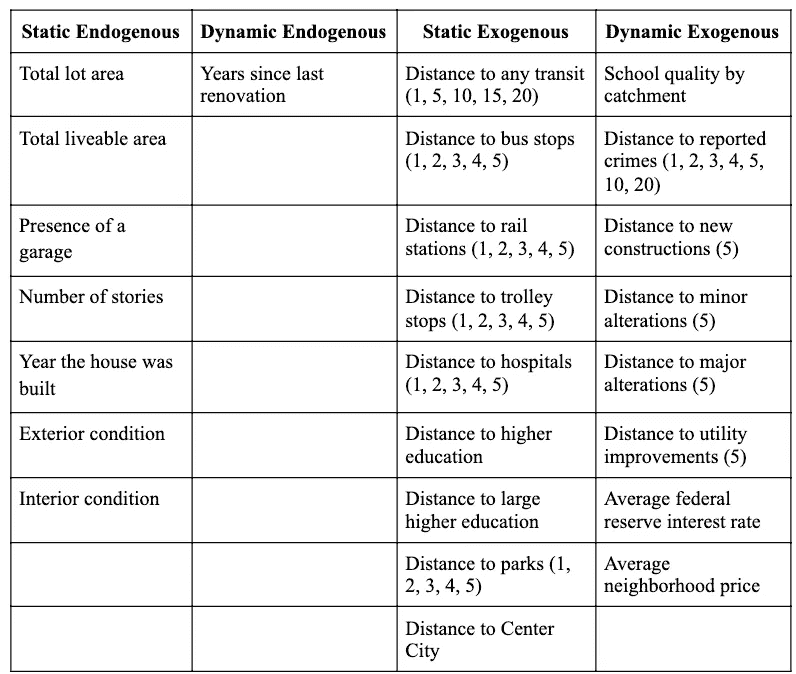
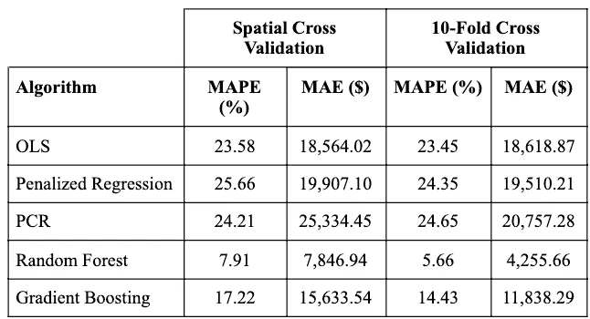
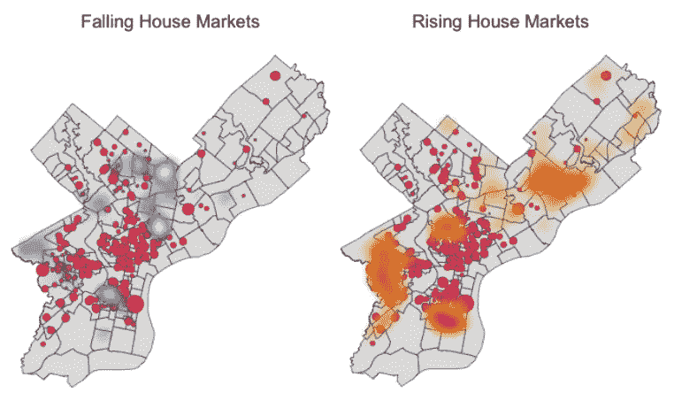
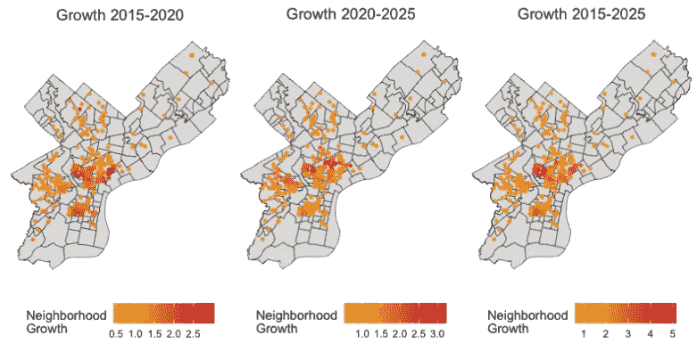
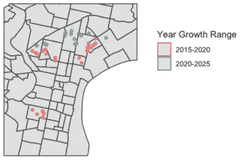
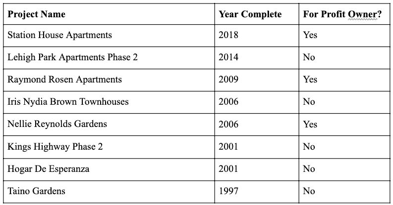

# 公共政策中的地理空间机器学习

> 原文：<https://towardsdatascience.com/forecasting-gentrification-to-inform-affordable-housing-policy-453344bde6e7?source=collection_archive---------42----------------------->

## [实践教程](https://towardsdatascience.com/tagged/hands-on-tutorials)

## 预测费城的中产阶级化，为经济适用房政策提供信息

由[伊森·胡佛](https://unsplash.com/@ethanchoover?utm_source=medium&utm_medium=referral)在 [Unsplash](https://unsplash.com?utm_source=medium&utm_medium=referral) 上拍摄的照片

# **简介**

在过去的八年里，费城的房地产市场已经从衰退中复苏，并准备加速复苏。与此同时，数以千计的贫困租户努力寻找和维护价格合理的住房。负担得起的住房倡议并非没有对新住房项目的布局提出批评，特别是在新开发项目集中在低收入地区的情况下。虽然有人可能会说，在这些地区建设经济适用房项目会让租户靠近他们现有的社区，但这也会让他们远离可能的经济增长和社会流动性。

中产阶级化是街区变化的主要来源，也是理解房价随时间变化的关键。为了吸引高收入居民，公共部门努力提供更高标准的生活设施和休闲。对中产阶级化地区的关注将资金从其他低收入地区抽走。然后，这些社区会经历投资减少或社区衰落的时期。随着城市中心的扩张和周围土地价值的增加，投资不足的地区开始为未来的中产阶级化周期做准备。这一过程在费城很明显，仅从 2008 年到 2016 年[就损失了 13，000 个低成本单元，而增加了 6，000 个高端单元](https://www.phila.gov/media/20190115161305/Housing-Action-Plan-Final-for-Web.pdf)。

很明显，随着中产阶级化正反馈循环的继续，越来越多的人因为租房合同价格过高而被迫搬迁。这种效应通过收入阶层逐级传播，从而需要更多的经济适用房。

经济适用房项目是保持经济领域公平感的一个重要因素，这些项目的位置对这一空间的形成至关重要。在目前主要由低收入或无投资地区占据的地区进行开发，可以确保那些有需要的人能够获得租金控制的住房，这种住房对开发商来说相对便宜。此外，如果该地区要中产阶级化，租金价格保持不变，而与中产阶级化相关的便利设施和机会给该地区带来了经济机会。因此，中产阶级化的预测措施将很好地指导经济适用房的安置。

# **数据**

费城有一个强大的开放数据平台，[opendatahilly](https://www.opendataphilly.org/)，有超过 350 个来自政府组织的公共数据集可供梳理。我选择的数据集主要是基于列举整个城市的便利设施，包括公园、学校、医院、高等教育和公共交通站。此外，我收集了犯罪点的位置数据，以代表潜在房主考虑的一个常见的不利因素。还收集了 2014 年至 2020 年每个地块(建筑)的市场估值。

和往常一样，这些数据并不完美。例如，如果有过去几年公交站点扩展的可访问日志，则该模型可以将公共交通使用的增加解释为远离中心城市的地区价格发生某些变化的原因。另一个例子是，学校质量和集水区数据不包括特许学校，特许学校是费城学校景观中不断增长的一部分，将导致更准确的学校质量数据表示。尽管如此，通过一些清理，合并这些数据集创建了丰富的空间和时间数据集以进行特征化。

收集和清理数据并非易事。以下是一些在特殊化之前进入项目的数据工程工作的例子:

*   我使用了东南宾夕法尼亚交通管理局(SEPTA) API 来提取整个城市的交通可达性。然而，API 只返回离给定的经纬度坐标最近的 50 个公交站点。为了创建一个横跨整个城市的点级公交站点数据集，我以网格方式迭代查询了整个城市的坐标，每个坐标之间的距离为 0.1 英里。这给了许多副本，但彻底涵盖了费城的所有过境站。我删除了重复的点，并将结果位置修剪到城市的边界。
*   属性评估数据集详细描述了目标时间段内的宗地值和内部特征，其中有几十行的值不一致。例如，在许多情况下，房间数是 0，而卧室数是 2。在此基础上，我删除了 num_rooms 和类似的不一致列。
*   我用从属性的描述性数据中提取的值替换了一些不一致的列。数据集中的每个住宅宗地都有一个描述，包括车库的存在和建筑物在描述性文本字段中的层数。使用正则表达式，我在数据集上提取了这些信息，添加了两列，分别表示车库的存在和房间的真实数量。
*   在地产评估数据集中，宗地值的分布呈明显的右尾分布:

*费城包裹市场价值直方图【作者图片】*

为了缩小预测范围，我剔除了估价高于 150 万美元的地块。估价为 1 美元或 0 美元的包裹也被移除。98.5%的宗地保留在数据集中以供考虑。

快速查看每个街区的平均市场估值，可以让我们很好地了解整个城市的分布情况:

*每个街区的平均价格【图片由作者提供】*

从图像上看，这里有一个高密度、高价格的城市核心区和低价格的郊区。费城西北部和东北部的郊区往往也有较高的值。费城南部和西南部的机场周围地区和工业区的值较低，而东侧的中心城市滨水区的平均值较高。

*2014-2020 年每个街区的百分比变化【作者图片】*

这种视觉化更深入地挖掘了城市核心周围明显的中产阶级化过程。就在高物价中心城市的北部和南部，是一些平均价值快速增长的街区。这个项目的目标是预测这个过程扩展的具体位置。

# **特色工程**

特征分为静态或动态，以及外源性或内源性。

*   **静态**特征假定在给定的时间段内不会改变(例如:公园、医院和公交车站的位置)
*   **动态**特征每年都会发生变化(例如:犯罪事件、学校质量)
*   **内生**特征是每个地块的内部特征(例如:总宜居面积、卧室数量、浴室数量)
*   **外源**特征是地块的外部特征，由周围环境引起(例如:到不同设施的距离、平均社区价格)

考虑到这些分类，我构建了以下特征:

*完整功能列表【图片由作者提供】*

请注意，一些特征后的数字表示平均 k-最近邻中的 *k* 。我在这里更深入地讨论这个版本的 k-最近邻算法[。简而言之，对于每个宗地，我计算了给定要素的 k 个最近位置，并对这些最近点的特征值进行平均。](https://prateek-a.medium.com/efficient-spatial-indexing-ac6c523410dd)

我尝试用不同的 k 值来衡量平均值。例如，对于最近的犯罪，如果某个犯罪仅在一年内发生在房屋附近，则该要素在该时间步长内将会非常倾斜。每个特征都有不同的 *k* 值，并且在模型构建过程中为每个特征选择了最具信息性的 *k* 。

请注意，平均邻域价格要素是在预定义的费城邻域上生成的。当给定的边界没有正确地在住房类型和价格的集群之间划分时，这可能会导致问题。这就是所谓的可变面积单位问题。在其他房价分析中，不同形式的聚类被用于根据具体特征对地理区域进行分组，而不是使用邻居边界。在本文中，我进一步研究了地理聚类，但是总的来说，创建定制聚类的尝试并没有比预定义的邻域更加同质。而是使用原始邻域。

## 建模

手头有几十个特征，我比较了线性、非线性和基于树的方法来预测整个城市的房价。

普通最小二乘法，或 OLS，经常被用于房价的享乐模型，但空间自相关的存在破坏了这一测试的统计假设。空间自相关是指房价数据在空间上并不独立，因为它们受到许多相同空间因素的影响。这个项目的目标不是优化统计推断，而是做出准确的预测。因此，准确性和普遍性更为重要。在整个特性工程过程中，OLS 预测是确定新特性质量的重要基准。

我还使用了被称为弹性网的惩罚回归作为基线估计。LASSO 的目的是将系数小的变量推向零，从而提供一种伪特征选择的方法，由于回归方程中有大量可用的特征，这一点尤其重要。岭回归还可以最小化系数，尤其有助于存在多个相关预测值，因为空间模型中存在自相关。具有混合因子的组合版本适合当前模型，因为它可以与相关变量和特征选择一起工作。

主成分回归，或 PCR，能够降低数据集的维度，也与其他模型进行了比较。PCR 首先使用主成分分析提取解释最大差异的主成分或特征向量。这个新空间的主成分将比特征少，从而降低了输入的维数。然后，可以将系数拟合到包含主成分的新特征空间中，该主成分在使用较少特征的同时解决了原始数据中的差异。这种降维在预测房价时可能很重要，因为有许多潜在的相关特征需要解释。

除了回归，我还使用了随机森林和梯度推进机器。随机森林是基于原始数据的不同自举样本的许多决策树的集合。由于在随机森林中使用了许多随机决策树，这个模型容易受到离群值的影响。随着训练的完成，它还会自动选择更多相关的功能。

最后，我测试了梯度推进机器。该算法包括连续计算决策树，以适应前一个模型的残差，按学习率缩放。随着连续树数量的增加，由于考虑了残差，模型变得更加适合训练数据。这样，GBM 能够很好地拟合已知数据，尽管它们对异常值很敏感。代表性的训练样本是这种技术有效工作的关键。

为了评估和比较这些模型，我使用平均绝对百分比误差(MAPE)和平均绝对误差(MAE)进行 10 倍交叉验证和空间交叉验证。10 倍交叉验证简单地将训练数据随机分成 10 倍。对于 10 次迭代，其中一个折叠作为测试集，其余的用于训练模型。空间交叉验证以类似的方式工作，但是折叠是在费城随机选择的邻域。以这种方式调查误差将暴露模型中未考虑的邻域级别的空间自相关。

*模型结果【图片由作者提供】*

# **预测**

在所用的模型中，随机森林迄今为止表现最好。这可能是由于从许多随机树中抽取平均结果时所表现出的固有变量选择过程。随着更具预测性的预测者出现，不重要的预测者最终被排除在连续的树之外。请注意，对于所有模型，与随机交叉验证相比，计算空间交叉验证时会增加误差。这表明残差中仍存在某种程度的空间自相关，这种自相关在邻域级别上表现出来。

确定了最准确的房价模型后，我使用随机森林模型来预测未来几年的市场价值。这些预测是通过使用特定年份的训练数据来预测未来年份的目标市场价值。由于数据集最多可以使用描述 2014 年城市状态的数据进行训练，并预测 2020 年的已知值，因此最大的未来预测也是未来六年的预测。一旦经过训练，这些模型可以外推至 2020 年以后。

*邻域变化预测的热图【图片由作者提供】*

上图显示了 2025 年的模型预测。左图显示的是未来五年内宗地密度较高且价格预计会下降的区域，右图显示的是价格预计会上升的区域。此外，两个地图都显示了当前经济适用房项目的位置，其大小基于可用单元的数量。总体而言，该市的平均单户家庭房价预计将从 2020 年的 136，860.90 美元升至 2025 年的 138，848.80 美元，这解释了房价上涨更频繁、更密集的地区。事实上，在预测的 275，347 宗地块中，121，342 宗预计升值超过 10%，而 36，231 宗预计下降相同的幅度。

# **推荐**

在经济适用房方面，热图为未来的安置提供了一个指标。费城北部和南部围绕中心城市的区域有着高密度的快速升值的地块，这为这些区域的经济适用房需求做好了准备。这些结果与直觉一致，即经济快速增长的地区位于城市中心的外围，这可能导致这些地区的流离失所和住房需求增加。

费城市已经认识到了这种需求，制定了“住房换权益”计划(T1)，计划在未来十年内新建 25，000 个家庭。为了评估过去住房单元的位置，我计算了每个开发项目四分之一英里半径内地块的当前和预测未来平均值。宗地价值的增长率被定义为时间跨度开始和结束时的平均宗地价值之间的比率。

*经济适用房开发和社区增长率【作者图片】*

如上图所示，周边社区增长最快的经济适用房项目位于市中心，尤其是在西北、东北和南部。那些离中心城市较远的地方，附近的房价涨幅较小。

*高增长地区的经济适用房【作者图片】*

放大高增长区域的集群，发现项目所在的社区在每个时间段的平均值都翻了一番以上。根据该模型，在接下来的五年中，预计社区增长将向北扩展。形成鲜明对比的是，在显示的两个时间段中，只有一个当前项目所在的区域的价值有望翻倍。尽管南费城的价值有了显著的增长，但预计未来几年不会有同样的增长。

在预计未来平均社区价值至少翻一番的 20 个项目中，只有 4 个项目是在 2010 年代建造的。在快速发展的地区缺乏近期的经济适用房使得这些地区经济适用房的前景不稳定。资助这些开发项目的低收入住房税收抵免(LIHTC)允许开发商在 15 至 30 年后将经济适用房开发项目转化为市场价格单位。由盈利性公司开发和拥有的经济适用房项目更有可能在期限结束时将其项目改造为市场价格单位，特别是在如上所示的高增长地区。

在 2015 年至 2020 年高增长地区的 27 个项目中，有 10 个由营利性开发商所有。在 2020 年至 2025 年预计高增长地区的 20 个项目中，一半由营利性开发商所有。根据提供租金补贴住房的 15 年合同，即使需求增加，这些关键地区的负担得起的住房存量预计也会大幅下降。

因此，特别是在中产阶级化地区，随着私人拥有的负担得起的住房单元转变为市场价格单元，可用的租金控制单元预计将会减少。这种住房短缺可能导致长期租房者流离失所。正如议员 Green 早些时候提出的，预测这些变化的一种方法是提前两年宣布低收入租金状况的变化，以便给城市规划者和居民时间准备搬迁。

鉴于对宗地价值的预测，对费城未来经济适用房的建议应考虑到预计增长最快的地区。这些领域目前的项目如下

*预测高增长地区的经济适用房项目【作者图片】*

如果不延长经济适用房期限，这些高增长地区的营利性开发商很可能会在他们的 15 年合同到期时驱逐低收入租户，从明年的 Nellie Reynolds Gardens 开始。考虑到对高增长地区的预测，建议采用三种方法来帮助抑制迁移的影响:

*   要求从补贴租金到市场租金的变化提前两年公布
*   延长警察局公寓、Raymond Rosen 公寓或 Nellie Reynolds Gardens 的租金控制住房的期限
*   将住房券的重点放在这些地区的租户身上，这些租户在未来一年可能会面临租金上涨

像这样的意识和基于地区的策略在规划费城经济适用房投资的未来时非常重要。