# 备件业务中的预测

> 原文：<https://towardsdatascience.com/forecasting-in-a-spare-parts-business-45437cadf195?source=collection_archive---------23----------------------->

## 有句话说，未来就在我们眼前一寸。永远在附近，但永远在前方。

丹尼尔·塞勒在 [Unsplash](https://unsplash.com/?utm_source=medium&utm_medium=referral) 上拍摄的照片

在这个例子中，一个 **R 预测**管道用几种统计方法创建，每天为每个零件运行，以支持自动补货系统。像**加法霍尔特-温特斯**、**指数平滑**、**克罗斯顿**和**脸书预言家**这样的方法被组合起来，以输出每个零件和下一个需求周期的需求预测。作为未来的工作，其他方法，如 LSTM，可以实施和分析，以改善预测，如果适用。

# 业务背景和现状

备件业务有其自身的挑战:

1.  客户非常迫切，要求立即供货(他们的客户大多是车主，还记得你上次去汽车修理厂吗？这通常不是一件愉快的事。)
2.  大多数零件在单位时间内销量很小(甚至没有销量)——间歇性需求
3.  该企业拥有庞大的产品组合(在多品牌零件批发商中甚至更多)，每个品牌拥有超过 200，000 种不同的零件

这三个问题增加了**库存积压**和**低库存周转率**的问题，并且与批发商规模成反比:小型零件企业更容易受到这些问题的影响。

除了这些挑战之外，其他挑战也确实存在，但对其他企业来说更为普遍:

1.  **需求可变性**:更好或更便宜或两者兼而有之的替代产品，客户偏好的变化(如配件市场备件份额的增加)或季节性(保险杠和其他车身部件在冬季的销量增加，而不是在夏季之前的过滤器和其他维护)
2.  上游供应链的变化和**中断** : PSA 整合了批发商的数量，并收购/合资了其他品牌，如欧宝和菲亚特集团，采购集团整合，非欧盟基金收购大型欧洲公司，黑天鹅事件，如 COVID global issue
3.  电子商务和市场:永久的“沉睡的巨人”一直潜伏在一个迄今为止仍然是传统的市场中，对于一个迫切需要整合的市场来说，参与者的数量仍然太多

# 预测简介

我先讲一个关于未来的故事:它不会完全是你预测的那样！你越想在粒度的基础上预测，你能得到的误差就越大。

在商业方面，这并不意味着你应该忽略它。平均而言，你只需要比竞争对手做得**好一点，从长远来看，你将拥有**的竞争优势**。**

对于这个业务问题，我使用了 4 种方法:

*   指数平滑法
*   加法霍尔特-温特斯
*   克罗斯顿
*   脸书先知

其他城市(ARIMA、LSTM)也可以加入进来，但为了简洁明了，我们选择从这些城市开始。

# 预测方法

## 指数平滑法

指数平滑法是由 Charles C. Holt 在 20 世纪 50 年代末引入的。基本概念是在移动平均窗口的**序列中构建时间序列，然后将最近的窗口置于旧窗口之上**。加权方法是指数产生良好的预测。

> 指数平滑是一种使用指数窗口函数平滑时间序列数据的经验法则。在简单移动平均中，过去的观察值被同等地加权，而指数函数被用于分配随时间按指数递减的权重。
> 
> [https://en.wikipedia.org/wiki/Exponential_smoothing](https://en.wikipedia.org/wiki/Exponential_smoothing)

## 加法霍尔特-温特斯

这种方法是对霍尔特之前工作的改进。它是由 Peter R. Winters **加上季节性**开发的，也被称为三重指数平滑法。

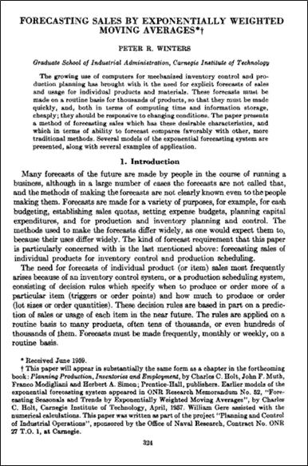

## 克罗斯顿

该书于 1972 年出版，书名为“间歇需求的预测和库存控制”，它解决了指数平滑积压的问题，方法是仅在发生的时间段内对发生的情况进行平均，然后乘以发生的概率。

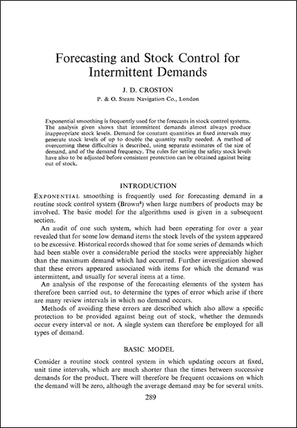

需要注意的是，它不能处理负销售额(如果总额为负，则向客户进行发票贷记)。在预测特定备件时，您必须意识到这一点。

## 脸书先知

> Prophet 是一种基于加法模型预测时间序列数据的过程，在该模型中，非线性趋势与每年、每周和每天的季节性以及假日影响相适应。它最适用于具有强烈季节效应的时间序列和几个季节的历史数据。Prophet 对缺失数据和趋势变化非常稳健，通常能够很好地处理异常值。

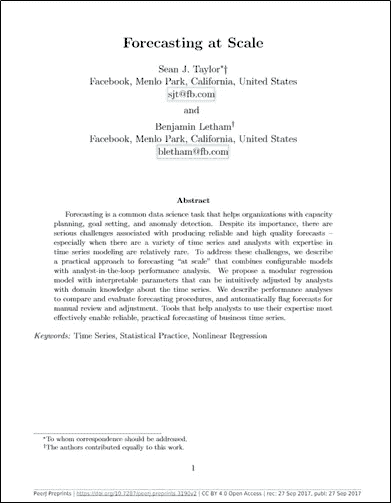

这种方法发表于 2017 年(比我们使用的前三种方法更近)，我们研究它的原因是，除了完全自动化的**之外，它**还考虑了日历效应**(像假期)。**

**不利的一面是，数据接收与前三种不同，迫使开发另一种数据提取过程。此外，对于我们的业务案例，它比其他的要慢得多**，迫使我们重建/升级一些服务器软件组件。它在生产中的实现有更大的障碍。****

# **预测的准备工作**

## **替代**

**备件业务有很多替代品。一个零件从 sku A 开始，变化到 B，到 C(或回到 A)…对任何想要一个干净方法的人来说都是一团糟。**

**替代用于:**

*   **用一部分代替另一部分**
*   **由于工程变更，需要用新版本替换的过时零件**

**因此，我们需要一个函数，它可以为一个零件获取它的替代链。由于使用了[递归公共表表达式](https://mariadb.com/kb/en/recursive-common-table-expressions-overview/)，它可以获得链中的所有部分:**

**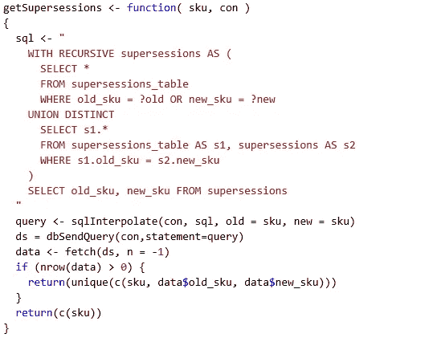**

**从替代的表格视图中，我们可以得到一个列表:**

**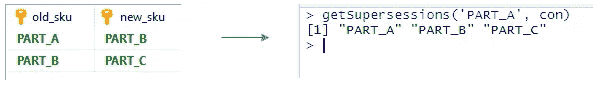**

## **提前期和预测期**

**这也许是一个更难解决的问题。对于由多个供应商供应(具有不同的交付周期)的每个零件，有必要评估主要供应商(如果存在多个供应商)并相应地进行预测。**

**例如，假设供应商 A 的补货提前期为 1 周(从订单到进货后的库存可用性)，我们可以预测 n 个周期，每个周期 1 周。另一方面，如果供应商 B 的零件需要一个月才能交货，那么它的预测期也应该是一个月。**

**为了本文的简洁，所做的分析将假设 1 个月的时间(生产方法在每个供应商/品牌的基础上有可变的交付周期)。**

## **将表格销售数据转换为时间序列**

**几乎每个销售数据源都以表格的形式出现。你会得到这样的结果:**

**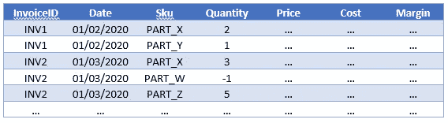**

**出于预测目的，有必要将此结构更改为时间序列(例如，使用月度时段的单个 sku 注意 2018 年 9 月出现的负值):**

**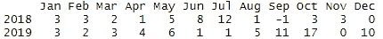****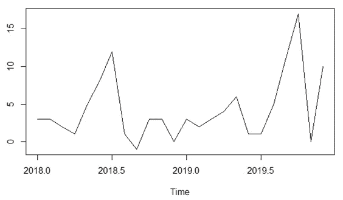**

**要从表格转换为序列，只需在数据库中“分组”时间段:**

**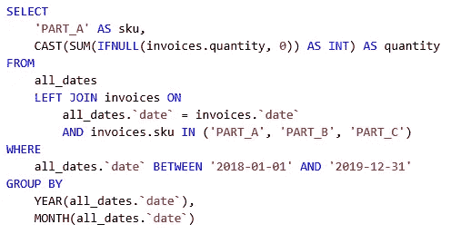**

## **用于预测的最低可行产品**

**现在，使用数据，我们需要设置它的预测方面。为此我们使用了 R(感谢非凡的库 [forecast](https://github.com/robjhyndman/forecast) )，但是你也可以使用 Python 或者其他解决方案。**

**添加所需的库并连接到数据库:**

**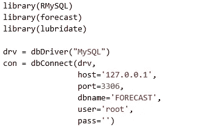**

**从数据库中获取数据:**

**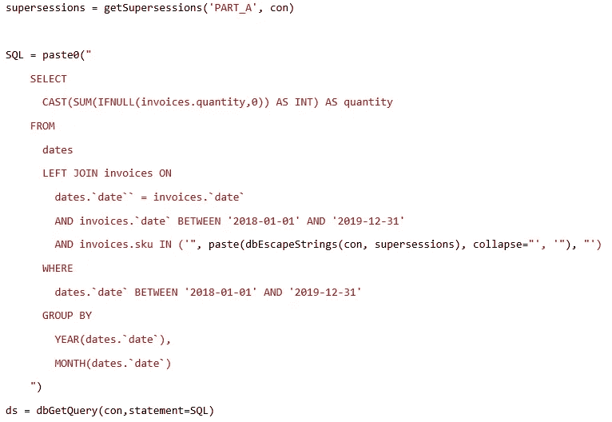**

**根据数据创建时间序列:**

**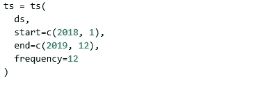**

**尝试第一次预测(仅在没有负面事件发生时适用于克罗斯顿):**

**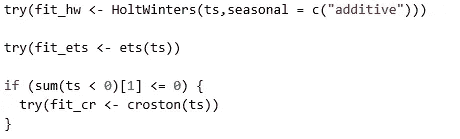**

**即使如此，如果您选择使用 Croston，您可以将负面事件归零(请在比较预测方法时考虑，因为您正在更改其中一种方法的数据):**

******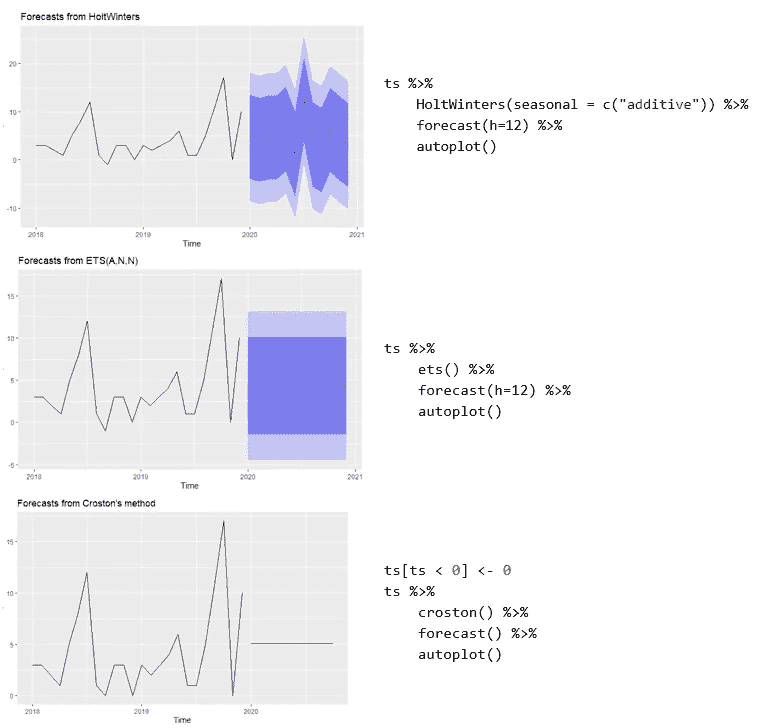**

**看着图表，我们倾向于选择前面的霍尔特-温特斯(其他的似乎“太平”)。但是，对于这个用例，只有对“下一个时期”的预测是重要的，因为我们将重复地做它。**

**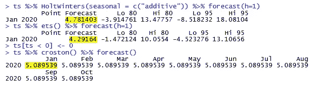**

**所有方法都导致类似的结果，2020 年 1 月平均售出 4 或 5 台，并且“Hi 95”区间达到 18 或 13。**

**先知呢？**

**正如我提到的，Prophet 数据摄入有点不同。首先，它需要每日数据，头必须是' **ds** 和' **y 【T3 ':****

**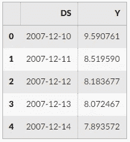**

**因此，我们需要改变我们的数据源 SQL。类似这样的事情会发生:**

**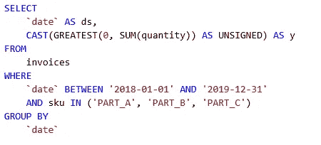**

**(如果你注意到了，我们正在将负面事件归零。模型中还有一个我们可以使用的特性，叫做“饱和最小值”。)**

**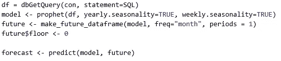**

**获得下一期的预测只是跟踪预测:**

**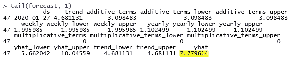**

# **解决生产预测问题**

**现在我们有了一个工作的 MVP，是时候把它投入生产了。对于那些仍在内部使用 IT 基础设施的人来说，计算相对便宜。服务器已经在那里了，大部分时间都在闲置，乞求做一些有用的事情。**

**对于我们的数据集(+50.000 sku)，对每个 sku 进行 4 次预测很容易就需要一整天以上的时间。我给你一个提示:先知应该为此负责😊**

**但是有一些策略可以用来减少花费的时间:**

## **1.并行计算**

**这是减少时间的最佳选择。按照仓库、品牌或任何其他标准来划分工人。请注意，组的基数相等通常意味着它运行得更快(结束得更快),因为它避免了一个延迟的组拥有比其他组更多的 SKU。**

**你可以使用的另一种方法是将 Prophet 与其他人分开。这样，由于数据采集是不同的，其他的将会很快结束。请注意，一些 Prophet 预测是长期运行的，数据库连接/事务可能会在数据库端关闭。**

**另一方面，并行计算有两个问题需要解决:**

*   **如果您的方法是让工作器在没有任何顺序的情况下获取数据块，那么有必要强制执行一些数据库锁。**
*   **当最后一名选手结束时，你需要给这个项目的合奏部分发信号(下一章会有更多的介绍)。**

## **2.仅对前一天销售或购买的零件进行每日计算**

**该选项是另一种快捷方式😊。如果您的补货订单每天都有，前一天未售出/未购买的零件“可能”会减少他们的库存预测(请对此持保留态度，因为当季节性等其他问题生效时，这在数学上是不正确的)。**

**这种解决方案的优点是还减少了与每天售出的不同零件(平均)数量相关的因素所做的计算。如果你有 50，000 个 SKU，而你平均每天只卖出/买入 5，000 个，那么你就减少了 90%的计算量。**

**如果你选择使用这种策略，我建议每周/每月进行一次全面跑步。**

# **对于给定日期的给定备件，使用哪种预测方法**

**现在，我们有一个渠道在每个零件上运行 4 个不同的预测，我们应该选择哪一个？**

**有几个概念可以帮助你选择(我不能在这里说得太详细):**

1.  **库存不足比库存过多更贵吗？也就是说，利益相关者更重视缺失的部分还是过多库存的成本？这个问题的答案有助于你选择更保守的方法。在这一点上，克罗斯顿往往做得很好。**
2.  **选择返回较低 MAPE(平均绝对百分比误差)或 MSE(均方误差)的方法。平均而言，ETS 表现最差。**
3.  **通过使用 MAPE 对库存不足进行+20%的惩罚(如果实际值减去预测值为负)来综合前两种方法。**

**这也许是这个项目更商业的一面。这实际上取决于你试图预测的潜在原因是什么:是数学准确性还是商业优势。👍**

# **总结**

**从所做的工作来看，克罗斯顿和霍尔特-温特斯都做得很好。ETS 是表现最差的模型，而 Prophet 的计算强度更大，没有为 7 天、15 天或 30 天的预报提供足够的优势。**

**在自动订单管道上完成工作后，预测方将估计的销售额反馈给它，并允许一个完整的自动化库存管理。**

**就是这样！全部完成！新的挑战在别处等待着我们！！！👏**