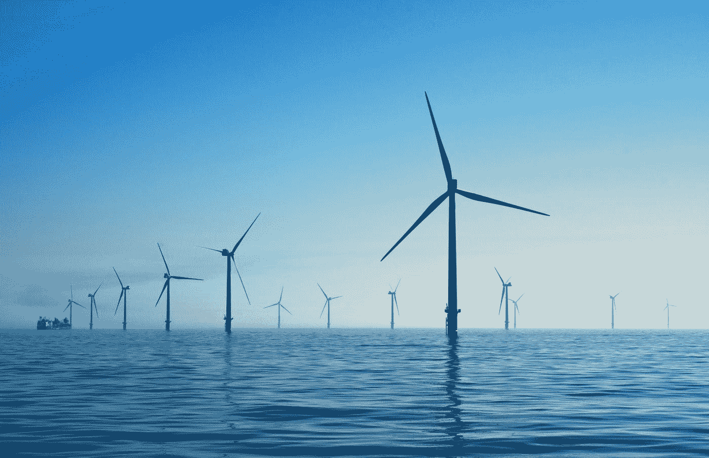
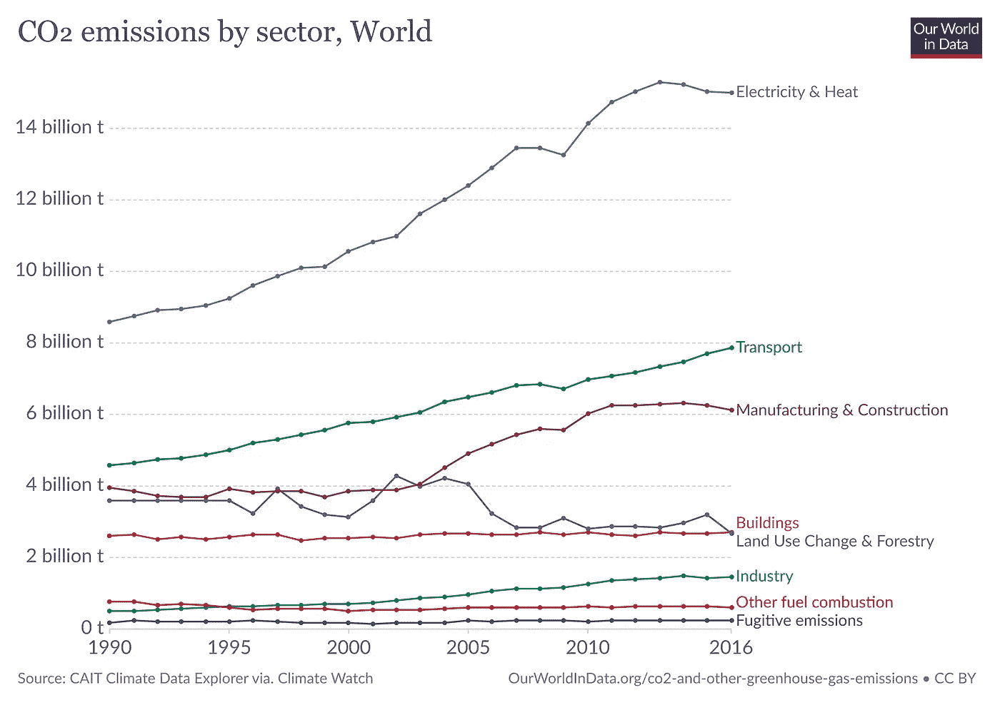

# 利用 Streamlit 和 sktime 预测可再生能源发电量

> 原文：<https://towardsdatascience.com/forecasting-renewable-energy-generation-with-streamlit-and-sktime-ab789ef1299f?source=collection_archive---------29----------------------->

## 开发 Streamlit web 应用程序，提供欧盟国家可再生能源发电预测



尼古拉斯·多尔蒂在 [Unsplash](https://unsplash.com?utm_source=medium&utm_medium=referral) 上拍摄的照片

气候变化无疑是人类面临的最大挑战之一。[过去十年是有记录以来最热的](https://public.wmo.int/en/media/press-release/multi-agency-report-highlights-increasing-signs-and-impacts-of-climate-change)，2019 年结束时，全球平均气温比工业化前水平高 1.1 摄氏度。全球气温上升对人类福祉的各个方面都有重大影响，如健康和粮食安全。近年来，许多人死于热浪，而其他人则因气候多变和极端天气事件而遭受饥饿。

科学家们不断做出与全球变暖有关的惊人发现。例如，最近有报道称，自 1994 年以来，地球已经失去了 28 万亿吨冰，这表明到本世纪末，全球平均海平面可能会显著上升。根据政府间气候变化专门委员会(IPCC)的说法，[世界必须在 2050 年实现碳平衡](https://www.ipcc.ch/2018/10/08/summary-for-policymakers-of-ipcc-special-report-on-global-warming-of-1-5c-approved-by-governments/)才有希望将全球变暖限制在 1.5 摄氏度以内，并避免气候变化的最恶劣影响。联合国秘书长安东尼奥·古特雷斯表示，我们目前离实现这一目标还很远。

# 可再生能源

科学界一致认为，人为气候变化是由人类活动排放的二氧化碳和其他温室气体(GHG)造成的。因此，降低大气中的 GHG 浓度来缓解这一问题至关重要。化石燃料发电站要对很大一部分温室气体(GHG)排放负责，这使得向低碳替代能源的过渡比以往任何时候都更加重要。在过去几年中，可再生能源发电的成本大幅下降，使其成为一种可行且具有成本效益的选择，即使我们忽略了环境保护方面。不幸的是，[最近的一项研究表明，只有 10%的电力公司优先考虑可再生能源](https://www.bbc.com/news/science-environment-53951754)，这表明这种转变非常缓慢。另一方面，这也表明可再生能源行业具有巨大的增长潜力。



图表由[我们的数据世界](https://ourworldindata.org/)

# 预测可再生能源发电

有许多可再生能源可用于发电，如太阳能、风能、水电、生物质能和地热。大多数国家都把重点放在太阳能和风能上，因为替代能源有很大的局限性。例如，水力发电站和地热发电站只能建在特定的地区。太阳能和风能更灵活，但它们的输出取决于天气条件和其他因素，所以它们被称为可变可再生能源(VRE)。由于 VRE 电站的输出功率波动较大，将它们并入电网是一项挑战。准确的预测可以帮助我们克服这一障碍，并改善电力调度和长期系统规划。

# sktime Python 库

时间序列预测通常是用统计模型来完成的，比如 ARIMA。然而最近几年，机器学习算法也被使用。利用滑动窗口方法，时间序列预测可以很容易地转化为一个监督学习问题。在这个方法中，每个值被认为是一个标签 **y** ，前面的 **n** (窗口长度)值是 **x** 特征。产生的数据集可用于训练我们偏好的回归模型。您可以在下表中看到这样的示例(窗口长度为 **n** = 10)。

```
[ 0  1  2  3  4  5  6  7  8  9] [10]
[ 1  2  3  4  5  6  7  8  9 10] [11]
[ 2  3  4  5  6  7  8  9 10 11] [12]
[ 3  4  5  6  7  8  9 10 11 12] [13]
[ 4  5  6  7  8  9 10 11 12 13] [14]
[ 5  6  7  8  9 10 11 12 13 14] [15]
[ 6  7  8  9 10 11 12 13 14 15] [16]
[ 7  8  9 10 11 12 13 14 15 16] [17]
[ 8  9 10 11 12 13 14 15 16 17] [18]
[ 9 10 11 12 13 14 15 16 17 18] [19]
```

[Sktime](https://sktime.org/) 是一个 Python 库，基于机器学习算法，为时间序列预测提供了有用的工具。它自动对时间序列应用滑动窗口方法，同时也与 scikit-learn API 兼容。这意味着它可以很容易地与每个 scikit-learn 回归器或其他兼容的库(如流行的 XGBoost 算法)一起使用。要深入了解 sktime，您可以查看这篇文章，或者阅读由其开发人员撰写的研究论文。

# 简化框架

[Streamlit](https://www.streamlit.io/) 是一个 Python 框架，可以让您非常快速地为数据科学项目构建 web 应用。您可以用几行代码轻松创建一个包含各种小部件的用户界面。此外，Streamlit 是一个很好的工具，可以将机器学习模型部署到 web 上，并增加数据的可视化效果。Streamlit 还有一个强大的缓存机制，可以优化应用程序的性能。关于 Streamlit 的详细介绍可在[这里](/streamlit-101-an-in-depth-introduction-fc8aad9492f2)获得。

# 开发 Renewcast 网络应用程序

[Renewcast](https://renewcast.herokuapp.com/) 是一款网络应用，提供欧盟国家可再生能源发电预测。我决定开发这个应用程序有几个原因。首先，我非常关注气候变化，我想探索机器学习可以帮助缓解气候变化的各种方式。第二，我总是试图提高我的技能，开发这个应用程序是熟悉 Streamlit 和 sktime 的一个很好的方式。我现在将描述源代码的功能，从`app.py`文件开始。

这是主要的 Streamlit 应用程序。首先我导入了 Streamlit 库，还有一些我自己创建的函数。之后，我使用相关的 Streamlit 函数为应用程序添加了一个标题和描述。然后，我继续创建一个基本的用户界面，在标准的 Streamlit 侧边栏上添加小部件。用户可以选择一个国家和回归算法，以及修改预测范围和窗口长度。最后，我使用了`area_chart()`和`line_chart()`函数来绘制总发电量，以及可再生能源发电量(太阳能和风能)的预测。让我们继续讨论`entsoe_client.py`文件。

`get_energy_data()`功能与 [ENTSOE-E API](https://transparency.entsoe.eu/) 接口，下载每个欧盟国家的必要能源生成数据。在定义函数之前，我插入了`@st.cache`装饰器来使用 Streamlit 的缓存机制。我这样做是为了让 ENTSOE-E API 不会在我们每次需要使用这些数据的时候被调用，而是只在需要更新的时候被调用。这将优化我们的应用程序的性能，并显著减少运行它所需的时间。现在让我们继续，检查最后一个主要源代码文件`forecast.py`的功能。

`select_regressor()`函数只是将用户界面的回归算法选项映射到相关的 scikit-learn 类。我已经包含了一些典型的 scikit-learn 回归算法，比如线性回归、随机森林和梯度推进，但是任何与 scikit-learn API 兼容的回归器都应该可以工作。`generate_forecast()`函数负责应用程序的主要功能，即预测能源生产时间序列的未来值。我用`ReducedRegressionForecaster`类实现了这一点，它将滑动窗口方法应用于时间序列，然后用该数据训练一个回归模型，这是前面讨论过的一种技术。最后，我还创建了`calculate_smape()`函数，它返回对称平均绝对百分比误差(SMAPE ),这是一个有用的指标，可以帮助我们评估预测的准确性。

# 结论

我希望读完这篇文章后，你会被鼓励开发自己的 Streamlit 应用程序，甚至 fork renew cast(Github 存储库在这里[可用](https://github.com/derevirn/renewcast))。也许你会受到启发，获得更多关于气候变化的知识，以及用机器学习减轻气候变化的许多方法。欢迎在评论中分享你的想法，或者在 LinkedIn[上关注我，我会定期在那里发布关于数据科学、气候变化和其他主题的内容。你也可以访问我的](https://www.linkedin.com/in/giannis-tolios-0020b067/)[个人网站](https://giannis.io/)或者查看我最新的一本书，书名是[用 PyCaret](https://leanpub.com/pycaretbook/) 简化机器学习。

# 参考

[1] M. Joos，I. Staffell，[可变可再生能源的短期整合成本:英国和德国的风电削减和平衡](https://www.sciencedirect.com/science/article/pii/S1364032118300091) (2018)，可再生和可持续能源评论

[2] D. Rolnick，P. L. Donti，L. H. Kaack，K. Kochanski，A. Lacoste，K. Sankaran，等.[用机器学习应对气候变化](https://arxiv.org/abs/1906.05433) (2019)，arXiv:1906.05433

[3]m . lning，F. Király，[用 sktime 进行预测:设计 sktime 的新预测 API 并应用它来复制和扩展 M4 研究](https://arxiv.org/abs/2005.08067) (2020)，arXiv:2005.08067