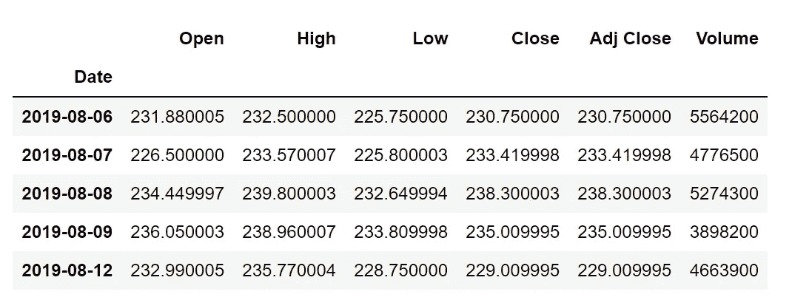
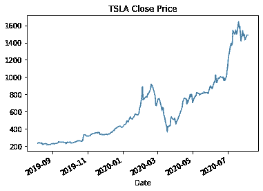
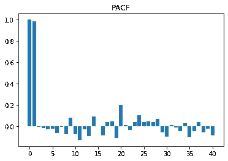
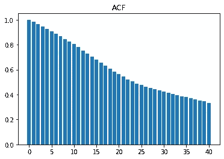
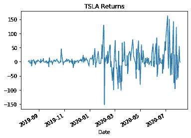
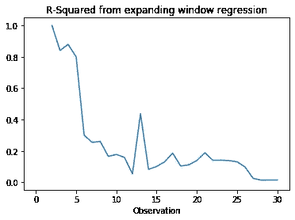
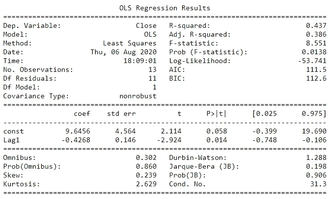
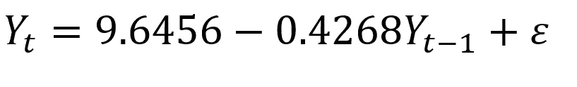
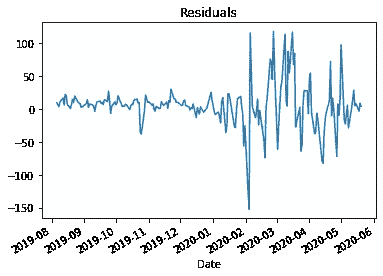
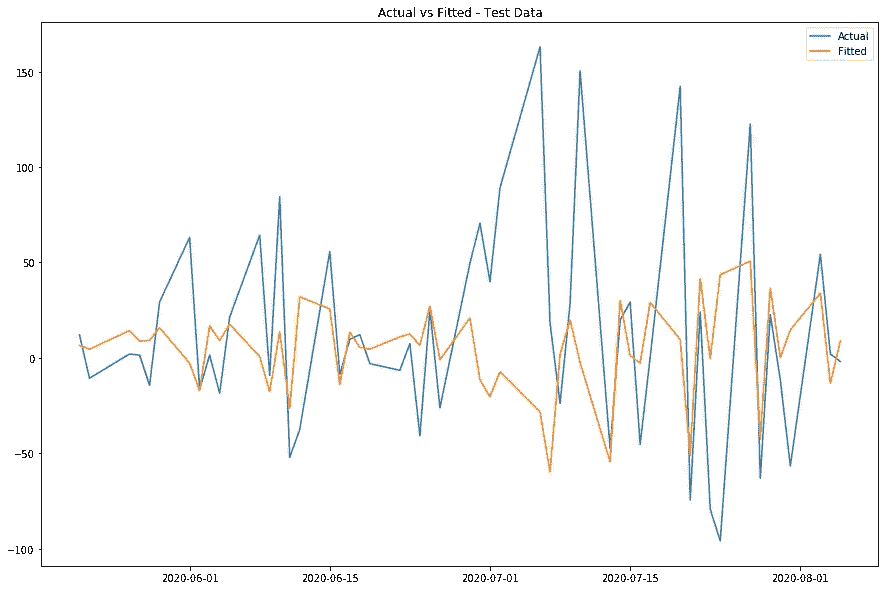

# 用自回归预测特斯拉的股价

> 原文：<https://towardsdatascience.com/forecasting-teslas-stock-price-using-autoregression-52e7908d34b6?source=collection_archive---------19----------------------->

## 了解如何使用 Python 将基本的时间序列建模技术应用于 Tesla 的股票价格。


资料来源:Bram Van Oost via Unsplash。

过去几个月里，特斯拉一直在金融市场兴风作浪。此前被评为美国最被卖空的股票[1]，特斯拉的股价此后飙升至 2780 亿美元的市值[2]。其最新的季度业绩表明，它现在可以加入标准普尔 500 了，尽管它是美国第 12 大公司，但它目前还不是其成员[3]。

在市场波动、各种交易策略和“FOMO”(害怕错过)感的背景下，预测特斯拉股票的回报是一项艰巨的任务。但是，我们将使用 Python，使用自回归来预测特斯拉的股价回报。

**探索数据**

首先，我们需要导入数据。我们可以使用从雅虎财经下载的历史股票价格数据。我们将使用“接近”价格进行分析。

```
import pandas as pddf = pd.read_csv("TSLA.csv", index_col=0, parse_dates=[0])
df.head()
```



来源:雅虎财经。



来源:雅虎财经。

为了确定 ARMA 模型的阶数，我们可以首先绘制一个*偏自相关函数。*这给出了因变量和其自身滞后之间的相关量的图形解释，*未通过*所有*低阶滞后的相关来解释*。

从下面的 PACF 中，我们可以看到滞后的显著性在滞后 1 之后消失，这表明我们应该使用自回归(AR)模型[4]。

```
# Plot PACF
from statsmodels.tsa.stattools import acf, pacf
plt.bar(x=np.arange(0,41), height=pacf(df.Close))
plt.title("PACF")
```



有限&滞后 1 后截止，所以 AR。

当绘制自相关函数时，我们会得到一个稍微不同的结果。该系列是无限的，并慢慢衰减，这表明 AR 或 ARMA 模型[4]。考虑到 PACF 和 ACF，我们将使用 AR 模型。

```
#Plot ACF
plt.bar(x=np.arange(0,41), height=acf(df.Close))
plt.title("ACF")
```



无限和阻尼所以 AR/ARMA。

**数据预处理**

在运行模型之前，我们必须确保我们使用的是*静态数据*。平稳性是指数据移动的方式不会随时间而改变的特征。查看本文前面看到的原始股票价格，很明显该序列不是平稳的。我们可以看到，随着时间的推移，股票价格以看似指数的方式上涨。

因此，为了使数列平稳，我们*差分*数列，这实质上意味着**从明天的值中减去今天的值。**这会导致序列围绕一个常数均值(0)旋转，从而给出*股票收益*而不是股票价格。

我们还将使差分序列滞后 1，这**将昨天的值向前推至今天。**这样我们就可以得到我们的 AR 期限(Yt-1)。

将这些值放入同一个数据帧后，我们将数据分成训练集和测试集。在代码中，数据被大致分成 80:20。

```
# Make the data stationary by differencing
tsla = df.Close.diff().fillna(0)# Create lag
tsla_lag_1 = tsla.shift(1).fillna(0)# Put all into one DataFrame
df_regression = pd.DataFrame(tsla)
df_regression["Lag1"] = tsla_lag_1# Split into train and test data
df_regression_train = df_regression.iloc[0:200]
df_regression_test = df_regression.iloc[200:]tsla.plot()
```



差分序列。来源:雅虎财经。

**形成 AR 模型**

现在，我们应该用多少个值来预测下一个观察值呢？使用所有过去的 200 个值可能不会给出很好的估计，因为直观上，200 天前的股票价格活动不太可能对今天的价值产生重大影响，因为自那时以来许多因素可能已经发生了变化。这可能包括收入、竞争、季节等等。因此，要找到用于回归的最佳观察窗口，我们可以使用的一种方法是使用*扩展窗口运行回归。*下面的代码详细介绍了这种方法，它使用一个过去的观察值进行回归，记录 r 平方值(拟合优度)，然后重复这一过程，**每次将过去的观察值扩展 1。**从经济角度来看，我将窗口期限制在 30 天。

```
# Run expanding window regression to find optimal windown = 0
rsquared = []while n<=30:

    y = df_regression_train["Close"].iloc[-n:]
    x = df_regression_train["Lag1"].iloc[-n:]
    x = sm.add_constant(x)model = sm.OLS(y,x)
    results = model.fit()rsquared.append(results.rsquared)n +=1
```

查看每次迭代的 r 平方图，我们可以看到它在 1–5 次迭代附近较高，并且在 13 个过去值处也有一个峰值。在 1 和 5 之间选择一个值似乎很诱人，但是，非常小的样本量可能意味着我们的回归在统计上有偏差，所以不会给我们最好的结果。因此，让我们选择 13 次观察的第二个峰，因为这是一个更充分的样本量，它给出了大约 0.437 的 r 平方(即模型解释了数据中 43%的变化)。



r 平方图。

**对训练数据运行 AR 模型**

下一步是使用我们过去 13 次观察的窗口来拟合 AR(1)模型。我们可以使用 statsmodels 中的 OLS 函数来实现这一点。以下代码:

```
# AR(1) model with static coefficientsimport statsmodels.api as sm
y = df_regression_train["Close"].iloc[-13:]
x = df_regression_train["Lag1"].iloc[-13:]
x = sm.add_constant(x)model = sm.OLS(y,x)
results = model.fit()
results.summary()
```



AR(1)模型的回归输出(训练数据)。

正如我们在统计摘要中看到的，常数和第一个滞后的 p 值在 10%的显著性水平上是显著的。查看系数的符号，常数上的正号表明，在其他条件相同的情况下，股票价格回报应该为正。此外，第一个滞后上的负号表明，在其他条件相同的情况下，股票回报的过去值低于今天值，这也**维持了股票回报随着时间推移而增加的说法。**

很好，现在让我们使用这些系数来找到特斯拉股票回报的拟合值，这样我们就可以根据原始数据绘制模型。我们的模型现在可以指定为:



我们的 AR(1)方程。

**绘制残差图(实际-拟合)**



残差(训练数据)

残差表明模型在 2019 年表现更好，但在 2020 年随着波动性增加，模型表现相当差(残差更大)。这很直观，因为 2020 年 3 月抛售经历的波动对美国股市产生了巨大影响，而科技股尤其感受到了快速而可观的反弹。这一点，加上 Robinhood 等平台上的散户投资者加大了对特斯拉股票的押注，加剧了价格波动，从而加大了预测难度。

考虑到这些因素，以及我们之前 43%左右的 r 平方，我们不会期望我们的 AR(1)模型能够预测准确的股票回报。相反，我们可以通过计算其“命中率”**来测试模型的准确性，即当我们的模型预测为正值而实际值也为正值时**，反之亦然。总结真阳性和真阴性的实例，我们的模型的准确性达到 55%左右，对于这个简单的模型来说，这是相当好的。

**根据测试数据拟合模型**

现在，让我们将同样的方法应用于测试数据，看看我们的模型如何执行样本外的*。*



实际值与拟合值(测试数据)。

```
# Calculate hit rate
true_neg_test = np.sum((df_2_test["Fitted Value"] <0) & (df_2_test["Actual"] <0))
true_pos_test = np.sum((df_2_test["Fitted Value"] >0) & (df_2_test["Actual"] >0))accuracy = (true_neg_test + true_pos_test)/len(df_2_test)
print(accuracy)# Output: 0.6415
```

在将模型应用于测试数据时，我们的命中率提高到了 64%，这是一个很有希望的改进！提高其准确性的下一步可能包括运行滚动回归，其中系数随着每次迭代而变化，或者可能将移动平均(MA)元素并入模型。

***感谢阅读！*** *如果你有什么见解，欢迎随时留下评论。包含我用来做这个项目的源代码的完整 Jupyter 笔记本可以在我的* [*Github 资源库*](https://github.com/nathanwilthomas/tsla_ar_forecasting) *中找到。*

参考

[1]卡门·赖尼克(2020)。特斯拉再次成为美国(TSLA)被卖空最多的股票。市场内幕。可在:[https://markets . business insider . com/news/stocks/Tesla-stock-most-shorted-us-beats-apple-higher-short-interest-2020-1-1028823046](https://markets.businessinsider.com/news/stocks/tesla-stock-most-shorted-us-beats-apple-highest-short-interest-2020-1-1028823046)

[2]雅虎财经，截至 2020 年 8 月 6 日。

[3]史蒂文斯，皮帕(2020)。“特斯拉可能很快就会加入标准普尔 500 指数，但这并不是自动的，即使全年都有盈利”。见:[https://www . CNBC . com/2020/07/21/Tesla-not-a-guarantee-for-s-p-500-even-with-year-of-profits . html](https://www.cnbc.com/2020/07/21/tesla-isnt-a-gurantee-for-the-sp-500-even-with-year-of-profits.html)

[4]约翰逊法官，迪纳多法官(1997 年)。*《计量经济学方法》，第四版。*

*免责声明:本文表达的所有观点均为本人观点，与任何金融实体无关。我不是一个交易者，也没有用本文中的方法赚钱。这不是财务建议。*