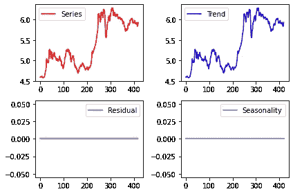

# 用 Prophet 预测铜生产者价格指数

> 原文：<https://towardsdatascience.com/forecasting-the-copper-producer-price-index-with-prophet-d570e3baac78?source=collection_archive---------30----------------------->

## 利用 Prophet 预测商品价格


来源:图片由 [Pixabay](https://pixabay.com/photos/coins-ancient-roman-money-old-4786028/) 的 [papazachariasa](https://pixabay.com/users/papazachariasa-12696704/) 提供

*免责声明:本文是在“原样”的基础上编写的，没有担保。它旨在提供数据科学概念的概述，不应被解释为投资建议或任何其他类型的专业建议。*

即使在最好的情况下，预测资产价格也可能是一件棘手的事情。首先，资产价格受高度随机性(或随机影响)的影响，这使得预测未来变得困难。

也就是说，脸书的[先知时间序列模型](https://facebook.github.io/prophet/docs/trend_changepoints.html)的一个有用的特性是能够识别**变点**，或者时间序列中重大结构变化的时期。准确识别这些点反过来可以改进时间序列预测。让我们看看 Prophet 如何预测铜的生产者价格指数。数据来源于[弗雷德经济数据](https://fred.stlouisfed.org/series/WPUSI019011)使用 Quandl。

# 背景

铜生产者价格指数从 1985 年 9 月到 2020 年 7 月进行分析。由于这是一个金融时间序列，因此该序列被转换为对数格式，以平滑数据并确保模型考虑了百分比基础上的回报。

这是一张数据图表:


资料来源:弗雷德经济数据

从 1985 年 9 月**到 2017 年 1 月**的数据作为训练数据。截止到 2020 年 7 月**的剩余月份用作测试数据——这些数据用于与模型预测进行比较，以评估准确性。**

以下是对该系列的分解:



来源:Jupyter 笔记本输出

我们可以看到，在这种情况下，该系列有一个强大的上升趋势。然而，没有证据表明该系列具有季节性。

也就是说，数据中确实出现了几个结构性突变。从这个角度来看，Prophet 模型在预测测试数据的价格时可能会产生很好的预测能力。

# 模型结构

数据集定义如下:

```
train_dataset= pd.DataFrame()
train_dataset['ds'] = train_df['Date']
train_dataset['y']= train_df['Value']
train_dataset.head(10)
```

标准 Prophet 模型与数据集的拟合如下:

```
prophet_basic = Prophet()
prophet_basic.fit(train_dataset)
```

以下是使用该模型生成的预测:

```
forecast=prophet_basic.predict(future)
fig1 =prophet_basic.plot(forecast)
```


来源:先知

如上所述，特别令人感兴趣的是**变化点**，或者时间序列中的重大结构突变。

```
from fbprophet.plot import add_changepoints_to_plot
fig = prophet_basic.plot(forecast)
a = add_changepoints_to_plot(fig.gca(), prophet_basic, forecast)
```


来源:先知

从上图可以明显看出，模型已经识别出 12 个变化点。现在在此基础上进行预测。

```
pro_change= Prophet(n_changepoints=12)
forecast = pro_change.fit(train_dataset).predict(future)
fig= pro_change.plot(forecast);
a = add_changepoints_to_plot(fig.gca(), pro_change, forecast)future_data = pro_change.make_future_dataframe(periods=43, freq = 'm')

#forecast the data for future data
forecast_data = pro_change.predict(future_data)
pro_change.plot(forecast_data);
```

Prophet 生成了详细的预测:


来源:先知

# 准确(性)

现在让我们根据以下内容评估模型的准确性:

*   **平均定向精度:** 95%
*   **均方根误差:** 0.1948
*   **平均预测误差:** 0.1839

下面是测试集的预测价格与实际价格的对比图:


来源:Jupyter 笔记本输出

整个测试集的平均值为 5.93(以对数表示)，相比之下，RMSE 和 MAE 相当低(大约为平均值的 3%)，表明该模型在预测方面表现良好。由于我们使用的是月度数据，因此不清楚当使用较短的时间范围(例如每小时或每天)时，该模型的表现如何。从这个角度来看，模型预测在预测短期波动方面可能是有限的，但在捕捉总体趋势方面似乎做得相当好。

此外，由于 MDA 为 95%，这表明该模型能够在 95%的时间内预测特定月份的价格方向，这相当不错。

请注意，变点配置对预测准确性有直接影响。例如，当预测中的变点数降低到 **4** 时，RMSE 达到 **0.2840** 。虽然这与平均值相比仍然很低，但仍然是用 12 个变点计算的 RMSE 的近两倍。

# 限制

一般来说，预测资产价格(或任何种类的经济数据)都很棘手。

这是因为资产价格天生受制于反馈回路。例如，假设一个预言家模型在预测铜价方面带来近乎完美的准确性。在这种情况下，更广泛的市场最终将开始使用该模型——假设市场在长期内保持有效——此时，就预测能力而言，竞争优势不再能够获得。

例如，不像天气这样的时间序列——它不能通过人为干预来改变——基于预测的后续交易具有改变价格本身的效果——这意味着以前准确的预测不再准确。

此外，金融时间序列可能会受到干预，这些干预在以前的数据中可能没有被捕捉到。例如，2008 年之前的时间序列数据不会捕捉到美联储将美国利率降至零的情况，因此时间序列本身无法解释如此重大的结构性变化。

当涉及到具体的干预建模时，更有效的方法可能是通过使用[因果影响](https://github.com/dafiti/causalimpact)包。这里有一个[的例子](/analysing-time-series-interventions-with-causalimpact-currency-fluctuations-e6ab14a30768)，说明如何使用这样的工具来模拟利率变化对货币波动的影响。

# 结论

在这个例子中，我们已经看到，在预测资产价格的长期趋势时，Prophet 可以非常有效，并且在识别重大结构变化点以通知此类预测时特别有效。

非常感谢您的阅读，非常感谢您的任何问题或反馈。

更新:如果你感兴趣，[这里有一篇关于这个主题的更新文章，我在其中讨论了如何使用 CNN(卷积神经网络)预测铜价！](https://medium.com/@mgcodesandstats/cnn-vs-prophet-forecasting-the-copper-producer-price-index-af4da63bd93d)