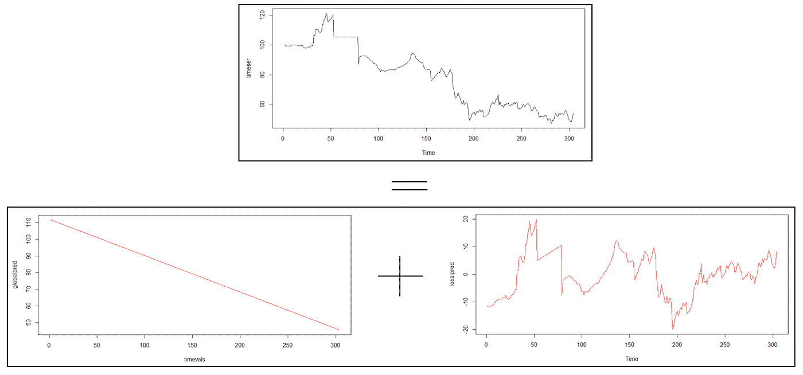
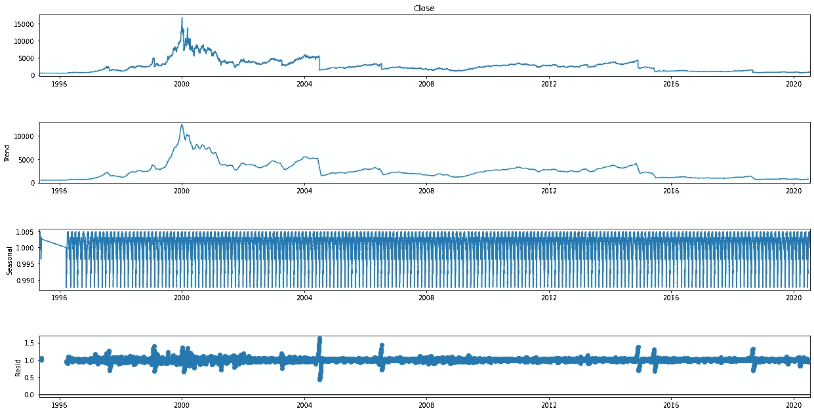
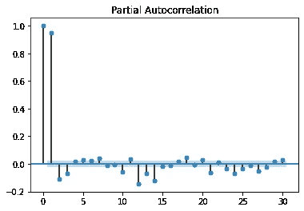
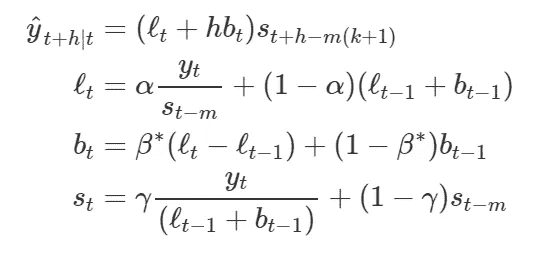

# 预测时间序列数据-股票价格分析

> 原文：<https://towardsdatascience.com/forecasting-time-series-data-stock-price-analysis-324bcc520af5?source=collection_archive---------14----------------------->

## 时间数列预测法

## 重点介绍了使用不同的平滑方法和 Python 中的 ARIMA 对时间序列数据进行预测。

[lo lo](https://unsplash.com/@bylolo?utm_source=medium&utm_medium=referral) 在 [Unsplash](https://unsplash.com?utm_source=medium&utm_medium=referral) 上拍照

在本文中，我们将浏览某家公司的股票价格。**然而，本文并不鼓励任何人仅仅基于这种预测进行交易。**股票价格取决于各种因素，如供求关系、公司业绩、投资者情绪等。

## 什么是时间序列？

时间序列由定期捕获的观察值组成。时间序列数据集具有很强的时间依赖性。它可以用来根据以前的观测结果预测未来的观测结果。

## 分解时间序列:

时间序列可分为以下几个部分:

***趋势:*** 数据值的增减。这可以进一步分为全球趋势和局部趋势。

实际观察值=全球趋势+当地趋势(来源:UpGrad)

***季节性:*** 系列中可见的是重复模式。数据值的这种上升或下降是固定频率的。例如，圣诞树的销量在 12 月份总是较大，而在其他时间则较少。

***周期性:*** 它是数据的值的上升和下降，不是固定的频率。它可以被看作是经济条件或其他外部因素的结果

***噪声:*** 它只是我们从时间序列中提取趋势和季节成分后得到的一些随机数据。

时间序列的组成部分可以是加法或乘法版本。当季节性模式的幅度随着数据值的增加或减少而增加或减少时，乘法模型是优选的。当季节模式的幅度与数据值不相关时，最好使用加法模型。

加法和乘法季节性——资料来源: [kourentzes](https://kourentzes.com/forecasting/2014/11/09/additive-and-multiplicative-seasonality/)

在加法版本中，季节性模式的幅度仍然与上升趋势无关，而在乘法版本中，它随着时间序列趋势的增加而增加。

# 如何获取股价数据？

我们可以通过使用[请求](https://pypi.org/project/requests/)包创建一个 API 请求来获取股票价格。我们也可以使用 [quandl](https://www.quandl.com/) 包，它被设计用来提供金融和经济数据。

我们将通过创建一个 **API 调用**从 [alphavantage](http://www.alphavantage.co) 网站提取美国股票的价格。使用下面的代码片段，我们提取了 IBM 的每日股票价格。您可以参考此[链接](https://www.alphavantage.co/documentation/)来更改您的请求需求。

为了使用 quandl 包将数据导入 python，您可能需要安装 quandl 包。输入命令**！pip 将 quandl** 安装到您的 Jupyter 笔记本中，您就可以开始了。我们已经导入了 Infosys (BOM500209)的价格，并将使用这些价格进行进一步的分析。关于 quandl 以及如何充分利用它的更多文档可以在这里找到。

对于这两种方法，您都需要创建一个 API 键，用于获取数据。你可以通过点击这些链接轻松获得你的 API:[alpha vantage](https://www.alphavantage.co/support/#api-key)和 [quandl](https://www.quandl.com/sign-up) 。

现在我们已经得到了数据，我们需要绘制它来获得趋势的概貌。

趋势会像股票一样经历一些起伏。这不是季节性的，因为季节性因素并不能提供更清晰的情况。除了一些观察结果，残差的方差似乎保持不变。

# 检查平稳性

对于 ARIMA，必须使时间序列**静止**以便进一步分析**。**对于一个平稳的时间序列，它的统计特性(均值、方差等)在整个序列中都是相同的，与你观察它们的时间无关。平稳的时间序列没有长期可预测的模式，如趋势或季节性。时间图将显示序列大致具有恒定方差的水平趋势。

## 滚动统计

我们可以绘制滚动平均值和标准偏差，以检查统计数据是呈上升趋势还是下降趋势。如果这些统计数据随时间变化，那么时间序列很可能是非平稳的。

## ADF 和 KPSS 试验

为了检验时间序列的平稳性，我们还将使用 ADF **(增广的 Dickey-Fuller)** 检验和 KPSS **(科维亚特科夫斯基-菲利普斯-施密特-辛特斯)**检验。ADF 检验的零假设是时间序列不是平稳的，而 KPSS 的零假设是平稳的。

时间序列的平稳性检验

我们可以看到，随着股票价格的上涨和下跌，滚动平均线会随着时间的推移而上升和下降。ADF 检验的 p 值大于 0.05，这意味着我们不能排除零假设。KPSS 检验的 p 值低于 0.05，这意味着我们拒绝零假设。所有这些检验的结论是，时间序列不是平稳的。

# 时间序列如何去趋势化？

**求差:**通过对当前时间与其前一时间的实际观测值求差，计算当前时间的值，构造新的序列。

> 值(t) =实际观察值(t) -实际观察值(t-1)

**转换:**使用乘方、平方根、对数等转换数值有助于数据线性化。例如，记录这些值有助于获得具有指数趋势的序列的线性趋势。 **log(exp(x))=x**

**季节差异:**时间序列的值是通过一个观测值与其前第 n 个观测值之间的差异来计算的。这有助于消除这种趋势

> 值(t) =实际观察值(t) -实际观察值(t-N)

**拟合模型:**我们可以用线性回归模型来拟合时间序列。它将符合时间序列的线性趋势。通过用模型预测的值减去实际观测值，可以计算出去趋势时间序列的值。

> 值(t) =实际值 _ 观察值(t) -预测值(t)

时间序列去趋势化后，ADF 和 KPSS 检验表明时间序列是平稳的。部分自相关函数(PACF)图表明，相关性存在于某些滞后。

## 分割数据集

列车测试分离

# 模型结构

为了预测价格，我们可以使用平滑法和 ARIMA 法。平滑方法可用于非平稳数据，而 ARIMA 要求时间序列是平稳的。我们还可以利用 *auto_arima* ，它使序列平稳，并确定 arima 模型的最佳阶数。

对于每一种方法，我们将对超参数的优化进行多次拟合，并将最优值用于最终模型。

## 简单指数平滑

当数据不包含任何趋势或季节性时，使用简单指数平滑或 SES。level (α)的平滑因子为观测值的影响提供了权重。α值越大，意味着越重视最近的过去观测，而值越小，表明预测时考虑的过去观测越多。

简单指数平滑

简单指数平滑片段

简单指数平滑预测

## 霍尔特指数平滑法

霍尔特的指数平滑法在预测时间序列时将趋势考虑在内。当数据中有趋势而没有季节性时使用。它计算平滑值(第一个等式)，该值与 SES 中用于预测的值相同。趋势系数(β)为后续平滑值和之前的趋势估计值之间的差异提供权重。预测是平滑值和趋势估计的组合。

霍尔特指数平滑法

霍尔特的指数平滑片段

霍尔特指数平滑预测

## 霍尔特-温特斯指数平滑法

霍尔特-温特斯指数平滑法在预测时间序列时考虑了趋势和季节性。它使用用于计算时间序列中的水平分量、趋势分量和季节分量的公式来预测这些值。根据数据的季节变化，要么使用加法，要么使用乘法。

加法(来源: [otexts](https://otexts.com/fpp2/holt-winters.html)

乘法(来源: [otexts](https://otexts.com/fpp2/holt-winters.html)

## 自回归综合移动平均(ARIMA)

ARIMA 模型是自回归模型和移动平均模型的结合，并结合了差分法。自回归模型确定了一个观测值和一定数量的滞后观测值之间的关系。积分部分是实际观测值的差值，以使时间序列平稳。移动平均确定观测值和残差之间的关系，残差是通过对滞后观测值使用移动平均模型获得的。

*自回归(p) - >模型中滞后观测值的个数。也称为滞后订单。*

*积分(d) - >实际观测值的平稳性差值的次数。也称为差异程度。*

*移动平均线(q)——>移动平均线窗口的大小。也称为移动平均的顺序。*

ARIMA 片段

ARIMA 天气预报

# 摘要

为了评估模型的性能，我们将使用均方根误差(RMSE)并比较哪个模型的性能优于其他模型。

RMSE 摘要

在这三个模型中，表现较好的模型是霍尔特的指数平滑法，它获得的 RMSE 最小。

在本文中，我们了解了时间序列及其组件，使用 API 调用和包获取数据，检查时间序列的平稳性，对时间序列进行去趋势化，用不同的类型对时间序列建模，以及最后对其进行评估。

你可以在这里找到笔记本供你参考。