# 预测战争:经典预测方法与机器学习

> 原文：<https://towardsdatascience.com/forecasting-wars-classical-forecasting-methods-vs-machine-learning-4fd5d2ceb716?source=collection_archive---------21----------------------->

我们将使用来自 kaggle 竞赛的数据 [M5 预测-准确性](https://www.kaggle.com/c/m5-forecasting-accuracy)。

任务是尽可能精确地预测沃尔玛在美国销售的各种产品的单位销售(需求)。

更准确地说，我们必须预测未来 28 天的日销售额。该数据涵盖了美国三个州(加利福尼亚州、德克萨斯州和威斯康星州)的商店，包括商品级别、部门、产品类别和商店详细信息。

数据是巨大的，对于这个演示，我将使用其中的一个子集，一个来自销售数据集中的产品。

**我们的目标是将经典的时间序列分析技术与机器学习算法进行比较。**

所有代码都可以在 [GitHub](https://github.com/Deffro/Data-Science-Portfolio/tree/master/Notebooks/Forecasting%20Wars%20-%20Classical%20Forecasting%20Methods%20vs%20Machine%20Learning) 上获得。

谁会更好地预测未来？

竞争对手:

1.  简单指数平滑
2.  双指数平滑
3.  三重指数平滑
4.  ARIMA
5.  萨里玛
6.  萨里马克斯
7.  光梯度增强
8.  随机森林
9.  线性回归

下注吧！

加载要使用的包。

读取数据。

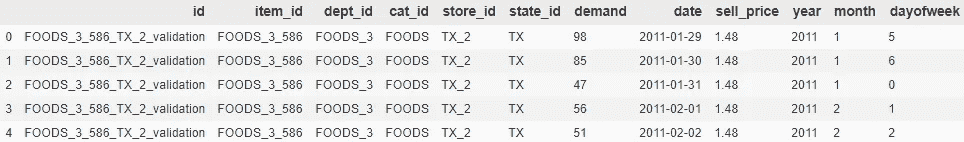

数据集的前 5 行。

要预测的**目标**变量是**需求**(该产品在该日期将售出多少件)。

日期从 2011 年 1 月 29 日到 2016 年 5 月 22 日，总共 1941 天。后 28 天是竞赛 _ 测试集，按照竞赛的指示，所以我们不知道需求(等于 0)。

为了训练和验证模型，我将数据分成两部分:训练和测试。测试装置不应与竞赛测试装置混淆。

**测试集**将具有与测试 competition_test 相同的长度，以模拟相同的条件。因此，它将由 2016 年 3 月 27 日**和 2016 年 4 月 24 日(28 天)**之间的日期组成。训练集将是所有其他先前的值。

从初始数据中分离出训练测试。

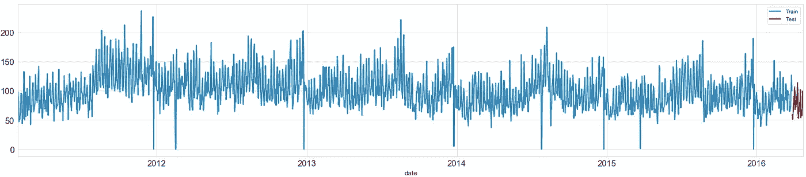

时间序列(训练-测试)线图。

我们有很多训练数据，过去 28 天是测试集。我们的目标是使用以前的值来预测它们。

接下来，我将创建一个*预测*数据帧来存储所有模型的预测。每个模型将是该数据框架中的一列。另外，一个 *stats* dataframe 存储每个模型的性能和执行时间。

# 训练和评估模型

我们将从简单的传统预测模型开始。不要低估他们。

# 简单指数平滑

这是简单移动平均的一种变体，称为指数加权移动平均(EWMA)或简单霍尔特-温特斯法。用于将其加载到 Python 的包称为 SimpleExpSmoothing。我们必须定义一个名为 *span* 的参数，它将等于数据集的季节周期。

自相关。

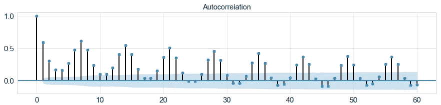

每个值与多达 60 个以前的滞后进行比较。

从自相关图中，我们可以清楚地看到，每 7 个滞后就有一个相关性峰值。这意味着当天的值和之前 7 天的值具有很高的相关性。我将设置 span 等于 7。经过训练，使用*。预测(x)* ，x=28 天，模型预测未来 28 天。将使用均方根误差进行评估。

简单的指数平滑。

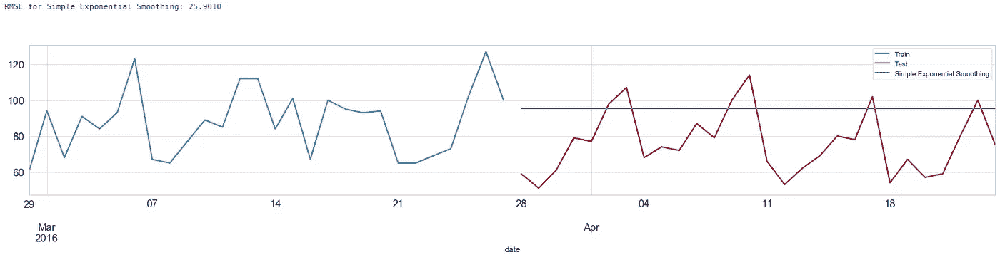

简单指数平滑的性能。

那些投票支持简单指数平滑的人确实会失望。然而，让我们以 RMSE 为基准。

# 双指数平滑

简单指数平滑仅使用一个平滑因子α (alpha ),而双指数平滑添加了第二个平滑因子β (beta ),用于处理数据趋势。我们必须定义*季节周期*。

双重指数平滑。

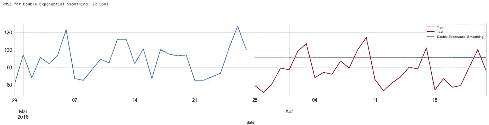

双指数平滑的性能。

比 SES 好，但还是直线。我们能做得更好吗？

# 三重指数平滑

与霍尔特-温特斯最密切相关的三重指数平滑法增加了对数据中趋势和季节性的支持。

三重指数平滑。

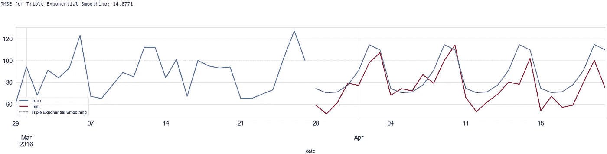

三重指数平滑的性能。

现在我们正在做一些事情！TES 很好地捕捉到了数据的季节性，并且几乎总是接近测试数据。缺点是我们必须输入季节周期的数量。如果这个数字不是 7，性能会变差。

# ARIMA

一个 ARIMA 模型由三部分组成:p，d，q

*   p 是 AR 项的阶数。它是指用作预测值的 Y 的滞后数。
*   q 是 MA 项的阶数。它是指应该进入 ARIMA 模型的滞后预测误差的数量。
*   d 是使时间序列平稳所需的差分次数

**自动选择 ARIMA 参数**

我们将使用优秀的 *auto_arima* 包，它会自动发现 arima 模型的最佳订单。

让我们忽略季节性。如果我们加上季节性，这个模型将是 SARIMA，这将在后面讨论。

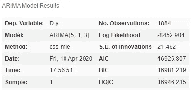

arima 的 auto_arima 结果。

ARIMA。

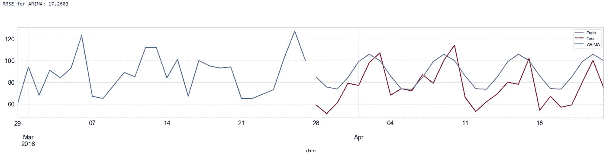

ARIMA 的表演。

这里使用的简单 ARIMA 模型没有考虑季节性。这是一个(5，1，3)模型。这意味着它使用 5 个滞后来预测当前值。涉及滞后预测误差数量的移动窗口的大小等于 1。使时间序列平稳所需的差值为 3。

该模型的性能比三重指数平滑法差。

# 萨里玛

它是 ARIMA 的扩展，接受一组额外的参数，专门描述模型的季节组成部分。

与 ARIMA 相比，我们将使用 2 个额外的参数:*季节性=真实值*和 *m=7* 。我们现在考虑季节性，并对模型说它等于 7。Auto_arima 运行的时间要长得多。

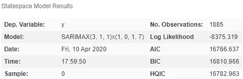

SARIMA 的 auto_arima 结果。

萨里玛。

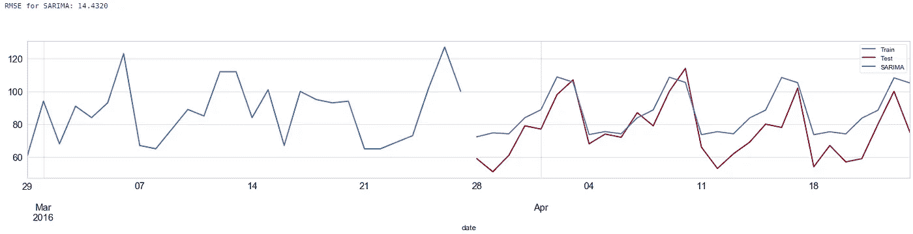

萨里玛的表演。

这比简单的 ARIMA 好得多，事实上也比三重指数平滑法好得多！

# 萨里马克斯

使用以前的方法，我们唯一可以使用的数据是以前的历史数据。带有外生回归的季节性自回归综合移动平均引入了外部特征可以影响时间序列的思想。

我们将添加数据集的另一个特征，即 *sell_price* ，以帮助模型，并有望做出更好的预测。

萨里麦克斯。

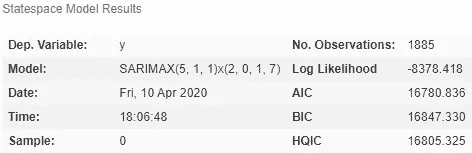

SARIMAX 的 auto_arima 结果。

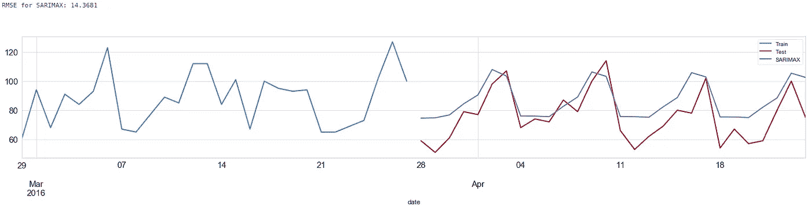

SARIMAX 的性能。

SARIMAX 运行时间更长。额外的功能减少了误差！

# 机器学习

机器学习模型，不能仅仅通过它本身以前的值来预测目标。他们需要特色。这就是我们将要做的，构造一些特征。

目标先前值的所有信息都将丢失。我们将创建要素来维护这些信息。

史上最大的 github gist。

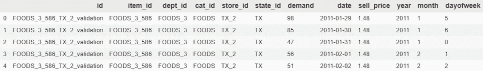

数据集的前 5 行。

我将创建的功能相对较少且简单。

*   滞后 7:提前 7 天的需求值
*   滚动平均值 7_7:在滞后 7 上，计算前 7 天的滚动平均值。这意味着我们现在回到了 14 天前。

当滞后 7 捕获一天时，滚动平均 7 在单个特征中捕获关于 7 天的信息。

有人可能会想，哦，那么我们为什么不为每个滞后创建一个特征呢？滞后 1，2，3，..1885,..？我们可以创建一些，如滞后 6 和 8(我们看到它们在自相关图中很强)，或滞后 14，30。然而，增加数据集的维度将是一个严重的问题。RAM 过载、巨大的执行时间、过拟合、相关性。

创建的其他功能包括:

*   每月需求平均值，最大值，最大值到最小值差值。这捕获了信息:该产品在 12 月、4 月等的平均销售额是多少。
*   每天每周平均值、中值、最大值

创建特征的函数。

为 ML 准备数据。

# 适合模型

适合三个 ML 模型。

# 使用滑动窗口通过模型进行预测

这部分需要更多的关注。我会解释的。

测试集由 28 天组成。假设是第 1，2，3…，28 天。还记得我们为训练集创建的特性 lag_7 吗？显然，我们将为测试集创建相同的特性。当我们为测试集的第一天创建这个特性时，它被创建得非常好。它提前 7 天(在训练集中)并复制该值。如果我们在第 10 天创建这个特性，它会提前 7 天。这是测试的第三天。我们不知道它的价值！

所以我们做了一个滑动窗口，一次向前移动一天。在每次迭代中，我们预测今天的价值。所以我们用我们的预测来填充测试集。当我们到达测试集中的第 10 天时，我们将具有先前的值，并且可以计算 lag7。

等等，你为什么使用长度为 15 的滑动窗口(max_lags=15)？功能 lag 7 需要至少提前 7 天的样本。特征滚动平均 7_7 需要提前 14 天。因此，为了成功创建要素，最小窗口大小应为 14。如果我们增加窗口的大小，它不会影响这些功能。他们不使用早期的值。但如果我们增加它，那么它将影响其他功能(每月平均需求等)。我尝试过增加它，但 rmse 减少了一点，执行时间增加了一点。

预测未知未来的滑动窗口技术。

# 光梯度增强

我调整了算法的参数以获得更好的性能。

光梯度增强。

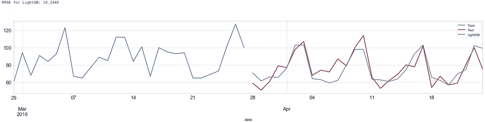

光梯度增强的性能。

啊，LightGB...它从不让人失望。(但是，不要盲目的用在每个问题上。)

# 随机森林

我调整了树的最大深度以获得更好的性能。

随机森林。

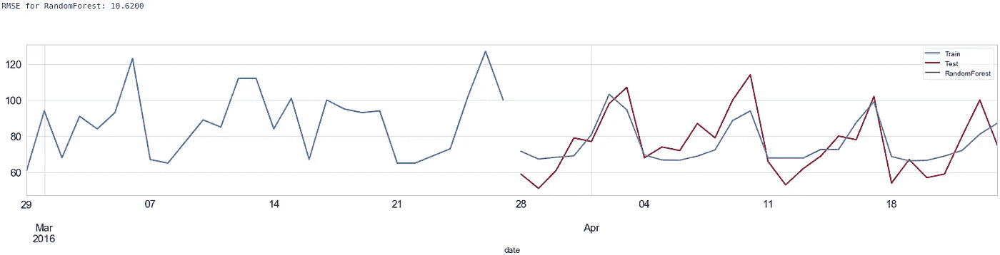

随机森林的性能。

随机森林的表现也很好。

# 线性回归

线性回归。

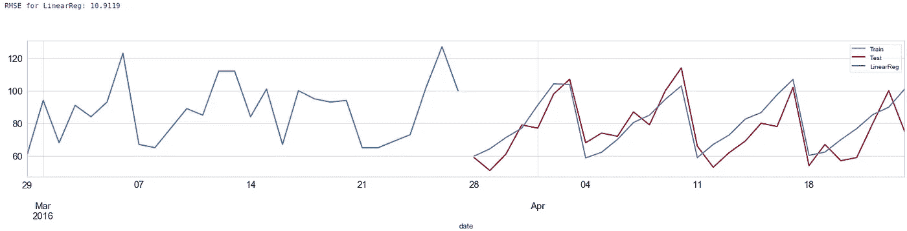

线性回归的性能。

好老线性回归在这里是极好的！

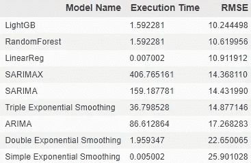

所有竞争者的执行时间和 RMSE。

传统的预测方法要慢得多。

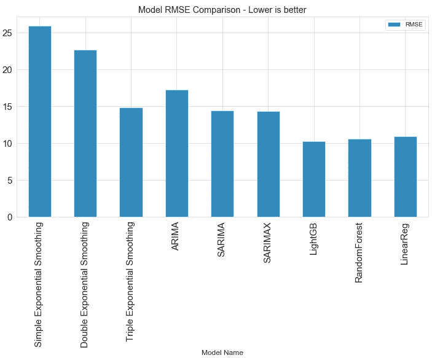

每个模型的均方根误差。越低越好。

在我们分析的最后，我可以说这只是一个基线实验。当然，可以创建更多的特征，然后通过特征选择技术来选择最佳数量，可以进行更多的超参数调整，这样的例子不胜枚举。

那么 ML 方法是否优于经典的时间序列预测方法呢？

*也许是*

这当然取决于问题。机器学习方法需要特征。如果我们只有时间序列的值，那么我们能够创建的唯一特征就是基于它们。这些将是滞后，移动平均线等，所以我们可以包括尽可能多的信息，而不需要做太多的栏目。只有 6 个特征的线性回归优于所有经典方法。通过特征工程使 ML 方法变得更好是数据科学家的职责。突出算法的不一定是模型，而是提供给算法的数据。

所以带 LightGB 的 ML 机型赢了战斗，但没打赢战争。