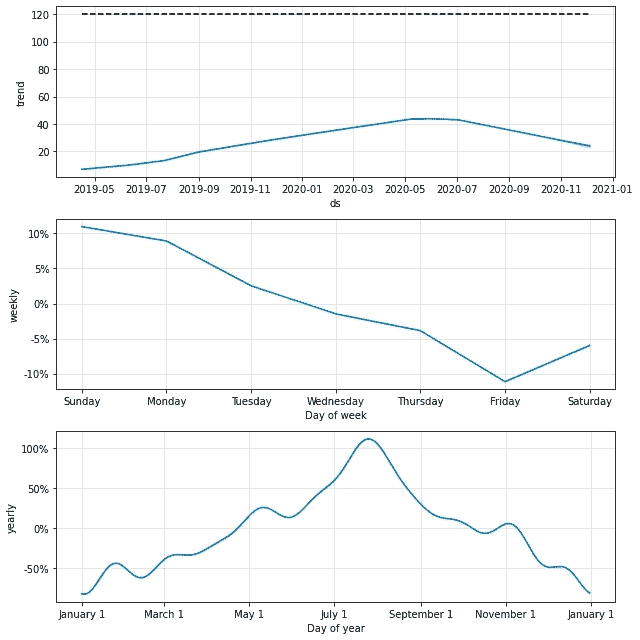
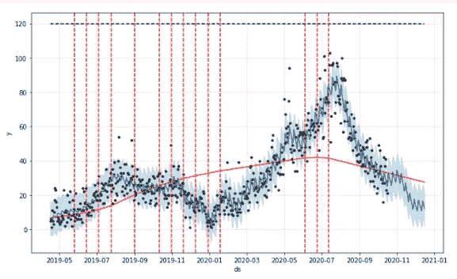

# 用 Python 和 Google Analytics 预测网络流量

> 原文：<https://towardsdatascience.com/forecasting-web-traffic-with-python-and-google-analytics-fb066659ae8f?source=collection_archive---------15----------------------->

## [实践教程](https://towardsdatascience.com/tagged/hands-on-tutorials)

## 向业务经理展示未来:一步一步地创建 web 流量的时间序列预测，绘制成 GIF 图。

最终的结果是:一个美丽的图表描绘了我的 12 月份的交通会有多糟糕。

SolarPanelCompany 决定雇佣他们的第一个数据科学家:我。我对从零开始构建一切的挑战感到非常兴奋。我的目标是获得第一场速战速决的胜利，向车队展示我的价值。

第一周，一位营销经理惊慌失措地来到你的办公桌前:“你看！”他指着笔记本电脑的屏幕说，“在谷歌分析上，我看到我们的流量在上个月下降了！你的预测数据学习材料能做些什么来拯救企业吗？”。

“好吧，”我想“这不是真正的问题。”所以我换了一种说法:“你是在要求我证明我们是有下降趋势，还是只是季节性效应？”。他茫然地凝视着。“你是在问我，我们什么时候能希望它回升？—是的！正是如此！我明天和市场总监有个会议。我让你在那上面工作！”

如果这种情况发生在你身上，或者如果你想创建自己的网站流量的可视化预测，你就在正确的页面上！下面是**的一步一步的指导**，根据你的谷歌分析数据预测你网站的访客数量，作为奖励，让它成为商业人士喜欢的 GIF。简而言之，我们将使用 Prophet 包创建一个时间序列模型。

本指南包括 3 个步骤:

1.  用 Python 调用您的 Google Analytics API 数据
2.  使用 Prophet 构建您的模型
3.  制作你的预测的 GIF 图(因为它很有趣)

# 1.连接到您的 Google Analytics API

*这一步需要:谷歌分析帐户的管理员权限*。*如果你没有，你可以用一个* [*演示谷歌分析账号*](https://support.google.com/analytics/answer/6367342?hl=en) *然后简单的导入 csv 格式的数据。*

这不是一个容易的步骤，但是 Google 创建了很多文档来帮助你完成。我将在这里提出一步一步的指南来获取流量。如果你对其他指标感兴趣(比如目标、浏览量等。)你需要看一看内容广泛的官方 [Google 的管理 API 文档](https://developers.google.com/analytics/devguides/config/mgmt/v3)。

让我们导入我们的包:

第一个包裹是我们永远的朋友熊猫。最后两个包来自 Google，允许您调用 Google Analytics API。

如果你还没有访问 Google API 的权限，你需要在你这边激活它。下面的视频解释了这样做的所有步骤。

所以让我们开始开心吧。我们的第一段代码是调用键和右视图。请注意，您可以在谷歌分析账户的“设置>查看”中找到查看次数

在上面的部分中，第一行没有改变，但是第二行和第三行必须用你自己的访问键来改变。

现在我们将使用 Google API 文档中的代码。如果你不完全理解，没关系:如果你适当地修改了上面的段落，复制粘贴就可以了。

我们可以看到上面提到的“度量标准”。在我这边，因为我想做一个时间序列，所以我只关心流量维度，但也导入页面视图供以后分析。

这些代码块是谷歌为愿意获取他们数据的人提供的标准代码。

好了，现在你的数据在数据框中了。恭喜你！你成功调用了 Google API，第一步就实现了。

# 2.预测你的网络流量

所以我们有数据。这已经花了一些时间，但现在是有趣的部分:预测 SolarPanelCompany 的网络流量。

迈克尔·威尔森在 [Unsplash](https://unsplash.com?utm_source=medium&utm_medium=referral) 上的照片

为了开始预测谷歌分析流量，我们需要开始导入我们的包。我们将在这里使用脸书的先知。这个伟大的工具非常容易使用，因为它使用了与软件包 scikit 相同的语法。脸书自己使用他们所有的时间序列预测，无论是网络流量或其他。

让我们先探索一下，并检查我们的数据是如何做的。一个简单的情节就完成了任务。

我们已经可以在数据中看到很强的季节性。的确，这是关于太阳能电池板的数据。因此，季节性是可以预料的:随着阳光越来越强烈，它从 2 月到 7 月平稳生长。然后，到了八月，人们知道享受阳光已经太晚了，队伍就下降了。

回到我们的代码，让我们看看先知说了什么。脸书的先知要求你改变你的两个专栏的名字:

*   **值**列需要称为**‘y’**
*   **时间戳**需要是**‘ds’**并且是一个日期时间变量。

## 2.1 缺失数据

尽管脸书声称 Prophet 对缺失数据和异常值有很好的抵抗力，但去掉它们也未尝不可。尤其是在我们这种情况下:假设网站的跟踪崩溃了一两天，你不希望这个影响。

如果你有一些丢失的数据，就像我一样，你将把它们输入到一个新的数据框架中。您还需要给它赋值。我个人用的是 7 天均线。

然后我们把框架连接在一起，放上一个盖子和一个地板。楼层是“0 ”,因为你知道你不会有负流量。另一方面，cap 纯粹是“人在回路中”的工作，所以基于你的良好判断。这个顶部和底部将有助于创建模型的边界。

## 2.2 EDA

那会很快，因为我们没有那么多的功能；只有观察本身的价值。

我们看到，丢失的数据中不再有离群值，我们可以继续保留。

## 2.3 预测我们的网络流量:培训

用 Prophet 训练模型真的很简单。该团队复制了 scikit 软件包所使用的机制:。fit()和。预测()

## 创建模型

所以首先我们创建模型。有许多变化可以添加。下面我会解释我的选择。

*   Changepoint_prior_scale:应对欠拟合。增加使趋势更加灵活(因此在视觉上扩大了终端漏斗)
*   Changepoint_range:默认情况下，Prophet 只改变前 80%数据的趋势斜率。我在这里将它设置为 0.9，以包含 90%的数据。
*   季节性模式= '乘法'作为参数，因为季节性的影响越来越大。我们清楚地看到，我们的业务正在呈倍增趋势增长，而不是呈线性增长。
*   每年.季节性= 20。它是 10，但我想要更多。这个数字代表[傅立叶级数](https://en.wikipedia.org/wiki/Fourier_transform)。

如果你想在不同的标准下改编你的模型，我推荐看看[脸书的先知 Github。](https://facebook.github.io/prophet/)

## 2.3.2 构建预测时间戳集合。

到目前为止，我们已经根据以前的数据训练了我们的模型。为了预测未来的 web 流量，我们首先需要创建未来的时间戳。在这里我将创造 60 天，也就是未来的两个月。

## 2.3.3 预测未来

开始了。在接下来的两行中，我们将通过 Google Analytics 预测我们的网站流量。

瞧！11 月和 12 月可以看到我的交通跳崖之美。

## 分析组件

现在 Prophet 有了另一个伟大的功能:它可以在一个图形中显示不同的组件。

已经有了一些有趣的结论:

*   总趋势是下降。要知道，我的增长是成倍增长的，因此 2020 年秋季将趋势大幅向下推。
*   每周趋势:周四到周六是最糟糕的时刻。如果我想做广告，周日是个好时机。
*   年度:非常有见地。我们可以在八月一日看到顶峰。另外，我们可以看到圣诞节搜索并没有带来多少收入。所以硕果累累的时期是 4 月到 10 月底。

这已经是一些很好的见解，我可以反馈给营销经理。我不仅可以建议他们应该花更多的广告预算，而且我还可以确认，是的，看到我们的流量下降是正常的。而且要到二月份才会恢复。

同样有趣的是将总体趋势与数据进行比较。我们可以在这里看到趋势的变化。

红线横线是趋势。红色虚线是趋势改变的点。

## 2.4 测试模型

太好了，现在我们已经完成了预测谷歌分析流量的大部分工作。但作为严谨的数据科学家，我们也想测试模型。

时间序列的测试与传统模型略有不同。我们需要使用滚动窗口:滚动窗口意味着使用 60 天的数据，并评估它对未来 30 天数据的预测能力。

例如，在上面的图表中，红色部分用于预测绿色部分。在交叉验证后，红色部分将向前移动，以适应下一个 60 天，并再次预测下一个 30 天。这就是滚动窗户的概念。关于滚动窗口的文章[已经够多了，所以我就不再赘述了。](https://medium.com/making-sense-of-data/time-series-next-value-prediction-using-regression-over-a-rolling-window-228f0acae363)

就编码而言，它是这样写:

RMSE 在地平线上密谋

我们在这里。我们现在有了白天地平线上的 RMSE。我们可以看到，视野越远，误差越大。

现在为了你自己的工作，你可以玩模型的超参数来试着把这个推下去。因为我们使用这个图表是为了营销目的，而不是为了工程目的，这样的 RMSE 已经足够好了。

## 3.形象化

所以在第一部分，我获取了我的数据，在第二部分，我创建了模型。现在，是时候让它变得更好，让营销经理和 CMO 对此感到兴奋了。人类真理:有令人愉快的东西看会使它更有价值，所以是时候让我的工作有价值了。

纯粹为了吸引注意力，我创造了一个 GIF 图片。这种动画真的可以吸引人们的注意力，从而引起利益相关者对我的项目的兴趣。

## 3.1 数据绘图

让我们从导入包开始:

我们希望它朗朗上口，所以我们将直接从一个时尚的元素开始:深色背景。

黑色背景上的网络流量数据

非常好的效果。现在让我们画出我们的预测。

## 3.2 将预测绘制成 GIF

我们首先需要创建一个包含数据和预测的数据框架。

好了，这是容易的部分，现在我们将有大块来创建我们的 GIF。要在这里继续，一定要安装 PillowWriter 或 Imagemagick，它们可以将你的图像转换成 GIF 格式。

经典的 *fig，ax* matplotlib 操作的不同之处在于，我们需要创建函数来为图表制作动画。

ax.clear()操作超级重要。如果你像我一样没有把它放进去，动画会在之前的图形上创建一个新的图形。不可怕，除非..每个新图都有一种新的颜色。最终的动画将是一个快速闪烁的图形，每四分之一秒改变一次颜色。足以杀死癫痫患者。

一个艺术上的失败:我丢失了 90%的数据，创建了一个“派对”图，让人看了恶心。

请注意，如果您在笔记本中工作，您将不会在图表中看到动画。你必须下载创建的“animation_video.gif”才能真正看到动画。

你在这里，为你的长时间工作感到自豪，并准备好用你令人惊叹的动画震撼舞台。你现在可以知道你的企业的未来是什么样子了！

# 结论

从 Google Analytics API 获取数据后，我可以在 GIF 中绘制未来网络流量的时间序列。

这个视觉上吸引人的结果帮助营销经理和 CMO 明白，是的，如果流量在冬天下降是正常的。是的，它会在春天重新生长，那时太阳会回来，人们会考虑太阳能投资。

猜猜哪家公司开始加大对其数据团队的投资。

# 更进一步

你的业务经理不明白预测是如何工作的，也不明白你是如何工作的？你可能对[如何向经理们解释预测建模](https://medium.com/@arthur.s.moreau/how-to-explain-predictive-modeling-to-business-managers-ed9a0b3a9ebf)感兴趣

# 附录

Jupyter 笔记本:[https://github . com/Arthur mro/Prediction _ marketing/blob/master/Prophet _ GA _ cs _ info . ipynb](https://github.com/ArthurMro/Prediction_marketing/blob/master/Prophet_GA_cs_info.ipynb)