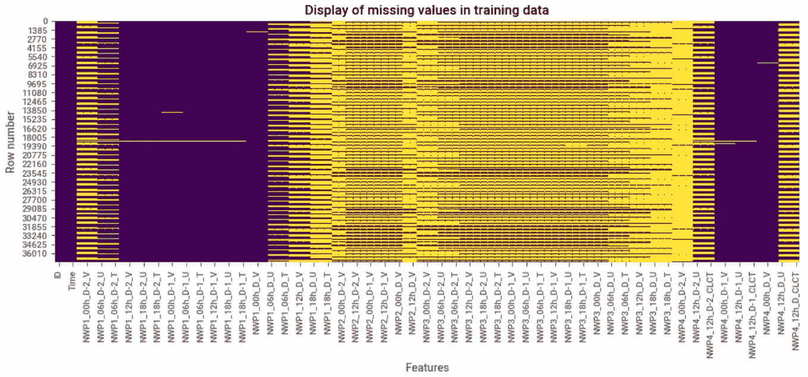
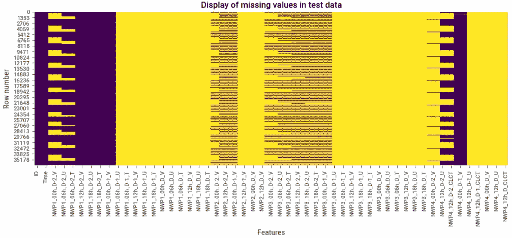
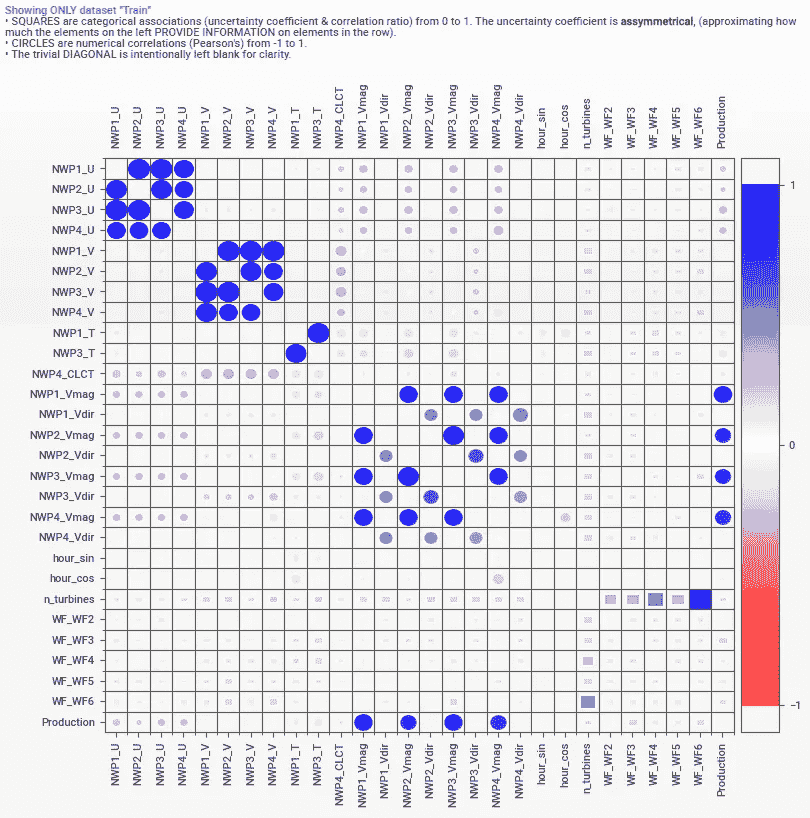
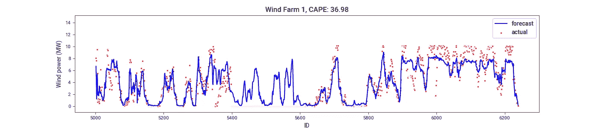
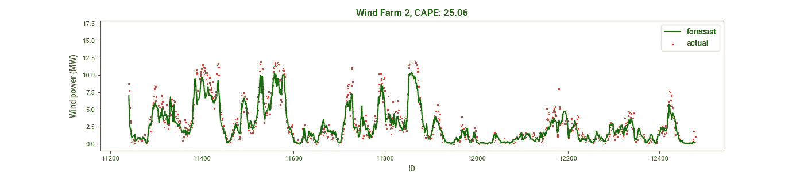
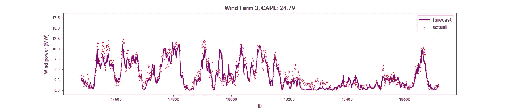
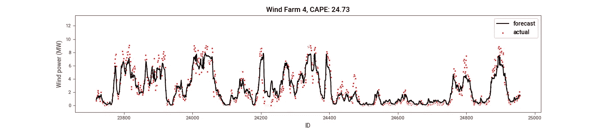
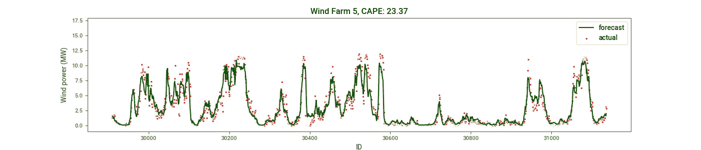
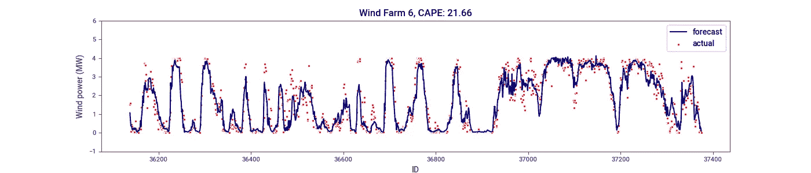

# 从多个数值天气预报预测风力

> 原文：<https://towardsdatascience.com/forecasting-wind-power-from-multiple-numerical-weather-predictions-63c9a67cfc5?source=collection_archive---------31----------------------->

## 数据科学技术在可再生能源领域的应用。

随着美国和整个欧洲对风能生产重新产生兴趣，现在是重新审视可再生能源的可变性和可预测性等重要因素的时候了。


由[瓦尔德马·布兰德](https://unsplash.com/@waldemarbrandt67w?utm_source=medium&utm_medium=referral)在 [Unsplash](https://unsplash.com?utm_source=medium&utm_medium=referral) 上拍摄的照片

在本文中，我将讨论以下内容:

1.  风能的可变性和可预测性
2.  使用多种天气预测的挑战
3.  处理混乱天气数据的技巧
4.  特征工程
5.  风电功率预测的非时间序列方法

**风能的可变性和可预测性**
可靠的能源需要具有低可变性和高可预测性。虽然适度的变化是可以容忍的，但不良的可预测性是不可接受的，并可能导致巨大的收入损失。

风能的可变性是由于对天气的强烈依赖，而天气在一天中会随季节而变化。因此，准确的天气预报对于实现有用的风力预测是必要的。

众所周知，天气预报的准确性随着预报范围的缩短而提高。此外，结合使用不同数值技术的模型预测可能是有益的。因此，风电场依赖于在一天或一周的不同时间生成的模型中的多种天气预测来源。

虽然天气无法控制，但风能行业可以利用人工智能技术的进步来提高能源的可预测性。

**使用多种天气预测的挑战**
我们来讨论一下在风力发电预测中使用多种天气预测时遇到的一些挑战。

1.  *不同高度可预测变量* :
    风速随高度变化。不同的模型可能提供不同高度的速度数据，这使得在没有额外的风电场特定参数或公式的情况下，很难推断出跨模型的缺失值。
2.  *推断时间大量缺失数据* :
    天气数据可能由不同时间生成的不同模型的预测组成。每一列可能有几个缺失的数据，因为在风力发电预测时并非所有的天气预测都是可用的。这种缺失数据不能通过简单的已知策略来估算，例如所有观察值的列平均值或行删除。
    样本训练和测试数据中缺失的值在下面以黄色显示。



作者图片



作者图片

**处理杂乱天气数据的技巧**
下面概述了一些处理来自多个模型和不同时间的天气数据的技巧。

1.  用来自同一模型的最近可用预测的平均值填充缺失值(按列，比如最近三个小时内)。
2.  从最近可用的预测开始，用模型间的平均值填充其他缺失值。
3.  如果仍然有更多的缺失值，使用风电场特定的参数和标准公式将风速从一个已知高度映射到另一个缺失速度的高度。
4.  在一天的不同时间获得的天气预测可以由模型聚合，以减少特征空间和缺失值的数量。
5.  为了生产中机器学习模型的健壮性，在数据管道中实现至少两个上述技巧是很重要的。
6.  最后，如果剩余任何缺失值，则可以应用标准的行移除过程。

**特征工程**应该为每个模型计算这个变量。

添加不同高度的速度大小的标准偏差等特征可以提高预测精度。此外，根据来自多个风电场的一次性编码数据训练模型可能会比根据来自每个风电场的较少数据集单独训练产生更好的结果。

与风电场运行相关的重要特征，如在用涡轮机的比例，可以提高预测性能。该特性不适用于本文中的预测示例。因此，即使在风力发电场似乎要关闭时，也能获得一些电力预测。

[Sweetviz](https://pypi.org/project/sweetviz/) 库用于探索变量分布和变量之间的关系。分布可以在[这里](https://github.com/abbey2017/wind-energy-analytics/blob/master/train_data_report.pdf)找到，变量之间的关联如下所示:



图片由作者使用 sweetviz 库提供

[速度幅度](https://www.khanacademy.org/science/physics/two-dimensional-motion/two-dimensional-projectile-mot/a/what-are-velocity-components)显示了与目标变量(产生的功率)的最强关联，如基于[流体动力学](https://en.wikipedia.org/wiki/Fluid_dynamics)领域的科学知识所预期的。这强调了在将数据驱动的解决方案应用于工程问题时，物理学的重要性。

**预测风力发电的非时间序列方法**
虽然从涡轮机或风电场产生的风力发电是具有一些季节性的时间序列，但是可以在不使用来自目标变量的滞后特征的情况下进行预测。此外，这种方法是稳健的，比时间序列方法更容易实施。

对应于测试集的功率生产不可用。因此，根据训练数据创建验证集来评估模型性能。新的训练集是原始训练数据的 80 %,数据中的每个观察值代表一个由名为 ID 的特征索引的每小时报告。

XGBoost 算法用于预测六个风电场的每小时风力发电量。累积绝对百分比误差(CAPE)用于评估模型性能。

```
def cape_func(y_true, y_pred):

    return 100*np.sum(np.abs(y_pred-y_true))/np.sum(y_true)
```

六个不同风电场的风力(MW)与 ID(每小时产生的风力指数)的曲线图如下所示。



作者图片



作者图片



作者图片



作者图片



作者图片



作者图片

模型的性能在不同的风力发电场之间有明显的差异，这表明有一些特定于风力发电场的变量可能会改善预测。此类变量的示例包括预测时正在使用的风力涡轮机的比例和总装机容量。

风电场 6 获得了最佳性能，其 CAPE 值为 21.7%。这个预报例子的 Jupyter 实验室代码包括混乱的天气数据清理可以在[这里](https://github.com/abbey2017/wind-energy-analytics/blob/master/windenergyforecast/windenergyforecast-xgb.ipynb)找到。

**接下来的步骤**
将使用此处描述的非时间序列方法实施人工神经网络算法，并与 XGBoost 结果进行比较。此外，将研究使用长短期记忆(LSTM)算法的时间序列方法。此外，时间序列和非时间序列方法的所有模型都将使用 CAPE 指标进行评估。

**结论**
讨论了风能的可变性和可预测性以及在风力发电预测中使用多种数值天气预测的基础。

需要小心处理大量缺失数据和预测变量高度的不匹配，并提供了一些应对挑战的技巧。

此外，在将数据驱动的解决方案应用于工程问题时，相关物理学知识也至关重要。

最后，在不使用基于目标的滞后特征的情况下，使用数值天气预测和风电场特定变量来预测风力。

什么更有趣？你可以通过我下面的推荐链接订阅 Medium 来获得更多我和其他作者的启发性文章，这也支持我的写作。

[](https://aolaoye.medium.com/membership) [## 通过我的推荐链接加入媒体

### 阅读 Abiodun Olaoye(以及媒体上成千上万的其他作家)的每一个故事。您的会员费直接支持…

aolaoye.medium.com](https://aolaoye.medium.com/membership) 

**资源**

1.  Bertrand，f .， [*强大的 EDA(探索性数据分析)只用两行代码使用 Sweetviz*](/powerful-eda-exploratory-data-analysis-in-just-two-lines-of-code-using-sweetviz-6c943d32f34)
2.  数据来源:[https://challengedata.ens.fr/participants/challenges/34/](https://challengedata.ens.fr/participants/challenges/34/)