# 用随机模型预测

> 原文：<https://towardsdatascience.com/forecasting-with-stochastic-models-abf2e85c9679?source=collection_archive---------26----------------------->

## 使用 ARIMA 模型预测沃尔玛的销售数据


`图 1:在 [Unsplash](https://unsplash.com?utm_source=medium&utm_medium=referral) 上[德鲁·比默](https://unsplash.com/@drew_beamer?utm_source=medium&utm_medium=referral)拍摄的照片

我们都想知道未来。想象一下，如果我们知道未来会发生什么，我们会拥有多大的力量，我们可以改变它以获得更合适的结果，为财务收益打赌，甚至更好地制定预算。虽然我们不能完全确定未来会发生什么，但我们可以对未来可能发生的事情建立某种直觉。

我们经常从自我提升的倡导者那里听到，通过反思我们过去的行为，我们可以区分我们是如何到达我们现在的人生阶段的。因此，在某种程度上，我们可以预测我们的生活轨迹，如果我们继续在特定的道路上。这是时间序列分析的精髓。如 Adhikari，R .和 Agrawal，R. (2013)所述。*关于时间序列建模和预测的介绍性研究，“*时间序列建模的主要目的是仔细收集和严格研究一个时间序列的过去观测值，以开发一个描述该序列内在结构的合适模型。然后，该模型用于生成序列的未来值，即进行预测。因此，时间序列预测可以被称为通过了解过去来预测未来的行为

> “现在是过去决定的积累”——未知

一个流行的和经常使用的随机时间序列模型是 ARIMA 模型。它假设时间序列是线性的，遵循特定的已知统计分布，如正态分布，并具有其他模型的子类，如自回归(ar)模型、移动平均(MA)模型和 ARIMA 模型所基于的自回归移动平均(ARMA)模型。在有效地将 ARIMA 模型应用于一个问题之前，我们应该了解一些关于我们的数据的事情，你会在这篇文章结束时明白的。

**需要知道的事情——时间序列的 4 个主要组成部分:**

**趋势** →一个时间序列在很长一段时间内增加、减少或停滞的倾向。

**季节性** →一年内有规律且可预测的波动。

**周期性** →周期性重复的系列中期变化。

**不规则性** →不可预测的不规则影响，不会以特定模式重复。

## 数据

> 要下载数据，点击此[链接](https://www.kaggle.com/c/m5-forecasting-accuracy/data)并按照说明进行操作。

我将在本文中使用的数据来自 Kaggle 上的 M5 预测准确性竞赛，该竞赛目前仍在进行中(在撰写本文时)。这场比赛向竞争对手提出了挑战，他们已经获得了来自 3 个不同州(加利福尼亚州、德克萨斯州和威斯康星州)的分层销售数据，以预测未来 28 天的销售情况。要访问本文中生成的代码，可以在我创建的 Kaggle 笔记本上找到，可以在这里或下面的链接中找到[。](https://www.kaggle.com/kurtispykes/m5-forecasting-late-bloomers-eda)

[](https://www.kaggle.com/kurtispykes/a-look-at-arima-model-for-forecasting) [## ARIMA 预测模型管窥

### 使用 Kaggle 笔记本探索和运行机器学习代码|使用来自 M5 预测的数据-准确性

www.kaggle.com](https://www.kaggle.com/kurtispykes/a-look-at-arima-model-for-forecasting) 

下面是我们必须导入的框架，以执行手头的任务。

```
import numpy as np 
import pandas as pdimport matplotlib.pyplot as plt
import plotly.graph_objects as go 
from plotly.subplots import make_subplots
from statsmodels.graphics.tsaplots import plot_acf
from statsmodels.graphics.tsaplots import plot_pacffrom statsmodels.tsa.arima_model import ARIMA
from statsmodels.tsa.stattools import adfuller
```

我对数据做了一些预处理，以利用它的层次结构。

```
# store of the sales data columns
d_cols = full_df.columns[full_df.columns.str.contains("d_")]# group columns by store_id
df= full_df.groupby(full_df["store_id"]).sum()[d_cols].T
df.head()
```

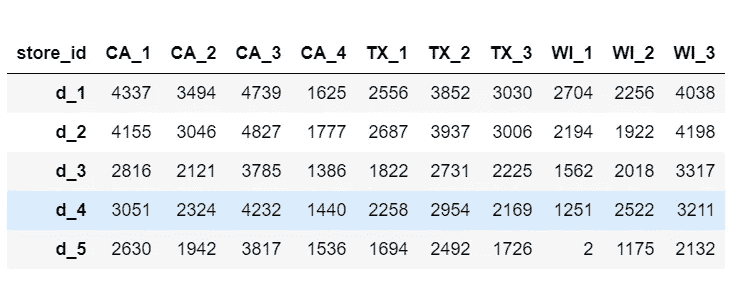

图 2:按 store_id 分组的数据

本次竞赛基于 RMSE(均方根比例误差)进行评估，RMSE 源自 MASE ( [平均绝对比例误差](https://en.wikipedia.org/wiki/Mean_absolute_scaled_error))，MASE 设计为不变且对称，您可以在此处了解更多关于预测准确度指标[(本次竞赛的不同之处在于，MASE 中的 **A(绝对)**替换为均方差的 **S(平方)**，我们取 RMSE 的根)。](https://robjhyndman.com/papers/foresight.pdf)

## 平稳性概念

理解平稳性的概念是很重要的，因为它对我们可以用数据来预测未来值的模型类型有很大的影响。当一个时间序列的性质不依赖于该序列被观察的时间时，我们称之为平稳的。平稳性的一些标准如下:

*   时间序列中的常数均值
*   时间序列中的恒定方差
*   没有季节性

简而言之，从长期来看，一个稳定的时间序列没有可预测的模式。对于数学家来说，当联合分布在一段时间内保持不变时，就知道随机过程是平稳的。让我们看看数据中的一些随机项目，看看它们是否是平稳的。

ARMA 模型是自回归模型和移动平均模型的组合。这种传统方法要求数据是静态的，然而，在现实世界中，事情并不总是像我们预期的那样发展。事实上，在现实世界中，数据更有可能是非平稳的，因此诞生了 ARIMA，它使用一种称为差分的巧妙技术来使非平稳数据平稳。

## 区别

差异计算原始序列中连续观测值之间的变化，这有助于稳定平均值，因为它消除了序列水平的变化，这具有消除(或减少)季节性和趋势的效果。这种技术广泛用于非平稳数据，如金融和经济数据。ARIMA 模型采用差分技术将非平稳时间序列转换为平稳时间序列。我们可以用数学方法表示差分数列，如图 2 所示。

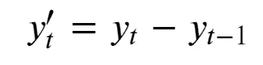

图 2:第一个区别

当差分数据看起来不稳定时，我们可以进行第二次差分——在实践中几乎不需要超过第二阶——这可以用数学方法表示在图 3 中。

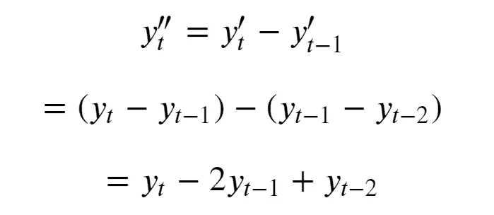

图 3:二阶一阶差分公式。

我们还可以得到同一季节的一个观测值和另一个观测值的差异。这种现象被称为季节差异。

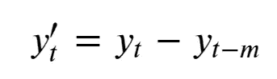

图 4:一级季节性差异公式

有时，我们可能需要取普通的差值*(这是我们在图 2 中讨论的差分技术。被称为第一差异，意思是滞后 1)和季节差异，使我们的数据平稳。*

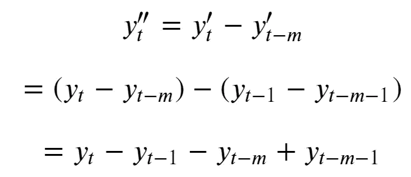

图 5:第一差异和季节差异的公式

在 python 中，我们可以使用可视化和/或[单位根测试](https://en.wikipedia.org/wiki/Unit_root_test#:~:text=In%20statistics%2C%20a%20unit%20root,depending%20on%20the%20test%20used.)来确定我们的数据是否需要差分——没有其他方法来确定平稳性。有许多不同的单位根检验有不同的假设，但我们将使用[迪基-富勒](https://en.wikipedia.org/wiki/Dickey%E2%80%93Fuller_test)。下面我将想象一个商店，并在你看 dickey-fuller 测试的结果之前，尝试确定你是否认为它是稳定的。

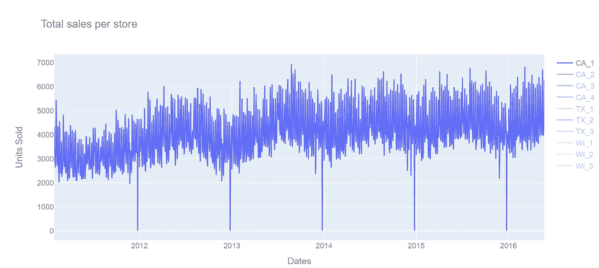

图 6:每个商店的总销售额——注意，我已经照亮了商店“CA_1”。在笔记本中，你可以点击任何一家你想照亮的商店，或者同时想象它们。

```
# Dickey-fuller statistical test 
def ad_fuller(timeseries: pd.DataFrame, significance_level= 0.05):

    non_stationary_cols= []
    stationary_cols= []

    for col in timeseries.columns: 
        dftest= adfuller(df[col], autolag="AIC")
        if dftest[1] < significance_level:
            non_stationary_cols.append(
                       {col:{"Test Statistic": dftest[0],
                             "p-value": dftest[1],
                             "# Lags": dftest[2],
                             "# Observations": dftest[3],
                             "Critical Values": dftest[4],
                             "Stationary": False}})
        else: 
            stationary_cols.append(
                       {col:{"Test Statistic": dftest[0],
                             "p-value": dftest[1],
                             "# Lags": dftest[2],
                             "# Observations": dftest[3],
                             "Critical Values": dftest[4],
                             "Stationary": True}})
    return non_stationary_cols, stationary_colsnon_stationary_cols, stationary_cols= ad_fuller(df[stores])
len(non_stationary_cols), len(stationary_cols)
>>>> (10, 0) non_stationary_cols[0]
```

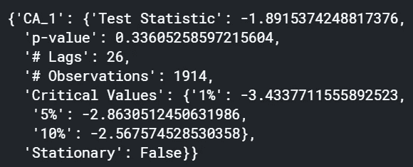

图 7:商店 CA_1 的扩充 DIckey-Fuller 结果。

p 值大于我们设定的显著性水平(0.05)，因此我们不拒绝数据中存在单位根的零假设。换句话说，我们的数据是不稳定的——它不符合我们上面描述的平稳性标准，因此我们必须做一些差分来使我们的数据变得稳定。熊猫有一个很酷的功能`DataFrame.diff()`为我们做到这一点——你可以在这里的[文档中读到更多。](https://pandas.pydata.org/pandas-docs/stable/reference/api/pandas.DataFrame.diff.html)

```
# making the data stationary
df["lag-1_CA_1"]= df["CA_1"].diff().fillna(df["CA_1"])
```

## ACF 和 PACF 图

ARIMA 模型具有必须定义的超参数 p、d 和 q。自相关函数(ACF)和偏自相关函数(PACF)图使确定模型的 p 和 q 阶变得更加容易。

ACF 图显示了时间序列的自相关性，这意味着我们可以测量 y_t 和 y_{t-k}之间的关系。最简单的方法是把它作为一个时间序列和它本身的滞后之间的相关系数。

> 注:“y_t”表示下标。

PACF 图显示了消除滞后效应后 y_t 和 y_{t-k}之间的关系。如果我们想到相关性，就是变量的相互依赖。“部分”相关性指的是它们之间的相关性，这种相关性不能用它们与一组特定的其他变量的相互相关性来解释。当我们对自相关进行调整时，我们说的是时间序列和滞后本身之间的相关性，这种相关性不能用较低阶滞后的相关性来解释。

[这是了解 ACF 和 PACF 地块](https://people.duke.edu/~rnau/411arim3.htm)的绝佳资源。

让我们看看我们的一些可视化…

```
_, ax= plt.subplots(1, 2, figsize= (10,8))
plot_acf(df["lag-1_CA_1"], lags=10, ax=ax[0]), plot_pacf(df["lag-1_CA_1"], lags=10, ax=ax[1])
plt.show()
```

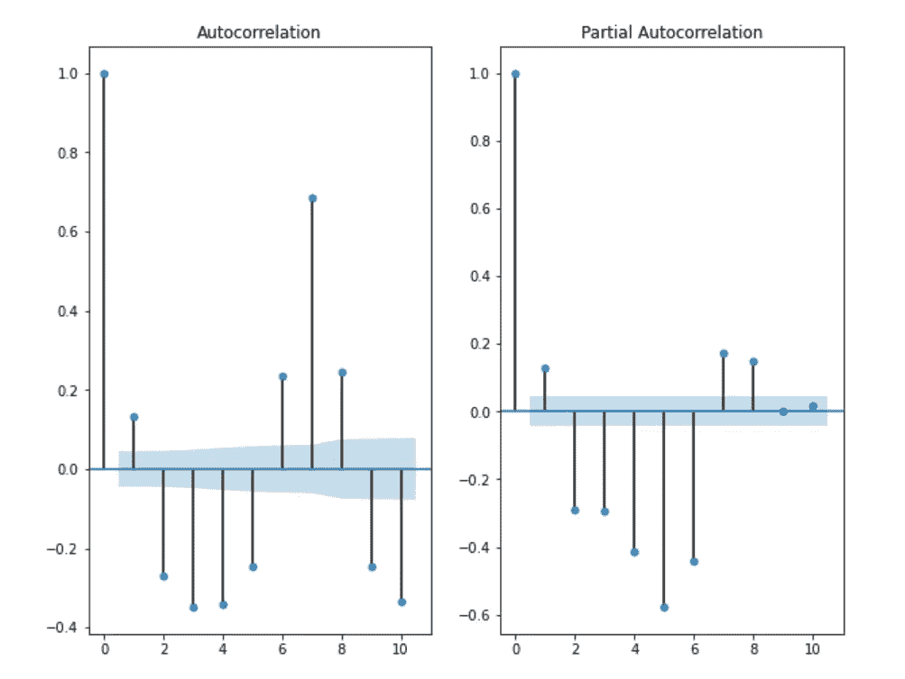

图 8:lag-1 _ CA _ 1 的自相关函数和偏自相关函数；正如在[确定 ARIMA 模型中 AR 和 MA 项的阶次](https://people.duke.edu/~rnau/411arim3.htm)中所述，仅通过检查 PACF，您就可以确定需要使用多少 AR 项来解释时间序列中的自相关模式:如果偏自相关在滞后 k 处显著，而在任何更高阶滞后处不显著——即，如果 PACF 在滞后 k 处“截止”——那么这表明您应该尝试拟合 k 阶的自回归模型；

这表明我们应该尝试用 AR(8)模型来拟合我们的数据，我已经在下一节中这样做了。

## 滞后/后移符号

滞后/后移记数法是一种非常有用的记数方法。不同的来源使用不同的符号来表示滞后 L 或后移 b。

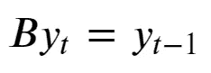

图 9:后移运算符符号

自回归 AR(p)模型通过使用变量的过去变量的线性组合来生成预测。我们可以认为自回归是变量对自身的回归。

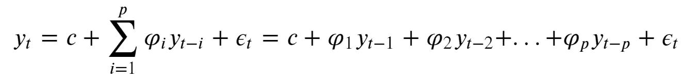

图 10:自回归模型(没有滞后/后移符号)

另一方面，移动平均 MA(q)模型在类似回归的模型中使用过去的预测误差而不是过去的值。因此，我们可以把每个预测值看作是过去几个预测误差的加权移动平均。


图 11:移动平均模型(没有后移符号)

## ARIMA 模式

条条大路通这一点。如果我们结合差分，我们的自回归模型和移动平均模型，我们得到 ARIMA(p，d，q)。

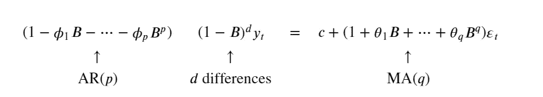

图 12: Arima 公式。资料来源:Hyndman，R.J .，& Athanasopoulos，G. (2018) *预测:原则与实践*，第二版，OTexts:澳洲墨尔本。[OTexts.com/fpp2.](http://OTexts.com/fpp2.)2020 年 9 月 6 日访问

> 注意，用滞后符号来表示 ARIMA 模型通常要容易得多。你可以在这里了解更多关于如何做这件事的[。](https://en.wikipedia.org/wiki/Autoregressive_integrated_moving_average)

*p* =模型的自回归部分的阶

*d* =我们的模型中的一阶差分的程度

*q* =模型的移动平均部分的顺序

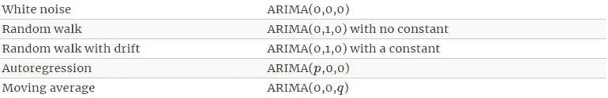

图 13:ARIMA 的特殊情况。资料来源:Hyndman，R.J .，& Athanasopoulos，G. (2018) *预测:原则与实践*，第二版，OTexts:澳大利亚墨尔本。OTexts.com/fpp2。于 2020 年 9 月 6 日访问

```
# fitting the model
model= ARIMA(df["lag-1_CA_1"], order=(8,1,0))
results= model.fit(disp=-1)# visualizing the fitted values 
fig= go.Figure(data=
               [go.Scatter(x= df["date"],
                           y= df["lag-1_CA_1"],
                           name= "original", 
                           showlegend=True,
                           marker=dict(color="blue"))])
fig.add_trace(
    go.Scatter(x= df["date"],
               y=results.fittedvalues,
               name= "fitted values",
               showlegend= True, 
               marker=dict(color="red")))
fig.update_layout(
    title="Fitted values",
    xaxis_title="Dates",
    yaxis_title="Units Sold",
    font=dict(
        family="Arial, monospace",
        size=14,
        color="#7f7f7f"
    )
)
fig.show()
```

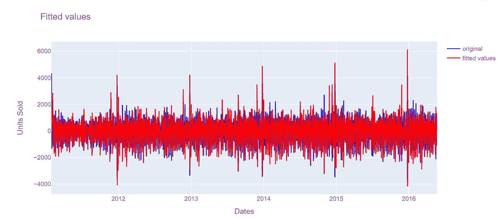

图 14:ARIMA 模型的拟合值。

我们可以仔细看看…

```
# a closer look
_, ax= plt.subplots(figsize=(12,8))
results.plot_predict(1799, 1940, dynamic=False, ax=ax)
plt.show()
```

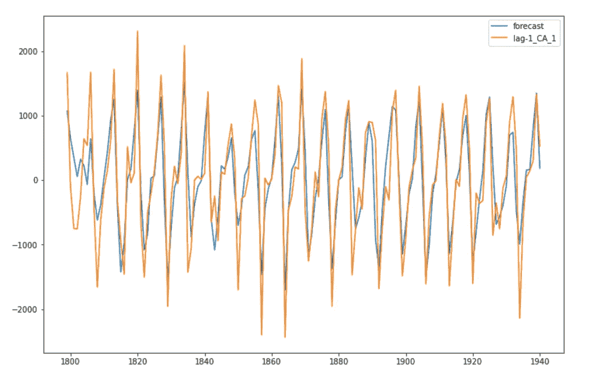

图 15:实际值与预测值的对比

为了了解我们如何与实际预测进行对比，我们必须首先回到数据的原始规模进行比较。我们可以在 pandas 中使用一个有用的`cumsum()`函数— [文档](https://pandas.pydata.org/pandas-docs/stable/reference/api/pandas.Series.cumsum.html)。

```
compare_df= pd.DataFrame({"actual": df["CA_1"],
                          "predictions": pd.Series(results.fittedvalues.cumsum(), copy=True),
                          "d": df["d"]}).set_index("d")
compare_df.loc["d_1", "predictions"]= 0
```

然后我们绘制这个…

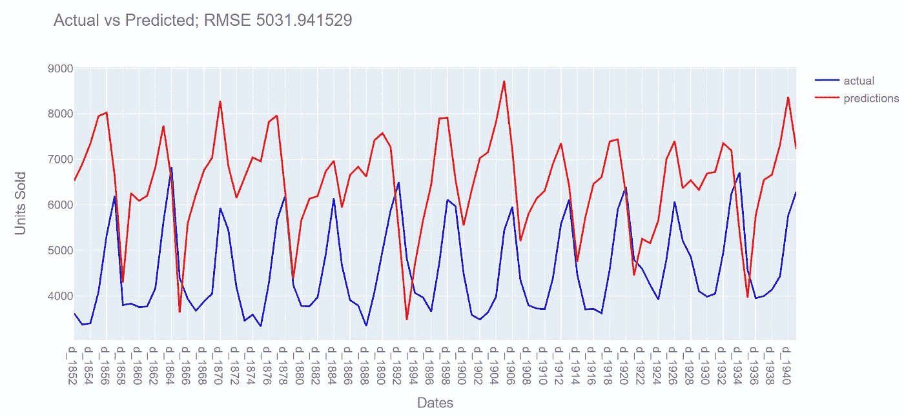

图 16:模型的实际与预测。

我参加这个比赛有点晚，但仍然有足够的时间来改善这个结果(我将与大家分享)。

## 有用资源:工作流程指南

Rob Hyndman 在《预测:原则与实践》一书中提供了一个非常有用的流程图。在线书籍的链接将在下面的其他资源部分。

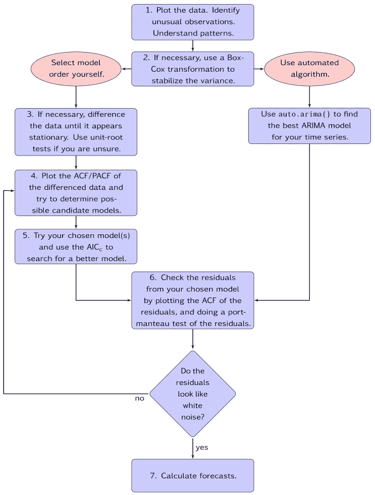

图 16:ARIMA 流程图。资料来源——hynd man，R.J .，& Athanasopoulos，G. (2018) *预测:原理与实践*，第二版，OTexts:澳大利亚墨尔本。OTexts.com/fpp2.[2020 年 09 月 06 日](http://OTexts.com/fpp2.)访问

## 一锤定音

感谢您花时间阅读这篇文章。我是一名自学成才的数据科学家，来自英国伦敦。可以通过 LinkedIn 和 https://www.linkedin.com/in/kurtispykes/的[联系到我。请不要犹豫联系我，认识新朋友是很棒的。](https://www.linkedin.com/in/kurtispykes/)

## **其他资源:**

[预测:原理与实践，第二版](http://OTexts.com/fpp2.)

[时间序列建模与预测导论研究](https://arxiv.org/ftp/arxiv/papers/1302/1302.6613.pdf)

[自回归综合移动平均线](https://en.wikipedia.org/wiki/Autoregressive_integrated_moving_average)