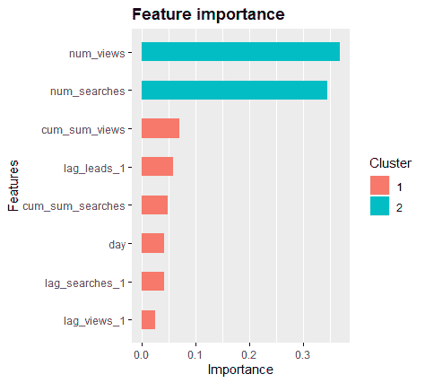
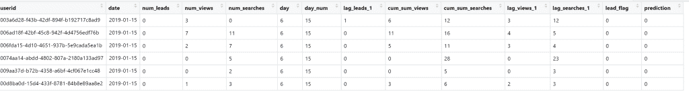

# 利用 web 流量数据进行预测

> 原文：<https://towardsdatascience.com/forecasting-with-web-traffic-data-6681ff148df0?source=collection_archive---------38----------------------->

## 不使用时间序列的预测

# 介绍

通常，当您访问时间序列数据时，在这种情况下，我们将查看一个例子，其中我们有一周的 web 流量数据，本能地应用时间序列模型。然而，情况并不总是如此，我将在这篇博文中进一步说明原因。

在这篇文章中，你将学会如何:

*   设置您的分析数据集以预测未来的事件，即网络用户是否会在第二天成为销售线索
*   创建辅助预测的附加要素
*   识别并绘制特征重要性
*   利用强大的分类技术进行时间序列预测

# 数据概述

**数据问题:**预测某网站用户第二天是否会成为 lead？

**数据集:**提供了一个为期一周的网站流量样本数据集，包括三个变量:用户 id、事件(“查看”、“搜索”或“引导”)和时间戳(日期和时间)

**建议方法:**为了预测用户第二天是否提交线索的可能性，我们需要了解用户前一天或前几天的活动以及网站上的聚合活动。为此，我们需要创建功能。

# R 中的建模

# 加载库和导入数据集

```
library(data.table)
library(dplyr)
library(padr)
library(xgboost)
library(Matrix)
library(RcppRoll)
library(zoo)
library(readr)
library(sqldf)data_interactions<-read_csv("C:\\Users\\srivastavas\\Downloads\\data-interactions\\data-interactions.csv")
```

# 数据询问

一旦数据集被加载，查看数据集以确保它被正确读入总是有帮助的。如下所示，我们可以看到数据集由四列组成:事件类型(“查看”、“搜索”或“潜在客户”)、用户 id(唯一标识符)、时间戳(用户访问网站的时间和日期)以及日期。

```
# A tibble: 6 x 4
  event  userid                               utc_timestamp       date      
  <fct>  <chr>                                <dttm>              <date>    
1 view   4c02df98-fee3-43dd-8582-4192180a52c8 2019-01-17 03:49:36 2019-01-17
2 search bcc02079-d9d6-461a-bb7a-6ad679dc3ddb 2019-01-19 22:33:14 2019-01-19
3 search 4443b108-11aa-44e8-9934-a9c75e7a5b2e 2019-01-20 06:54:42 2019-01-20
4 search a8513b28-c94b-49b4-9260-07f9ce8a24aa 2019-01-17 23:33:44 2019-01-17
5 search 261eb70e-af13-4d0c-a2d8-7c2095586b2d 2019-01-20 01:28:01 2019-01-20
6 search 7d670d0a-f815-4ce1-955a-f026f478ebb5 2019-01-17 22:42:44 2019-01-17
```

时间变量和唯一标识符是我喜欢称之为“垃圾”的变量。它们对模型的预测没有帮助。然而，在我们的案例中，时间是一个重要的特征，因为我们想知道用户是否会在第二天成为销售线索。个人用户 id 也很重要。那么，我们如何还能利用这些信息。

这让我想到了建模的下一个部分——特征工程。

# 特征工程

由于用户每天可能会查看或搜索一个网站一次或多次，因此有必要汇总这些信息，以减少每个用户的记录数量，同时能够创建每日数据集，即每个用户每天一条记录。这可以用 R 的 dplyr 包或者 sqldf(用 R 写 SQL 代码)来完成。

在下面的代码片段中，我按照日期和用户 id 对数据集进行了分组，以计算每个用户每天的查看次数、搜索次数和线索数。

```
sql_str<-"select userid, date
       , SUM(CASE WHEN event = 'leads' THEN 1 ELSE 0 END) AS num_leads
       , SUM(CASE WHEN event = 'view' THEN 1 ELSE 0 END) AS num_views
       , SUM(CASE WHEN event = 'search' THEN 1 ELSE 0 END) AS num_searches
       FROM unique_data_interactions
       GROUP BY userid, date"df1<-sqldf(sql_str,stringsAsFactors = FALSE)
```

接下来，为了有意义地使用日期变量，我们可以创建与时间相关的变量，如访问网站的日期、访问时间、访问月份和访问周。因为我们只有一周的时间，所以只有访问日(即星期日与星期一)可能有用。下面的代码可以用来创建与时间相关的变量。

```
df1$day<-as.numeric(as.factor(weekdays(as.Date(df1$date))))
```

现在，因为我们希望预测某个用户第二天是否会成为潜在客户，所以我们希望了解该用户以前的活动。例如，用户是在前一天还是前一天、三天前浏览网站的？他们以前也搜索过网站吗？

为了使用以前的活动来预测未来的活动，我们需要创建*滞后*变量。因为我们想要预测某个用户第二天是否会成为销售线索，所以我们使用前一天的活动来预测第二天的活动。

首先，你需要按日期排列数据。然后，您希望按 userid 对数据进行分组，因为您希望预测给定用户是否会在第二天成为销售线索。

为了预测用户第二天是否成为潜在客户，我们需要知道客户前一天是否是潜在客户(滞后 num _ leads 1)，他们前一天是否查看和搜索了网站(滞后 num_views 和 num _ searches 1)，以及到目前为止的查看和搜索总数(cum_sum_views 和 cum_views_searches)。

```
df1<-df1[order(df1$date),]#Create lag variablesdf2<-df1 %>%
  group_by(userid) %>%
  mutate(lag_leads_1 = lag(num_leads,1) #lag target variable by 1
        , cum_sum_views = cumsum(num_views)
        , cum_sum_searches = cumsum(num_searches)
         , lag_views_1 = lag(num_views,1) #lag num_views by 1 day
         , lag_searches_1 = lag(num_searches,1)#lag num_searches by 1 day
          )
```

在时态数据中，通常会创建一些变量，如滚动平均值、滚动中值平均值和各种滞后变量，但由于我们只能访问一周的数据，这些变量似乎并不合理。

现在，如果我们有用户前一天的信息，我们只能预测用户第二天是否会成为潜在客户。例如，如果用户仅在周末(第 7 天)出现在数据集中，则很难测试该用户的模型准确性，因为我们没有关于该用户是否成为销售线索的信息。因此，此类记录已从数据集中删除。

```
#remove users who don't have previous day records as can't predict next day lead for them
df3<-df2[!is.na(df2$lag_leads_1),]
```

第二件要做的事情是决定一个模型。由于问题是确定用户 a 是否在第二天成为销售线索，这是一个二元问题，也是一个分类问题，即用户成为销售线索= Success = "1 "，用户没有成为销售线索= Failure = "0 "。为了对这个问题建模，我们需要如下对这个目标变量进行特征工程。

```
df3$lead_flag<-ifelse(df3$num_leads>=1, 1, 0)
```

# 准备分析数据集

我们已经删除了重复的记录，创建了每个用户每天一条记录的每日数据集，并创建了时间相关变量和我们的目标变量(我们希望预测的变量)。

下一步是现在决定我们如何训练和测试我们的模型。在大多数情况下，随机拆分数据是有意义的，即随机的行子集成为训练集，其余的成为测试集。通过这种方式，您的模型在数据集上接受训练，然后在从未见过的数据上测试准确性。

但是，当您拥有时态数据时，您预测的是未来的某个时间，因此数据集应根据时间进行拆分，即数据集的前 75%用于训练(即周一至周四)，其余部分用于测试(周五至周日)。由于我们的数据集只有一周，这种划分似乎不合理。

在我们的示例中，我们希望预测某个特定用户是否会成为潜在客户。因此，按用户 id 分割数据集是有意义的，其中模型针对一组特定的用户进行训练，然后针对从未遇到过的用户进行准确性测试。为了以这种方式分割数据，编写了以下代码。

```
#Subset data into training and test sets - split on different users
user_ids<-as.data.frame(unique(df3$userid))
names(user_ids)<-"user_ids"
train_user_ids<-sample_frac(user_ids,0.75)
names(train_user_ids)<-"user_ids"
train <-df3[df3$userid %in% train_user_ids$user_ids,]
test <- anti_join(df3, train, by = c("userid" = "userid"))
```

一旦你有了训练集和测试，你就可以开始建模了！:)

# 运行模型

对于二进制分类，您需要一个分类模型。基于树的方法通常用于二元分类。一种流行的基于树的方法是 xgboost，它从每一棵新树(迭代)中学习，试图减少错误的百分比。与最终结果是一组树或平均加权树的随机森林不同，最终的 xgboost 决策树是所有回合中错误率最低的一个。

众所周知，randomforest 和 xgboost 在试图改进之前的迭代时会过度拟合数据；然而，由建模者决定提供给模型的变量是否独立(不相关)，是否能提供信息，是否以任何方式影响结果。

R 中的 xgboost 模型需要一个矩阵和定义的参数，如下面的代码片段所示。

xgboost 模型需要以下步骤:

*   定义目标变量—“标签”
*   删除 NAs
*   创建一个包含要包含在模型中的变量的矩阵(当数据集中有标称/分类变量时，使用 contrasts.arg)
*   为您的模型设置参数—使用二元逻辑函数，因为这是一个分类问题，不需要非常深的树(导致过度拟合，所以只指定了四个级别；当你有一小组变量时，2 和 3 通常是好的)

```
set up model
label <- train$lead_flag
#returns object unchanged if there are NA values
previous_na_action<-options('na.action')
options(na.action='na.pass')#build matrix input for the modeltrainMatrix<- sparse.model.matrix(~num_views+num_searches+day+lag_leads_1+cum_sum_views+cum_sum_searches
                                  +lag_views_1+lag_searches_1
                                  , data = train, 
                                  , contrasts.arg = c('day')
                                  , sparse = FALSE, sci = FALSE)
options(na.action=previous_na_action$na.action)#create input for xgboosttrainDMatrix <- xgb.DMatrix(data=trainMatrix, label = label) #set parameters of model# Define the parameters for binomial classificationparams <- list(booster = "gbtree", 
               objective = "binary:logistic", 
               eta=0.3, 
               gamma=0, 
               max_depth=4, 
               min_child_weight=1, 
               subsample=1, 
               colsample_bytree=1)
```

当您的模型正在训练时，您可以使用一种叫做 ***交叉验证的方法来测试它的准确性。*** 在交叉验证中，你运行多个不同的训练测试拆分，然后平均结果，而不是完全依赖单个特定的训练集。最常见的交叉验证类型是 K 重交叉验证，最常见的是将 K 设置为 5 或 10。例如，为了进行五重交叉验证，将原始数据集划分为大小相等或接近相等的五个部分。这些部分中的每一个都被称为“褶皱”。然后训练一系列五个模型，每个折叠一个。第一个模型:模型一，使用折叠 2 至 5 作为训练集进行训练，并使用折叠 1 作为测试集进行评估。第二个模型:模型 2，使用折叠 1、3、4 和 5 作为训练集进行训练，使用折叠 2 作为测试集进行评估，以此类推。当这个过程完成时，我们有五个精度值，每个折叠一个。通常取准确度分数的平均值。

您可以为交叉折叠验证设置您的模型，如下所示。在这里，我们指定了五轮交叉验证，告诉模型运行 1000 次迭代，但如果它不再显示任何准确性的提高，就提前停止(在第 20 轮)。

最后一行告诉我们，在哪个迭代中，模型生成的树具有最低的误差。在我们的例子中，输出是第 40 次迭代。

```
xgbcv <- xgb.cv( params = params, data = trainDMatrix, nrounds = 1000, 
                  nfold = 5, showsd = T, stratified = T, 
                  print_every_n = 10, early_stopping_rounds = 20, maximize = F)
num_iterations = xgbcv$best_iteration
```

现在，我们可以使用这些信息在训练集上运行我们的模型，并让它在第 40 次迭代时停止。我们还告诉我们的模型使用内置的错误度量来评估树以及 logloss 度量。

```
model <-xgb.train(data=trainDMatrix
                  , params=params
                  , nrounds = num_iterations
                  , maximize = FALSE
                  , eval.metric = "error", eval.metric = "logloss")
```

# 模型评估

功能重要性图告诉我们，模型中的变量是如何用来预测用户是否会在第二天成为潜在客户的。

在这里，我们可以看到当天的浏览量和搜索量是预测客户当天是否会成为销售线索的最重要的预测因素。我们还可以看到，尽管创建了滞后和累积变量，但它们并不十分有用。然而，这是意料之中的，因为数据集覆盖了一周的很短的时间范围。



```
importance<-xgb.importance(feature_names=colnames(trainDMatrix), model=model)
xgb.ggplot.importance(importance_matrix=importance)
```

下一步是测试模型的准确性。这需要将测试数据集设置为矩阵，并使用训练好的模型对测试集运行命令“预测”。

为了测试模型的准确性，我们在这里比较有多少 lead_indicator 值被模型正确分类为“0”或“1”。“预测”数据集在模型输出概率时被重新编码。任何大于 0.5 的概率都转换为“1”(是销售线索)，任何小于 0.5 的值都转换为“0”(不是销售线索)。我们对测试集(testMatrix$label)中预测值(“预测”)等于原始值的所有实例求和，然后除以测试集的大小。

这里，我们得到 97.53%的准确率，或者 0.03 的错误率，这意味着测试集中所有用户的 97.53%被正确分类为他们是否会在第二天成为销售线索。

```
testMatrix<- sparse.model.matrix(~num_views+num_searches+day+lag_leads_1+cum_sum_views+cum_sum_searches
                                  +lag_views_1+lag_searches_1
                                  , data = test, 
                                  , contrasts.arg = c('day')
                                  , sparse = FALSE, sci = FALSE)
options(na.action=previous_na_action$na.action)pred<-predict(model,testMatrix)
prediction <- as.numeric(pred > 0.5)
print(head(prediction))
err <- mean(as.numeric(pred > 0.5) != testMatrix$label)
print(paste("test-error=", err)) #average error is 0.03 very low so  model is good result = sum(prediction==test$lead_flag)/length(test$lead_flag)
print(paste("Final Accuracy =",sprintf("%1.2f%%", 100*result))) #97.53%
```

如果你和我一样无法相信自己的眼睛，那么将测试集和预测结合起来，并排查看如下信息会很有帮助。在下图中，您可以看到，对于 2019 年 1 月 15 日，并非所有用户都在这一天成为销售线索，这些用户的预测值为“0”(非销售线索)。



如果我们的模型显示精度降低，我们可以使用 xgboost 参数，比如树深度、轮数、用于树分支分裂的最小行数。然而，在这种情况下，以如此好的精度，这是不需要的。

希望您现在已经很好地理解了如何对分类性质的时间序列数据建模！如有疑问，请在下方评论。

完整的代码文件可以在这里找到:

[https://gist . github . com/shedoedasdatascience/fbdd 1b 52 c 5089 d3b 80 ba 512 f 969 e 704 c](https://gist.github.com/shedoesdatascience/fbdd1b52c5089d3b80ba512f969e704c)