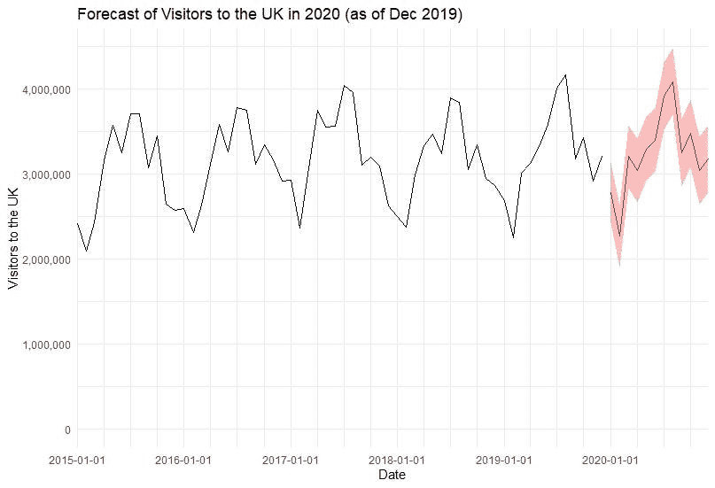
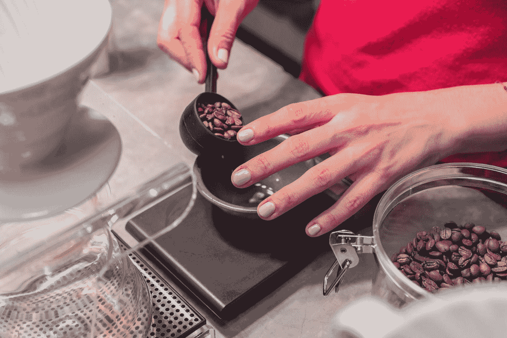

# 日冕时代的预测

> 原文：<https://towardsdatascience.com/forecasts-in-the-time-of-corona-5541bc1df8f7?source=collection_archive---------44----------------------->

## 现在，我们比以往任何时候都更需要谨慎地创建和使用预测

在此次危机期间，我作为一名数据科学家在旅游业工作，经常被问到如何利用数据来预测旅游业何时会恢复某种健康。我的回答都归结为:“伙计，现在我几乎不能给你一个今天下午*会发生什么的准确预测”。但这让我想到:目前我们应该如何进行预测？到底什么是预测？*

**

*Tardis:终极预测机器(照片由[查理·西曼](https://unsplash.com/@casman?utm_source=medium&utm_medium=referral)在 [Unsplash](https://unsplash.com?utm_source=medium&utm_medium=referral) 上拍摄)*

# *什么是预测？*

*预测的根本问题是我们实际上无法预测未来。当我们说我们要“预测”某事时，我们实际上是在说我们要做三件事情中的一件(或多件):*

## *时间序列投影*

*在这里，我们将重点放在我们试图预测的指标的历史上，并假设历史上的模式将持续到未来。因此，如果我们预测冰淇淋销售，我们将只查看以前的冰淇淋销售数据，并假设夏季和周末的高峰将持续下去。*

*一旦我们做出了这个假设，我们需要做的就是建立准确描述历史(或“时间序列”)的模型，然后用这些模型预测未来。ARIMA 等车型就属于这一类。*

## *系统模型化*

*在这里，我们使用对其影响最大的各种因素的数据或与之相关的数据，建立一个感兴趣的度量模型。在这种情况下，我们的冰淇淋预测将涉及了解冰淇淋销售与温度、降雨量、工作日、学校假期等之间的关系。这里的一个关键点是，您需要确信已经捕获了影响预测指标的所有关键因素，并对这些因素本身有一个良好的预测。因此，如果你有一个坏天气预报，这将损害你的能力，建立一个良好的冰淇淋销售预测。*

*天气预报和对体育赛事和选举的预测就是这种预测的好例子。*

## *情况分析*

*在这里，我们不试图从数据中推测趋势或关系，而是想象会发生什么，然后看看在我们感兴趣的各种系统/过程中会发生什么。你可能在想“等等，这只是猜测？”是的，确实如此。但这也是吸引力所在:你不会用看似精确的数字来哄骗人们产生一种虚假的安全感，在猜测千载难逢的场景可能会如何发展方面，人类的想象力比任何机器都做得更好。*

*这是一个简单的方法，但比你想象的更常见。养老金、投资和抵押贷款提供商做了很多这样的事情，银行的压力测试本质上是一种悲观的情景分析。很明显，在一切都失控之前，这些往往更有用，但在危机当中，当人们不确定事情将如何发展时，这些可能会有用。*

# *为什么预测这么难？*

*要进行预测，你需要对两件事有信心:*

1.  *你很好地掌握了影响结果的主要因素，即[统计术语](https://en.wikipedia.org/wiki/Uncertainty_quantification#Aleatoric_and_epistemic_uncertainty)中的低**随机**不确定性。*
2.  *没有任何重大的不可预测的事件会突然发生并把事情弄糟，即低**认知**不确定性*

*你们中目光更敏锐的人可能已经发现了第二点的一个问题:如果上述重大事件是不可预测的，我们怎么知道它们不足以左右结果？让我们通过一个例子更深入地探讨这一点。*

*想象一下，一个为英国政府工作的预测者，被旅游部长委派预测明年每月将有多少国际游客到达英国。看着[数据](https://www.ons.gov.uk/peoplepopulationandcommunity/leisureandtourism/datasets/monthlyoverseastravelandtourismreferencetables)，他们心里想:“嗯，这看起来非常规律和稳定，这应该不会太难”，然后使用季节性 ARIMA 模型建立一个预测，如下图所示。它们包括一些很好的、清晰的 95%预测区间，这样旅游部长就能感觉到这个预测有多少不确定性。*

**

*对英国游客数量的糟糕预测*

*他们表现如何？虽然我没有英国游客数量的最新数据，但根据波士顿咨询集团[在此](https://public.tableau.com/profile/the.boston.consulting.group#!/vizhome/BCGsTravelRecoveryInsightsPortal/PortalHome?publish=yes)有益总结的[行业数据](https://www2.arccorp.com/)，在撰写本文时，机票数量几乎为零，因此我们可以假设所有游客都在做类似的事情。总的来说，不太好。*

*发生了什么事？嗯，有人可能会说没有什么真正出错:有一个 95%的下限预测区间，我们超过了它，但我们应该预计 20 分之一的时间，所以，有什么大惊小怪的？这个推理的问题是，我们不仅仅是超出了下限一点点。我们撞穿了它，直到撞到地面才停下来。使用预测区间的正态分布假设，这种事件的概率为 0.000002%，即我们应该每 500 万年才观察到一次这样的事件！*

*相反，问题在于预测区间只是一个关于*随机*不确定性的陈述，基于算法在它被训练的数据中观察到的东西。换句话说，预测区间本身*只是不确定性的预测*，因此只显示了现实世界不确定性的最小界限。*

*公平地说，认知的不确定性是不可量化的(如果它是可量化的，它将是任意的)，并且很难在图表上显示出来。预测者本可以做的一件事是，在预测的同时，考虑 2001 年和 2008 年的危机是如何影响旅游人数的。这清楚地表明，他们只是提供了一个“正常年份”的预测，而在现实世界中，任何事情都可能发生。马后炮是一件奇妙的事情。*

# *预测通常是错误的，相应地计划*

*正如我们所看到的，无论你正在看什么样的预测，大多数时候都会有一点点错误，有时还会有很多错误。正因为如此，始终知道你可以接受多少误差，以及当误差超过这些界限时你会怎么做是至关重要的。*

*因此，任何预测者工作的最重要的部分是理解一个人预测的客户或系统对什么样的错误最敏感。如果你要预测库存，是库存过多还是缺货成本更高？如果你预测要设定一个目标，如果目标经常被超过或经常被错过会更好吗？预测者可能犯的一个常见错误是花费数小时研究不同的预测技术和模型，但只花几分钟去理解不可避免的误差将如何影响他们为之建立预测的系统或客户。*

**

*一个好的预测者不仅仅是最小化错误，他们还会选择正确的错误来最小化*

*幸运的是，当决定被恰当地框定时，这种想法会自然而然地来到我们身边。我敢打赌，上次你办派对时，买的食物和饮料比你最终需要的还多。这远非不理性，而是因为过度预测的成本很低(多余的可以廉价储存)，而预测不足的成本很高(还有什么比没有酒喝的派对更让人难过的吗？).*

# *适应，不要预测*

*正如你可能已经收集到的，基于数据的预测在未来几个月不会有太大帮助，因为我们有大量的随机和认知的不确定性。我们不知道人们在接下来的几个月里会如何或是否想去旅行。即使我们开始理解这一点，任何基于这一理解的预测都有被不可预测事件粉碎的高风险，如第二波浪潮、政治决策、经济影响(如果没有航空公司就不能飞行)，或者更乐观地说，新的治疗方法或疫苗。*

**

*你得等等，老朋友(图片由[帖木儿 M](https://unsplash.com/@tim_front?utm_source=medium&utm_medium=referral) 在 [Unsplash](https://unsplash.com?utm_source=medium&utm_medium=referral) 上拍摄)*

*那么如果我们不能预测，我们能做什么呢？最有效的方法将是以下方法的组合:*

*使用**情景分析**概述几种可能的结果，并描绘它们如何影响你感兴趣的内容。请注意，这并不一定是花哨的，在许多行业和领域中，有许多已经开发出来的现成产品可以使用。在这样做的时候，基于你所拥有的信息，选择一个“最有可能”的场景，然后围绕这个场景设计计划是很有诱惑力的。但这又落入了预测陷阱:你现在拥有的信息明天可能就无关紧要了。*

*清楚地评估客户、系统或您正在做出的决策对风险的**敏感度，并将这些敏感度与可能的情景进行比较。请注意，无论哪种情况发生，你都应该努力做出最大化你实现目标的能力的决策*，即使在每个特定的情况下都不是最优的*。你的风险承受能力在这里也发挥了作用；你可能准备好接受一个在某些情况下冒着破产风险的决定，如果在其他情况下会有很大的回报。*****

**最后，给定的环境可能会继续快速演变，探索如何提高自己的能力以变得**灵活和响应**将使你更有效地应对这种变化，并减少对场景分析中固有的猜测的依赖。**

**那么什么时候才是回归预测的合适时机呢？嗯，如果可能的话，你可能不想。预测是一件不确定的事情，你的决策依据越少，你的决策就越稳健。这并不意味着你不应该再次启动 ARIMA 模型或查看天气预报，许多决定需要对未来将要发生的事情有一些看法，但这确实意味着你应该永远记住:如果这真的是错的，我该怎么办？如果有，我该如何快速适应？**

****

**你觉得幸运吗？(照片由[马库斯·斯皮斯克](https://unsplash.com/@markusspiske?utm_source=medium&utm_medium=referral)在 [Unsplash](https://unsplash.com?utm_source=medium&utm_medium=referral) 上拍摄)**

**从一个重要的意义上来说，预测现在比以往任何时候都更像是在股市上挑选赢家:有很大程度的随机性，很少有人能做好，而且很难区分有才华的人和仅仅是幸运的人。但是，我们可以使用优秀基金经理管理投资组合的相同工具和方法:了解他们的风险承受能力，选择能够承受一系列结果的多样化等策略，并确保他们能够灵活地转移资金以利用机会。当然，永远不要忘记古老的投资格言:过去的表现并不能保证未来的结果。**