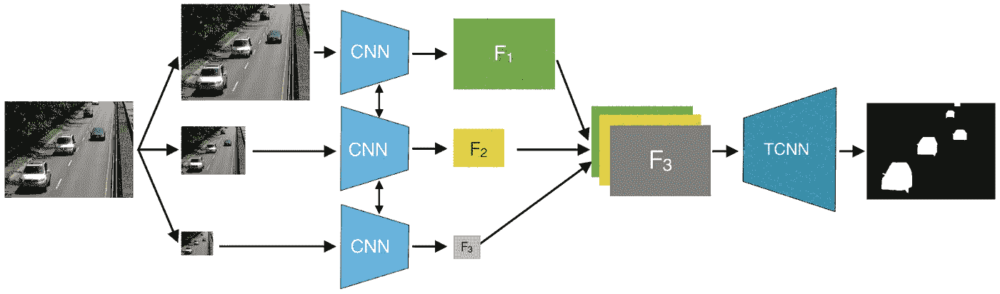
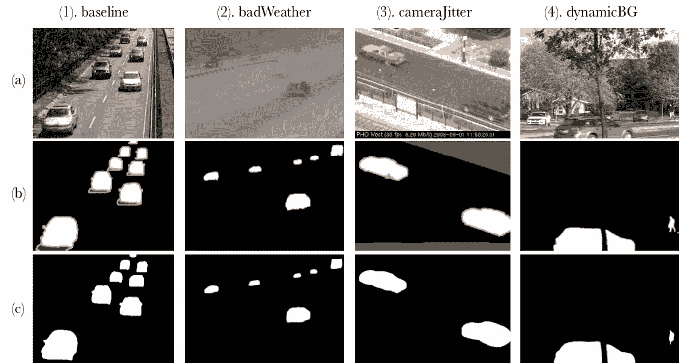
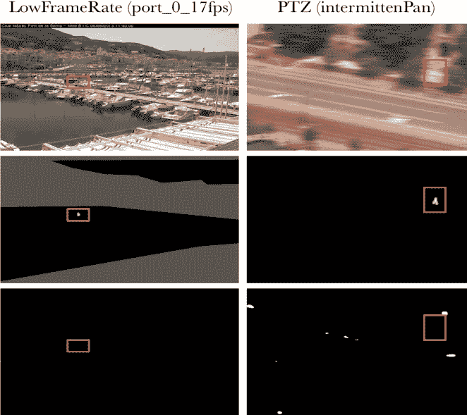

# 基于 FgSegNet 的前景图像分割

> 原文：<https://towardsdatascience.com/foreground-image-segmentation-with-fgsegnet-9ecbe3d194ab?source=collection_archive---------21----------------------->

## 具有类似自动编码器结构的多尺度 CNN

FgSegNet 的架构图；它使用三个 CNN 模型和一个 TCNN。[1]

# 介绍

一个有待解决的棘手问题是前景图像分割(从不同的角度来看)，即*(或*)。这个任务听起来可能很琐碎:**创建一个二进制蒙版，其中只有移动/重要对象的像素被标记**。然而，当现实世界的可变性被引入到图片中时，这可能变得特别困难(没有双关语)。例如， ***一个真正鲁棒的图像分割模型必须考虑以下所有*** :**

*   **(背景)景色的微妙变化**
*   **忽略移动的树木、树叶、雪、雨、阴影等。**
*   **处理光线不好的情况**
*   **处理相机抖动和/或运动**
*   **摄像机视野内模糊区域的伪装物体**
*   ***这个清单还在继续……***

**完成这项任务的最初几个方法之一(在当时)是相当健壮的，本质上是统计学。具体来说，它涉及使用**多个高斯模型来映射输入**的每个像素的每个颜色值(即 RGB)**的分布。如果像素的颜色值在特定帧中与其高斯分布不匹配，则可以确定该像素持有前景对象。然而，这种方法仍然很容易受到上述挑战的影响，但在当时(1999 年)[2]仍然是鲁棒图像分割的一个突破。****

**快进到最近的时代，现在我们有足够的计算能力和数据让卷积神经网络(CNN)和其他复杂的模型相当精确地运行，更不用说简单的前馈网络了。不出所料， ***现在比以往*** 有更多基于深度学习的背景减法。**

> ***我们来看看* **前景分割网络** *，或者* **FgSegNet** *，这是一种最近提出的、性能最好的神经网络架构，它使用多个 CNN 和一个转置 CNN (TCNN)来实现背景减法。[1]***

# **理论**

## **CNN 和 TCNNs**

*****FgSegNet*** 在其架构内使用 3 个卷积神经网络(CNN)和一个转置 CNN (TCNN)。具体来说，该架构为其每个 CNN 使用一个**预训练的 VGG-16 模型。****

**综上所述，CNN 广泛用于图像特征提取，因此在图像分类中工作良好。卷积层如何在 CNN 内工作的前提是通过**内核**(具有初始化的但可改变的值/权重的小 2D 矩阵)**，其跟踪图像输入并聚集内核值和相应输入像素值之间的乘积**。换句话说，内核 ***在运行时会对输入*** 进行卷积，这就是 CNN 中的 C。卷积层在实际应用中更容易理解，所以这里有一张内核操作的 GIF 图片。**

****

**CNN 内核的例子。蓝绿色是完整的输出，蓝色是图像输入，阴影/轮廓是内核。内核将其相对于输入的每个值相乘，然后相加，产生一个像素作为输出。[3]**

*****那么什么是转置 CNN 呢？把它想成是 CNN 应该做的完全相反的事情。CNN 自然产生的输出通常小于其输入；这与 TCNNs 相反，**，因为它的内核执行与 CNN**相反的操作。*****

**根据上面的架构图， ***FgSegNet*** 首先将输入馈入三个 CNN，连接三个输出，并将其作为输入馈入 TCNN。最终输出是二进制掩码。**

## **为什么是“类自动编码器”？**

**论文称 ***FgSegNet*** 为“**编解码型网络模型**”，这是名副其实的。首先，**架构类似于自动编码器**的架构:输入首先被漏斗化/瓶颈化成一个更小的特征图(编码)，然后在模型的后半部分结束时被扩展回其原始形状(解码)。CNN 本质上也是编码器，因为它们通过内核操作提取特征。也就是说，**tcnn**(与 CNN 相反)**将是解码器**也是事实。**

**我推测，在前景提取等任务中使用编码器的目的是**精确定位图像帧中容易发生变化的“重要”特征，用通俗的话来说，就是使用压缩信息输出带有 TCNN 的遮罩**。让 3 个不同形状的 CNN 并行工作也支持这一概念，并且**允许该模型更加通用于不同大小的前景对象**。**

# **表演**

## **数据集**

**前景提取器模型的一个突出数据集是 [CDnet2014 数据集](http://changedetection.net/)。 **CDnet2014 包括模型的 11 种不同挑战场景**(即恶劣天气、相机抖动、夜间视频等。)，每个场景包含 4 到 6 个视频序列。数据集包括地面真实图像/遮罩，标记每一帧的所有前景对象和阴影。 ***FgSegNet*** 在多个图像数据集上进行测试，其中一个是 CDnet2014。**

## **模型实现**

*****FgSegNet*** 是使用 Keras 和 Tensorflow 框架构建的。它的所有层(除了最后一层)都使用 ReLU 激活层，而 VGG-16 CNN 的多个池层被替换为 dropout 层。除了辍学，该模型利用 L2 权重正则化。RMSProp 被用作具有学习率降低器的优化器，当验证损失停止改善 6 个时期时，学习率降低器被激活。 ***最后，该模型允许选择用 50 或 200 帧图像进行训练。*****

> **要了解更多关于模型实现的信息，请点击[这里](https://arxiv.org/abs/1801.02225)阅读其论文。**

## **估价**

*****FgSegNet*** 是 CDnet2014 数据集评估期间表现最好的模型之一。当用 200 帧训练时，达到的平均 F 分数是 0.9734(分数范围从 0[差]到 1[最好])，用 50 帧训练时是 0.9545。下面是一个场景分类的例子，以及由模型生成的基本事实和掩码。**

****

**(a)是原始图像。(b)是基本事实。(c)由 FgsegNet 生成。[1]**

****

**图像行从上到下依次显示原始图像、地面实况和模型生成的遮罩。[1]**

**正如你所看到的，模型生成的遮罩**非常令人印象深刻**，尤其是对于跟随*基线*的三个类。**

**在左侧，您可以找到模型意外执行的一些实例。然而，即使对人类来说，分割这些样本看起来也很麻烦。**

*****总的来说，FgSegNet 给人印象非常深刻，是一个很好的前景提取任务。*****

> **如果你想看看，这里是 github 对 ***FgSegNet*** 源代码的回购:**

** [## lim-anggun/FgSegNet

### 这个库包含以下论文的源代码和训练集:“前景分割使用…

github.com](https://github.com/lim-anggun/FgSegNet) 

# 参考

[1] L. Ang Lim 和 H. Yalim Keles，[使用三重卷积神经网络进行多尺度特征编码的前景分割](https://arxiv.org/abs/1801.02225) (2018)，arXiv-1801。

[2] C. Stauffer 和 W. E. L. Grimson，[用于实时跟踪的自适应背景混合模型](https://ieeexplore.ieee.org/document/784637) (1999)，IEEE 计算机学会会议。

[3] V. Dumoulin 和 F. Visin，[深度学习卷积算法指南](https://arxiv.org/abs/1603.07285) (2016)，arXiv-1603。**