# 犯罪和事故现场的法医分析

> 原文：<https://towardsdatascience.com/forensic-analysis-of-crime-and-accident-scene-34febf84a938?source=collection_archive---------48----------------------->

## 随机森林分类器的性能

## 机器学习解决多类分类问题

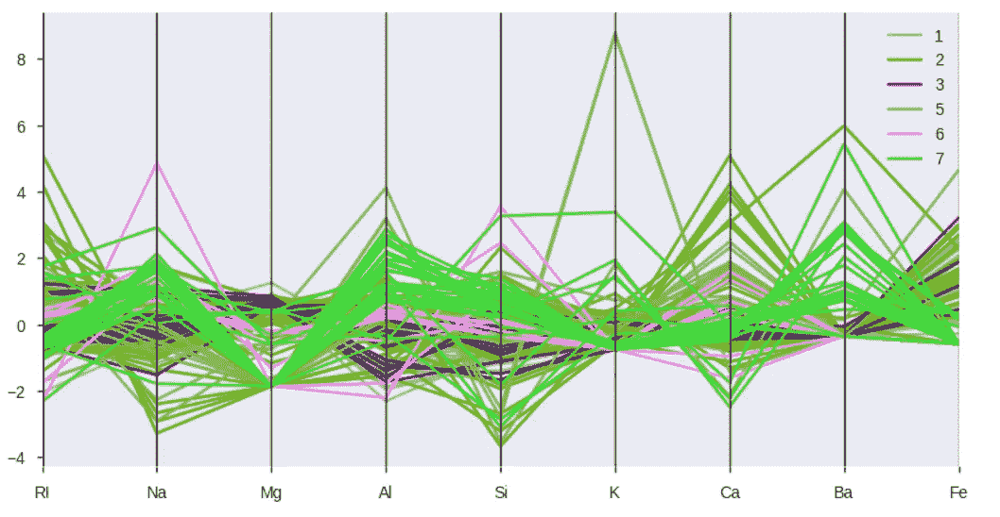

作者图片

机器学习算法通常假设对象数量大致相似的类别。然而，在现实生活中，数据分布大多是倾斜的，一些类出现的频率比其他类高得多。因此，当面对这种不平衡时，我们必须设计一个智能系统，能够克服这种偏见。

这里，我们将处理一个多类问题，数据取自 UCI ML 库，如下所示。

```
url = ("https://archive.ics.uci.edu/ml/machine-learning-"
"databases/glass/glass.data")
df = pd.read_csv(url, header=None)
df.columns = ['Id', 'RI', 'Na', 'Mg', 'Al', 'Si','K', 'Ca', 'Ba', 'Fe', 'type']
df.set_index('Id', inplace=True)
print('Data loading:')
df.head()
```

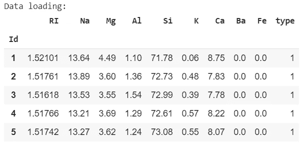

在这里，我们把具有不同化学成分特征和不同类型的玻璃归为多类。该问题提出了各种玻璃的化学成分，其目的是确定玻璃的用途。

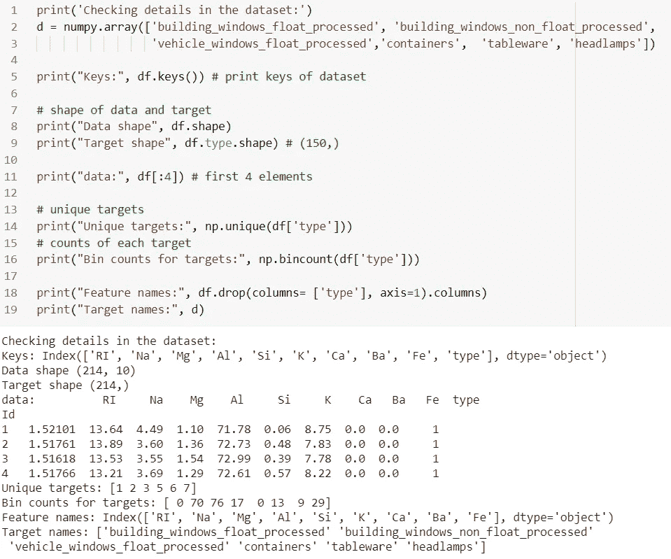

# 探索性分析

## 类可视化

```
figure, ax = plt.subplots(1,1, figsize=(10,5))
sns.countplot(x = 'type', data=df)
ax.set_xticklabels( ('building_windows_float_processed', 'building_windows_non_float_processed','vehicle_windows_float_processed','containers',  'tableware', 'headlamps'), rotation = 90 ) plt.show()# summarize the class distribution
target = df.values[:,-1]
counter = Counter(df['type'])
for k,v in counter.items():
per = v / len(df) * 100
print('Class=%d, Count=%d, Percentage=%.3f%%' % (k, v, per))
```

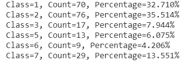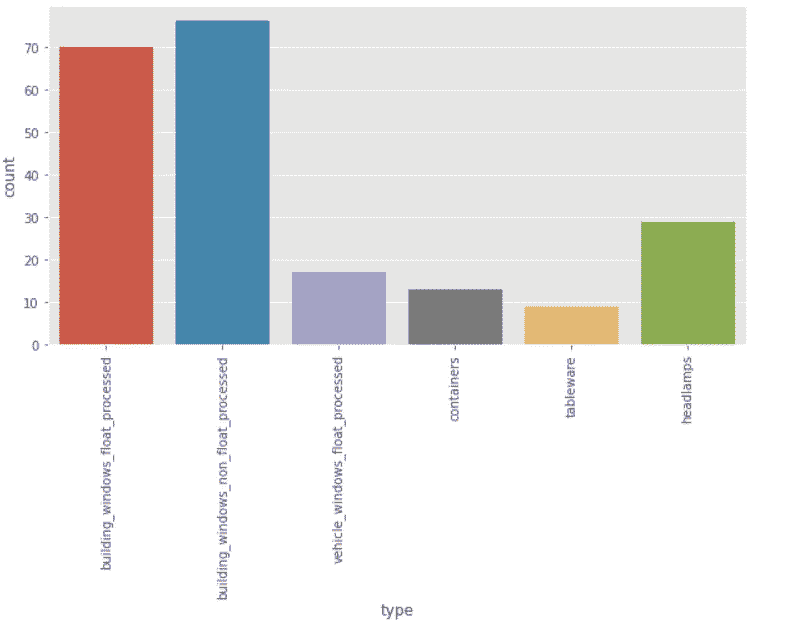

我们可以观察到数据有些不平衡。每个等级从人口最多的 76 到人口最少的 9。平均统计数据可能主要由人口最多的类的值决定，没有理由期望其他类的成员具有相似的属性值。激进行为对于区分不同的类来说是一件好事，但它也意味着进行预测的方法必须能够追踪不同类之间相当复杂的边界。

## 箱形图

让我们来看看标准化数据的箱线图。我们使用平均值和标准差对数据进行了标准化。偏差。

```
X = df[['RI', 'Na', 'Mg', 'Al', 'Si','K', 'Ca', 'Ba', 'Fe']]
X_norm = (X - X.mean())/X.std()
boxplot = X_norm.boxplot(column= ['RI', 'Na', 'Mg', 'Al', 'Si',
'K', 'Ca', 'Ba', 'Fe'])
plt.xlabel("Attribute Index")
plt.ylabel(("Quartile Ranges"))
plt.show()
```

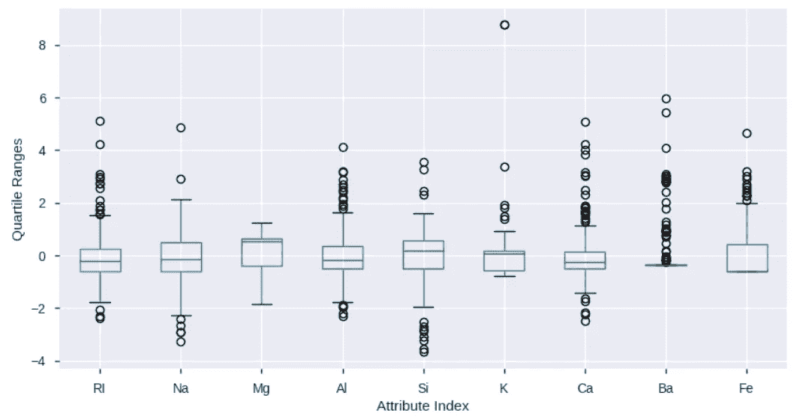

这里可以观察到大量的异常值。我们有一个多层次的分类问题。更有甚者，数据有些不平衡。

## 平行坐标图

我们将使用标准化数据绘制平行坐标图，以保持比例一致。而且，因为并行坐标图计算的动态特性在显示中起着很大的作用。

```
X_norm = pd.concat([X_norm, df['type']], axis=1)
pd.plotting.parallel_coordinates(X_norm, 'type')
plt.show()
```

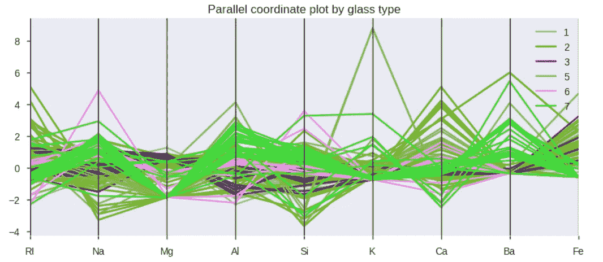

绿色和蓝色的线条很好地组合在一起，并在许多属性上与其他类很好地分开。此外，绿线位于几个属性的数据边缘，换句话说，就是这些属性的异常值。中间的蓝色线条也聚集在一起，但其值处于中间范围。

## 预测能力评分(PPS)

PPS 在数据中发现更多模式，并检测线性或非线性关系。分数范围从-1 到 1，表示是否存在强线性关系。PPS 使用交叉验证的决策树，并计算合适的评估指标。要了解更多，请访问[这里](/rip-correlation-introducing-the-predictive-power-score-3d90808b9598)。

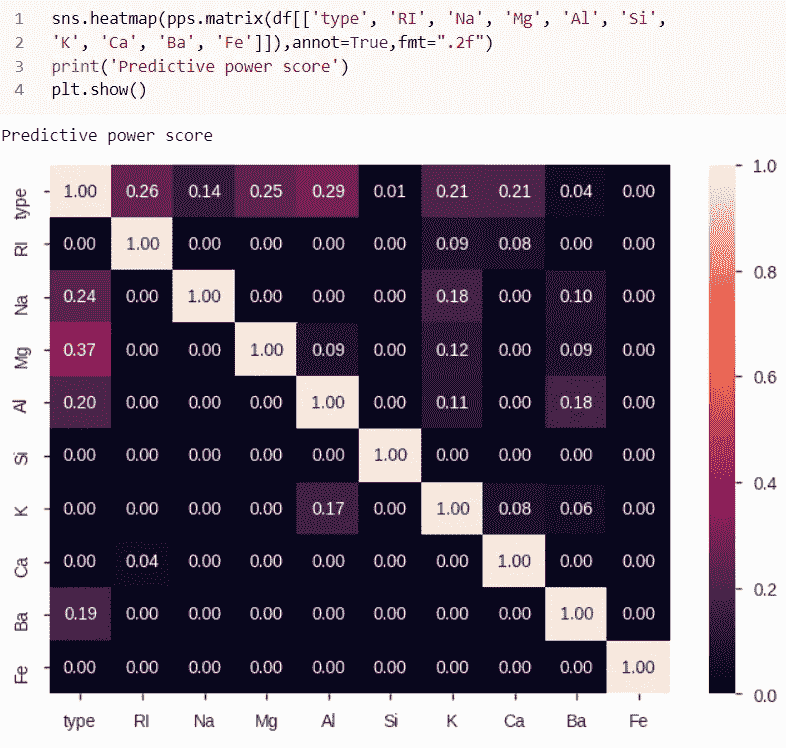

非线性关系由“0”值标识。目标不包括在相关图中，因为问题的目标具有几个离散值中的一个。

从探索性分析中，我们很好地理解了这个问题的权衡，导致了对什么算法将给出最佳性能的一些猜测。这里，数据量很小，考虑到不平衡数据集涉及多个类，问题有点复杂。

我们可能需要一个基于非线性树的算法来针对这个用例。我们将尝试决策树(DT ),它通过在某个值重复分割特征，将特征空间分割成许多更小的区域。为此，DT 使用一个贪婪算法和一些启发式算法来寻找一个分裂，使子节点的组合杂质最小化。在 DT 下的许多算法中，我们将在这里尝试随机森林。

# 具有 OOB 误差的随机森林

> 随机森林使用树，根据事例是高于还是低于所选特征变量的所选阈值，将数据分成组(重复)。输入异常值没有额外的影响。输出异常值将影响它们所在叶节点的估计值，但不会影响任何其他叶节点的值。输出异常值对随机森林有“隔离”效果。埃文·埃尔格

由于不平衡的类，我们选择分层抽样在列车测试分裂。

```
X = df.drop(columns = ['type'], axis=1)
y = df['type']
X_train, X_test, y_train, y_test = train_test_split(X, y, test_size = 0.20, stratify=y, random_state=123)miss_class_error = []
nTreeList = range(50, 2000, 50)
for iTrees in nTreeList:
depth = None
max_feat = 4 
rfc = RandomForestClassifier(n_estimators=iTrees, max_depth =depth, max_features=max_feat, oob_score=True,n_jobs = -1, random_state=123)
print('RandomForest model fit:')
rfc.fit(X_train, y_train)
```

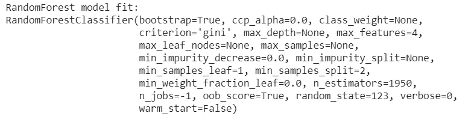

我们想要评估我们的训练集中的观察值的数量对某些度量(准确性、F1 等)的影响。).

## 学习曲线

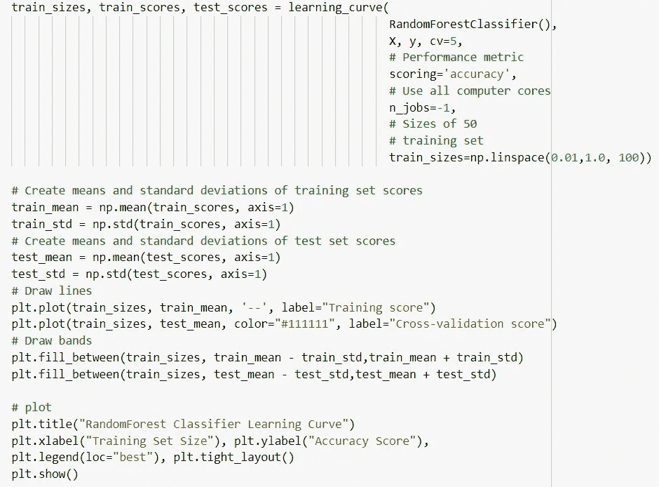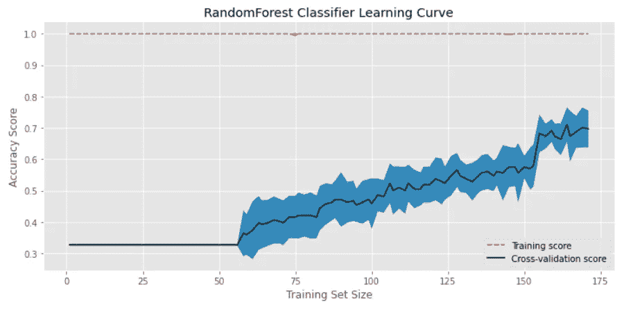

它实际上是可视化我们的模型在训练和交叉验证过程中的性能(例如，准确性、召回率),因为训练集中的观察次数增加了。我们在 100 个不同的训练集大小(从 1%的观察值到 100%的观察值)下绘制了拟合分类器的准确度。交叉验证模型的准确度分数越来越高，这告诉我们，我们可能会从额外的观察中受益。这是一个缓慢的过程。

# 准确(性)

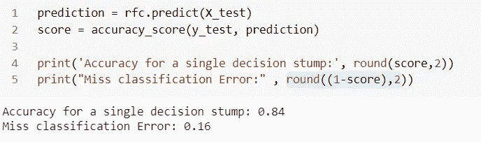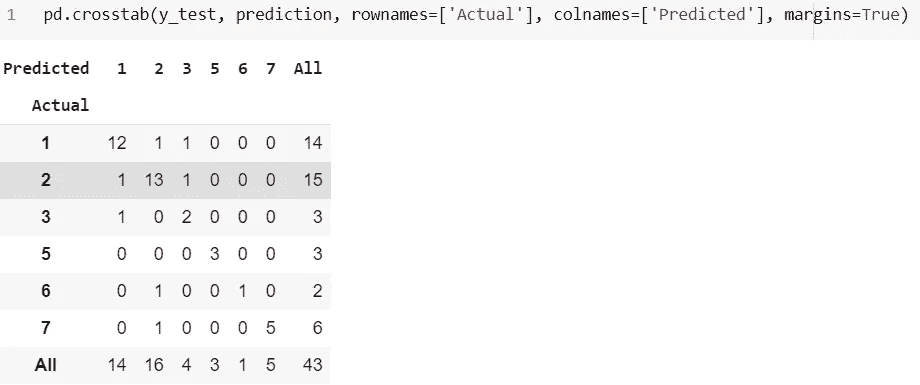

## 混淆矩阵

```
cm = confusion_matrix(y_test, prediction)
pd.DataFrame(cm)
plt.figure(figsize=(10,6))
print('')
print("Confusion Matrix plot")
sns.heatmap(cm.T, square=True, annot=True, fmt='d', cbar=False)
plt.xlabel('true label')
plt.ylabel('predicted label');
```

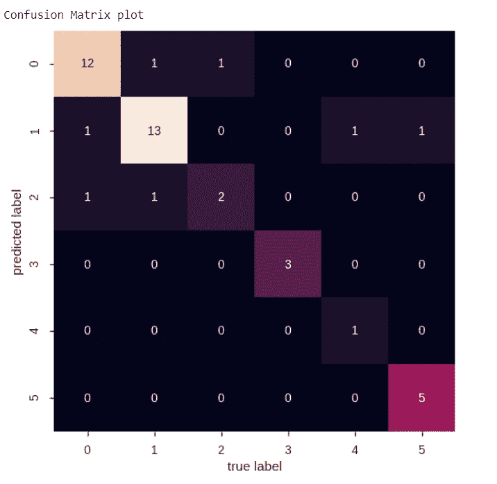

## 分类报告

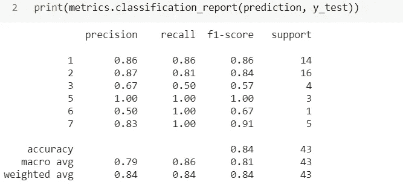

## 接收机工作特性(ROC)

以下代码摘自 sklearn 指南:

我们将使用一对所有的方法，这种方法在标签方面具有独特的优势。

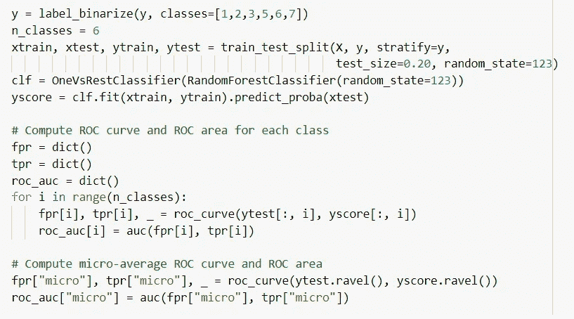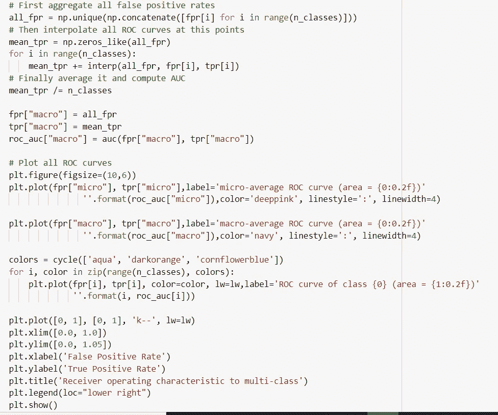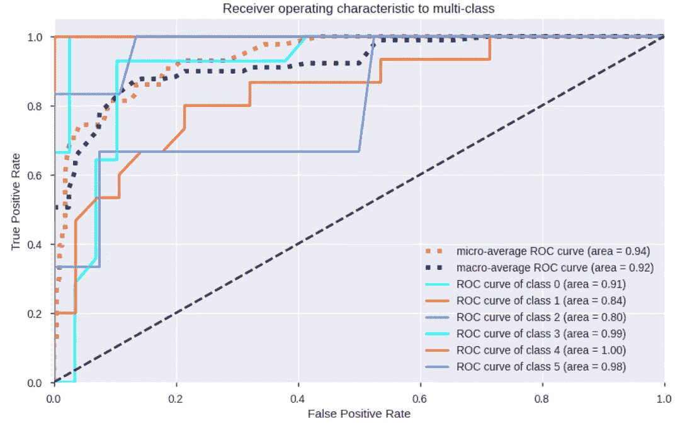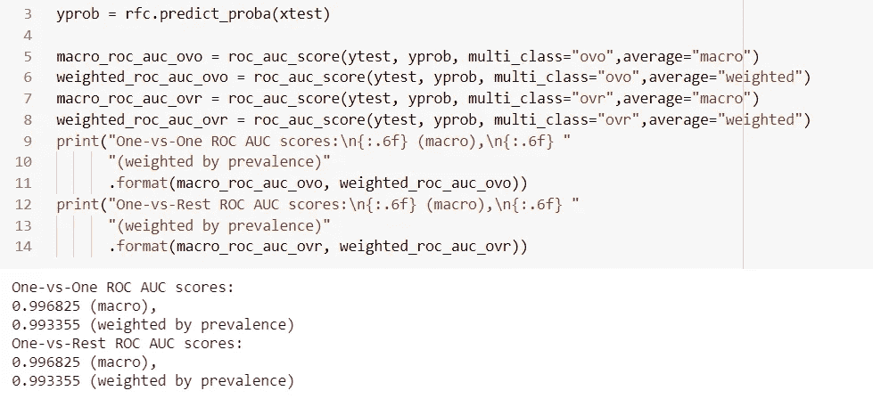

## 特征重要性

```
feature_importance = rfc.feature_importances_
# normalize by max importance
feature_importance = feature_importance / feature_importance.max()#plot variable importance
idxSorted = numpy.argsort(feature_importance)
barPos = numpy.arange(idxSorted.shape[0]) + .5
plt.barh(barPos, feature_importance[idxSorted], align='center')
plt.yticks(barPos, variable_names[idxSorted])
plt.xlabel('Variable Importance')
plt.show()
```

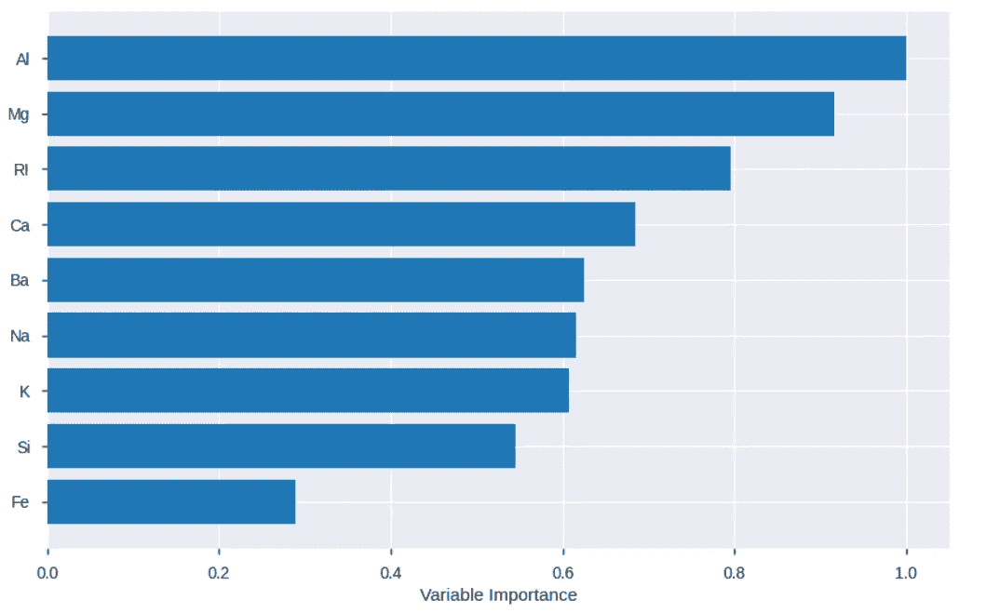

总的来说，我们可以看到我们的模型在给定数据集的情况下为眼镜的分类提供了很好的洞察力。

## 超参数值的影响

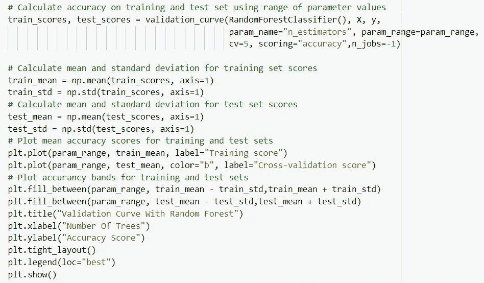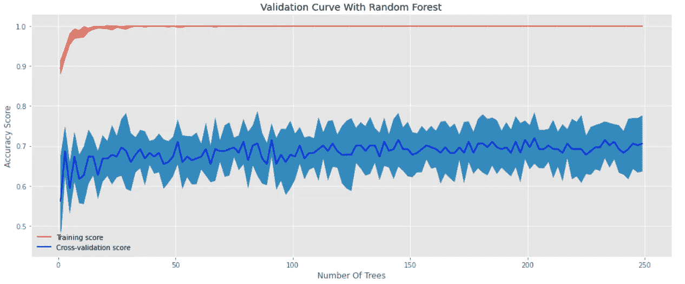

这表明，训练大规模森林的计算成本可能没有太大价值。因此，我们可以用更少的树重新训练出模型来评估性能。

# 结论

用相同的数据集与其他模型进行比较总是明智的。然而，多标签分类在最近几年已经成为一个非常重要的范例。随着 ML 算法的进步，在 RandomForest 的最新版本中，不需要交叉验证或单独的测试集来获得测试集误差的无偏估计。它是在运行期间内部估计的。每个树都是使用来自原始数据的不同引导样本构建的。大约三分之一的情况被排除在引导样本之外，并且不用于第 k 棵树的构造。此外，使用随机平均梯度(SAG)求解器来训练逻辑回归模型进行比较也是一个好主意。

***我这里可以到达***[](https://www.linkedin.com/in/saritmaitra/)****。****

*参考:*

1.  *[*https://www . stat . Berkeley . edu/~ brei man/random forests/cc _ home . htm*](https://www.stat.berkeley.edu/~breiman/RandomForests/cc_home.htm)*
2.  *鲍尔斯博士(2015 年)。Python 中的机器学习:预测分析的基本技术。约翰·威利的儿子们。*

*注意:*这里描述的程序是实验性的，在用于任何商业目的时都应谨慎使用。所有此类使用风险自负。**