# 异常检测的 ML 和精确召回曲线的重要性

> 原文：<https://towardsdatascience.com/forensic-analytics-application-of-machine-learning-to-anomaly-detection-ccd7bef58097?source=collection_archive---------39----------------------->

## 使用机器学习的欺诈检测

## 处理不平衡数据集以检测欺诈概率

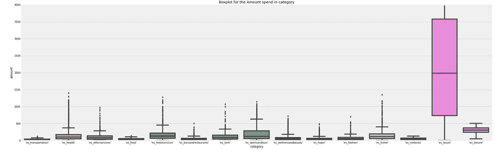

作者图片

[https://sarit-maitra.medium.com/membership](https://sarit-maitra.medium.com/membership)

F 在电子商务、医疗保健、支付和银行系统等许多不同领域都可以看到欺诈行为。财务欺诈对投资者、监管者、审计师和公众都有重要影响。数据挖掘在检测在线交易中的金融欺诈中起着重要的作用。然而，数据挖掘变得具有挑战性，因为正常和欺诈行为的特征不断变化，并且欺诈数据集高度扭曲。

在这里，我们有银行支付的数据集如下。显示交易欺诈性(1)还是有效(0)的目标变量。

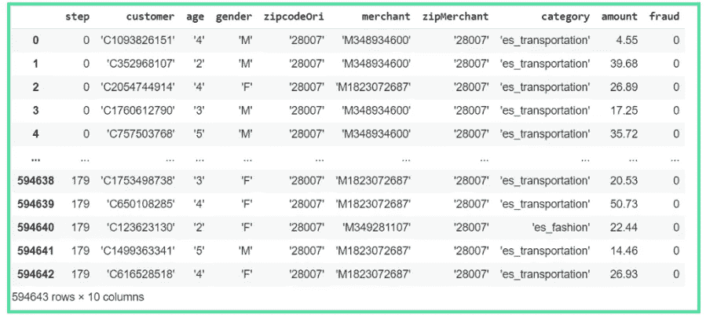

该数据集包含了有关数字金融欺诈风险上升的信息，强调了获取此类数据的难度。它对预测欺诈构成的技术挑战是 600 万行数据中正负类之间的高度不平衡分布。为了更好地理解金融交易数据集，让我们按特性统计不同值的数量。

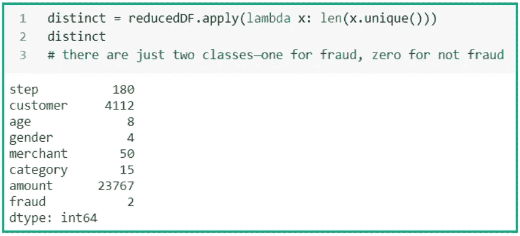

正如我们在下图和 outlier_fraction 中看到的，数据是不平衡的。

```
ax = (df['fraud'].value_counts()*100.0 /len(df)).plot(kind='bar', stacked = True, rot = 0)
ax.yaxis.set_major_formatter(mtick.PercentFormatter())
ax.set_ylabel('Frequency Percentage')
ax.set_xlabel('Class')
ax.set_title('Frequency Percentage by Class')
totals = [] for i in ax.patches:
 totals.append(i.get_width())total = sum(totals) for i in ax.patches:
 ax.text(i.get_x()+.15, i.get_height()-3.5, \
 str(round((i.get_height()/total), 1))+'%', color='black', weight = 'bold')
```

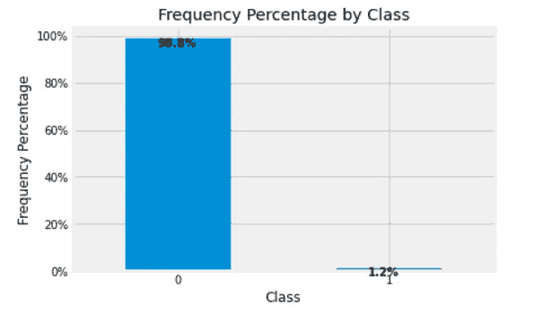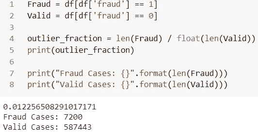

## 数据预处理:

只有一个唯一的邮政编码值，因此我们将删除它们。

```
print("Unique zipCodeOri values: ",df.zipcodeOri.nunique())
print("Unique zipMerchant values: ",df.zipMerchant.nunique())
```


```
# dropping zipcodeori and zipMerchant 
reducedDF = df.drop(['zipcodeOri','zipMerchant'],axis=1)# changing object dtype to categorical for easing the transformation process
categorical = reducedDF.select_dtypes(include= ['object']).columns
for col in categorical:
reducedDF[col] = reducedDF[col].astype('category')# categorical values to numeric values
reducedDF[categorical] = reducedDF[categorical].apply(lambda x: x.cat.codes)
reducedDF.head()
```

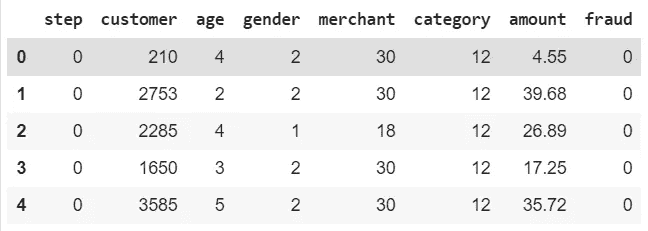

可以注意到，为了计算容易，这里避免了一位热编码；但是，通常最好将这些类别值转换为虚拟值，因为它们在大小上没有关系(即客户 1 不大于客户 2)。

创建特征矩阵 X 和标签数组 y

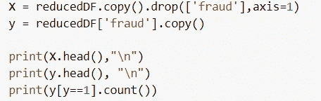

让我们重新调整特征矩阵，使均值为零，标准差为一。

```
featuresToScale = X.columns
sX = pp.StandardScaler(copy=True)
X.loc[:,featuresToScale] = sX.fit_transform(X[featuresToScale])
```

## 特征的相关性:

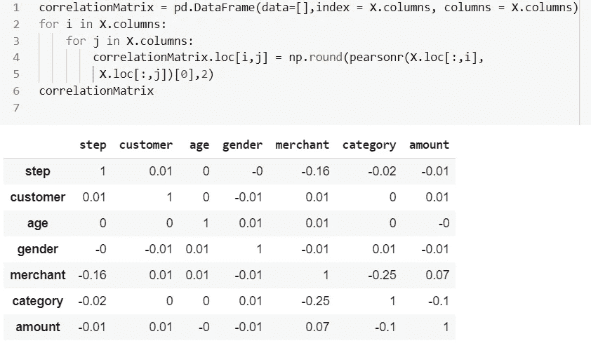

# 模型准备:

现在数据准备好了，就来准备模型吧。我们需要将数据分为训练集和测试集，选择一个成本函数。

## 选择成本函数:

在训练之前，我们需要将误差率的成本函数应用于算法。该算法将通过从训练示例中学习来尝试最小化该成本函数。我们将使用二元分类对数损失，这将计算真实标签和基于模型的预测之间的交叉熵。

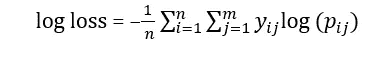

这里， *n* 是观察次数； *m* 是类标签的个数； *log* 是自然对数；如果观察值 *i* 在类 *j* 中则 *1* 否则*0*1；并且是观测值 *i* 在类 *j* 中的预测概率。

该模型将为每笔交易生成欺诈概率。欺诈概率越接近真实标签，对数损失函数的值越低。ML 的目标是尽量减少测井损失。

```
featuresToScale = X.columns
sX = pp.StandardScaler(copy=True)
X.loc[:,featuresToScale] = sX.fit_transform(X[featuresToScale])# Define resampling method and split into train and test
method = SMOTE(kind='borderline1')
trainX, testX, trainY, testY = train_test_split(X,y, test_size = 0.2, random_state = 42, stratify=y)# Apply resampling to the training data only
X_resampled, y_resampled = method.fit_sample(trainX, np.ravel(trainY))
```

## 安装灯 GBM:

```
model = LGBMClassifier().fit(X_resampled, y_resampled)# Get model performance metrics
predicted = model.predict(testX)
print(classification_report(np.ravel(testY), predicted))probabilities = model.fit(trainX,
                          np.ravel(trainY)).predict_proba(testX)
print('AUPRC = {}'.format(average_precision_score(testY, \
probabilities[:, 1])))# Probabilities for the positive outcome only
lgb_probs = probabilities[:, 1]# Precision-recall AUC
precision, recall, _ = precision_recall_curve(np.ravel(testY), lgb_probs)
auc_score = auc(recall, precision)
print('LightGBM PR AUC: %.3f' % auc_score)average_precision = average_precision_score(testY, lgb_probs)plt.figure(figsize=(10,6))
# calculate the no skill line as the proportion of the positive class
no_skill = len(y[y==1]) / len(y)# plot the no skill precision-recall curve
plt.plot([0, 1], [no_skill, no_skill], linestyle='--', label='No Skill')# plot the model precision-recall curve
plt.plot(recall, precision, marker='.', label='LightGBM')
plt.fill_between(recall, precision, step='post', alpha=0.3, color='k')# axis labels
plt.xlabel('Recall')
plt.ylabel('Precision')plt.legend()
plt.title('Precision-Recall curve: Average Precision = {0:0.2f}'.format(average_precision))
```

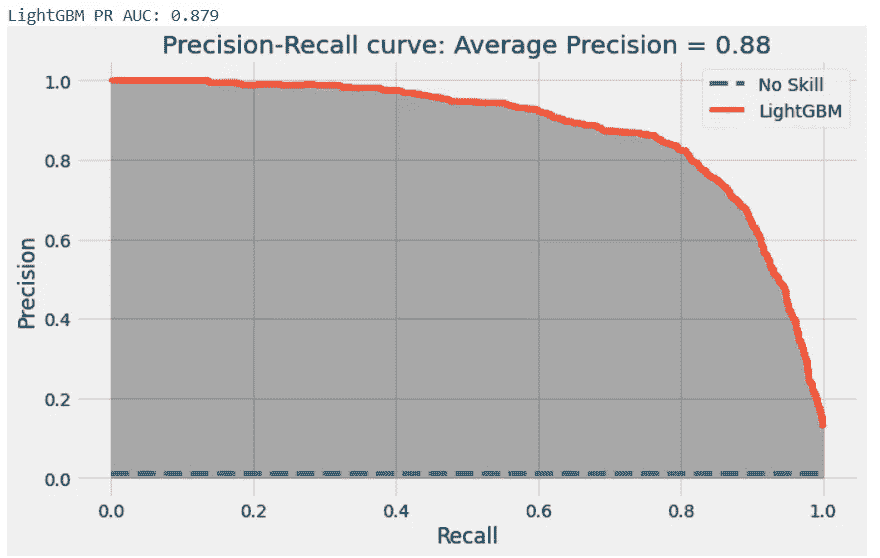

## 灵敏度、特异性、精确度、F1 和 MCC:

敏感性和特异性通常被认为是混淆矩阵的特征。

*   敏感度或召回率是指检测到的欺诈行为将产生阳性测试结果的可能性(真阳性率)。

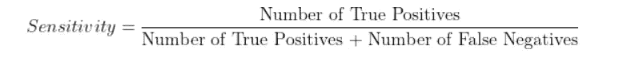

我们在这里看到，公式不包含 FP 和 TN；因此，敏感性可能导致有偏差的结果，特别是对于我们的不平衡类用例。

因此，当分类器在 10 个交易中有 8 个报告肯定有可能欺诈时，灵敏度为 0.8 (80%)。它代表了我们的分类器检测欺诈的能力；低敏感度分类器不能识别许多欺诈交易，而高敏感度分类器在结果为否定时有助于排除交易。因此，我们看到，灵敏度是假阴性率的补充(即假阴性率加上灵敏度= 100%)。

*   特异性是指欺诈性交易在非欺诈性交易中测试结果为阴性的可能性(真-负比率)。

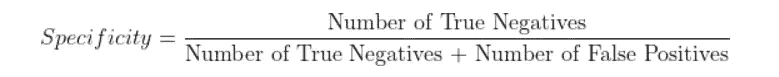

因此，当分类器在 10 个无欺诈交易中的 8 个中报告否定时，特异性为 0.8 (80%)。特异性代表我们的分类器正确识别欺诈交易的程度，因为特异性高的分类器的假阳性率低。具有低特异性的分类器将许多真实的交易信号化为欺诈性的。它是假阳性率的补充。然而，这里我们也看到，公式不包含 FN 和 TP；对于不平衡的类，特异性也可能给我们有偏见的结果。

*   精确度也称为阳性预测值。

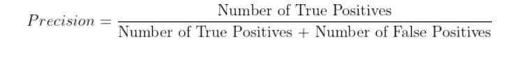

这里，公式也不包含 FN 和 TN，同样，精度可能会对我们的不平衡类给出有偏差的结果。它给出了所有预测欺诈中正确预测欺诈的百分比。

*   F1 分数结合了召回率和精确度，与上述 3 个指标相比，呈现了一个更平衡的视图，但在该场景中可能会给出有偏差的结果，因为它不包括 TN。


*   马修斯相关系数(MCC)在其公式中考虑了混淆矩阵的所有单元。然而，我们没有在这项工作中试验 MCC，尽管一些报告表明 MCC 易于解释，并且对预测目标的变化也是稳健的。

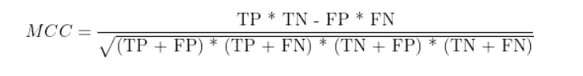

在我们的案例研究中，欺诈占总案例的 1.2%。欺诈检测可能无法通过获得高准确率来实现。因此，我们将考虑其他性能指标，特别是灵敏度、精确召回曲线下面积(AURPC)和 F1 分数。

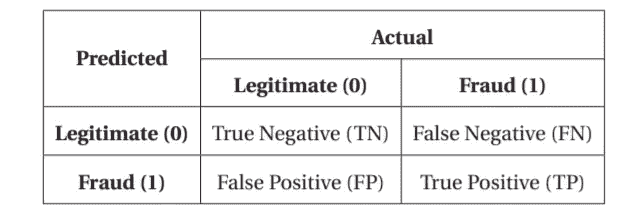

准确率代表两个类别中正确分类的观察值的百分比:

百分比精度= (T P +T N / T N +F N +T P +F P) * 100

灵敏度，即真阳性率(TPR)和回忆，代表了被正确分类为阳性的阳性的比例。这些参数至关重要，我们认为这些参数与精确度一起是一种性能指标。

灵敏度= T P / T P +F N

然而，单独的灵敏度也有误导性，因为它允许忽略大量的假阳性。我们的目标是在这两个参数之间找到平衡。我们需要获得高欺诈检测率(灵敏度)，以及尽可能高的准确性。为了解决这个问题，我们考虑了像 AUPRC 和 F1 分数这样的权衡措施。

## 精确度-召回曲线:

对于我们不平衡的数据集，更好的评估结果的方法是使用精度和召回率。精度-召回曲线显示了精度(结果相关性的度量)和召回(返回多少相关结果的度量)之间的权衡。我们已经讨论了精确度、召回率和 F1 分数。

*   高精度意味着，在我们所有的积极预测中，许多是真正的积极预测。
*   高召回率意味着模型已经捕获了大部分的实际阳性(换句话说，它具有低的假阴性率)

最优解需要高精度和高召回率。因此，我们在这里看到的是精度和召回之间的权衡。这通常由算法设置的阈值来确定，以将阳性病例与阴性病例分开。为了评估精度-召回曲线，我们需要计算平均精度，即在每个阈值达到的精度的加权平均值。平均精度越高，解决方案越好。

```
print("Classification Report for LightGBM: \n", classification_report(testY, predicted))print("Confusion Matrix of LightGBM: \n", confusion_matrix(testY, predicted))
```

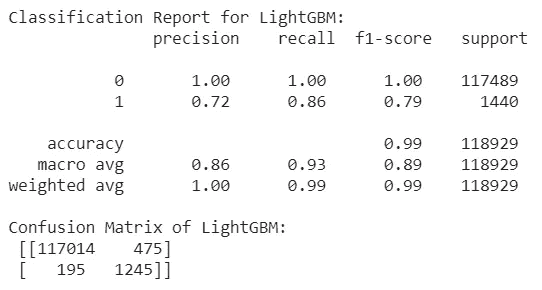

鉴于我们的金融交易数据集高度不平衡，使用混淆矩阵将没有意义。考虑到这种不平衡的阶级问题，混淆矩阵在捕捉这种次优结果方面表现不佳。

## 拟合逻辑回归模型:

```
# fit Logistic Regression model
logreg.fit(trainX, trainY)
log_pred = logreg.predict_proba(testX)
log_probs = y_pred[:, 1]# calculate the precision-recall auc
precision, recall, _ = precision_recall_curve(testY, log_probs)
auc_score = auc(recall, precision)
print('LogReg PRAUC: %.3f' % auc_score)log_probabilities = logreg.fit(trainX, trainY).predict_proba(testX)
avg_prec = average_precision_score(testY, log_probabilities[:, 1])plt.figure(figsize=(10,6))
# calculate the no skill line as the proportion of the positive class
no_skill = len(y[y==1]) / len(y)
# plot the no skill precision-recall curve
plt.plot([0, 1], [no_skill, no_skill], linestyle='--', label='No Skill')
# plot the model precision-recall curve
plt.plot(recall, precision, marker='.', label='LogisticRegression')
plt.fill_between(recall, precision, step='post', alpha=0.3, color='k')plt.xlabel('Recall')
plt.ylabel('Precision')
plt.legend()
plt.title('Precision-Recall curve: Average Precision = {0:0.2f}'.format(avg_prec))
```


## LightGBM 和 Logistic 回归的集成

堆叠概括提供了一种利用异质分类方法集合的集体辨别能力的机制。这包括使用顶级分类模型，该模型能够从基础级模型的预测(和分类偏差)中学习，以实现更大的分类能力。考虑到 XGBoost 和 LightGBM 来自同一个家族，我们将选择 LightGBM 和 Logistic 回归模型用于集成方法。

```
kfold = model_selection.KFold(n_splits=10, shuffle=True, random_state=42)# create the sub models
estimators = []
model1 = LogisticRegression()
estimators.append(('logistic', model1))model2 = LGBMClassifier()
estimators.append(('lgb', model2))# create the ensemble model
ensemble = VotingClassifier(estimators)
= model_selection.cross_val_score(ensemble, trainX, trainY, cv=kfold)print(results.mean())
```

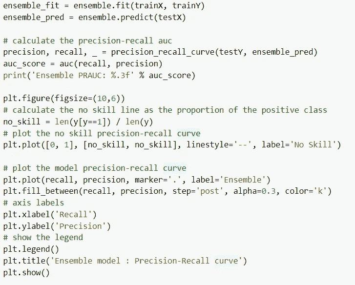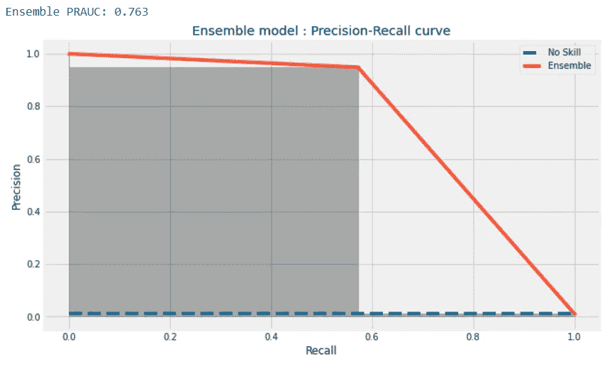

这种性能比逻辑回归好不了多少，但远不如前两种模型。因此，我们将拒绝这一点。

使用无监督的 LightGBM 模型，我们实现了 0.90 的平均精度。我们将尝试安装自动编码器，以检查无监督模型是否带来更好的准确性。

## 自动编码器:

这里，我们将通过对欺诈案例的数量进行过采样来调整我们的训练集。我们希望将更多欺诈案例添加到我们的数据集中，以便我们训练的自动编码器能够更容易地将有效交易与欺诈交易分开。

```
oversample_multiplier = 100
trainX_original = trainX.copy()
trainY_original = trainY.copy()
testX_original = testX.copy()
testY_original = testY.copy()trainX_oversampled = trainX.copy()
trainY_oversampled = trainY.copy()trainX_oversampled = trainX_oversampled.append( \[trainX_oversampled[trainY==1]]*oversample_multiplier, ignore_index=False)
trainY_oversampled = trainY_oversampled.append( \[trainY_oversampled[trainY==1]]*oversample_multiplier, ignore_index=False)trainX = trainX_oversampled.copy()
trainY = trainY_oversampled.copy()model = Sequential()
model.add(Dense(units=20, activation='linear', 
activity_regularizer=regularizers.l1(10e-5), input_dim=7,name='hidden_layer'))model.add(Dropout(0.02))
model.add(Dense(units=1, activation='linear'))
model.compile(optimizer='adam',loss='mean_squared_error',metrics=['accuracy'])num_epochs = 5
batch_size = 32history = model.fit(x=trainX, y=trainY,epochs=num_epochs,
batch_size=batch_size,shuffle=True,validation_split=0.20,verbose=1)
predictions = model.predict(testX, verbose=1)
anomalyScoresAE = anomalyScores(testX, predictions)
preds, average_precision = plotResults(testY, anomalyScoresAE, True)
```

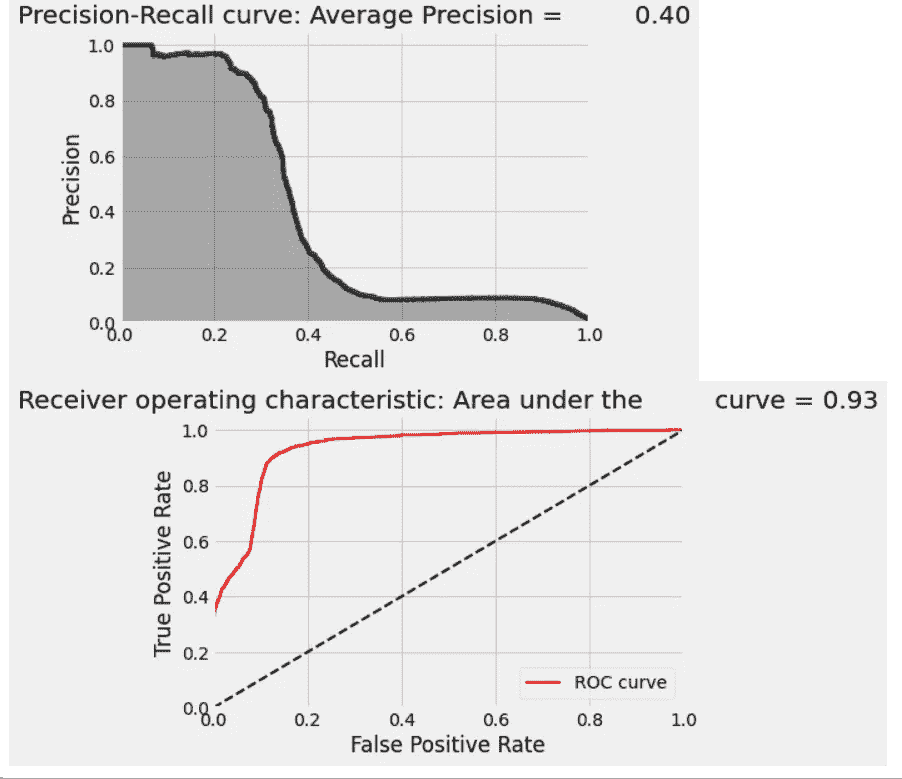

基于精度-召回曲线的测试的平均精度是 0.40，这是数据的最差表示。我们可以尝试将监督和非监督结合起来，创建一个半监督模型来检查性能。然而，由于我们现有的数据是有标记的，无监督算法可能会带来更好的结果。

## 精确召回曲线的阈值:

```
fscore = (2 * precision * recall) / (precision + recall)
ix = argmax(fscore)
print('Best Threshold=%f, F-Score=%.3f' % (thresholds[ix], fscore[ix]))no_skill = len(testY[testY==1]) / len(testY)
plt.plot([0,1], [no_skill,no_skill], linestyle='--', label='No Skill')
plt.plot(recall, precision, marker='.', label='LightGBM')
plt.scatter(recall[ix], precision[ix], s=(10*2)**2, marker='s', color='black', label='Best')plt.xlabel('Recall')
plt.ylabel('Precision')
plt.legend()
plt.show()
```

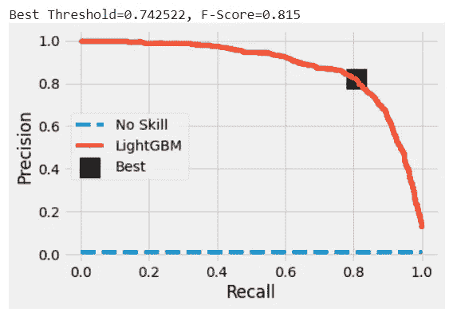

可以进一步调整该图以获得最佳性能；然而，在这里，最佳 F1 分数被标注为阈值 0.74。

# 生产管道:

一旦我们确定了用于生产的模型，让我们设计一个简单的管道，对新的传入数据执行三个简单的步骤:加载数据，缩放特征，并使用我们已经训练并选择用于生产的 LightGBM 模型生成预测:

```
*# Pipeline for New Data*# first, import new data into a data frame called ‘newData’
# Scale all the variables to a range of 0 to 1
newData.loc[:, featuresToScale] = sX.transform(newData[featuresToScale])# third, predict using LightGBM
lgb.predict(newData, num_iteration=lgb.best_iteration)
```

# 关键要点

一个欺诈检测系统应该具有下面提到的一些属性，以使现实世界的商业意义。

1.  该系统应该能够处理偏斜分布，因为所有交易中只有一小部分是欺诈性的。为了克服这一点，需要将训练集分成分布不那么偏斜的部分。
2.  系统应该能够处理噪声，即数据中的错误。无论训练有多广泛，数据中的噪声都会限制归纳的准确性。
3.  如果使用重采样技术，应该小心使用；它们不应该作为独立的解决方案使用，而必须与问题的返工相结合，以达到特定的目标
4.  系统应该能够适应新类型数据。欺诈者总是不断改变他们的行为，因此，过一段时间后，成功的欺诈技术会降低效率。
5.  良好的度量对于检查分类器性能至关重要。偏斜分布的总体高分并不意味着系统能够捕捉所有欺诈交易。
6.  该系统还应考虑到检测欺诈交易的成本和阻止欺诈交易的相关成本。欺诈检测系统之上的决策层可能有助于降低成本。分类器和决策规则必须相对于最小化成本来设置。

# 结论:

随着时间的推移，解决方案将需要重新培训，因为欺诈的模式总是在变化。此外，我们可以试验其他 ML 算法，它们的性能与梯度提升一样好，并且可以将它们包括在集成中，以提高整体欺诈检测性能。通过足够的迭代，通常有可能找到一个适当的机器学习模型，在偏差与方差以及精度与召回之间取得正确的平衡。此外，可解释性对于机器学习的现实应用非常重要。我们将为下一次讨论保留可解释性。

如果不进行全面调查，永远无法确认财务欺诈，欺诈检测方法的进步可能会发出危险信号，警告利益相关方欺诈的可能性。

**我可以到达** [***这里***](https://www.linkedin.com/in/saritmaitra/) **。**