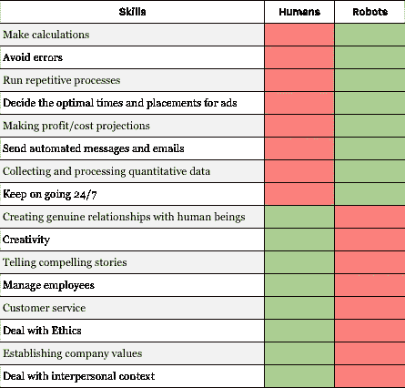

# 忘记学习事实，专注于学习如何做人

> 原文：<https://towardsdatascience.com/forget-about-learning-facts-focus-on-learning-how-to-be-human-e60916232bea?source=collection_archive---------33----------------------->

[亚历山大·奈特](https://unsplash.com/@agk42?utm_source=medium&utm_medium=referral)在 [Unsplash](https://unsplash.com?utm_source=medium&utm_medium=referral) 上拍照

## 人工智能如何改变我们使用信息的方式。

*在工业革命的早期，对于大多数人来说，能够制作和执行体力劳动是赚钱的关键。在工厂工作 8 小时，在建筑工地工作，或者——如果你够幸运并且负担得起的话——为一份需要更多脑力而不是体力的工作而学习。随着机器的兴起，越来越多的艰苦体力劳动由早期的机器人完成。组装汽车或搬运重物被机器取代，我们慢慢进入了一个更加以知识为基础的经济。人工智能的兴起现在正在重复这一过程，但现在这项技术正在智力基础上更多地帮助我们。*

## 从苦力到脑力

我是一个 80 后(更准确地说是 80 后)，对我来说，我被告知记住信息是成功的关键。90 年代我在学校的时候，在接下来的几年里，我们没有谷歌、必应或任何其他形式的数字搜索引擎。我们被教导要记住尽可能多的信息，因为如果没有这些常识，你对工作社区的价值就会降低。我们正在过渡到一个知识时代，而不是启动工业革命的艰苦体力劳动时代。你可以看到这种转变，因为人们毕业的年龄越来越大，继续上大学的雄心也在迅速增长。我们现在有工具来部分自动化艰苦的体力工作，所以现在每个人都想通过使用他们的大脑来赚钱。公司为聪明人付了很多钱。

> “我们是以信息为导向的，你的学位将是伟大事业的保证。”

所以我接受教育的目标是尽可能多的学习，尽可能的得到最高分，在任何类型的测试中达到最高分。当然，我们慢慢有了像早期的谷歌和类似的搜索引擎这样的工具，但这仅仅是为了查找你必须记住的信息。软技能是一个没有人听说过的词，更不用说将其作为你未来工作的一项资产了。我们是信息驱动的，你的学位将是伟大事业的保证。没有人想学习成为一名木匠、瓦工或擦窗工。我们被告知“努力学习，你会有所成就的”。软技能工作是为那些想成为心理学家或社会工作者的人保留的。

## 你的知识不在你的脑袋里，而是在你的指尖

人工智能如何改变我们从事体力工作的方式，同时满足我们对信息的持久需求？首先，人工智能擅长帮助我们做体力活。一个现实生活中的例子是连接到虚拟现实设备和手持控制器的机器人手臂，以执行精确的工作。通过深度学习，它能够学习不同的任务，如装沙拉或叠毛巾，只需对信息进行微小的调整。没有“仅仅会叠毛巾”——作为一个单一的任务——它可以学习新的技术并扩展它的一系列动作。在某种程度上类似于我们人类，能够像我们一样学习新的物理技术。

现在，我们正在进入一个机器覆盖物理部分的时代，这意味着人类可以更加专注于知识。但是，身处 2020 年的我们，还需要我们大脑中所有的精确知识、事实和细节吗？我个人很怀疑。我们觉得有必要存储所有这些信息，并根据你拥有多少事实知识来确定你有多“聪明”，这可能仍然是一种自我或声望的事情，但这仍然值得吗？如今，你可以在 Google Home 或 Siri 上问任何维基百科上有价值的问题，并在 2 秒内得到答案，这比我解锁手机主屏幕和打开谷歌还快。当然，手头有知识会派上用场，但在大多数情况下已经不再需要了。事实上，我们大多数人不是一直带着 4G 手机甚至 Siri 吗？事实上，所有的答案不都在我们的指尖或牛仔裤的口袋里吗？我们真的应该用我们(不断发展的)手机、平板电脑、智能扬声器等现成的琐碎信息来加重我们大脑的负担吗？

## 忘记琐碎的事实，专注于做人

我们现在正在应对如此多的现代挑战，这些挑战不需要太多的“顶级知识”，而是需要更多的理解和执行让我们与众不同的东西。我们人类是世界上最有创造力的生物(或者至少有足够的创造力让我们认为自己是)。我们也有强大的道德指南针，[这是人工智能所缺乏的东西](/the-importance-of-ethics-in-artificial-intelligence-16af073dedf8)你可以在我以前的一篇文章中读到。我们不应该再想去回忆西尔斯大厦有多高，或者哪位将军在 1729 年的一场战斗中骑着白马。这是我们在几秒钟内从我们的人工大脑(谷歌、Siri、Alexa 等)接收到的信息类型。)如果你愿意的话。

**图片 1** :来自[品牌人性化论文](https://medium.com/@JonathanFlores/brand-humanizing-an-inevitable-and-humane-turn-on-business-in-an-increasingly-robotic-world-427890e4328b) (2018)的人类与机器人

我们**确实**需要投资于人工智能(还)无法从我们手中接管的事物。理解人类情感、处理道德问题、发挥创造力、管理工具和人员。我们在 2018 年发表的[品牌人性化论文](https://medium.com/@JonathanFlores/brand-humanizing-an-inevitable-and-humane-turn-on-business-in-an-increasingly-robotic-world-427890e4328b) Jonathan Flores 和我自己做了一个“机器人 vs 人类”的概述(图 1)。它显示了两者的优势和弱点，并显示了机器人和人类在不同领域的优势。机器人可以防止错误，运行重复性任务，全天候工作，并存储难以置信的大量信息和数据。那么，为什么我们还想用我们有限的大脑来储存信息呢？我们将做人工智能能做的事情，只是数量少得多，而且有丢失数据的风险。更确切地说，我们会关注机器人缺少我们所拥有的东西的领域。如果我们专注于更软的技能，我们实际上可以拥有 AI/Robots/ML 或任何你更喜欢的工具来做它最擅长的事情:成为一台机器，使用数据和体力来支持我们的日常生活。让我们——人类——专注于我们最擅长的事情，那就是创造性和人性。

## 你怎么想呢?

我们需要继续专注于在大脑中存储知识和事实，还是应该利用人工智能来为我们记住非关键信息？