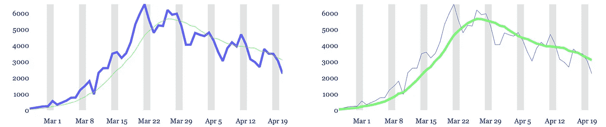
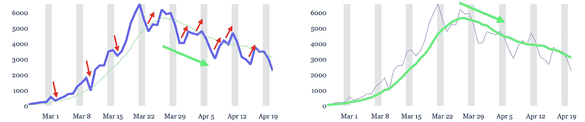
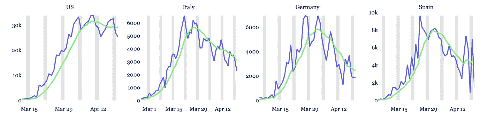
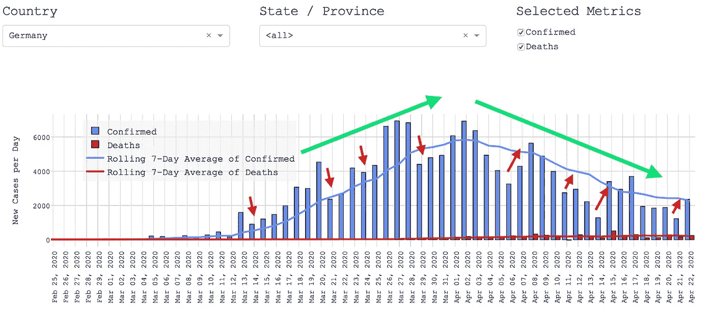

# 厌倦了被告知新冠肺炎方向每两天改变？

> 原文：<https://towardsdatascience.com/forget-daily-statistics-of-the-coronavirus-7e9bbb7349bd?source=collection_archive---------30----------------------->

## 忘记每日统计，遵循正确的 KPI！

索菲·戴尔在 [Unsplash](https://unsplash.com?utm_source=medium&utm_medium=referral) 上的照片

我们[和媒体！]过于看重日常数字。
对于大多数国家来说，病例统计遵循一个**周模式**，在周末达到最低点。

用过去 7 天的**滚动平均值**代替每日数据及其解释会带来一些决定性的**优势**:

*   **清晰的趋势**而不是摇摆不定、令人困惑的模式。
*   **减少 60%的误解**(即草率的结论)。

让我们放大**意大利**数据来更好地理解这种效果:

[疫情爆发以来新增确诊新冠肺炎病例(>每百万人口 5 例)。**每日统计(蓝线)与连续 7 天平均值(绿线)**。

图表显示:

*   **每日确诊病例** ( **蓝线**)。
*   确诊病例的**滚动 7 天平均值**(**绿线**)。这是按照当天和过去 6 天的平均值计算的。
*   **周末**(灰色阴影区域)。

在每个图表中，两个指标中的一个用粗线突出显示。现在让我们添加箭头来表示观察到的方向变化:

[疫情爆发以来新增确诊新冠肺炎病例(>每百万人口 5 例)。每日统计数据(蓝线)与 7 天滚动平均值(绿线)。**箭头表示指标的方向性变化。**

在左侧，每次我们观察到一个微逆趋势时，我们都会看到一个**红色箭头**，即每日数据的方向变化与主趋势相反。9 次我们得到了一个“**错误信号”**(或者说“曲解”)。

在右边，我们没有一个错误的信号！单一方向变化对应于宏观趋势在三月底的正确**突破——由绿色箭头**指示。****

> 现在我们很容易意识到，意大利已经连续 4 周呈持续下降趋势。

*我们所认定的“错误信号”就是我们一开始所说的“误解”或“草率结论”。我们在计算中使用的确切定义是:*

*如果在不到 5 天的时间内恢复方向，则方向变化被视为“对数字的误解”。*

回到整体数据集。

我们使用了来自 [JHU](https://github.com/CSSEGISandData/COVID-19) 的数据，并分析了 117 个国家从 2020 年 4 月 20 日到 2020 年 4 月 20 日的病毒单独爆发(>每百万人口 5 例)的数据。**这些国家的误解平均减少了 60%** 。对许多国家来说，降幅甚至更高。这些国家的例子包括:

美国:73%；意大利:95%，德国:91%，西班牙:83%

让我们快速看一下这些国家:

自疫情爆发以来新增确诊新冠肺炎病例(>每百万人口 5 例)。**每日统计(蓝线)与连续 7 天平均值(绿线)**。

> O 很明显，7 天的滚动平均值(绿线)再次比每日数据平滑。但更重要的是——滚动平均值**改变方向的次数要少得多**！

## 死亡人数

针对确诊病例显示的效果**也适用于死亡病例**。在该指标上应用滚动平均，我们会获得相同的优势。

# 是什么导致了周线模式？

这种模式(主要是每周一次)可能有不同的原因:

*   **周六和/或周日测试较少**。
*   **周末进行测试的记录延迟**。

即使“季节性”的原因是另一个，通过取 7 天平均值来平滑数据会使结果更加稳定。

# 预言

数据中季节性模式的存在也应纳入预测模型。季节性效应的调整使得预测**更加准确**并且其可信度(或置信度)区间更窄。

已经有很多非常好的预测模型，例如

[2020 年 3 月 30 日，帝国理工学院，评估 11 个欧洲国家的新冠肺炎感染人数和非药物干预的影响](https://www.imperial.ac.uk/media/imperial-college/medicine/sph/ide/gida-fellowships/Imperial-College-COVID19-Europe-estimates-and-NPI-impact-30-03-2020.pdf)。

这项研究考察了各国采取的不同干预措施:禁止活动、关闭学校、封锁等。，其影响通过减少[再现数 R0](https://en.wikipedia.org/wiki/Basic_reproduction_number) (或 Rt)来衡量。非常有趣的阅读！

照片由[诺亚·西利曼](https://unsplash.com/@noahsilliman?utm_source=medium&utm_medium=referral)在 [Unsplash](https://unsplash.com?utm_source=medium&utm_medium=referral) 上拍摄

# 最终注释

普通人每隔几天就会看到新冠肺炎数字改变方向，这并没有什么好处。相反，它制造了更多不必要的恐慌和不确定性。

毕竟，这些方向的快速转变与成功实施的干预(如“呆在家里”)无关，而往往是周末的产物。因此，同样:

> 使用滚动 7 天平均线！

## 想看看自己国家的数据吗？

> 几周前，我开发了一个微型网络应用程序来可视化冠状病毒病例统计。现在我添加了 7 天滚动平均值，所以如果你想查看你所在国家或美国各州的数据，请点击以下链接:
> 
> [T3【https://go.aws/2xsdb7q】T5](https://go.aws/2xsdb7q)

**Web App**截图，可在[*https://go.aws/2xsdb7q*](https://go.aws/2xsdb7q)*访问。该应用程序显示了* ***历史每日病例数据加上来自 JHU 数据集的所有国家*** *，* ***加上美国各州和中国各省*** *。*

*而如果你想自己(用 R 或者 Python)创建这样一个 app 的话，查看我更多的技术 101 篇:* [*R 版*](/create-a-coronavirus-app-using-r-shiny-and-plotly-6a6abf66091d) *，* [*Python 版*](/visualise-covid-19-case-data-using-python-dash-and-plotly-e58feb34f70f) *。*