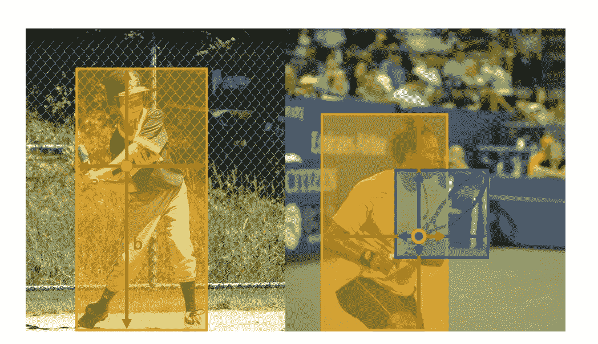
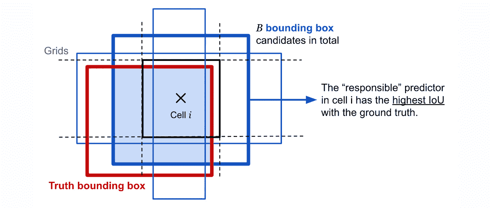
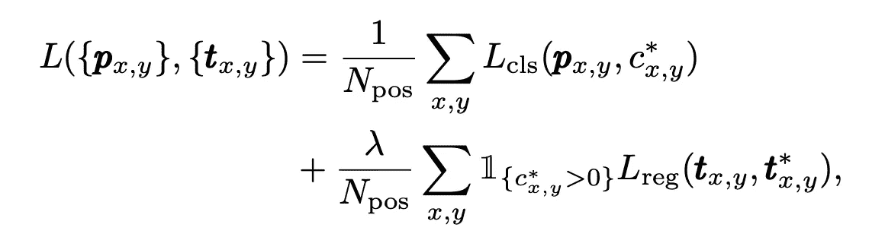
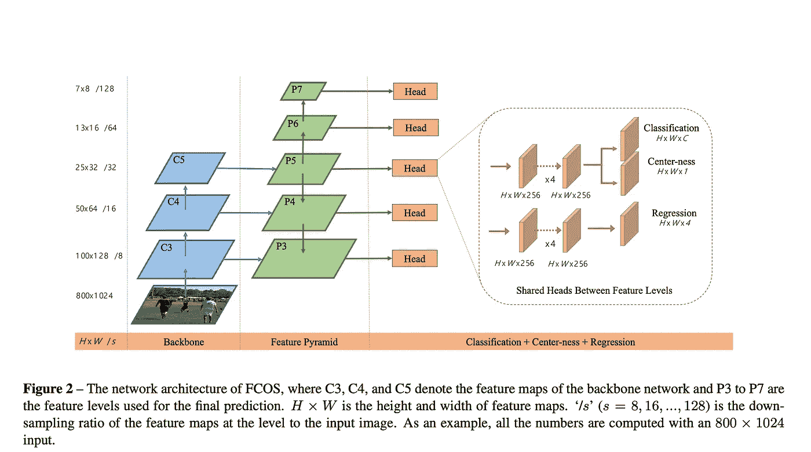
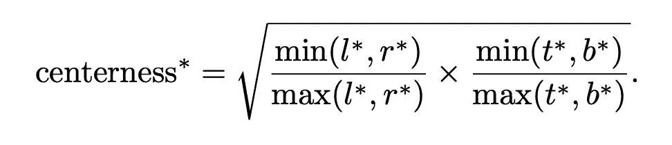
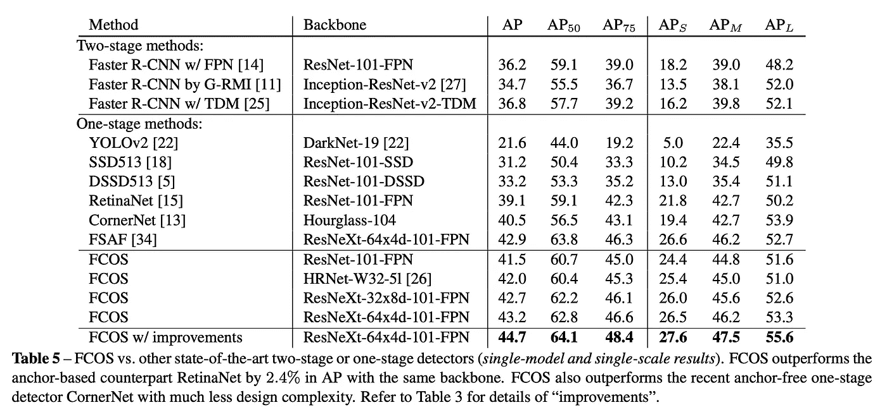
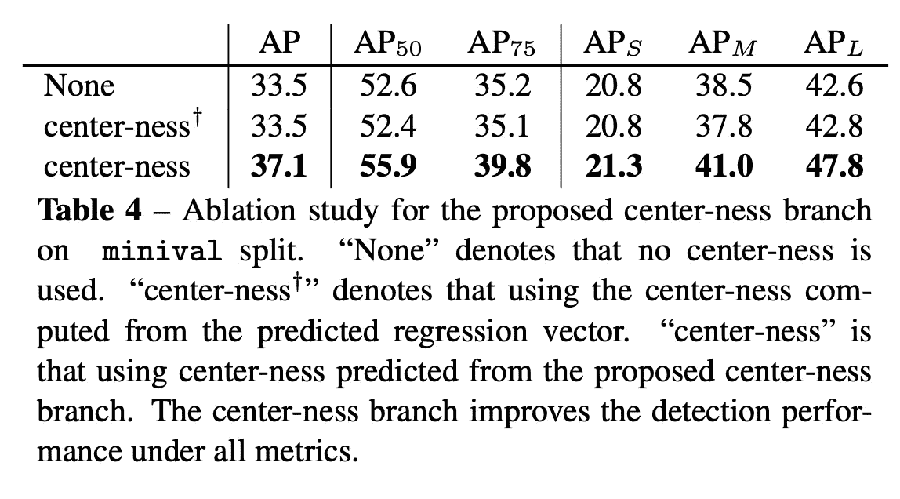

# 忘记锚盒与 FCOS 的争论:完全卷积的一阶段目标检测

> 原文：<https://towardsdatascience.com/forget-the-hassles-of-anchor-boxes-with-fcos-fully-convolutional-one-stage-object-detection-fc0e25622e1c?source=collection_archive---------11----------------------->

信用: [FCOS](https://arxiv.org/pdf/1904.01355.pdf)

本文详细解释了一种新的目标检测技术，该技术在 ICCV 19 年发表的论文 [FCOS](https://arxiv.org/pdf/1904.01355.pdf) :全卷积一阶段目标检测中提出。我决定总结这篇论文，因为它提出了一种非常直观和简单的技术来解决对象检测问题。留下来了解它是如何工作的。

# 内容

1.  基于锚的检测器
2.  FCOS 提出的想法
3.  多级检测
4.  FCOS 的中心
5.  基于锚的检测器的实验和比较
6.  结论

# 基于锚的检测器

我们现在使用的每一种著名的物体检测方法(Fast-RCNN，YOLOv3，SSD，RetinaNet 等。)使用锚点。这些主播基本都是预定义的训练样本。它们有不同的比例，以方便不同种类的对象及其比例。然而，正如你从它们的定义中清楚理解的那样，使用锚涉及到许多超参数。例如，图像的每个部分的锚的数量、框的尺寸的比例、图像应该被分成的部分的数量。最重要的是，这些超参数影响最终结果，即使是最微小的变化。此外，哪个边界框被认为是负样本还是正样本由另一个称为并集上的交集(IoU)的超参数决定。IoU 值极大地改变了哪些盒子将被考虑。下面是一个简单的图像，描述了在 Yolov3 中锚定框的使用:

我们一直在使用这种方法，原因只有一个，那就是延续以前方法使用的理念。第一个物体检测器从经典计算机视觉的早期检测模型中借用了滑动窗口的概念。但是，既然我们拥有多个 GPU 的计算能力，就没有必要使用滑动窗口了。

# FCOS:提议的想法

这就引出了一个问题，为什么还要使用锚点，为什么不像分割那样执行对象检测，即像素方式。这正是本文所要提出的。到目前为止，通过使用滑动窗口方法，在图像的逐像素值和检测的对象之间没有直接的联系。现在让我们正式看看这种方法是如何工作的。

设 **Fᵢ** 为总跨度 **s** 的骨干 CNN**I**层的 **Fᵢ⁰** 特征图。此外，我们将图像的地面实况包围盒定义为 **Bᵢ = ( x⁰ᵢ，y⁰ᵢ，x ᵢ，y ᵢ，cᵢ ) ∈ R₄ × {1，2 … C}** 。这里是 **C** 是班级人数。这里 **(x⁰ᵢ，y⁰ᵢ)****(xᵢ，y ᵢ)** 分别表示左上角右下角。对于特征图上的每个位置 **(x，y)** ，我们可以将其指向原始图像中的一个像素。这与我们在语义分割中所做的事情类似(尽管不完全相同)。我们将特征图上的 **(x，y)** 映射到感受野中心附近的点 **(floor(s/2) + x*s，floor(s/2) + y*s)** 。我鼓励用户使用大小为(8，8)的示例图像和大小为(4，4)的特征图来真正理解这种映射。在这种映射的帮助下，我们能够将图像中的每个像素作为训练样本进行关联。这意味着，每个位置 **(x，y)** 可以是正样本或负样本之一，这取决于以下条件:它落在地面真实(GT from now)边界框中，并且为该位置计算的类标签是该 GT 边界框的类标签。

现在我们知道了 GT 边界框中的一个点，我们需要评估这个框的尺寸。这是通过对四个值 **(l*、t*、r*、b*)的回归来完成的。**它们被定义为:

**l * =x-x⁰ᵢ；t * =y-y⁰ᵢ；r * = x⁰ᵢ-x；b* = y⁰ᵢ-y**

最后，正如您将看到的，这些值的基于回归的计算是整个检测算法的损失函数的一部分。

现在，因为没有锚点，所以不需要计算锚点和 GT 边界框之间的 IoU 来获得可以训练回归器的正样本。相反，给出正样本的每个位置(通过在 GT 框内并具有正确的类)可以是边界框尺寸回归的一部分。这是 FCOS 比基于锚的检测器工作得更好的可能原因之一，即使在使用更少数量的参数之后。

对于特征图中的每个位置，我们计算分类分数，对于每个正样本位置，我们进行回归。因此，总损失函数变为:

信用: [FCOS](https://arxiv.org/pdf/1904.01355.pdf)

对于本文， **λ** 的值取为 1。

RHS 的第一部分是位置分类 **(x，y)** 。RetinaNet 中使用的标准焦点 loos 也在这里使用。RHS 的第二部分是回归包围盒。对于不是正样本的位置，它等于零。

信用: [FCOS](https://arxiv.org/pdf/1904.01355.pdf)

# 用 FCOS 进行多层预测

多级预测基本上意味着使用不同级别的特征图进行对象检测。这类似于 RetinaNet 中使用的 FPNs(特征金字塔网络)的概念。探测器头应用于几个级别的特征图，P3，P4，P5，P6，P7 如上图所示。这有助于我们检测图像中不同大小的对象。这有助于解决重叠 GT 边界框的问题。如果两个不同大小的边界框相互重叠会怎样。这是用多级预测来处理的。与基于锚的检测器不同，基于锚的检测器将不同大小的锚框分配给不同的特征级别，从而在不同的级别分离不同大小的重叠 GT 边界框，像 FCOS 这样的无锚检测器通过在不同的特征地图级别限制回归来实现这一点。它们为所有要素级别(P3 至 P7)定义了一个值 mᵢ，该值设置为 0、64、128、256、512 和无穷大，P2 为 0，因此没有要素级别。基本上是特征级别 I 需要回归的最大距离。例如，特征级别 P7 需要回归其中 **max(l*，r*，t*，b*) < infinity** 但是大于下一个 m 的值，即 512 的盒子。同样，它也适用于其他功能级别。此外，如果一个位置即使在多级检测后仍被分配给一个以上的 GT 箱，它将被自动分配给两个 GT 箱中较小的一个。

# FCOS 的中心

信用: [FCOS](https://arxiv.org/pdf/1904.01355.pdf)

除了两个传统的探测头，分类和回归，FCOS 建议使用第三个头，称为中心头。顾名思义，它是对为其回归的边界框内的正样本位置的中心性的度量。这是为了提高无锚检测器的性能，并使它们与基于锚的检测器不相上下。从经验上来说，我们发现，就特征在盒内的位置而言，具有偏斜特征位置的低级回归盒会妨碍整体结果。因此，上面的项是使用 BCE 损失对每个回归的盒子进行计算的，因为它的范围是从 0 到 1。这个损失被加到上面讨论的最终损失函数中。测试时，在对推断出的边界框进行排名之前，将该值乘以分类分数以获得最终分数。

# 实验和与基于锚的最新技术的比较

信用: [FCOS](https://arxiv.org/pdf/1904.01355.pdf)

上表显示了与 RetinaNet 的比较，retina net 是一个最先进的基于锚点的模型。具有多级预测和中心分支的原始实现在其他参数方面优于 RetinaNet，例如。两种型号的 nms 阈值设置相同。上表中提到的“改进”是在最初提交后增加的。它们包括以下内容:将中心性分支移动到回归分支而不是分类分支，控制采样，这基本上是添加基于超参数的去除坏样本以及中心性分支。其他补充请点击[这个](https://github.com/yqyao/FCOS_PLUS)链接。

信用: [FCOS](https://arxiv.org/pdf/1904.01355.pdf)

上表很有趣，因为它强调了中心性分支带来的改进。基于锚的模型采用 IoU 阈值，同时对正负锚盒进行分类。中心性分支有助于消除这些超短波。

需要注意的非常重要的一点是，重要的超参数如学习率、NMS 抑制阈值等。直接取自 RetinaNet。通过专门针对无锚模型进行更好的超参数调整，有可能获得更好的结果。

# 结论

FCOS 是一个伟大的想法，使对象检测问题更简单，更快。这是对远离基于锚的滑动窗口的目标检测思想的鼓励。这可以在解决这个棘手的计算机视觉问题上带来巨大的成果。

**这就是所有的乡亲😃**

**你可以在我的**[**Github**](https://github.com/vandit15)**上看更多深度学习相关的东西，关注我的**[**Linkedin**](https://www.linkedin.com/in/vandit-jain15/)**。**

**我之前的一些文章:**

 [## 关于 Auto-Deeplab 你需要知道的一切:谷歌关于细分的最新消息

### 搜索图像分割模型

towardsdatascience.com](/everything-you-need-to-know-about-auto-deeplab-googles-latest-on-segmentation-181425d17cd5)  [## 关于 MobileNetV3 及其与以前版本的比较，您需要了解的一切

### 论文综述:寻找 MobilenetV3，ICCV 19

towardsdatascience.com](/everything-you-need-to-know-about-mobilenetv3-and-its-comparison-with-previous-versions-a5d5e5a6eeaa)  [## 使用辅助旋转损耗的自监督 GANs

### 弥合有监督和无监督图像生成之间的差距

towardsdatascience.com](/self-supervised-gans-using-auxiliary-rotation-loss-60d8a929b556)  [## 使用专门为其制作的损失来处理类不平衡数据

### 通过添加大约 10 行代码，在严重的类不平衡数据上获得超过 4%的准确性提升。

towardsdatascience.com](/handling-class-imbalanced-data-using-a-loss-specifically-made-for-it-6e58fd65ffab)