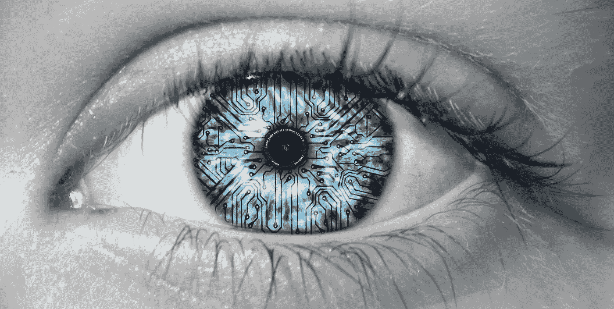
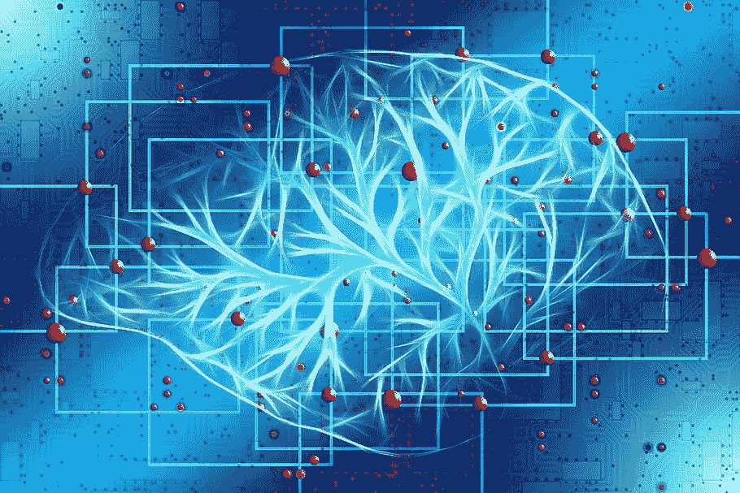

# 从计算机视觉到深度学习:工业应用中的人工智能创新之路

> 原文：<https://towardsdatascience.com/form-computer-vision-to-deep-learning-the-ai-path-to-innovation-in-industrial-applications-b132eef8803a?source=collection_archive---------49----------------------->

## 机器视觉如何演变成深度学习来提供一双额外的眼睛

图片由 [Flickr](https://www.flickr.com/photos/danielle-tunstall/4330572778/in/photolist-7AFjpU-obZxgs-2ts1R-xZPVY-eLjDvm-rTJ4d8-8TYCN8-CCG4rY-2DQnj8-8JZ7yc-e8d8u4-5ynLTB-agQ86i-69vgpZ-uey7MM-k7vETa-djcrXb-upepU5-9abbja-6kJkjw-8u8ws7-7ec1jW-bKEEJ4-8H53Ry-uTHUWW-oFxGwr-oXZGfG-7UiMJ4-oXLq12-c5LL8o-fkQVbt-5psvdE-vCwiJW-zBqFN8-cVMtY7-fMuEMR-KdUisi-wLZR2G-o1HqNH-PrpHd-6yykmt-qDZCmq-u9o2Y2-4nxrcv-7W6e6H-5HuChs-QLeZZt-7NpsbH-gYQPjJ-bjnuyK) 提供

在让制造工厂在面对间歇性人类劳动力的情况下提高产量的竞赛中，制造商正在考虑如何为他们的摄像机配备人工智能，以使人类检查员能够立即发现有缺陷的产品并纠正问题。

虽然机器视觉已经存在了 60 多年，但最近深度学习的流行已经使这种有时被误解的技术引起了全球主要制造商的注意。作为一家深度学习软件公司的首席执行官，我已经看到深度学习是机器视觉的自然下一步，并有可能推动制造商的创新。

深度学习与机器视觉有何不同，制造商如何利用相机技术的这种自然演变来应对现实世界的需求？

**机器视觉:当简单太简单的时候**

在 20 世纪 60 年代，几组科学家，其中许多在波士顿地区，着手解决“机器视觉问题”该方法简单而强大:科学家提出了一个框架，其中机器视觉系统由两个步骤来表征。

首先，科学家决定哪些简单的特征——图像中的边缘、曲线、色块、角落和其他突出的关键点——对图像来说是重要的。第二，他们设计了一个分类器，通常手动调整几个“阈值”(例如，多少“红色”和“曲率”将一个对象分类为“红苹果”)，自动衡量这些特征并决定它们属于哪个对象。虽然这种方法远非人类视觉能力的完整表征，但它简单有效，足以在 50 年内保持不变。

在这种原始形式下，它支持大量现实世界的应用，并成为制造应用的重要组成部分，从那以后一直为质量控制部署提供动力。

在视觉检查示例中，可以部署机器视觉系统来搜索产品图像中的缺陷。第一步通常是通过计算对比度、边缘、颜色和其他特征对产品图像进行采样，因为它们可能指示了物体中的缺陷。第二步，质量检查员将手动调整分类器，以确定产品是否有足够的“可疑特征”来最终确定损坏。

这种方法在某些情况下简单而强大，但在许多其他情况下却非常无效，因为它在好的产品属性和缺陷之间的差异是高度定性的、微妙的和可变的情况下失败了。然而，这就是我们生活的世界的本质。

机器视觉的答案是:创建更多的功能和阈值，稳步攀升到更高的复杂性，使这些系统变得极其复杂，即使是最有经验的工程师和操作员也难以调整。

**深度学习之路:将智能从人类转移到软件**

神经网络——以及它们的子类，深度学习，就在这里。图片由 [Piqsel](https://www.piqsels.com/en/public-domain-photo-spobo) 提供

在 80 年代，当机器视觉风靡一时时，一小群对弥合生物系统和机器之间的差距感兴趣的科学家开始尝试模仿大脑视觉系统中的神经元及其架构。目标是更好地理解我们如何感知，并在此过程中，设计出“看”得更好的机器。

在那些年里，今天的深度学习模型的前身被开发出来。关键是:自组织。重要的是，这些模型和后来的深度学习表兄弟不依赖于传统机器视觉的两个手动调整的步骤。相反，他们将寻找(学习)这些特征和阈值的负担从科学家转移到深度学习模型。科学家们仍然需要开动脑筋，设计出能够直接从数据中进行广义学习的方程，但现在只需要做一次。

这确实是深度学习的关键 *:* 我们不需要为每种情况手工制作一个机器视觉模型，而是设计一个可以直接从数据中学习几乎任何东西的学习机器，无论是对水果、飞机还是机器中的产品进行分类。

**深度检测:将人工智能的能力和灵活性带到每一台制造相机上**

在机器视觉主导的质量控制领域，深度学习代表着一种至关重要的创新，特别是在需要用更少的人完成越来越多的工作的时候。

随着机器能够以每分钟轻松超过 60 件的速度生产极其多变、不断变化的产品，深度学习正在改变机器视觉的格局，特别是结合了边缘学习(或直接在相机/机器中学习的能力)的产品。

今天，在机器的边缘节点上运行的深度学习使数十台摄像机能够在不断引入新项目的可变生产环境中学习新的项目类型和缺陷，并且新的、以前未见过的缺陷出现在生产线上。机器视觉无法完成这项任务——有太多专门的、手动调整的功能和阈值，每个产品都有自己非常复杂的要求。深度学习降低了优化质量检测的成本和时间，使其在技术和经济上对所有类型的制造商都可行。

深度学习是一种范式转换技术，它通过将智能从工程师和质量检查员转移到一个在计算边缘持续运行的软件，在需要的速度、延迟和成本方面为工业 4.0 革命开辟了一条清晰的道路，从而使高效实现 100%检查成为可能。

虽然机器视觉已经达到了目的，但深度学习相机将为这个从未如此需要突破的领域带来创新。