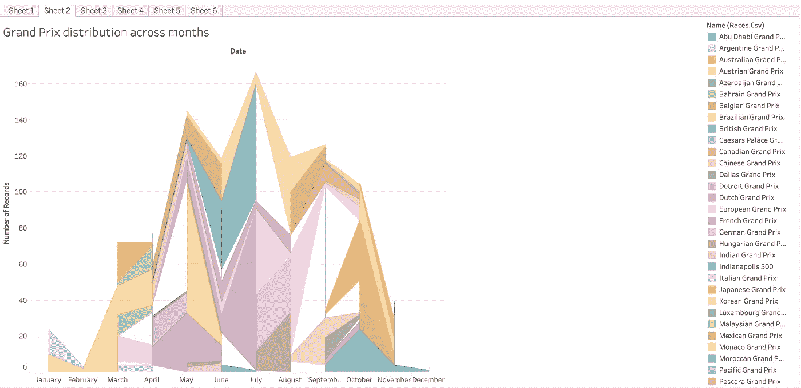
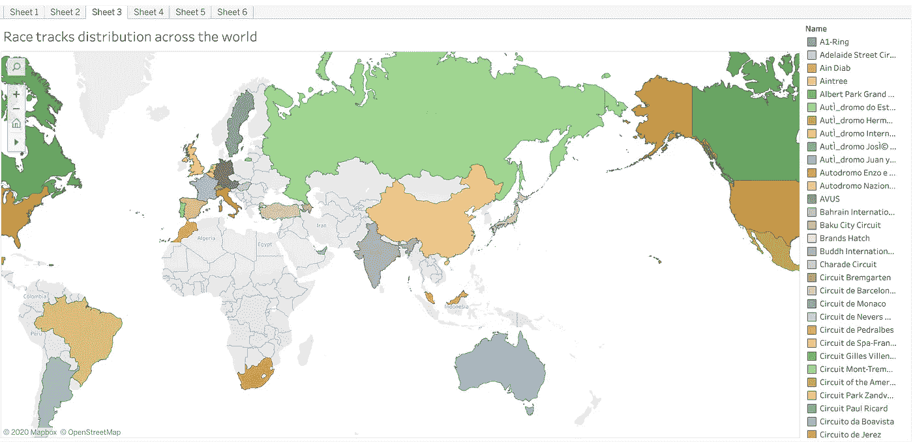
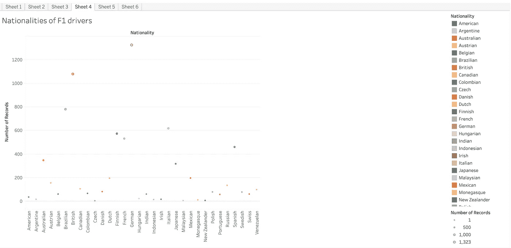
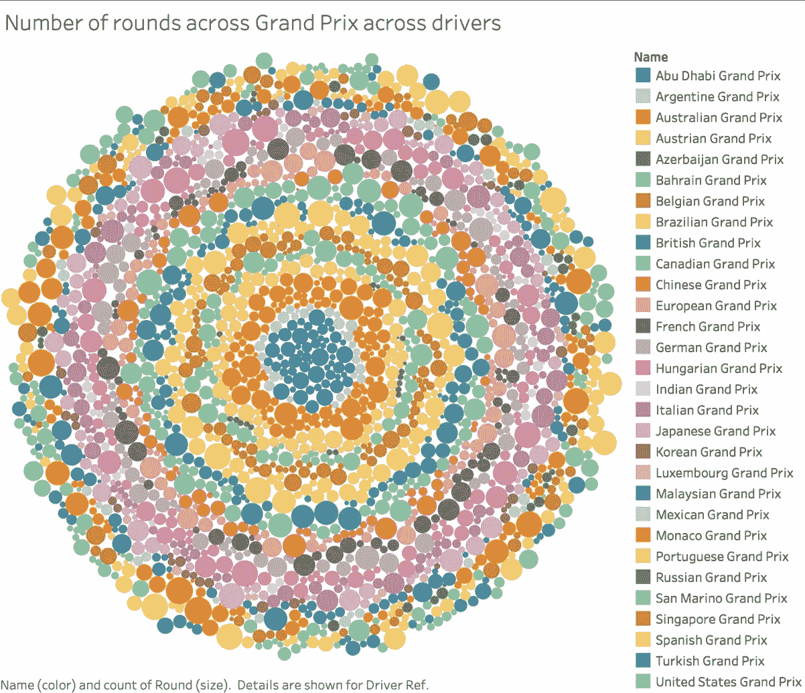
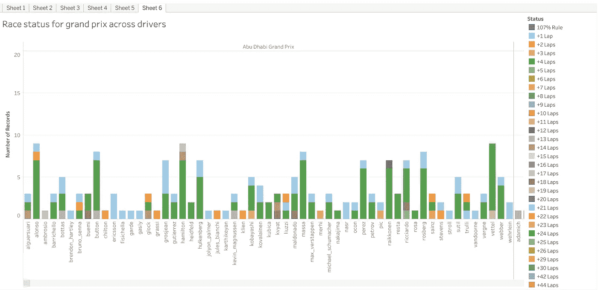
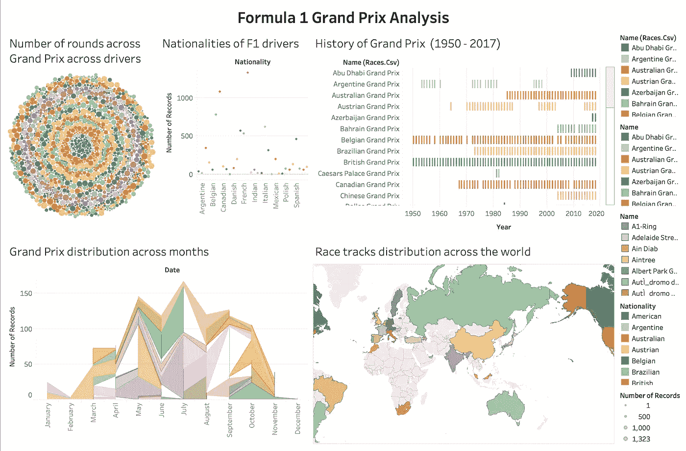

# 一级方程式大奖赛分析

> 原文：<https://towardsdatascience.com/formula-1-grand-prix-analysis-d05d73b1e79c?source=collection_archive---------15----------------------->

## 一级方程式数据集的数据分析(1950-2017 年)

来源:[|驱动|工作室](https://www.behance.net/drivestudio)[代理](https://www.behance.net/gallery/63599447/Formula-One-2018)

从我还是个孩子的时候起，ormula 1 就一直是我最喜欢的运动。极高的精确度、高准确度和优秀的团队是一个团队参与并赢得大奖赛的关键要素。当任何人决定独自行动时，团队要么失去位置，要么直接退出竞争。所有主要车队，如法拉利、迈凯轮、红牛、雷诺和许多其他车队都在争夺世界冠军。作为数据科学爱好者和 Formula1 的超级粉丝，我和 [Vineet Viswakumar](https://medium.com/u/63a92a5575cd?source=post_page-----d05d73b1e79c--------------------------------) 决定分析我们从 [Kaggle](https://www.kaggle.com/cjgdev/formula-1-race-data-19502017) 获取的 Formula1 数据集，该数据集为我们提供了开放数据集，为我们提供了许多数据属性，如 Formula1 车手、比赛、圈速、赛季数据、进站状态和其他相关属性。

资料来源: [GIPHY](https://gph.is/g/4beA0QG)

TL；我们决定用各种可视化工具分析这个数据集，比如 Tableau、plotly、matplotlib、seaborn 和其他各种工具。事实证明，仪表板看起来非常有前途，并打开了分析这个巨大平台的潜力，这个平台对数据科学世界开放，可以分析历史和结果，并应用现代技术和方法，如机器学习、强化学习、ARIMA 建模和许多其他技术。

这是初步分析，以 Tableau 交互式仪表盘的形式呈现这个庞大的数据集:

# 甘特图:

线条图

甘特图描述了这一时期(1950 年至 2017 年)大奖赛的历史。这张图表很好地描述了 1950 年至 2017 年期间大奖赛的发生情况。

# 离散折线图:

折线图

线形图描述了一年中从一月到十二月所有大奖赛的分布情况。

# 符号映射:

符号地图

符号地图描绘了分布在世界各地的赛道。这显示了这一魅力事件在世界范围内的传播，其中突出显示的颜色表示赛道的位置。

# 圆形视图:

圆形图表

圆形图用各种颜色描述 F1 车手的国籍。除了是竞争最激烈的运动，这项运动也同样受到不同人群的喜爱。这些是参加大奖赛的车手的不同国籍。

# 气泡图:

泡泡图

气泡图描述了 F1 参赛车手的回合数，其中气泡的大小与各自车手在相应大奖赛中的回合数成正比。

# 堆积条形图:

堆积条形图

描述 F1 大奖赛参赛车手比赛状态的堆积条形图。这包括参加了世界各地组织的各种大奖赛的各个车手的各种状态。

查看分析 **GitHub** 的完整代码:

 [## Gandalf 1819/配方 1

### 点击此处查看 Tableau 交互式仪表盘上的完整分析…

github.com](https://github.com/gandalf1819/Formula1) 

点击此处查看互动**画面**仪表盘:

 [## Tableau 公共

### 编辑描述

public.tableau.com](https://public.tableau.com/profile/chinmaynw#!/vizhome/Formula1Analysis/Sheet1) 

我们将添加进一步的分析和更直观的图表来显示这一时期的趋势，以丰富结果并利用数据科学界的各种工具和方法获得有意义的见解！欢迎对改进分析提出任何建议或改进，我们希望听到您对这一主题的想法。虽然这仍然是一项由热爱运动动力和能量的选定爱好者追随的运动，但我们建议每个人都尝试一下！

> 正如 Formula1 的标语所说:“工程精神错乱！—从技术角度来看，现在是我们遵循相同思维模式的时候了！

# 一级方程式仪表盘:

一级方程式大奖赛仪表板

来源:[吉菲](https://giphy.com/gifs/mercedesamgf1-f1-formula-1-fjy5sqXX25MNtVqaDb)

# 参考资料:

[1][https://www.kaggle.com/cjgdev/formula-1-race-data-19502017](https://www.kaggle.com/cjgdev/formula-1-race-data-19502017)