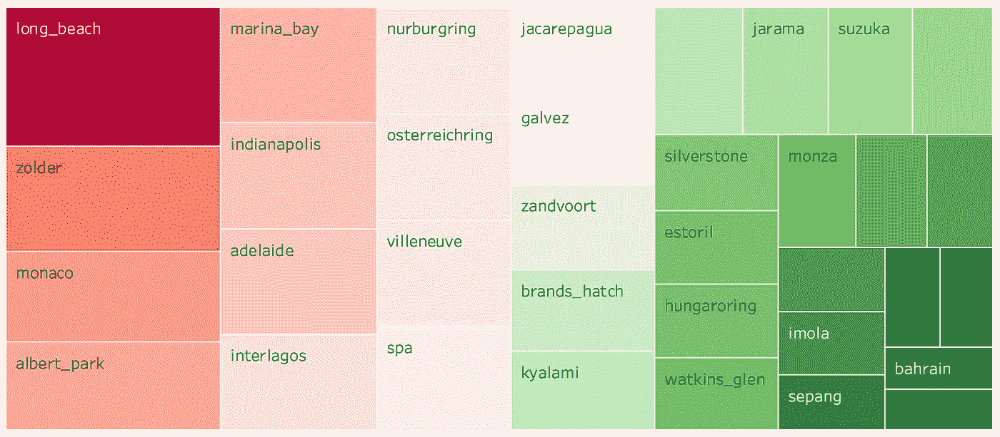

# 一级方程式赛车预测

> 原文：<https://towardsdatascience.com/formula-1-race-predictor-5d4bfae887da?source=collection_archive---------6----------------------->

## 预测下一届 F1 大奖赛冠军的机器学习方法

由 [Unsplash](https://unsplash.com/s/photos/formula-one-pit-stop?utm_source=unsplash&utm_medium=referral&utm_content=creditCopyText) 提供

当我还是个孩子的时候，我大部分时间都和我的祖父母在一起。我的祖父是一个超级 F1 迷，所以每当大奖赛开始时，我们都会一起坐在沙发上，对着电视欢呼尖叫，直到比赛结束。

多年后，我仍然对这项令人难以置信的运动充满热情，所以我认为预测某个车手赢得大奖赛的可能性并将其与博彩公司的赔率进行比较会很有趣。该项目将分为三个部分:

*   数据收集
*   数据分析
*   ML 建模

# **1。数据收集**

在第一部分中，我将解释我是如何收集所有的数据以及数据背后的决策过程。

## **数据帧 _1:比赛**

对于我的数据挖掘，我找到了两个很好的来源:Ergast F1 数据库和官方的一级方程式网站；它们基本上有相同的数据，但我使用了两者以获得更高的准确性和完整性。

我的第一个 dataframe 包含了从 1950 年到 2019 年所有锦标赛和比赛的信息，包括它们的位置和维基百科页面的链接。

## **数据帧 _2:结果**

对于我的第二个数据帧，我遍历了每一年和每一轮的比赛文件，以查询 [Ergast API](https://ergast.com/mrd/) 并获得关于所有车手成绩的信息。我包括了一些特征，如每位车手的发车位置和完赛位置，他们的车队，以及其他不太相关的变量，如出生日期、国籍和完赛状态，我将在后面探讨这些特征，以检查车手的年龄和他们的表现之间是否存在相关性，在他们的祖国比赛是否会有任何心理影响，或者一些车手是否比其他人更容易发生车祸。

## **数据帧 _3:驾驶员排名**

在锦标赛中，积分是根据车手和车队完成比赛的位置来决定的。只有前 10 名车手获得积分，获胜者将获得 25 分。 [Ergast API](https://ergast.com/mrd/) 提供冠军赛中每个车手和车队的积分、获胜次数和名次。因为积分是在比赛后授予的，所以我必须创建一个查找函数来转移同一锦标赛中以前比赛的积分。

## DataFrame_4:构造函数排名

车队总冠军是在 1958 年首次颁发的，所以没有那一年之前的数据。数据挖掘过程与车手积分榜相同，最终在比赛前应用相同的查找功能来获取数据。

## DataFrame_5:合格

获得合格时间数据是最棘手的部分，主要是因为 [Ergast](https://ergast.com/mrd/) 数据存储库中的数据有一些漏洞，也因为合格规则在这些年里变化很大。自 2006 年以来，排位赛在周六下午举行，采用三阶段“淘汰赛”制度，赛车试图创造自己的最快圈速。过去，资格认证只包括一次或两次会议，导致我的数据框中缺少数据。我决定只考虑每位车手的最佳排位赛时间，不管那一年举行了多少场排位赛。最佳排位赛时间反映在发车位置上，所以我稍后会计算第一辆符合条件的赛车和其他赛车之间的累计时间差异，希望这可以让我知道一辆赛车比其他赛车快多少。

由于 [Ergast API](https://ergast.com/mrd/) 有一些缺失的数据，我不得不使用 BeautifulSoup 抓取官方 [F1 网站](https://www.formula1.com/)并为每条赛道添加在发车区页面中找到的表格。

## DataFrame_6:天气

f1 中的天气对轮胎的选择、车手的表现以及车队的整体策略都有着重要的影响。我决定遍历 races_df 中附加的每个比赛的维基百科链接，并抓取天气预报。由于 wikipedia 页面没有一致的 html 结构，我需要查看一些不同的表，即使在这一点上，我仍然有许多丢失的值。但是，我注意到我可以在不同语言的相应页面中找到剩余的信息。然后，我使用 selenium 点击每个链接的意大利语页面，并添加缺失的天气数据。最终，我创建了一本字典来对天气预报进行分类，并绘制出我的结果。

# 2.数据分析

第一届世界车手锦标赛于 1950 年在英国银石赛道举行，只有 7 场比赛。几年来，每个赛季的大奖赛次数各不相同，最近几个赛季平均有 19 场比赛。比赛的地点也随着时间的推移而变化，这取决于赛道的适用性和其他财务原因。目前，只有意大利和英国大奖赛是自 1950 年以来唯一没有错过一个赛季的赛事。

历年来最受欢迎的电路

渐渐地，越来越多的非欧洲赛道被添加到 F1 锦标赛的合适主办城市名单中。这张地图显示了自赛季开始以来举行的所有大奖赛的地点。

自 1950 年以来的大奖赛地点

## 杆位有多重要？

在资格赛阶段，车手们试图在赛道上创造自己的最快时间，发车位置由车手的最佳单圈成绩决定，最快的是杆位。在杆位起步在超车更加困难的赛道上是至关重要的，除此之外，还有一个优势是可以在前方几米的正常赛道上起步，这条赛道通常更干净，抓地力更强。下图显示了在一些最受欢迎的赛道上以杆位起跑和赢得比赛之间的关系。

P1-Q1 相关

## 赛车在你的祖国有什么影响？

在你的祖国比赛的优势可以归因于支持者对车手的心理影响，以及在熟悉的情况下在家附近驾驶。条形图显示了这些年来登上领奖台的一些车手的国籍，以及他们在所有赛道比赛中获胜的百分比。尽管没有显示出明显的差异，但我们可以注意到，甚至心理因素也在赢得比赛的可能性中发挥了作用。

按国籍划分的获奖者

## 最危险的电路

近年来，一些电路布局已经过重新设计，以满足更严格的安全要求。目前，大多数赛道都是专门为比赛建造的，以避免长而快的直道或危险的弯道。然而，一些比赛仍然在街道赛道上举行，如摩纳哥大奖赛，尽管不符合最新的严格措施，但仍主要因其名气和历史而被使用。下面的树形图按照事故或碰撞的数量显示了一些最受欢迎的赛道。

事故最多的危险线路

## 哪些车队出现了更多的汽车故障？

条形图显示了在过去几个赛季中参加比赛的车队在这些年中经历了最多的汽车问题，包括发动机故障、刹车、悬挂或传动系统问题。

团队见证的汽车问题比率

## 谁更容易撞车？

一级方程式赛车的最高时速可达 375 公里(233 英里/小时)，因此撞车事故最终会终止车手的比赛。下面的图表显示了过去两个赛季中参加比赛的一些车手的撞车率。

2018 年至 2019 年驾驶员的车祸率

## 从快 40 岁的人到青少年明星

在世界锦标赛的最初几年，大多数领先的车手都在 40 多岁:尼诺·法里纳在 43 岁时赢得了第一个世界冠军，而 Luigi Fagioli 在 1952 年创造了 F1 历史上年龄最大的冠军纪录，当时他 53 岁，在未来几年里不太可能被超越。然而，他们被新一代取代只是时间问题。从 20 世纪 60 年代到 1993 年，平均年龄约为 32 岁，而在最近几个赛季，只有少数车手年龄超过 30 岁。

下面的散点图显示了第一个赛季获胜车手的年龄，显示了一条向下倾斜的趋势线。

获胜车手的年龄

# 3.机器学习建模

这最后一节将讨论以下主题:我用来评估最佳模型的**指标**，合并数据的**过程**，以及最终使用神经网络的**机器学习建模**。

## 成功指标

*   **精准评分**—2019 赛季正确预测赢家的百分比
*   **赔率对比** —我的模型能战胜赔率吗？

## 数据准备

收集完所有数据后，我最终得到了六个不同的数据帧，我必须使用公共键将它们合并在一起。我的最终数据框架包括从 1983 年到 2019 年的比赛、结果、天气、车手和车队排名以及排位赛时间的信息。

我还计算了车手的年龄和排位赛时间的累计差异，这样我就可以知道每场比赛中第一辆赛车比其他赛车快多少。最后，我将赛道、国籍和车队变量虚拟化，去掉那些不太重要的变量。

## 回归还是分类问题？

由于我想预测 2019 年每场比赛的第一名，所以我可以将目标变量视为回归或分类。

当评估一个**回归**的精度分数时，我将我的预测结果按升序排序，并将最低值映射为比赛的获胜者。最终，我计算实际值和预测值(映射 1 和 0)之间的精度分数，并在 2019 年的每场比赛中重复，直到我获得该赛季正确预测的比赛的百分比。

这是 2019 年任何一场比赛的评分函数中的 prediction_df 的样子。实际领奖台映射为 0 和 1(获胜者)，排序后的预测结果也是如此。在这种情况下，模型错误地预测 Bottas 是比赛的获胜者，因此模型的得分等于 0。

在**分类**问题中，目标在建模之前被映射为 0 和 1(赢家),因此，当我查看预测值时，根据预测的概率，我可能有多个赢家或根本没有赢家。因为我的算法不够智能，无法理解每场比赛我只需要一个获胜者，所以我创建了一个不同的分类得分函数，对每位车手赢得比赛的概率进行排名。我将概率从最高到最低排序，并将概率最高的车手作为比赛的获胜者。

在这种情况下，即使马克斯·维斯塔潘只有 0.35 的获胜概率，因为这是那场比赛中获胜的最高概率，该函数也会正确地将他映射为获胜者。

## ML 建模

由于我的自定义评分功能需要在评估之前对模型进行拟合，所以我必须对不同的模型进行手动网格搜索，最终将分数和参数添加到字典中。

我尝试使用逻辑和线性回归、随机森林、支持向量机和神经网络来解决回归和分类问题。

训练-测试分割:训练集包含从 1983 年到 2018 年(含)的所有比赛。测试集由 2019 赛季的所有 21 场比赛组成。

**回归**

**分类**

## 调查的结果

在花了几天时间运行所有的网格搜索后，神经网络和 SVM 的分类似乎返回了最高分，正确预测了 2019 年 62%的比赛的获胜者，这对应于 13/21 的比赛。

ML 模型比较

我还使用 2018 年和 2017 年两季作为测试集，以检查模型是否仍然表现良好。神经网络在这两年都比 SVM 分类器返回了更高的分数，所以我决定选择具有以下参数的神经网络分类器。

*   hidden _ layer _ size =(75，25，50，10)
*   激活=身份
*   求解器= lbfgs
*   阿尔法= 0.01623776739188721

考虑到**特征重要性**根据线性回归，在预测获胜者时，网格位置似乎起着最重要的作用，还有其他特征，如比赛前的车队或积分。

根据线性回归的特征重要性

查看过去几年的结果，我注意到算法总是错误地预测一些赛道的获胜者，可能是因为发生了更多的事故或超载。最难预测的赛道是阿尔伯特公园、巴库、斯帕、蒙扎和霍根海姆环。

## 算法能战胜几率吗？

在将所有我预测的获胜者聚集在一起后，我决定查看由 [SkySport](https://sport.sky.it/) 发布的 2019 赛季比赛的赔率，并发现如果我在这些比赛上下注，我会赢得的奖励。

下表显示了根据 [SkySport](https://sport.sky.it/) 在“赔率最大”下最有可能赢得比赛的车手，而“车手预测”是由神经网络预测的获胜者。红色的驱动程序名称表示错误的预测，因此与“实际”驱动程序列不同。以绿色突出显示的行表明算法预测的驱动因素结果是正确的，与赔率预测相反；然而，红色的突出显示表明，我可能应该在赔率最大的赔率上下赌注。最后两列显示了赔率奖励和利润，如果我一直在每场比赛中投资 100€，最终利润为 4，255.00€。

赔率比较

# 结束想法

我希望你喜欢我的帖子！欢迎在下面评论我可能错过的任何东西。所有代码都可以在我的 GitHub 中找到:

 [## veronicanigro/Formula_1

### 在 GitHub 上创建一个帐户，为 veronicanigro/Formula_1 开发做出贡献。

github.com](https://github.com/veronicanigro/Formula_1) 

领英:【https://www.linkedin.com/in/veronica-nigro/ 