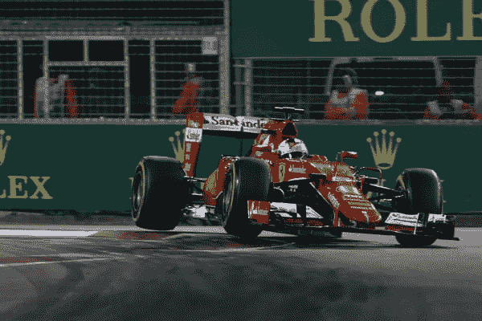
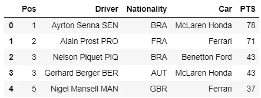
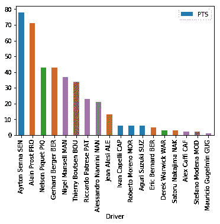
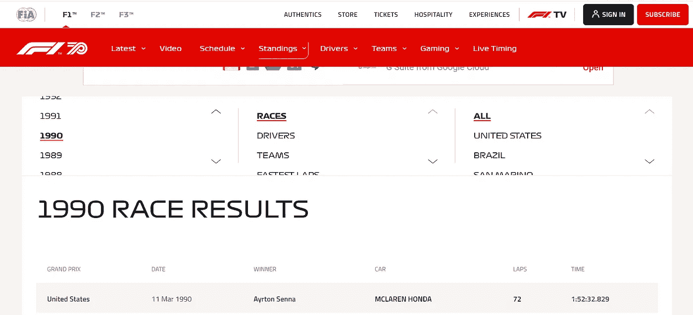
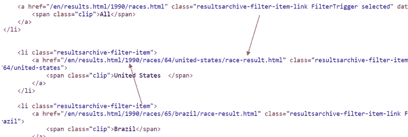
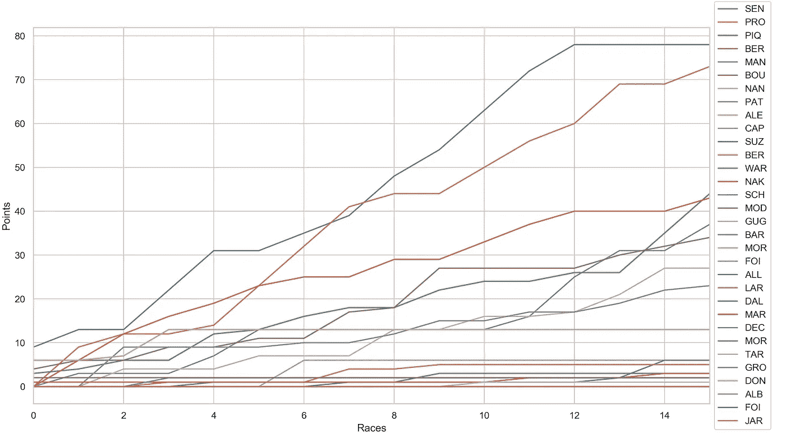
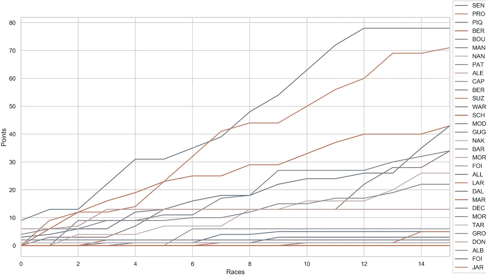
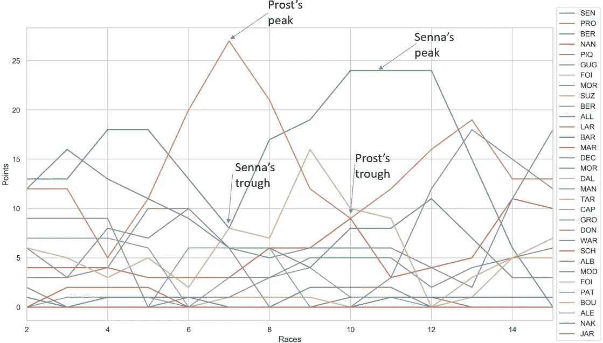

# 公式一:提取和分析历史结果

> 原文：<https://towardsdatascience.com/formula-one-extracting-and-analysing-historical-results-19c950cda1d1?source=collection_archive---------18----------------------->

## 《美汤熊猫》F1 赛季的网页抓取与数据分析

资料来源:Unsplash.com

# 数据无处不在

作为一名数据科学家，有时你手头没有你需要的数据，或者没有现成的渠道向你提供你需要的数据。在其他时候，您可能只是对探索一个没有全新数据集的领域感兴趣。幸运的是，互联网上有一个星系间的数据海洋(如果你还不知道的话),几乎可以分析任何主题，Python 拥有为你选择的项目收集和格式化数据所需的所有工具。

对我来说，我将在这里探索的主题，以及在未来的一些帖子中，是一级方程式赛车的历史成绩。对于外行人来说，F1 是世界上的精英赛车运动，在这里，像埃尔顿·赛纳和迈克尔·舒马赫这样的传奇人物在车轮战中与他们时速 200 英里的骏马搏斗！

对我来说幸运的是，[F1 官方网站](https://www.formula1.com/)包含了从 1950 年至今 F1 锦标赛的存档数据。比赛结果，排位赛时间，冠军位置和许多其他结果都在档案中(见下文)，很容易浏览网站找到你感兴趣的任何信息。

来源:formula1.com 网页截图

在我让你对所有这些 F1 的东西兴奋起来之前，让我们用 Python 从档案中提取一些信息，并用熊猫来显示它。

# 美味的汤

B eautiful Soup 是一个很棒的包，用于将组成网页的 HTML 数据解析成更可读和可用的格式。我使用 Beautiful Soup、urllib 和 Pandas 从 F1 档案中抓取数据，并以数据帧的形式呈现出来。如果我们追溯到 1950 年左右，一些历史数据会有点稀疏，所以现在我打算从 1990 年开始，也就是说，从现代 F1 和综合数据开始。

从一些简单的事情开始，我决定从 1990 年开始收集所有的冠军排名并绘制结果。首先我用 **urllib.request.urlopen()** 打开了包含 1990 年车手总冠军成绩的网页(可以导航到相关网页复制链接)。然后我使用带有' table '参数的 **find_all()** 方法来搜索网页中包含的表格(这里只有一个)。最后，我使用 Pandas 方法 **read_html()** 将数据转换成 DataFrame。这是一个非常有用的方法，任何人都可以从网页上抓取数据进行后续分析，因为它使立即开始使用 Pandas 功能变得简单。

来源:为本帖制作的情节(恰兰·库尼)

好了，我成功地从一个网站上提取了一些数据，虽然我们可以看到埃尔顿·赛纳击败阿兰·普罗斯特获得了 1990 年 F1 世界冠军，但这里没有什么特别有趣的东西！

我认为从每场比赛中提取结果并建立自己的冠军表来显示所有结果，然后绘制车手在一年中的进步，这可能会更有趣，而不是像上面那样获取最终的冠军排名。在此之前，我想看看每场比赛的数据是如何存储在网页上的，所以我导航到 20 世纪 90 年代比赛结果页面[这里](https://www.formula1.com/en/results.html/1990/races.html)。

来源:formula1.com 网页截图

您可以从上面的截图中看到，1990 年的第一场比赛是在美国，我用这场比赛来查看比赛结果格式，使用了与上一个例子类似的代码。

得到的数据帧包含一些有用的列、一些不太有用的列以及一些不可读的列。为了构建我自己的冠军表，我现在只需要“Driver”、“Car”、“No”和“PTS”列。与其手动点击网页来提取数据或找到所有比赛结果的链接，不如使用网络爬虫来自动完成这一过程。

# 搜索链接

为了做到这一点，我必须搜索 1990 年比赛结果网页(上面截图中的页面)中的所有链接，并根据特定条件仅提取我想要保留的链接。我想对比赛 URL 列表应用一些条件，因为我不想要网页中经常包含的无关信息或重复链接。为了找出使用哪些条件，我查看了网页的源文件(ctrl + u ),发现每个比赛结果链接都包含年份和字符串“race-result”——红色箭头指向下面的这些内容。这将允许我反复搜索链接，只保留那些符合这些条件的链接。

来源:formula1.com 网页截图

为了提取所有比赛结果，我创建了一个函数，它将相关年份作为参数，并返回一个 URL 列表。当 URL 满足条件(“1990”和“race-result”)并且还没有包含在列表中时，它们被添加到列表中。注意:“a”标签——如 soup.find_all('a') —是链接，告诉浏览器呈现另一个网页的链接。

它返回一个 URL 列表，每个 URL 对应一组比赛结果。然后，我可以使用这个列表将每场比赛的结果反复加载到一个数据帧中，并将本赛季的所有结果合并到一个包含所有分类车手和所有积分的数据帧中。

在第一次迭代中，在将比赛结果加载到数据帧中之后，我创建了一个新的数据帧来存储整个赛季的结果，其中包含第一场比赛中分类的车手和车号( **season_results_df = pd)。DataFrame(df[['驾驶员'，'汽车']]，columns=['驾驶员'，'汽车']，index=df.index)** 。对于随后的每一次迭代，如果以前没有分类，我会在数据帧中添加新的驱动因素(下面的第 25-26 行)。然后从每场比赛中提取每位车手的积分，并添加到 season_results_df 数据帧中(见下文第 28-30 行)。最后，我对数据帧进行了格式化，按驱动程序编号(“否”)排序，用零填充任何 NAN 值，并通过应用 lambda 和 map 函数将汽车制造商的名称重新格式化为三个字母的版本。

如您所见，它返回了一个数据帧，其中包含了每位车手在每场比赛中的得分。请注意，数据帧目前是根据车手编号排序的(普罗斯特作为卫冕世界冠军排名第一)。我本可以增加一个“总计”栏，把每个车手在整个赛季的积分加起来，但那会给我提供和开始时差不多的信息。

我n 取而代之，我决定创建一个数据框架，使用熊猫中可用的 **cumsum()** 方法跟踪每个车手在赛季中的累积积分。我还重新排列了数据框，显示了从塞纳开始的最终冠军位置。我用累积成绩绘制自己的冠军表的原因之一是为了更容易看到竞争是否在整个赛季中波动。为了整理图形图例，我将驾驶员姓名转换为他们姓氏的前三个字母。

现在，我可以看到整个赛季积分的积累，以及今年澳大利亚站最后一场比赛的结果，显示出最终的积分榜。然而，从数据图表中很难得到赛季进展的总体感觉，所以我也绘制了数据。

来源:为本帖制作的情节(恰兰·库尼)

现在，你不用太费力就可以看出，在 1990 年，只有两位车手争夺冠军(塞纳和普罗斯特)，而普罗斯特确实在赛季中期领先塞纳，之后领先优势再次扩大。从这一点上也可以清楚地看到，总得分由相对较少的车手决定，在 36 名车手中，只有 9 名车手得分超过 10 分。从累积图中我还注意到了让·阿莱西(金牌)的形态。他在赛季开始时状态很好，在前 4 场比赛中获得了 13 分，但在赛季余下的比赛中表现平平。

你可能已经注意到，与我在上面绘制的最终冠军排名相比，一些车手的最终分数有所不同。这是我没有预料到的事情，所以我不得不做一些调查，看看到底发生了什么。原来，1990 年 F1 采用了“最佳 1 1 名”的规则，即根据车手在 16 场比赛中的最佳 11 名成绩的累积来确定冠军排名。由于这个原因，我决定使用这个公式来查看数据，并创建了下面的函数来计算基于最好的 11 个的累积分数。

**best_11_cumsum()** 函数只是计算前 11 场比赛的累积分数。从第 12 场比赛开始，它会检查该场比赛的得分是否大于前 11 场最佳得分的最小值。如果评估结果为真，则删除之前的最小值，添加新的分数，并计算修订后的累积分数。

你现在可以看到，积分分数与上面的最终冠军排名相匹配，从下面的图中可以看出,“最佳 11”评分系统的整体效果是最小的。唯一真正的影响之一是，它使小尼尔森·皮奎特的最终分数减少了一分，这使他从第三名直接与加赫特·贝加并列。

形式是短暂的，但它仍然可以被分析。我想看看整个赛季的表现波动，特别是塞纳和普罗斯特争夺冠军的表现。绘制滚动平均值是跟踪数据点的基本方法，我决定使用 3 场比赛的滚动平均值来观察车手的表现如何不同。

来源:为本帖制作的情节(恰兰·库尼)

这个情节乍一看有点嘈杂，但它确实表明了两个冠军争夺者之间的势头有一些相当大的转变。你可以看到普罗斯特的状态达到顶峰，塞纳的状态达到最低点，反之亦然。普罗斯特的状态达到顶峰，随后他取得了冠军的领先地位，这似乎表明他势不可挡。当然，这并没有持续多久，普罗斯特的死亡恰好与塞纳的状态明显复苏相吻合，最终锁定了冠军。

你可能已经从数据图表中注意到，1990 年大奖赛冠军获得了 9 个积分。当我在 90 年代后期开始观看 F1 比赛时，车手赢得了 10 分，现在是 25 分(尽管积分结构有所改变——我猜这是我的专业知识)。我经常想知道这些分数差异是否真的改变了谁在冠军争夺战中胜出。我在 1990 年用一个简单的 if 语句做了一个快速测试: **if pts ==9: pts = 10** 。无论如何，这不是一个问题，因为那一年塞纳会得到 6 分，普罗斯特 5 分，一切都会保持不变。

# 接下来去哪里？

W 我在这里展示的是一个相当基本的网络抓取介绍和一个 F1 赛季的一些探索性数据分析，但还有更多的事情可以做。我可以看看车手和车队的形式是如何随着赛季甚至几十年的变化而变化的。我可以试着从排位赛时间中获取一些信息，来判断不同时代谁是最快的车手。我可以将不同的积分系统映射到不同的赛季，看看它们实际上是如何影响最终结果的，我也许可以看看更长期的影响，比如在不同的时代系列赛的竞争有多激烈。我甚至可以考虑建立一个预测性的机器学习模型，也许可以使用排位赛时间和以前的比赛结果来预测比赛结果。

你甚至可能想自己尝试一下这些东西。

我在这篇文章中使用的所有代码都可以在 Jupyter 笔记本[中找到。](https://github.com/cfcooney/medium_posts)