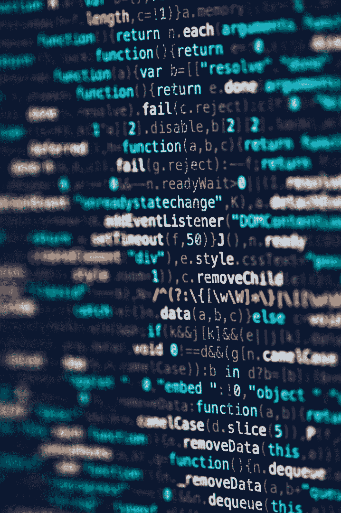
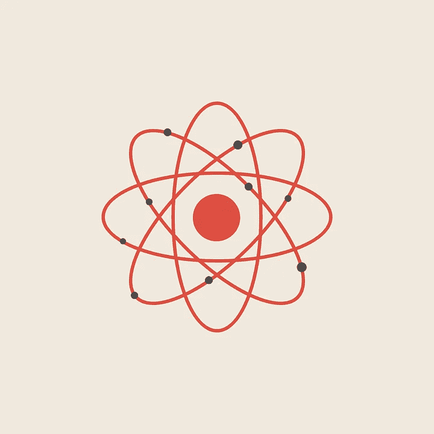

# 数据科学基金会

> 原文：<https://towardsdatascience.com/foundation-for-data-science-81199daf3acf?source=collection_archive---------46----------------------->

## [入门](https://towardsdatascience.com/tagged/getting-started)

## 获取关于数据的一切的简单解释

数据科学是一个迅速发展的领域，最初是基于统计学。在过去的几十年里，由于数据和计算资源的数量呈指数级增长，以及对更深入理解它的需求，它变得更加广泛。人工智能和机器学习在许多方面都非常接近 DS，但最重要的是，它们的目标是让机器理解和操作数据，基本上使人类目前使用计算机所做的事情更加自动化。

由[弗兰基·查马基](https://unsplash.com/@franki?utm_source=medium&utm_medium=referral)在 [Unsplash](https://unsplash.com?utm_source=medium&utm_medium=referral) 上拍摄的照片

我认为将数据科学描述为几乎所有研究和实践领域的共同基础是公平的，这些领域起源于数字计算机的发展，以及大多数依赖事实数据及其分析来取得进展的经验领域。然而，由于 DS 已经发展到不仅仅是统计，而没有完善基础理论，交流思想和在重要项目上合作变得更加困难。在这篇文章中，我想通过以简单的方式定义核心概念来填补空白，并使用它们来描述最常见的数据类型。

## 什么是**数据**？

—任何信息的任何给定表示。文本、数字、图形、声音或任何其他形式。它来自于测量、成像、挖掘、描述以及许多其他方式。重要的是要了解它是如何收集的，以及该方法的局限性，记住它不是对现实的完整描述。然而，数据是我们可以讨论和分析的一切。

在一个非常基本的层面上，根据我们目前对物理学的理解，所有的数据都可以被分割成某种独立的**对象**。在许多情况下，连续表示法作为近似值仍然很有用，但是它们也可能被视为抽象或数学对象。有些数据，比如艺术，根本无法用正式语言来描述。

虽然任何数据都可以表示为某种对象，但有时它可以更好地描述为对象之间的关系。这种类型的数据通常包含有关相关对象标识符的信息，通常还附带有连接描述或在它们之间发送信息的编码器/解码器功能。

有时数据来源是随机的，就像掷硬币的结果一样。它通常由一组可能的状态来表示，例如(*头像；tails)* ，再加上代表我们对系统在观察过程中有多大可能最终处于其中一种状态的信念的数值，比如*(0.5；0.5)* 为公平币。在大多数情况下，由于缺乏知识，概率变量实际上代表了我们的近似值。例如，如果你有足够的数据、施加的力、空气条件和其他细节，你实际上可以准确地预测硬币会落在哪一边。然而，对于本质上看似随机的量子粒子来说，情况似乎并非如此，但我们稍后将回到这一点。

爱德华多·苏亚雷斯在 [Unsplash](https://unsplash.com?utm_source=medium&utm_medium=referral) 上拍摄的照片

理解概率对于理解存储在数据中的信息通常是如何量化的很重要。想象一下扔一次硬币，不看。为了让您知道结果，其他人必须向您发送的最少数据量是多少？正面/反面、1/0 或其他表示形式。这是**熵**背后的基本思想，表示为*，通常用**位**来度量。你至少需要获得 1 比特的信息才能知道结果。例如，在英语中，你需要更多的信息来描述一个单词，因为有数百万个可能的单词和它们的形式，而不仅仅是两种可能的结果。有趣的是，随着句子中每个后续单词的出现，随着概念变得越来越清晰，大多数单词出现的概率越来越接近于零，而剩下的单词越来越少，并且每个后续单词实际上传达的信息越来越少。*

*另一个基于熵的重要概念是**互信息**，记为 ***I*** 。简而言之，它是衡量两个数据之间有多少共同信息，或者一个数据告诉我们多少关于另一个数据的信息。在上面的英语句子的例子中，每个单词都和它的邻居有交互信息，平均来说，每个新单词增加的信息都比之前的单词少。此外，这也解释了为什么尽管语言能够构建任意长的序列，但句子很少超过 10-50 个单词。*

## *怎么处理它*

*通常原始数据太重而没有意义，我们需要对其执行**操作**来提取有趣的信息。在实践中，我们使用许多不同的转换:排序、过滤、清理、计数、查询、合并、推断、重构、建模、可视化、搜索、映射、近似、压缩、修剪、粗粒度化等等。*

*所有这些操作的共同点是，如果我们考虑所有输入数据，包括过程中使用的函数，输出将包含相同或更少量的信息。此外，如果我们放弃产生与所提供的输入无关的输出的操作，如数学常数函数，我们将剩下可能实际上帮助我们有意义地将数据转换成其他表示并找到相关信息的操作。由于我们的目标通常是将大量数据简化为可解释的表示，我建议将这种类型的操作称为**简化**，并表示为 **~ >** 。从数学角度来说:*

**对于某个数据* ***A*** *那一个操作被定义为，****A ~>B****是有效的* ***还原****if****B = f(A)****其中运算符* ***f* B) > 0** *。**

*许多这样的操作都有自己的名字，就像上面的例子一样，但并不是每一个都有，即使是有名字的操作，不同类型或不同数据实例之间的实际计算也可能不同。此外，这种符号迫使我们考虑**所有**用于产生输出的数据，如函数或模型的参数、数据库的内部工作方式、关于这些数字来源的领域的隐式或显式知识，以及许多其他潜在的方面。*

*约简的例子:( *2 + 2) ~ > 4* 、⠀ *sin(π) ~ > 0* 、⠀“我走了”~ >“我走了”、⠀数据库(查询)~ >结果、⠀模型(输入)~ >输出、⠀(有缺失值的表∪函数来填充它们)~ >(完整的表)、⠀(量子态*ψ= ax**

## *转向实际的数据表示*

*现在，我们可以回顾一些我们可能会用到的实际案例，从更直观的案例开始，逐渐转向复杂的现实问题。*

**

*汉娜·赖特在 [Unsplash](https://unsplash.com?utm_source=medium&utm_medium=referral) 上的照片*

*让我们从你现在正在读的东西开始——书面的**自然语言**。我在上面的例子中提到了一点，但是这种类型的数据非常丰富，由相对较小的字母组成。一些语言实际上有成百上千的基本符号，如埃及象形文字或一些东方书写系统，它们通常在图形上与这些字符的含义相似。除了打字语言之外，还有可能与书面语几乎一对一对应或差异很大的口语变体、手语(通常包含与口语相同的信息，但表达方式非常不同)、盲文和许多其他例子。一种常见的简化方法是摘要，其中一些数据加上语言知识可以简化为一种更短的形式。*

*有一种语言特别突出，并在全世界范围内被广泛使用，那就是数学。对于我们自己或在计算机的帮助下进行的计算的定义，它是特别正式、简洁和方便的。*

**

*由 [Alexander Sinn](https://unsplash.com/@swimstaralex?utm_source=medium&utm_medium=referral) 在 [Unsplash](https://unsplash.com?utm_source=medium&utm_medium=referral) 上拍摄*

*数字计算机中的基本数据表示——位和**字节** (=8 位)通常用 1 和 0 来表示。**布尔值**真/假值仅为 1/0，**整数**直接转换为二进制数字系统，并增加一位表示符号，**浮点数**是指数和分数的组合，二者相乘产生存储值。**字符串**可能用 ASCII 或 Unicode 等不同编码表示，但都只是整数和指定字符之间的映射。**数组**、**向量**、**张量**等通常只是同类型值的集合。根据编程语言和库的不同，这些表示也可能有内置的函数/缩减，或者组合成更复杂的结构。*

**

*马库斯·斯皮斯克在 [Unsplash](https://unsplash.com?utm_source=medium&utm_medium=referral) 上的照片*

***编程语言中的代码**本身就是一个被翻译成机器代码的字符串，是处理器中整数和指定操作之间的映射。这些映射通常被称为指令集架构或只是计算机架构，其中最受欢迎的是大多用于台式机和服务器的 x86，以及大多打包在移动设备中的 ARM。有趣的是，最近 ARM 也进入了笔记本电脑和服务器市场。*

*将高级代码转换成低级指令的程序，通常被称为**编译器**或**解释器**，它们本身曾经是直接用这些指令编写的，但现代版本是用旧版本编译的。重要的是要注意，在这个过程中，许多信息，如变量的名称和注释，通常会丢失，而源代码与编译器相结合，被简化为一系列特定的机器指令。*

*除了上面描述的代码和基本类型，计算机通常还存储其他数据，如文本、表格、图像、声音、视频和许多其他以不同方式编码的形式。所有的数据都按照某种文件系统分割成文件，这样人们就可以浏览并理解它们。这对于数量相对较少、整体结构不太完整的数据非常有效。*

**

*来自 [Pixabay](https://pixabay.com/vectors/database-schema-data-tables-schema-1895779/)*

*然而，将数千、数百万甚至数十亿的条目作为文件来处理几乎是不可能的。这就是我们需要数据库的地方。一般来说，数据库是存储数据的表、数据编码器/解码器、可以添加新条目或对现有条目执行不同缩减的查询引擎，以及用于访问控制、迁移、复制和其他目的的大量辅助工具的集合。*

*数据库之间的区别在于它们对单个对象和它们之间的关系的重视程度。在一个极端，我们有 **SQL** 数据库，它们实现了结构化查询语言，非常适合具有大量关系的数据，在另一个极端，我们有 **NoSQL** 数据库，比如键值和文档存储，它们擅长处理大量独立的条目。在中间的某个地方，我们有**图形数据库**，它将数据表示为对象的节点和关系的边。虽然图形数据库还不是很受欢迎，但我相信它们的灵活性、直观性和更好地表示混乱的真实世界数据的能力最终会使它们至少像 SQL 和 NoSQL 的竞争对手一样受欢迎。*

*一台计算机可以存储高达数十万亿字节，每秒钟可以执行高达数十万亿次最简单的操作。这听起来可能很多，但这样的性能要归功于成千上万的内核，实际上它需要工作负载的**并行化**。例如，如果你想得到 *sin(x )* ，在你完成平方 *x* 之前，你不能开始计算 *sin()* 。但是，如果您需要类似于 *(a*b) + (c*d)* 的东西，您可以在不同的内核上同时执行乘法，然后在其中一个内核上对结果求和。*

**

*来自 [Pixabay](https://pixabay.com/vectors/network-iot-internet-of-things-782707/)*

*但是如果你不想建造一台超级计算机来扩大规模，或者你想远程连接计算机，你需要网络。除了硬件之外，您还需要像 TCP 和 HTTP 这样的协议来对传输的数据进行公共表示。有了它，你就可以用数字电脑把各种东西连上互联网，甚至是你的衣服和家具，这种现象通常被称为物联网。*

*然而，仅仅来回发送原始数据可能会对您的安全造成危险。几十年前，只有政府、银行和少数其他实体需要保护他们的数据，但如今，随着你周围的所有环境都在收集数字数据并受其控制，我们需要**加密**来确保我们能够控制对这些信息的读取和编辑。粗略地说，加密的工作原理是将数据转换成无法识别的表示形式，同时使用数字密钥保存完整的信息。这些密钥是编码和解码算法工作所需的输入，通过控制谁拥有这些密钥，就可以控制谁拥有访问权。*

**

*照片由[思想目录](https://unsplash.com/@thoughtcatalog?utm_source=medium&utm_medium=referral)在 [Unsplash](https://unsplash.com?utm_source=medium&utm_medium=referral) 上拍摄*

*一个特别有趣的数据结构，基于数据库、互联网和加密的混合物，是 T4 区块链 T5。它背后的基本思想是创建一个数据库，任何人都可以按照一致同意的程序添加新的数据块，并通过加密防止编辑或删除等操作。最受欢迎的应用是加密货币，如比特币和以太坊，但还有更多。然而，它的名字有点误导，因为在实践中很难将所有数据存储在单个链上，并且扩展需要一些分支来处理成千上万的用户。由于现实世界的解决方案已经更接近于类似于“块树”的东西，我相信将核心思想概括为类似于“块图”的东西是有益的，使其更具可扩展性，并适用于更广泛的问题集。*

*描述某个对象行为的更一般的表示概念被称为**模型**。它可以像单个变量的线性函数一样简单，就像在固定速度参数 *v* 和给定时间 *t* : *d=v*t* ，下行驶的总距离 *d* 一样，也可以像具有数十亿个参数的人工神经网络一样复杂，用于处理任意长系列的输入。有些数据模型定义了它们在数据库中应该如何表示，有些模型描述了事物应该如何分类、估值、生成、决策，还有许多其他类型的模型。*

**

*来自 [Pixabay](https://pixabay.com/vectors/neural-network-thought-mind-mental-3816319/)*

*机器学习模型，如回归、决策树或神经网络，特别有用，因为它们不需要人类对我们想要建模的东西做出精确的说明，而是可以从提供的例子中“学习”它的表示。通过调整参数，以提高它们模拟给定数据的能力，模型可以自动完成任何数据处理任务，有时它们在重要问题上胜过人类。然而，它们的有效性直接取决于这些例子包含多少关于感兴趣的对象的信息，以及它们的架构与对象的内部工作有多相似。*

*另一类重要的模型是**物理模型**。它们是对我们所拥有的真实世界最准确和详细的描述。其中，你可以找到像水、电和计算机如何工作、引力和行星如何围绕恒星形成这样的常见事物的模型，一直到暗物质、暗能量和其他几乎不为人知的事物。*

**

*来自 [Pixabay](https://pixabay.com/illustrations/atom-chemistry-science-model-1674878/)*

*其中最基本和被广泛接受的是**量子**物理模型。它们大多描述了我们观察到的最小粒子的行为，但这些数据也与我们对黑洞的理解以及宇宙如何发展成我们所看到的样子有着深刻的联系。还有一些模型寻求更小的基本对象，如弦理论，以及许多更高层次的抽象概念，如电路或内燃机。*

*量子粒子有很多令人费解的性质，但其中最违反直觉的是**叠加**和**纠缠**。第一个意思是一个粒子可以处于不同状态的混合状态，根据某种概率分布，在测量后会在其中一种状态下被看到。第二个意思是，你可以把多个粒子联系起来，把它们的状态联系起来，这种联系不会因为距离而中断，并且有即时的效果。这种怪异的行为是有问题的，因为在经典的数字计算机上很难建模和理解，但它导致了利用它们的量子计算机的发明。*

*量子计算机中数据的基本单位——**量子比特**，代表一个量子比特。目前，我们知道这种计算机可以比经典计算机更快地执行某些操作，但我们没有一个理论来描述所有这些操作，这些计算机仍然非常罕见和昂贵。另一个重要区别的例子是:对于经典数据，您总是可以在副本上应用缩减，并在保持原始数据完整的情况下获得结果，但它并不总是适用于量子数据。*

**

*来自 [Pixabay](https://pixabay.com/vectors/social-media-connections-networking-3846597/)*

*所有可观测的物质都是由量子粒子构成的，包括生命体。虽然从物理和化学的角度来看，它的大部分相对简单，但有些部分非常复杂，即使经过几十年的研究也很难理解。DNA 可能是最有趣的生化结构，因为几乎所有关于单个细胞如何行为和构建像我们这样的大型生物的数据都存储在其中。人们通常认为 DNA 只是一长串编码一些蛋白质的静态数据，但它也对环境的变化做出动态反应，这些机制背后的所有复杂性和可能性仍然知之甚少。此外，它被许多其他生化机械以许多方式与之相互作用，在这种规模下，甚至一些量子效应也是完全可以想象的。*

**

*由 [Robina Weermeijer](https://unsplash.com/@averey?utm_source=medium&utm_medium=referral) 在 [Unsplash](https://unsplash.com?utm_source=medium&utm_medium=referral) 上拍摄的照片*

*在我们周围和体内，有数不清的细菌种类和细胞类型。但是有一种特别的类型因其数据处理能力而特别有趣——神经元**。它们可以相互之间以及与数米之外的其他细胞形成数千个连接，以电和化学形式接收、携带和发送信号。身体中神经元最集中的部分——大脑，有着极其复杂和相互关联的结构，我们仍然几乎不了解。大脑的一个大问题是，我们不知道信号中有多少是不必要的噪音，有多少是有意随机的。我并不认为这种规模的量子效应，但强化学习的探索-开发困境以及机器学习模型训练中噪声的有效性表明，一些随机性可能是一种进化的特征，而不是一个问题。***

******

***来自 [Pixabay](https://pixabay.com/vectors/social-media-connections-networking-3846597/)***

***神经元和一堆其他细胞一起可以构成一个人类，而一堆人类可以构成一个**社会**。在这些尺度下，量子效应不再是问题，但收集数据和对人类进行操作会有很多伦理和其他方面的问题。此外，由于互联网和数字设备，与几千公里外的人联系变得容易多了。然而，这些设备也可以用来收集我们可能不想分享的关于我们生活的各种信息，尤其是当我们不知道谁会看到这些信息时。总的来说，理解社会和政治从来没有像今天这样重要，因为我们可以跨越国界和全球团结起来，而且还因为我们有足够的核武器来摧毁所有文明，杀死几乎所有人，使整个地球无法居住。***

***总之，不可能对数据的所有类型、表示和操作进行计数。物理学家每天都在发现关于宇宙的新事实，生物学家——新的生命物种，工程师——新的工具，心理学家——我们头脑中的新维度，其他人以各种形式收集新知识。然而，在计算机的帮助下，我们可以在这些成堆的数据中找到新的见解，这些数据反过来可以用来给我们生活的许多方面带来积极的变化。***