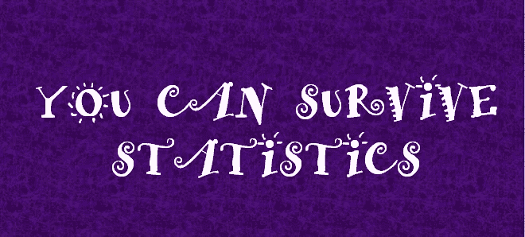

# 基础统计术语解码

> 原文：<https://towardsdatascience.com/foundation-statistics-terms-decoded-f1def3721c1e?source=collection_archive---------65----------------------->

## 统计学初学者！请继续阅读，了解一些重要的基本术语及其含义。

## 用 VS 风格解释，先左后右！

相信我！你可以！

任何决定开始精通统计学习方法(SLM)的漫长而艰难的旅程的人都面临着对一些非常基本的术语的公开的技术解释。这篇文章旨在通过用简单的英语解释一些基础术语来揭穿统计学很难的流行神话。

举例来说，如果我们想根据不同的参数，如阅读等级(D)、每句话字数(D)、阅读时间(D)等，来确定一个中型故事(I)的成功与否。*(一中文末参考)*

1.  **因变量(响应变量)与独立变量(预测变量)**

故事成功的概率是因变量或反应，用于预测的变量(标记为 D)是自变量或预测因子。

**2。预测 VS 推理方法**

如果我想使用一种只关注最佳输出预测的方法，而不考虑因变量和自变量之间的关系，我们将选择一种预测方法(一般来说，像决策树一样复杂且不易解释)。但是，如果目标也是理解反应和预测之间关系的本质，那么我们将使用一种推断方法(像线性回归一样容易理解)。

**3。参数与非参数方法**

参数方法是一种两步方法。首先，我们假设自变量的性质和形状，假设它本质上是线性的。

*成功概率= a+ b(阅读成绩水平)+ c(每句话字数)+……..+n(读取时间)*

第二步是使用 OLS(普通最小二乘法)等技术预测系数(a 到 n)。这种基于简化模型的方法本质上是参数化的。

然而，在非参数方法中，我们不对自变量的函数形式做任何明确的假设。这种方法比参数方法有更大的优势，因为通过避免任何假设，它们有可能精确地拟合更大范围的独立变量的可能形状。

**4。监督与非监督学习方法**

我们正在讨论的问题是，一个媒体故事的成功与上述预测因素之间的关系，这有助于我们确定这个故事是否成功。为了开发这个模型，我们必须访问适当的训练数据，其中我们有一堆已经发布的故事的成功结果来训练模型，然后该模型将预测未来故事的成功。这是一种监督学习方法。

然而，如果我们遇到一个问题，比如说，确定特朗普是否会喜欢他遇到的下一个国家元首(他从未见过)。现在，我们没有任何可用的过去的数据，所以我们不能训练一个模型。在这里，我们将部署一个能够自我学习的模型，并在每次新的会议中变得智能。随着时间的推移，这类模型需要定期反馈才能成为可靠的预测器。这是一种无监督的学习方法。

最后但绝对不是最不重要的，

**5。回归与分类**

变量可以定性或定量(也称为分类)。定量变量采用数值，如每句话字数、阅读文章的时间等。然而，分类变量在 K 个不同的类或类别中取值，如对像标题中的句子格这样的变量取 Yes 和 No。

简单地说，我们把有定量反应的问题称为回归问题，而那些涉及分类反应的问题通常称为分类问题。

我参考了下面的媒介故事来了解媒介故事成功的预测因素。这是一本好书。

 [## 是什么让一篇文章在媒介上流行？我们分析了 10，000 多个数据点来寻找答案

### 在过去的几年里，Medium 已经迅速成为我最喜欢的出版和阅读的地方。这是一个民主的天堂…

medium.com](https://medium.com/the-mission/after-10-000-data-points-we-figured-out-how-to-write-a-perfect-medium-post-58c41c314f6a) 

感谢您的阅读:)观看这个空间，了解更多关于统计、数据分析和机器学习的信息！