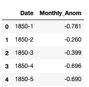
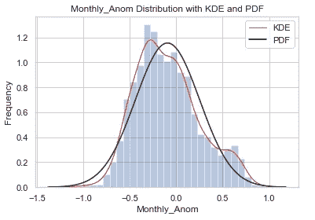
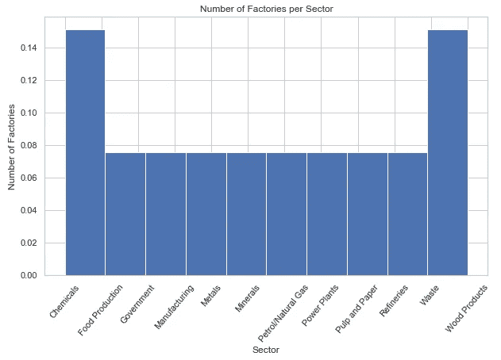
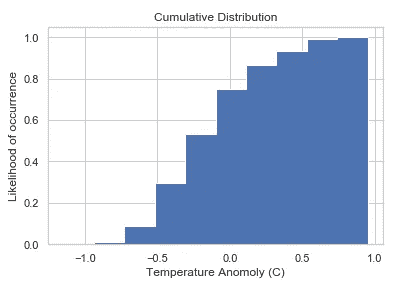

# 气候变化统计分析的基础——概率分布

> 原文：<https://towardsdatascience.com/foundations-for-the-statistical-analysis-of-climate-change-probability-distributions-158845c6feaf?source=collection_archive---------32----------------------->

## 数据分布的描述统计

威廉·博森在 [Unsplash](https://unsplash.com/s/photos/arctic?utm_source=unsplash&utm_medium=referral&utm_content=creditCopyText) 上的照片

*为了更好地理解本文的数据集和其他基本统计数据，可以考虑在这里阅读该系列的第一部分:* [*气候变化统计分析的基础*](/climate-change-analysis-series-volume-1-48708a938fcc) *。*

我在之前的一篇文章[中简要地提到了核密度估计(kde)的主题。在这里，我将扩展 KDEs 并介绍概率密度函数、概率质量函数和累积分布函数。我将再次使用 Python 编程语言进行演示。](/climate-change-analysis-series-volume-1-48708a938fcc)

让我们再快速看一下我们的数据。日期列中的值对应于年和月，而 Monthly_Anom 列中的值是每月的温度异常。在这里阅读更多关于为什么全球气温显示为异常[的信息。](https://www.ncdc.noaa.gov/monitoring-references/faq/anomalies.php)

## 连续分布

下面是我们数据的分布图。异常范围从低于全球平均值约 1.5 度到高于全球平均值 1 度，平均值为-0.093。

持续分发— PDF

我们的数据分布是一个**连续分布**，因为温度是一个连续变量(身高、体重和距离也是)。我们可以观测到 0.1 度，0.008 度，0.98600093828209 度等等，但是连续变量的精确值只能估计到给定的精度。

**概率密度函数**或 **PDF** ，是一种估计数据集中特定范围内随机值出现概率的参数方法。因为数值不可能精确，你要问自己*变量 X 落在 0.3 到 0.4 之间的概率是多少？*通过问这个问题，你在寻找一个值出现的相对可能性，而不是绝对可能性，对于连续变量，绝对可能性是 0，因为它们是无限的。要计算特定范围内给定值的概率，您需要计算曲线下的面积，即 AUC。AUC 将在下一篇文章中讨论。

为了可视化连续变量的分布，您可以使用 Seaborn 库的 [distplot()](https://seaborn.pydata.org/generated/seaborn.distplot.html) 来显示直方图(条形)和内核密度估计(红线)，并可以选择绘制概率密度函数(黑线)。

kde 是一种估计随机变量中某个值的概率的非参数方法。KDEs 在分布中的每个单独点绘制一条曲线，然后作为平滑密度估计添加到分布图中，从而得到平滑线。当分布是正态或接近正态时，使用的[核](https://en.wikipedia.org/wiki/Kernel_(statistics))将是高斯核，尽管如果分布不是正态的，也将使用其他核。

直方图将数据分成多个条块，并对每个条块内的每个数据点进行计数。Seaborn 的 distplot()直观地显示了数据中的条柱数量，尽管您可以指定您希望直方图中的条柱有多粗糙。您可以通过归一化计数来确定落入每个条柱中的点的百分比。请记住，y 轴反映的是频率，KDE 下的总概率等于 1。根据已指定的箱数，可视化可能会发生变化，解释可能会有所不同。

在上面的图中，PDF 显示为黑线。首先，我们假设我们的数据在可视化直方图后是正常的，尽管分布可能是双峰的、指数的等等，所以你的 PDF 可能不是正常的。正态分布的概率密度函数是通过取变量的两个参数，平均值和标准差来计算的。一旦拟合到图，您就可以评估 PDF 估计随机变量的概率有多好。对于我们的数据，PDF 做得相当好，尽管在 0.6 标记附近有一个轻微的概率凸起和一个轻微的负偏度，这在 PDF 中没有考虑。

## 离散分布

当变量是分类的，并且值可以假设为一个有限的、可数的数时，就有了一个**离散分布。**任何一个结果的概率都等于 1。例如，在标准骰子(未加权)上掷出任意数字的概率为 1/6，总概率等于 1。

离散分布— PMF

一个**概率质量函数**，或 **PMF** ，显示一个离散随机变量的概率。每个值的概率之和为 1。分类变量可以用 PMF 来描述，因为分布中有有限数量的无序值。

这张图表来自 2015 年的[排放数据集](https://www.kaggle.com/ramyaparimi/greenhouse-gas-report-data-2015)，展示了每个行业中工厂对这份特定温室气体报告的贡献百分比。y 轴显示每个行业中工厂的频率，以样本的分数表示。

## 累积分布函数

正如我们之前在连续变量和 PDF 中看到的，给定月份的温度异常为精确值的概率为 0，y 轴展示了值的密度，但没有展示实际的概率。

一个**累积分布函数**，或 **CDF** ，计算变量 X 小于或等于值 X 的概率，给定月份全球气温异常为 0 度或以下的概率是多少？

从名称推断，CDF 给出了 PDF 下概率的累积和。对于我们的例子，小于或等于 0 度的概率的累积和看起来大约是 0.75。我们可以有把握地假设，任何给定月份的温度异常在大约 75%的时间里都是 0 度或更低。

了解数据的分布和描述性统计数据至关重要，尤其是在研究全球气候变化时。了解变量中某个值的可能性有多大的基础知识，将有助于您识别某些趋势何时是预期的或远离基础，更容易捕捉错误或意识到意外何时发生。

赶上下面的第一卷，并留意未来关于更多描述性统计、预测、机器学习等的文章！

 [## 气候变化统计分析的基础

### 量化全球变暖的环境和经济影响的基础

towardsdatascience.com](/climate-change-analysis-series-volume-1-48708a938fcc)