# 概率基础

> 原文：<https://towardsdatascience.com/foundations-of-probability-7a792e7eea5?source=collection_archive---------19----------------------->

## Python 中的适马代数、测度论和幂集

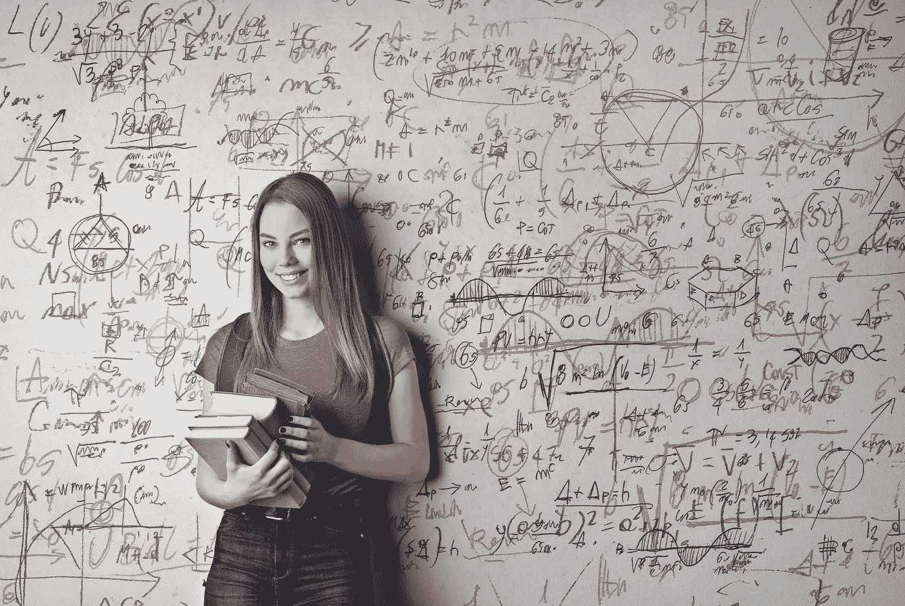

安德里亚·皮亚卡迪奥在[像素](https://www.pexels.com/photo/woman-holding-books-3768126/)上拍摄的照片

西格玛代数被认为是概率论公理基础的一部分。卡塞拉和伯杰的*统计推断简要介绍了这个话题。对西格玛代数的需求源于与定义概率相关的技术困难。那么 sigma 代数到底是什么？*

# 什么是适马代数？

简单来说， *X* 上的 sigma 是包括空集和 X 本身在内的 *X* 子集的集合。换句话说，sigma 是 *X* 的幂集。西格玛代数也称为 Borel 场。其正式定义如下:

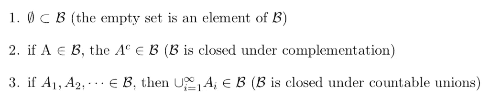

第一个性质表明空集总是在 sigma 代数中。此外，由于空集的补集也在样本空间 *S* 中，第一和第二个陈述暗示样本空间总是在 Borel 域中(或 sigma 代数的一部分)。最后两个语句是可数交集和并集的条件。

# 与测度论有什么联系？

Borel 空间是测度论的一个基本对象。它由一个集合及其对应的 sigma 代数组成。具体来说:

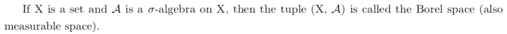

让我们看一个小例子。考虑以下集合:

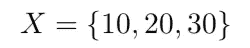

给定 *X* ，Borel 场是 2 = 8 个集合的集合，也称为幂集:

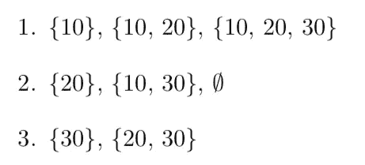

幂集与描述二项式幂的代数展开的二项式定理密切相关，如下所示:

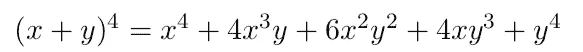

我们可以使用二项式公式对此进行扩展:

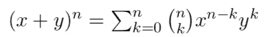

其中二项式系数为:

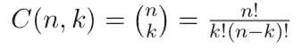

*X* 的幂集中子集的个数由二项式系数 *C(n，k)*的个数给出

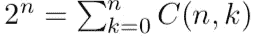

任何集合的幂集是包含空集和该集合中元素的组合的集合，从 1 到原始集合的大小:

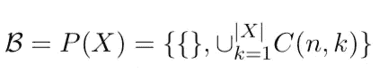

# python 中幂集的实现

现在我们将讨论如何使用 python 中的实现来生成幂集。首先，让我们从 itertools 导入组合和链:

```
from itertools import combinations, chain
```

接下来，让我们初始化一个包含空元组的元组:

```
powerset = ((),)
```

现在，让我们定义一个函数，它接受一个参数输入集，并使用链和组合方法来生成幂集:

```
def powerset(input_set):size = len(input_set)
    combs = (combinations(input_set, k) for k in range(1, size+1))

    return chain(empty_powerset, *combs)
```

如果我们用之前指定的集合调用函数:

```
print(tuple(powerset({10, 20, 30})))
```

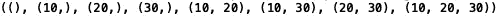

事实证明，与我们上面的例子不同，对于不可数集合，sigma 代数是必要的。西格玛代数是必要的，以便我们能够考虑实际事件的实数子集。换句话说，在可数并集和可数交集的条件下，集合需要被很好地定义，才能被赋予概率。

给定我们对 Borel 空间的基本理解，让我们继续定义概率函数。

# 概率公理(Kolmogorov 公理)

给定样本空间 *S* 和相关联的西格玛代数 *B，*，概率函数是满足以下条件的具有域 *B* 的函数 *P* :

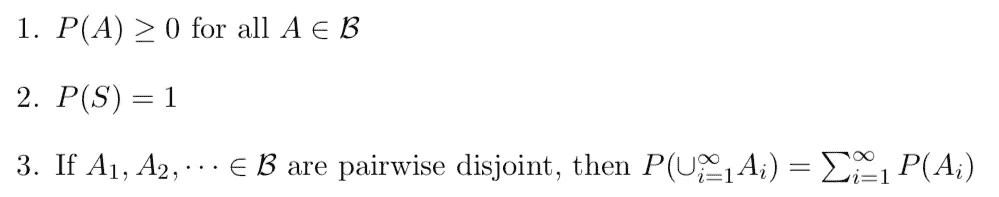

满足以上陈述的任何函数 *P* 都是候选概率函数。因为可以定义许多满足概率公理的概率函数，所以概率论关心的是理解哪些函数反映了在特定实验中可能观察到的情况。

需要考虑的最后一件有趣的事情是:

[巴拿赫-塔尔斯基](https://en.wikipedia.org/wiki/Banach–Tarski_paradox)悖论说明了在缺少西格玛代数的情况下出现的矛盾。它声明如下:

给定两个实心 3D 球，一个小，一个大，任何一个球都可以重新组合成另一个。这也被称为豌豆和太阳悖论，即一颗豌豆可以重新组合成太阳，反之亦然。这意味着，如果你在三维空间中处理实数(例如，体积比)，你将很难定义事件的概率，因为你可以重新排列空间来改变体积。如果你的概率取决于体积，通过改变集合的体积，你也将改变概率。这意味着没有一个事件可以被赋予单一的概率。这需要 sigma 代数，它允许我们定义可测量的集合和概率。