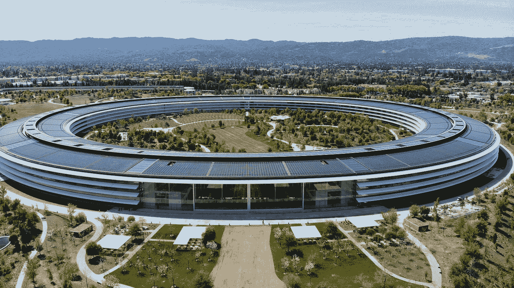

# 在人工智能竞赛中领先的四大人工智能公司。

> 原文：<https://towardsdatascience.com/four-ai-companies-on-the-bleeding-edge-of-artificial-general-intelligence-b17227a0b64a?source=collection_archive---------13----------------------->

## 人工通用智能

## 下面让我们来看看走在 AGI 前列的四家公司。

尼斯·姆舒蒂在 [Unsplash](https://unsplash.com?utm_source=medium&utm_medium=referral) 上的照片

一种人工智能已经接管了世界，但不是以末日杀手终结者机器人、反乌托邦未来那种方式。在 21 世纪，人工智能被用于增强商业、教育、建筑、医疗保健、交通等行业。它被用来拯救生命，创造下一代技术，主要是为了让我们的生活更美好。人工智能的应用似乎是无穷无尽的。尽管看起来人工智能是一种领先于我们时代的未来科幻技术，但它不会停留在个性化你的社交媒体体验或自动化单调的任务上。如果你认为这是人工智能革命的顶峰，请再想想，因为你今天看到的人工智能只是冰山一角。

## 窄 AI vs 强 AI

在我们开始之前，这里有一个关于人工智能的速成班，简单地定义为机器思考和学习的能力。今天使用的人工智能被称为**狭义人工智能**，狭义的意思是，它只能按照编程完成特定的任务，除此之外什么也做不了。AI 的下一个“级别”是**强 AI** 或者本文标题中使用的术语——人工通用智能。强人工智能是一个假设的机器大脑，它具有执行任务和理解语音的智能能力，其认知水平与人脑相同。换句话说，一个机器人可以像我们一样感受事物，恋爱，并基本上做我们人类每天可以做的事情，这对一个狭隘的人工智能系统来说几乎是不可能的。

## 在 AGI 的投资

这个假想的 AGI 是不朽的，可能会改变历史的进程。这就是为什么投资者向公司投入数百万美元，专家们努力工作，希望将这种虚构的技术变成现实。根据 Mind Commerce 的一份报告，预计到 2023 年，AGI 的投资将达到 500 亿美元。

说到投资，有很多科技公司都有一群专家在研究这项技术。IBM 和百度等大型科技公司可能正在人工智能领域实现飞跃。然而，有四家著名的公司领先于人工智能的终点线。奖品不是金杯，而是人工智能的圣杯——超级智能。

以下是对它们的简要介绍。

# 4 家人工智能公司

照片由[卡莱斯·拉巴达](https://unsplash.com/@carlesrgm?utm_source=medium&utm_medium=referral)在 [Unsplash](https://unsplash.com?utm_source=medium&utm_medium=referral) 上拍摄

# 1.开放 AI

**始于** : 2015
**驻于**:加州三藩市
**使命**:确保人工通用智能造福全人类
**目标**:率先创造 AGI，不是为了利润的支配，而是为了社会的安全，为了平等地分配给世界。
**创始人**:埃隆·马斯克、山姆·奥特曼等人。
**投资方**:微软——10 亿美元
**近期成就**:创造了 [Open AI Five](https://openai.com/projects/five/) ，一个由 5 个 AI 机器人组成的团队击败了世界 Dota 2 冠军[和一个能够解魔方的机器人手](https://openai.com/blog/solving-rubiks-cube/)。
**AGI**方法论:更大的神经网络模型

 [## OpenAI

### OpenAI 是一家人工智能研究公司，发现并制定安全人工智能的道路。

openai.com](https://openai.com/) 

# 2.深度思维

**始于** : 2010
**基于**:伦敦
**任务**:研究并构建安全的人工智能系统，学习如何解决问题并推进所有人的科学发现。
**目标**:通过融合机器学习和系统神经科学的新技术来构建强大的通用学习算法，从而实现“解决智能”。
**【创始人】**:戴密斯·哈萨比斯
**投资人** : Founders Fund 和 Horizons Ventures
**近期成就** : [AlphaGo](https://deepmind.com/research/case-studies/alphago-the-story-so-far) ，2016 年在围棋比赛中击败人类最优秀棋手的 AI 系统。
**方法论 AGI** :神经科学——更深入地观察人类大脑，并从中汲取灵感，创造复杂的算法。

 [## deep mind——如果解决一个问题可以解开成千上万个问题的答案，会怎么样？

### 人工智能可能是人类最有用的发明之一。我们研究和建立安全的人工智能系统…

deepmind.com](https://deepmind.com/) 

# 3.谷歌大脑

**开始于** : 2011
**总部位于**:加州山景
**任务**:让机器变得智能，改善人们的生活
**目标**:创造一个拥有人类小孩智力的 A.I。
**创始人**:吴恩达和杰夫·迪恩
**投资人**:隶属母公司谷歌
**近期成果**:发明[变形金刚](https://ai.googleblog.com/2017/08/transformer-novel-neural-network.html)(一种用于[自然语言处理](https://en.wikipedia.org/wiki/Natural_language_processing)的神经网络) [TensorFlow](https://www.tensorflow.org/)
**方法论到 AGI** :监督学习，以及其他神经网络结构。

 [## 大脑团队——谷歌研究

### 关于团队研究，自由谷歌大脑团队成员制定自己的研究议程，团队作为一个整体…

谷歌研究](https://research.google/teams/brain/) 

# 4.脸书人工智能研究所

**始于** : 2013
**基于** : —
**任务**:推进人工智能
**目标**:创造类人人工智能
**创始人** : [Yann LeCun](https://en.wikipedia.org/wiki/Yann_LeCun) 、深度学习先锋
**投资方**:母公司
 ****方法论到 AGI** :无监督和自我监督学习。**

 [## 艾

### 我们将人们与他们关心的事物联系起来，为新的、有意义的体验提供动力，并推进…

ai.facebook.com](https://ai.facebook.com/) 

# 展望未来

吉列尔莫·费拉在 [Unsplash](https://unsplash.com?utm_source=medium&utm_medium=referral) 上拍摄的照片

人工智能肯定会给我们的社会带来混乱。它对我们世界的影响将跨越每一个行业，我们必须为这一天的到来做好准备。尽管 AGI 似乎被描绘成危险和暴力的，但真正的危险来自我们。

我们，人类，是不完美的，我们往往不知道我们行为的后果。只要看看我们是如何应对气候变化的生存风险的，世界上许多地方已经遭受了它，但我们仍然无动于衷。对于 AGI 这种有能力终结人类的技术，我们是在扮演上帝的角色，我们必须非常小心我们的行动。T2 的风险是巨大的，我们的比赛岌岌可危。

为了确保这项技术将被用于好的方面，而不是以任何方式被滥用，必须制定适当的规则来确保 AGI 系统 100%安全，并且有意识的 AGI 自己将具有人文主义价值观，如诚信和道德，以防止他们伤害人类。

只要参与推进 AGI 进程的人是负责任的，并且意识到 AGI 的危险，安全高效的 AGI 体系就能建立起来。

# 行动计划

照片由[伊森·道](https://unsplash.com/@ethandow?utm_source=medium&utm_medium=referral)在 [Unsplash](https://unsplash.com?utm_source=medium&utm_medium=referral) 上拍摄

既然你已经意识到了 AGI 将会带来的影响，试着去了解人工智能，并想办法把它应用到你的生活中。拥有将人工智能应用到现实世界的技能和能力将至关重要，无论你只是一名大学生还是一家大型零售公司的首席执行官。

如果你是人工智能的爱好者，你可以从学习人工智能流行的编程语言开始。我建议从 Python 开始，因为你可以继续学习 [PyTorch](https://pytorch.org/) 这是一个流行的机器学习框架，或者你可以学习 [TensorFlow 的 JavaScript，](https://www.tensorflow.org/js)也是一个机器学习库。

如果你是一名业务经理，你希望看到人工智能改变你的公司，那么开始投资人工智能，聘请机器学习工程师或数据科学家。在您的业务中使用人工智能，您可以增加销售额，增强客户体验，自动化流程，进行预测分析，检测欺诈，等等。

如果你是一个梦想改变世界的年轻人，目标是成为一名企业家，我敦促你从人工智能开始。找到你的激情或者一个你想解决的问题，尝试把 AI 的元素加入其中。比如你梦想设计一个新的服装品牌，为什么不让 AI 替你设计呢？或者，如果你想帮助找到大脑疾病或癌症的治疗方法，请使用人工智能来找到新的治疗方法。

总而言之，人工智能不是也不应该局限于富人，而是所有人都可以体验并参与这场让世界变得更美好的革命。不要害怕实验和使用人工智能来实现不可能的事情。

感谢您的阅读，我希望您已经了解了什么是人工智能，以及哪些公司正在引领它成为现实。

以下是美国人工智能研究人员兼作家埃利泽·尤德考斯基(Eliezer Yudkowsky)的一段话:

> “任何可以产生比人类更聪明的智能的东西——以人工智能、脑机接口或基于神经科学的人类智能增强的形式——都毫无疑问地成为最能改变世界的东西。其他的甚至都不在一个联盟里。”—

## 查看这些文章，了解更多关于人工智能和机器学习的信息！

 [## 互联网上 20 大免费数据科学、ML 和 AI MOOCs

### 以下是关于数据科学、机器学习、深度学习和人工智能的最佳在线课程列表

towardsdatascience.com](/top-20-free-data-science-ml-and-ai-moocs-on-the-internet-4036bd0aac12)  [## 机器学习和数据科学的 20 大网站

### 这里是我列出的最好的 ML 和数据科学网站，可以提供有价值的资源和新闻。

medium.com](https://medium.com/swlh/top-20-websites-for-machine-learning-and-data-science-d0b113130068)  [## 机器学习的未来

### 与杰夫·迪恩一起展望曼梯·里的未来

towardsdatascience.com](/the-future-of-machine-learning-ce0a9dc18cb8) 

如果您对学习数据科学感兴趣，请查看“超学习”数据科学系列！

 [## 如何“超级学习”数据科学—第 1 部分

### 这是一个简短的指南，基于《超学习》一书，应用于数据科学

medium.com](https://medium.com/better-programming/how-to-ultralearn-data-science-part-1-92e143b7257b) 

# 联系人

如果你想了解我的最新文章[，请通过媒体](https://medium.com/@benthecoder07)关注我。

其他联系方式:

*   [领英](https://www.linkedin.com/in/benthecoder/)
*   [推特](https://twitter.com/benthecoder1)
*   [GitHub](https://github.com/benthecoder)
*   [Reddit](https://www.reddit.com/user/benthecoderX)

注意安全！