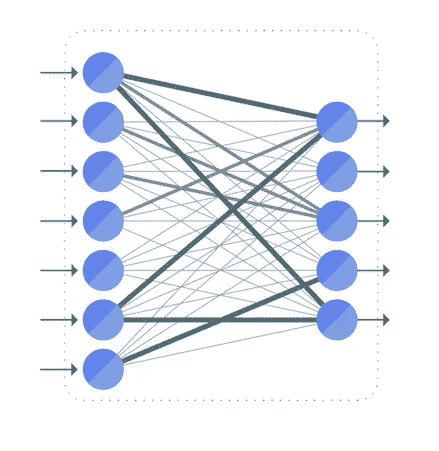
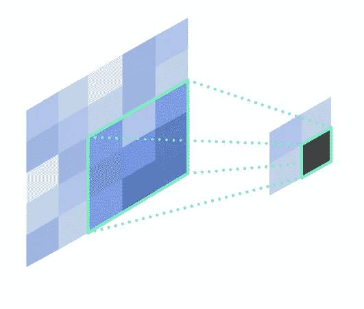
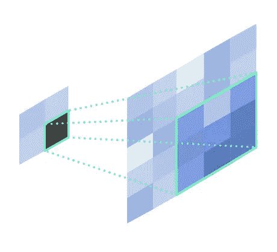
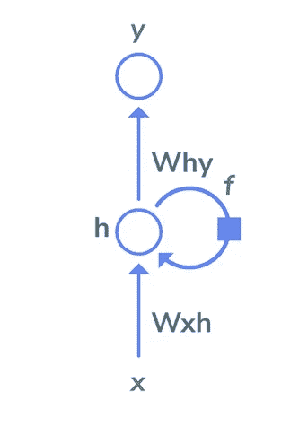

# 四种常见类型的神经网络层

> 原文：<https://towardsdatascience.com/four-common-types-of-neural-network-layers-c0d3bb2a966c?source=collection_archive---------9----------------------->

## (以及何时使用它们)

[神经网络](https://en.wikipedia.org/wiki/Artificial_neural_network) (NN)是当今许多机器学习(ML)模型的支柱，松散地模仿人脑的神经元，从输入数据中识别模式。因此，多年来已经设计了许多类型的神经网络拓扑，使用不同类型的神经网络层来构建。

有了今天大量的 ML 框架和工具，任何有一点 ML 知识的人都可以很容易地用不同类型的神经网络拓扑建立一个模型。在大多数情况下，这都是关于了解每种类型的神经网络擅长解决什么问题，并优化它们的超参数配置。

四种最常见的神经网络层是*全连接*、*卷积*、*反卷积*和*递归、*，下面你会发现它们是什么以及如何使用它们。

# 全连接层

图像由[感知实验室](https://perceptilabs.com/home)

[全连接层](https://en.wikipedia.org/wiki/Convolutional_neural_network#Fully_connected)将一层中的每个神经元连接到下一层中的每个神经元。全连接层存在于从标准神经网络到[卷积神经网络](https://en.wikipedia.org/wiki/Convolutional_neural_network) (CNN)的所有不同类型的神经网络中。

随着输入的增长，完全连接的层在计算上可能变得昂贵，导致要执行的矢量运算的组合爆炸，以及潜在的较差的可扩展性。因此，它们通常用于神经网络中的特定目的，例如对图像数据进行分类。

**用例**

*   使用全连接神经网络的实验或学习 ML。
*   为计算机视觉对图像进行分类。

**通常与全连接层相关的超参数**

*   激活功能
*   神经元数量
*   拒绝传统社会的人

# 卷积层

图像由[感知实验室](https://perceptilabs.com/home)

[卷积层](https://en.wikipedia.org/wiki/Convolutional_neural_network#Convolutional)是 CNN 中一种重要的层类型。它最常见的用途是检测图像中的特征，其中它使用一个*过滤器*来扫描图像，一次扫描几个像素，并输出一个*特征图*，对发现的每个特征进行分类。

过滤器(有时称为*内核*)是一组与输入相乘的 n 维权重，其中过滤器的维度与输入的维度相匹配(例如，当处理 2D 图像时是两个维度)。过滤器描述了给定的像素模式表示特征的概率。因此，滤波器权重的数量(即，滤波器的大小)小于输入，并且由层的卷积过程执行的乘法是在匹配滤波器大小的图像“小块”上执行的。

在整个图像上从左到右和从上到下系统地重复乘法以检测特征。滤波器在下一次迭代中移动的像素数称为*步幅*。*可以在输入图像周围添加填充*，以确保滤波器总是适合给定步幅的图像的总边界。

**用例**

*   用于图像识别和分类的图像分析。

**通常与卷积层相关的超参数**

*   维度
*   补丁大小
*   进展
*   要生成的要素地图的数量
*   填充策略
*   激活功能
*   拒绝传统社会的人
*   联营

# 去卷积层

图像由[感知实验室](https://perceptilabs.com/home)

反卷积图层是一种转置卷积过程，可有效地将数据向上采样至更高的分辨率。这可以包括从卷积层生成的图像数据和/或特征图，或者其他类型的数据。对于图像数据，通过去卷积输出的上采样分辨率可以与原始输入图像相同，也可以不同。

**常见用例**

*   向上采样图像

**通常与反褶积层相关的超参数**

*   维度
*   进展
*   要生成的要素地图的数量
*   填充策略
*   激活功能
*   拒绝传统社会的人

# 循环层

图像由[感知实验室](https://perceptilabs.com/home)

一个[循环层](https://en.wikipedia.org/wiki/Recurrent_neural_network)包括一个“循环”能力，使得它的输入既包括要分析的数据，也包括由该层执行的先前计算的输出。递归层形成了递归神经网络(RNNs)的基础，有效地为它们提供了*内存*(即，在迭代过程中保持状态)，而它们的递归性质使 RNNs 适用于涉及自然语言和时间序列等顺序数据的情况。它们对于将输入映射到不同类型和维度的输出也很有用。

**常见用例**

*   将情绪分为积极情绪和消极情绪。
*   生成图像内容的文本描述。
*   将文本段落翻译成另一种语言。

**通常与重现层相关的超参数**

*   维度
*   递归神经网络类型( [LSTM](https://en.wikipedia.org/wiki/Long_short-term_memory) 、 [GRU](https://en.wikipedia.org/wiki/Gated_recurrent_unit) ，或标准 RNN 层)
*   返回序列
*   拒绝传统社会的人

# 结论

当谈到机器学习时，神经网络是当前最先进的，有许多拓扑和层类型可供选择。每种类型的神经网络都擅长解决特定领域的问题，每种神经网络都通过优化这些解决方案的超参数进行调整。此外，ML 从业者现在可以访问许多 ML 框架和工具，这使得实现围绕神经网络拓扑结构构建的 ML 模型比以往任何时候都更容易。

要了解更多信息，请查看我的[机器学习手册](https://www.perceptilabs.com/resources/handbook)，它提供了关于神经网络和 ML 其他方面的更多细节。